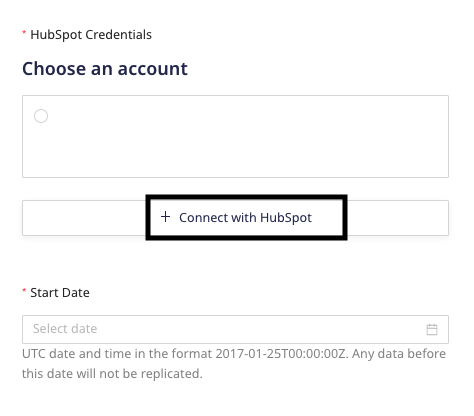
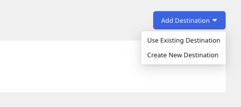

# HubSpot v2

[HubSpot](https://www.HubSpot.com/) is a leading marketing and CRM platform that helps you track leads as well as inbound marketing and sales.

This document guides you in setting up HubSpot as a source in RudderStack. Once configured, RudderStack automatically ingests your specified HubSpot data and routes it to your data warehouse.

All the Cloud Extract sources support sending data only to a <a href="https://www.rudderstack.com/docs/data-warehouse-integrations/">data warehouse destination</a>.

## Getting started

To set up HubSpot as a source in RudderStack, follow these steps:

1. Log into your [RudderStack dashboard](https://app.rudderstack.com/).
2. Go to **Sources** > **New source** > **Cloud Extract** and select **HubSpot** from the list of sources.
3. Assign a name to your source and click on **Continue**.

### Connection settings

* **HubSpot Credentials**: Click **Connect with HubSpot** and grant RudderStack the necessary permissions to access your HubSpot data.

Your HubSpot account and the related details will then automatically appear under <strong>Choose an account</strong>.

* **Start Date**: Select the date from when RudderStack should ingest your HubSpot data.

RudderStack will not replicate any data before this date.

### Destination settings

The following settings specify how RudderStack sends the ingested data from HubSpot to the warehouse destination:

- **Table prefix**: RudderStack uses this prefix to create a table in your data warehouse and loads all your HubSpot data into it.
- **Schedule Settings**: RudderStack gives you three options to ingest the data from HubSpot:
    - **Basic**: Runs the syncs at the specified time interval. 
    - **CRON**: Runs the syncs based on the user-defined CRON expression.
    - **Manual**: You are required to run the syncs manually.

For more information on the schedule types, refer to the <a href="https://www.rudderstack.com/docs/cloud-extract-sources/common-settings/">Common Settings</a> guide.

### Selecting the data to import

Choose the HubSpot data that you wish to ingest via RudderStack. You can either select all the data or choose specific HubSpot data attributes as per your requirement.

HubSpot is now configured as a source. RudderStack will start ingesting data from HubSpot as per your specified schedule and frequency.

You can further connect this source to your data warehouse by clicking on **Add Destination**, as shown:

Use the <strong>Use Existing Destination</strong> option if you have an already-configured data warehouse destination in RudderStack. To configure a data warehouse destination from scratch, select the <strong>Create New Destination</strong> button.

## FAQ

### Is it possible to have multiple Cloud Extract sources writing to the same schema?

Yes, it is.

RudderStack associates a table prefix for every Cloud Extract source writing to a warehouse schema. This way, multiple Cloud Extract sources can write to the same schema with different table prefixes.

## Contact us

If you come across any issues while configuring HubSpot as a source in RudderStack, you can [contact us](mailto:%20docs@rudderstack.com) or start a conversation in our [Slack](https://rudderstack.com/join-rudderstack-slack-community) community.
