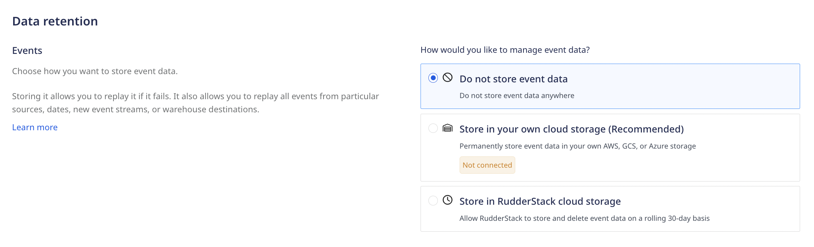
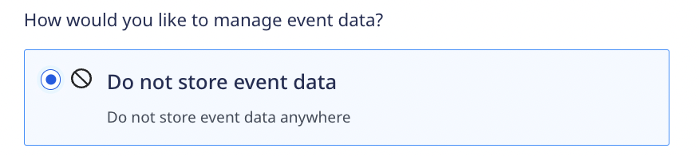
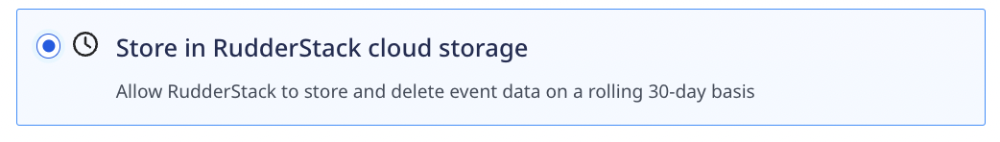

This guide explains RudderStack’s data retention policy and your options for opting in or out of data storage. 

RudderStack's default policy is not to store your event data, but there are times when it may be useful for you to access or replay recent event data. Refer to the <Link to="/user-guides/administrators-guide/event-replay/">Event Replay</Link> guide for more details on this feature.

RudderStack provides 3 options for retaining your event data:

- <Link to="#1-do-not-store-event-data">Do not store event data</Link>
- <Link to="#2-store-event-data-in-your-own-cloud-storage-recommended">Store in your own cloud storage (<strong>Recommended</strong>)</Link>
- <Link to="#3-store-event-data-in-rudderstack-cloud-storage">Store in RudderStack Cloud on a rolling 30-day basis</Link>

The following sections define different types of RudderStack data and provide steps on opting in to the right setup for your needs.

## Data definitions

RudderStack **does not** permanently store any customer data except the following:

- Aggregate “Count” data on Event Name, Event Type, Source ID, Destination ID.
- Error codes.
- Customer user records (for example, usernames, billing-related details).

All other customer data can be classified as either **transient** or **non-transient** and it may either be stored in your location, for example, AWS, or by RudderStack for upto 30 days. 

The storage options vary with the nature of the data and your RudderStack plan.

RudderStack's data retention policy defines data as they pertain to the primary components of its service - the <Link to="/resources/glossary/#data-plane">data plane</Link> and <Link to="/resources/glossary/#control-plane">control plane</Link>.

### Transient customer data

Transient customer data can be defined as follows:

- All data that is in transit, that is, **stored for less than 3 hours**, as an essential part of delivering the RudderStack product experience.
- Data plane: Events that hit the RudderStack gateway. Refer to the <Link to="/resources/rudderstack-architecture/#data-plane-architecture">data plane architecture</Link> for more details.
- Control plane: The in-transit data captured in the <Link to="/dashboard-guides/live-events/">**Live Events**</Link> tab of the RudderStack dashboard.

### Non-transient customer data

Non-transient customer data can be defined as follows:

- Data that can persist for more than 3 hours **only if** configured by the RudderStack user.
- Data plane: Processing errors, gateway dumps.
- Control plane: Data in the reporting service (sample events, sample responses).

## Data retention options

RudderStack provides 3 options for your event data storage. To choose how you want to store the event data, follow these steps:

1. Log into your [RudderStack dashboard](https://app.rudderstack.com/).
2. Go to **Settings** > **Data Management**.
3. Choose one of the 3 data storage options in the **Data retention** section:

The following sections explain the data retention options in detail.

### 1. Do not store event data

If you choose this option, RudderStack will not store any of your event data. This is the default setting.

### 2. Store event data in your own cloud storage (Recommended)

This is the recommended event storage option, and available in the <a href="https://www.rudderstack.com/pricing/">Starter, Growth, and Enterprise</a> plans. Selecting this option will bring up a modal allowing you to connect a storage bucket with your RudderStack data.

RudderStack supports storage via AWS, GCS, Azure, and MinIO if you select this option.

When connecting your cloud storage provider to RudderStack, you will first need to create a storage bucket and configure the credentials for RudderStack to access the datastore. Follow the steps listed below depending on your cloud provider:

<Tabs>
  <TabList>
   <Tab>Amazon S3</Tab>
    <Tab>Google Cloud Storage</Tab>
    <Tab>Azure Blob Storage</Tab>
    <Tab>MinIO</Tab>
  </TabList>
  <TabPanels>
    <TabPanel>
    <ol>
      <li>Create your <a href="https://docs.aws.amazon.com/AmazonS3/latest/userguide/creating-bucket.html">object storage bucket</a>.</li>
      <li>Configure the relevant <Link to="/user-guides/administrators-guide/bucket-configuration-settings/#permissions-for-amazon-s3">permissions</Link> for your bucket.</li>
      <li>Connect your storage provider in the RudderStack dashboard.</li>   
      </ol>
    </TabPanel>
    <TabPanel>
    <ol>
      <li>Create your <a href="https://cloud.google.com/storage/docs/creating-buckets">object storage bucket</a>.</li>
      <li>Configure the relevant <Link to="/user-guides/administrators-guide/bucket-configuration-settings/#permissions-for-gcs">permissions</Link> for your bucket.</li>
      <li>Connect your storage provider in the RudderStack dashboard.</li> 
    </ol>
    </TabPanel>
    <TabPanel>
    <ol>
      <li>Login to the <a href="https://portal.azure.com/">Azure portal</a> and create a <a href="https://docs.microsoft.com/en-us/azure/storage/common/storage-account-create?tabs=azure-portal">storage account</a>.</li>
      <li>Click <strong>Containers</strong> under <strong>Blob service</strong> and create a new container.</li>
      <li>Connect your storage provider in the RudderStack dashboard.</li>     
      </ol>
    </TabPanel>
    <TabPanel>
    <ol>
      <li>Login to your MinIO service and <Link to="/destinations/streaming-destinations/minio/#setting-up-minio">set up your bucket</Link>.</li>
      <li>Connect your storage provider in the RudderStack dashboard.</li>
    </ol>
    </TabPanel>
  </TabPanels>
</Tabs>

### 3. Store event data in RudderStack cloud storage

Choosing this option allows RudderStack to store and delete your event data on a rolling 30-day basis.

## Sample event data

When the **Sample event data** setting is enabled, RudderStack stores and deletes sample events and responses on a rolling 30-day basis. This data may be helpful for debugging your events. 

RudderStack <strong>does not</strong> consider the event name or event type to be Personally Identifiable Information (PII).

## Plan-based options

Based on your plan, RudderStack provides different options for event storage, giving you the ability to enable or disable retention for the following kinds of data:

- **Sample events and responses**: As mentioned above, RudderStack will store and delete sample events and responses on a rolling 30-day basis.
- **Processing errors**: These correspond to the events that are rejected at various stages of the data pipeline, including errors from user transformation, destination transformation (internal to RudderStack), and events rejected by the destination after **three hours** of retry attempts.
- **Gateway dumps**: These correspond to the raw data for every successfully-ingested event.

Refer to the below table for the storage items supported by different [RudderStack pricing plans](https://www.rudderstack.com/pricing/):

| Storage options | Free tier | Starter/Growth | Enterprise |
| :----| :------| :-----| :-----|
| Sample events/responses | ✅  | ✅  | ✅ |
| Processing errors | ❌ |  ✅ | ✅ |
| Gateway dumps | ❌ |  ❌ | ✅ |

 
