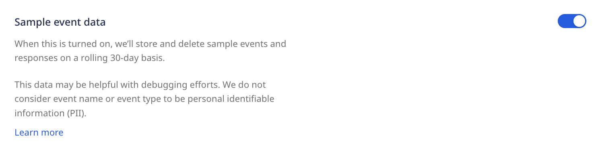

## Overview

The purpose of this guide is to explain the RudderStack data retention policy and your options for opting in or out of data storage by RudderStack. Our default policy is not to store your event data, but there are times when it may be useful for you to have access to recent event data and replay them for testing and debugging. See <Link to="/user-guides/administrators-guide/event-replay/">Event Replay</Link> for details on this feature.

You have 3 options for how to store your event data:

- Do not store it anywhere
- Store in your own cloud storage (recommended approach)
- Store in RudderStack cloud storage (on a rolling 30-day basis)

The sections below define different types of RudderStack data and provide steps on opting in to the right storage option for your needs.

## Data Definitions

At RudderStack we do not permanently store customer data in our systems *except* in the following instances:

1. Aggregate “Count” data on Event Name, Event Type, Source ID, Destination ID
2. Error Codes 
3. Customer User Records: RudderStack usernames, passwords, and account and billing-related details

All other customer data can be classified as either *transient* or *non-transient* and these data may either be stored in your location, e.g. AWS, or by RudderStack for up to 30 days. Storage options vary by the nature of the data and your RudderStack plan.

Our data retention policy defines data as they pertain to the primary components of our service, the <Link to="/resources/glossary/#data-plane">data plane</Link> and <Link to="/resources/glossary/#control-plane">control plane</Link>. 

### Transient Customer Data

> All data that is in transit, i.e., **stored for less than 3 hours**, as an essential part of delivering the RudderStack product experience

> - Data Plane: Actual RudderStack Events
> - Control Plane: Live Events 

### Non-Transient Customer Data

> Data that persists for longer than 3 hours

> - Data Plane: proc errors, gateway dumps
> - Control Plane: Data in the reporting service (sample events, sample responses)

## Data Retention Options

We provide 3 options for your event data storage. To choose how you want to store event data:

1. Log into your [RudderStack dashboard](https://app.rudderstack.com/).
2. Navigate to **Settings** > **Data Management**.
3. Choose one of the 3 data storage options in the *Data retention* section:

### Do not store event data

RudderStack will not store any of your event data. This is the default setting and the only available option on the RudderStack cloud free tier.

### Store event data in your own cloud storage

This is the recommended event storage option, and available on Pro and Enterprise plans. We support storage via AWS, GCS, Azure and MinIO if you select this option. Selecting this option will bring up a modal allowing you to connect a storage bucket with your RudderStack data.

When connecting your cloud storage provider to RudderStack, you will first need to create a storage bucket and configure credentials for RudderStack to access the datastore. See <Link to="/user-guides/administrators-guide/event-replay/">Object storage setup</Link> for details on setting up storage objects.

### Store event data in RudderStack cloud storage

Choosing this option will allow RudderStack to store and delete event data on a rolling 30-day basis.
## Sample event data

When sample data is turned on, RudderStack will store and delete sample events and responses on a rolling 30-day basis.

This data may be helpful with debugging efforts. We do not consider event name or event type to be personally identifiable information (PII).

## Overview

RudderStack

- We updated our data retention policy to be clear and consistent
- Based on plan tier, we are giving users different functionality for event storage, broken down into Sample Events and Responses (from Reporting Service), Gateway Dumps (every event that hits the gateway), and Proc Errors (basically the DLQ in current form)

## Tier-based Options

Based on plan tier, we provide different functionality for your event storage, broken down into Sample Events and Responses (from Reporting Service), Gateway Dumps (every event that hits the gateway), and Proc Errors 

- Ability to toggle ON/OFF sample events and responses
- Ability to provide your own storage *or* use RudderStack cloud storage **for proc errors** 
- Ability to provide your own storage *or* use RudderStack cloud storage **for gateway dumps**

| **Pricing tier** | **Sample events/responses**       | **Proc errors**    | **Gateway dumps**    |
| :------------------ | :------------ | :------------ | :------------ |
| **Free tier**     |      ✅        |       ❌         |        ❌        |
| **Pro**      |             ✅  |         ✅      |        ❌        |
| **Enterprise**      |        ✅       |    ✅           |   ✅            |

