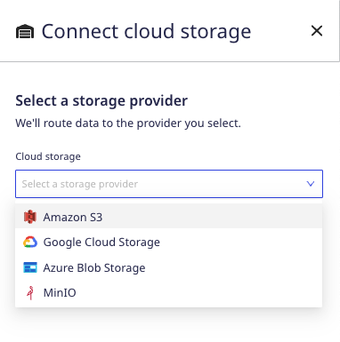

- overview
- definitions
- Event storage optionb (by plan)
- UI explanation
- <Link to="/user-guides/administrators-guide/event-replay/">Event Replay</Link>

## Overview

We will not permanently store any customer data in our systems except

We store transient data for a maximum of 3 hours.

Non-transient data can be stored for the purposes of event replay and debugging in your warehouse.

If you choose to opt in to RudderStack-hosted storage for non-transient data, the data will be stored on a 30-day rolling basis.

Talk about how data retention works at Rudderstack, and how we have different types of transient and non-transient data. Also, your ability to opt in to RudderStack cloud storage for non-transient data will depend on your pricing plan.

RudderStack doesn't want to store your data, so we let you decide.

- Sample events and responses
- Gateway dumps
- Proc errors

We have different options for storing transient event data:
  - Do not store
  - Store in your own cloud storage (recommended)
  - Store in RudderStack cloud storage

Data storage options vary based on your pricing plan

## Data Definitions

At RudderStack we do not permanently store customer data in our systems *except* in the following instances:

1. Aggregate “Count” data on Event Name, Event Type, Source ID, Destination ID
2. Error Codes 
3. Customer User Records: RudderStack usernames, passwords, and account and billing-related details

All other customer data can be classified as either *transient* or *non-transient* and these data may either be stored in your location, e.g., AWS, or by RudderStack for up to 30 days. Storage options vary by the nature of the data and your RudderStack plan.

Our data retention policy concerns data as they pertain to the primary components of our service, the <Link to="/resources/glossary/#data-plane">data plane</Link> and <Link to="/resources/glossary/#control-plane">control plane</Link>. 

### Transient Customer Data

> All data that is in transit, i.e., **stored for less than 3 hours**, as an essential part of delivering the RudderStack product experience

> - Data Plane: Actual RudderStack Events
> - Control Plane: Live Events 

### Non-Transient Customer Data

> Data that persists for longer than 3 hours

> - Data Plane: proc errors, gateway dumps
> - Control Plane: Data in the reporting service (sample events, sample responses)

## Data Retention Options

We provide 3 options for your event data storage.

1. **Do not store event data**

RudderStack will not store any of your event data. This is the default setting and the only available option on the RudderStack cloud free tier.

2. **Store in your own cloud storage**

This is the recommended event storage option, and available on Pro and Enterprise plans. We support storage via AWS, GCS, Azure and MinIO if you select this option.

When connecting your cloud storage provider to RudderStack, you will first need to create a storage bucket and configure credentials for RudderStack to access the datastore. See <Link to="/user-guides/administrators-guide/event-replay/">Object storage setup</Link> for details on setting up storage objects.

## Sample event data

When this is turned on, we’ll store and delete sample events and responses on a rolling 30-day basis.

This data may be helpful with debugging efforts. We do not consider event name or event type to be personally identifiable information (PII).

## Overview

RudderStack

- We updated our data retention policy to be clear and consistent
- Based on plan tier, we are giving users different functionality for event storage, broken down into Sample Events and Responses (from Reporting Service), Gateway Dumps (every event that hits the gateway), and Proc Errors (basically the DLQ in current form)

## Tier-based Options

Based on plan tier, we provide different functionality for your event storage, broken down into Sample Events and Responses (from Reporting Service), Gateway Dumps (every event that hits the gateway), and Proc Errors 

- Ability to toggle ON/OFF sample events and responses
- Ability to provide your own storage *or* use RudderStack cloud storage **for proc errors** 
- Ability to provide your own storage *or* use RudderStack cloud storage **for gateway dumps**

| **Pricing tier** | **Sample events/responses**       | **Proc errors**    | **Gateway dumps**    |
| :------------------ | :------------ | :------------ | :------------ |
| **Free tier**     |      ✅        |       ❌         |        ❌        |
| **Pro**      |             ✅  |         ✅      |        ❌        |
| **Enterprise**      |        ✅       |    ✅           |   ✅            |

## Setting it up

Follow these steps to set up your data retention policy.

1. Log into your [RudderStack dashboard](https://app.rudderstack.com/).
2. Navigate to **Settings** > **Data Management**.

In the *Data Management* tab, you will select your data retention policy from one of the 3 following options: 

Do not store event data
We won't store it

