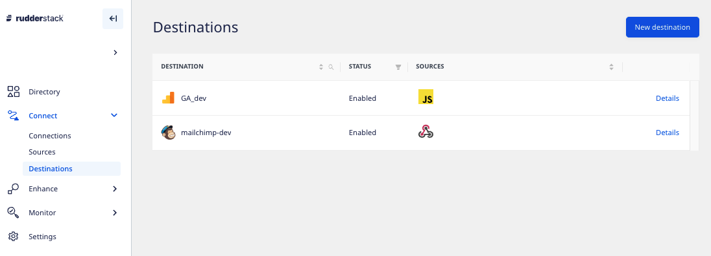
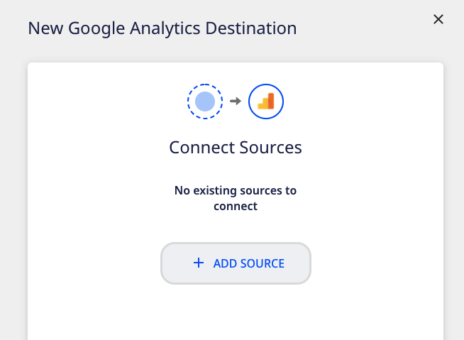
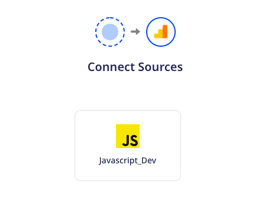
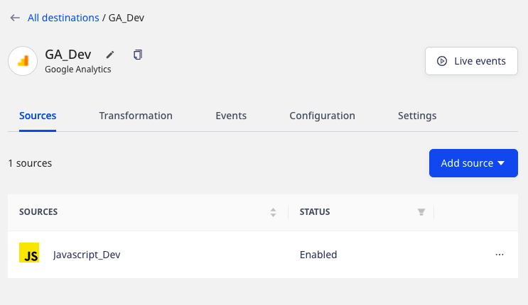
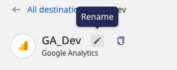
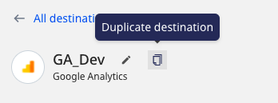

A **destination** is a cloud tool or a platform where you want to send the data via RudderStack.

RudderStack currently supports over 150 destinations. These include various <Link to="/destinations/streaming-destinations/">Streaming Destinations</Link> and <Link to="/destinations/warehouse-destinations/">Warehouse Destinations</Link>.

The **Destinations** option is povided in the left navigation bar in the RudderStack dashboard. It lets you view all your configured destinations, as shown:

## Adding a destination

Follow these steps to add a destination in RudderStack:

1. Log into the [RudderStack dashboard](https://app.rudderstack.com/).
2. Click **Add Destination** and select the destination you want to set up in RudderStack.
3. Assign a name to the destination and click **Continue**.
4. Click **Add Source** to connect a source with this destination. Refer to the detailed steps for <Link to="/sources/#adding-a-source">Adding a source</Link>.

Alternatively, you can select an existing source (if any) for this destination and click **Next**.

5. Configure the destination with the relevant connection settings. Refer to the <Link to="/destinations/">destination documentation</Link> for more details on these settings.
6. Click **Create New Transformation** if you want to add a <Link to="/features/transformations/">transformation</Link>. Otherwise, click **Continue** to configure the destination successfully.

### Destination details

To get details about a configured destination, click it to see the following options:

- **Rename**: Lets you rename the destination by clicking the edit icon next to the destination's name.

- **Live Events**: Lets you view the real-time event data flowing through RudderStack. Refer to <Link to="/dashboard-guides/live-events/">Live Events</Link> for more information.
- **Sources**: Displays all the sources connected to a destination and their status (enabled/disabled). You can also connect a new source by clicking on the **Add source** button.
- **Transformation**: Lets you connect an existing user transformation to your destination.

To add a new transformation, go to the <strong>Transformations</strong> option in the left navigation bar and click <strong>New Transformation</strong>.

- **Events**: Displays all the latest metrics related to the event delivery such as number of events successfully delivered, failed events, etc. You can also filter these by the source and the time period.
- **Configuration**: Lets you edit the connection settings of the destination.
- **Settings**: Provides additional destination-related details, such as:
  - **Enabled**: Lets you enable or disable sending data to the destination.
  - **Destination ID**: Unique identifier associated with your destination.
  - **Permanently delete destination**: Lets you delete the destination by clicking on the **Delete** button.

Before you delete a destination, make sure there are no sources connected to it.

- **Syncs**: This tab gives you the metrics on all the data syncs associated with the different sources connected to the destination, like the source name, schema name associated with the sync, timestamp of the first and last event in the upload batch, and the duration of the sync.
- **Permissions**: Lets you determine which members in your workspace can make changes to this destination.

Refer to the <Link to="/dashboard-guides/permissions-management/#restricting-edit-permissions-for-individual objects">Permissions Management</Link> guide for more details on this option.

### Cloning a destination

You can duplicate an existing destination by following these steps:

1. Click the **Duplicate Destination** option in the **Destination Details** page.

2. Assign a name to the new destination and click **Continue**.
3. Connect the destination to a source to successfully configure it.

