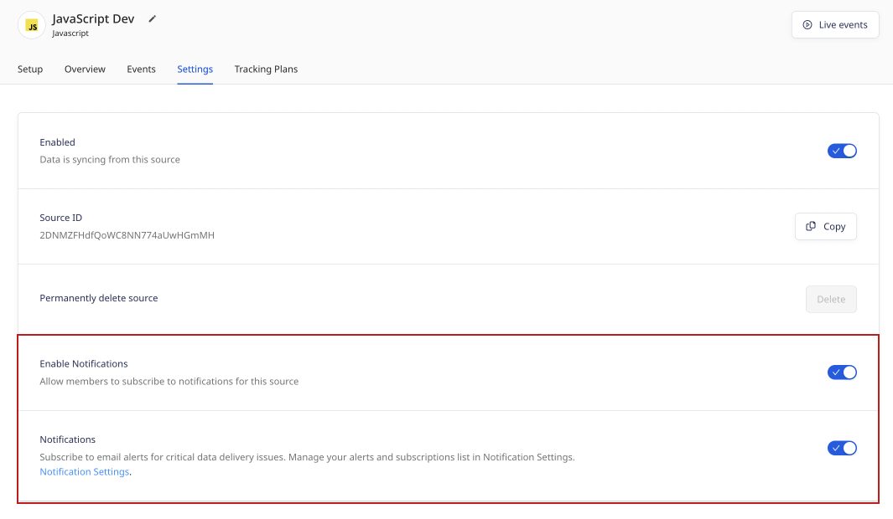
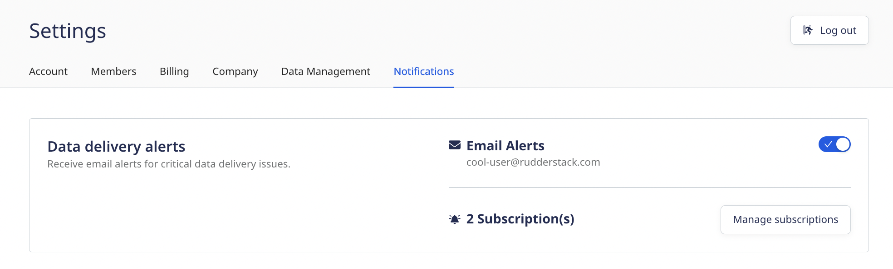
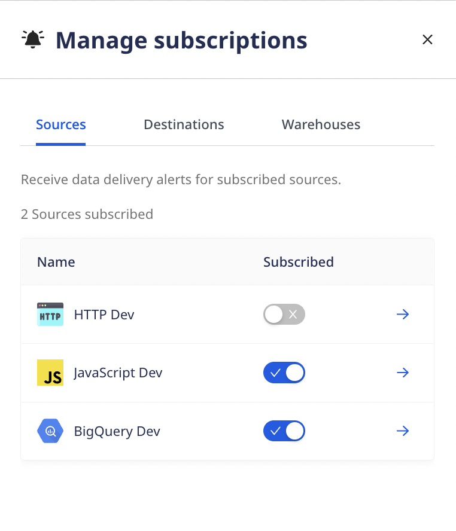

RudderStack's notifications feature lets you enable data delivery alerts for sources, cloud destinations, and warehouse destinations. You can  subscribe/unsubscribe to alerts for a particular resource once your admin enables the alerts for that resource.

## Enabling notifications

To enable the alerting service for a particular source or destination you must have <Link to="/dashboard-guides/user-management/#role-permissions">admin permissions</Link>.

1. Navigate to your desired source or destination in the RudderStack dashboard.
2. Click the **Settings** tab.
3. Toggle the switch in the **Enable Notifications** section to allow members to subscribe to notifications for the selected source/destination.

The <strong>Enable Notifications</strong> option is only available to users with admin privileges.

## Managing alerts

To manage the individual alerts per connection, navigate to the **Settings** menu in the main left-hand navigation and click the *Notifications* tab.

In the notifications area, you can manage your alert subscriptions for errors relating to sources, cloud destinations, and warehouse destinations. Notifications must have been enabled by an admin as described in the <Link to="#enable-notifications-per-connection">previous section</Link>.

From the **Notifications** tab, click the **Manage Subscription** button to toggle on/off subscriptions to all of the sources, destinations, and warehouse destinations your admin has enabled.  

From this view you can toggle your own notifications on or off. Clicking the arrow will take you to the Settings page for that connection.
## Error types

RudderStack will send email alerts for two types of errors: Datatype mismatch and delivery errors.

Refer to the following tables for the error descriptions and the necessary actions to resolve them.
### Datatype mismatch errors

| Error description                                     | Customer actions                                                                                                                                  |
|-------------------------------------------------------|---------------------------------------------------------------------------------------------------------------------------------------------------|
| Message Type is not present. Aborting message.        | `event.type` is missing from the payload. Make sure you include the message type.                                                             |
| Event name is required.                                | `event.event` is missing from the payload. Include a valid event name.                                                                      |
| Unable to process without `anonymousId` or `userId`.     | Make sure to include all the required fields in the payload for successful event delivery.                                        |
| Missing required value from `<source key>`.              | Make sure to include all of the required fields from the list for a successful event delivery.                                    |
| Event is required for track call.                      |  `event.event` is missing from the payload. Make sure to include a valid event name.                                                         |

### Delivery errors

| Error description                                     | Customer actions                                                                                                                                  |
|-------------------------------------------------------|---------------------------------------------------------------------------------------------------------------------------------------------------|
| Message format type not supported.                     | The destination does not support this message type. Ensure that you pass only the supported event type.                              |
| Invalid payload for the destination.                   | The inputted JSON payload does not match the expected request body.                                                                               |
| Event is not configured in your RudderStack dashboard | Make sure to either filter out the event through a user transformation or add a new event in the RudderStack dashboard.                      |
| Invalid API Key. Aborting message.                   | Ensure that a valid API key has been added to the RudderStack dashboard.                                              |
| Invalid Account Id. Aborting message.                 | Ensure that a valid Account ID key has been added to the RudderStack dashboard.                                                                 |
| `userId` or `email` is mandatory for this request.         | Make sure to include `userId`/`email` in the payload for successful event delivery.                                                  |
| Event timestamp should be within last `<timeline>`.      | The event needs to be within the last `<timeline>` for successful delivery of the event. Any event older than `<timeline>` would result in failures.  |

### Delivery warnings

| Warning          | Customer actions                    |
| :--------------| :-----------------------------|
| You're reaching the column limit in your `<table_name>` table. | <ul><li>Go to your warehouse and delete (drop) the unwanted table columns. </li> <li>If you're syncing semi-structured event data that is not defined by a fixed schema, you can leverage RudderStack's <Link to="/destinations/warehouse-destinations/json-column-support/">JSON Column Support</Link> feature to send your data.</li></ul>  For more information, refer to the <Link to="/destinations/warehouse-destinations/faq/#how-can-i-handle-the-column-count-threshold-in-my-warehouse">Warehouse FAQ</Link> guide. |
