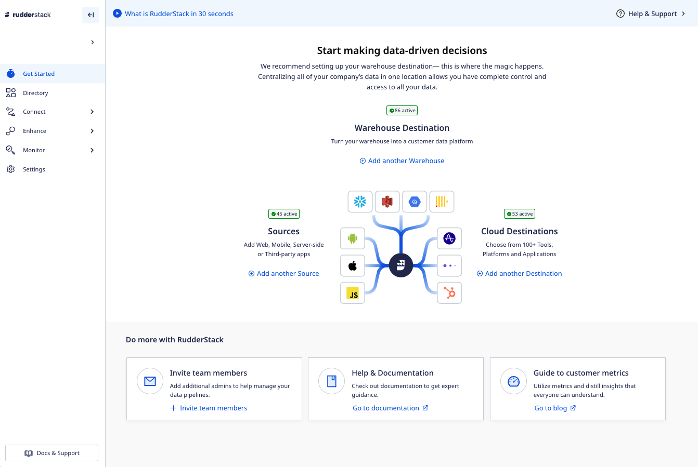
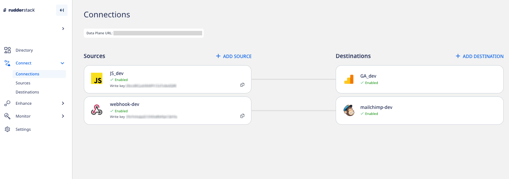
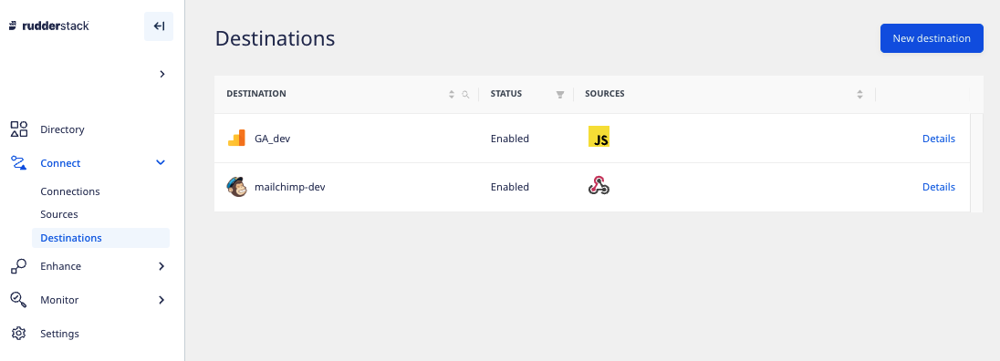
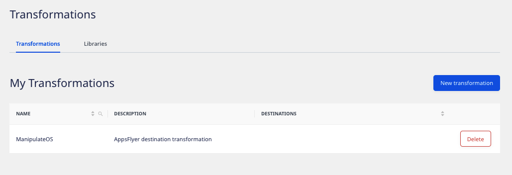

Once you [sign up](https://app.rudderstack.com/signup) for RudderStack Cloud, you are presented with a dashboard that lets you set up and manage all your event data sources, destinations, and connections through an easy-to-use UI.

This guide walks you through all the dashboard options to get started with RudderStack Cloud in no time.

## Get Started

This option helps you easily get started with RudderStack. You can set up a source and connect it to your cloud destinations or data warehouses via this page, as shown:

## Directory

**Directory** acts as a catalogue for all the sources (<Link to="/sources/cloud-apps/">Cloud Apps</Link>, <Link to="/sources/extract/">Cloud Extract</Link> and <Link to="/sources/reverse-etl/">Reverse ETL</Link>) and destinations (<Link to="/destinations/warehouse-destinations/">Warehouse</Link> and <Link to="/destinations/streaming-destinations/">Streaming destinations</Link>) supported by RudderStack.

## Connections

This option lets you set up your data pipelines by connecting different sources and destinations across your entire customer data stack.

### Data plane URL

For routing and processing the events to the RudderStack backend, a **data plane URL** is required.

Refer to the <Link to="/resources/rudderstack-architecture/">RudderStack Architecture</Link> guide for more information the RudderStack data plane.

Here's how to get the Data Plane URL:

* If you're using [RudderStack Cloud Free](https://app.rudderlabs.com/signup?type=freetrial), the data plane URL is provided in the dashboard itself. 
* If you're using [RudderStack Pro or Enterprise](https://rudderstack.com/pricing), [contact us](https://rudderstack.com/join-rudderstack-slack-community) for the data plane URL with the email ID you used to sign up for RudderStack.
* If you're using [RudderStack Open Source](https://app.rudderstack.com/signup?type=opensource), you are required to <Link to="/get-started/rudderstack-open-source/data-plane-setup/">set up your own data plane</Link> in your preferred environment.

An open source data plane URL looks like <code class="inline-code">http:localhost:8080</code> where <code class="inline-code">8080</code> is typically the port where your RudderStack data plane is hosted.

### Sources

This option lists all the configured sources in your workspace. You can add a new source by clicking on the **New Source** button, as shown:

Refer to the <Link to="/sources/">Sources</Link> guide for more details on setting up a source in RudderStack.

### Destinations

This option lists all the configured destinations where you can send your event data. You can add a new destination by clicking on the **New Destination** button, as shown:

Refer to the <Link to="/destinations/overview/">Destinations</Link> guide for more details on setting up a destination in RudderStack.

## Syncs

This option provides detailed metrics on the events synced to the warehouse destinations. You can also filter the event data based on a specific source or destination by using the filter option in the header or sync the data manually by using the **Sync Now** button.

## Models

This feature lets you define custom SQL queries which can be executed on your warehouse. You can then use RudderStack to send the resulting data to specific destinations.

Refer to the <Link to="/sources/reverse-etl/features/models/">Models</Link> guide for more details on setting up a new model in RudderStack.

## Transformations

With this option, you can write your own JavaScript functions to transform your events. You can also create your own **Libraries** to reuse a transformation's code for other transformations.

Refer to the <Link to="/features/transformations/">Transformations</Link> guide to learn more about this feature.

## Audit Logs

Audit logs can be used to track the user activities within your RudderStack workspace.

Audit logs is an <a href="https://www.rudderstack.com/pricing/">enterprise</a> feature.

Refer to the <Link to="/dashboard-guides/audit-logs/">Audit Logs</Link> guide for more information on this feature.

## Tracking Plans

**Tracking Plans** is an **enterprise feature** lets you proactively monitor and act on non-compliant event data coming into your RudderStack sources based on the predefined plans. It ensures data quality and validates your expected events against the live events that are delivered to RudderStack with real-time validation.

Refer to the <Link to="/features/data-governance/tracking-plans/">Tracking plans</Link> guide for more information on creating and using tracking plans in RudderStack.

## Settings

This option lets you manage the settings and various details related to your RudderStack account.

### Account

It displays the general account settings like name, email, and password. You can change your account name and password, set up and enforce two-factor authentication.

You can also generate a <Link to="/dashboard-guides/personal-access-token/">Personal Access Token</Link> required to use the RudderStack APIs.

### Members

This option displays all your teammates with their access permissions in the current RudderStack workspace. You can also invite new teammates by using the **Invite Teammate** button.

Refer to the <Link to="/dashboard-guides/permissions-management/">Permissions Management</Link> guide for more details on this option.

### Billing

It displays the billing information of your RudderStack account. You can change the existing plan or contact sales to get more information.

### Company

This tab lets you change your workspace name and company name. You can also find your <Link to="#workspace-token">workspace token</Link> here.

### Workspace Token

The workspace token is a unique identifier associated with your current RudderStack workspace. 

The workspace token is not available for the <a href="https://www.rudderstack.com/pricing/">RudderStack Pro and Enterprise</a> versions as the RudderStack team handles the deployment. 

To get your workspace token, go to **Settings** > **Company**, as shown:

By default, the workspace token is hidden for security purposes. You must have <Link to="/dashboard-guides/teammates/#admin">administrative privileges</Link> to access the token.

To view the workspace token, click on <strong>Reveal Token</strong> and enter the password associated with your RudderStack account.

### Data privacy

In this tab, you can control who can view the PII(Personally Identifiable Information) by limiting access to the raw event data.

Refer to the <Link to="/dashboard-guides/permissions-management/#limiting-access-to-pii-related-features">Permissions Management</Link> guide for more details on this option.

## Contact us

For queries on any of the sections covered in this guide, you can [contact us](mailto:%20docs@rudderstack.com) or start a conversation in our [Slack](https://rudderstack.com/join-rudderstack-slack-community) community.
