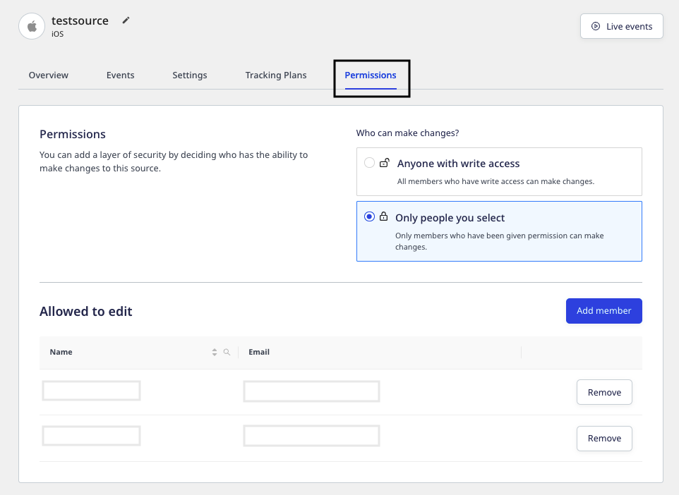
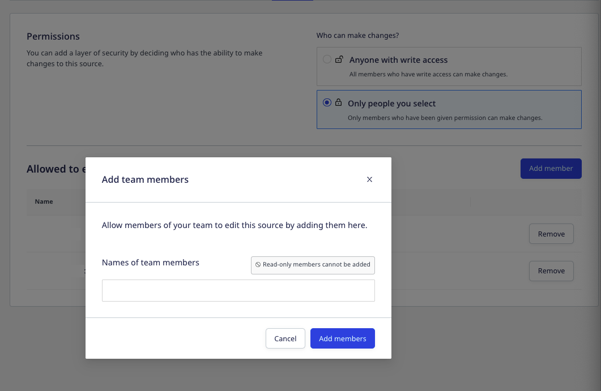
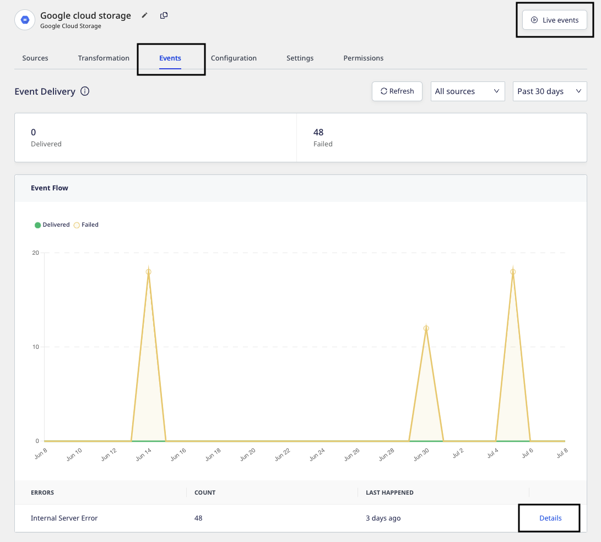
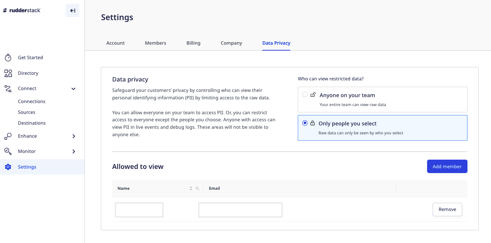
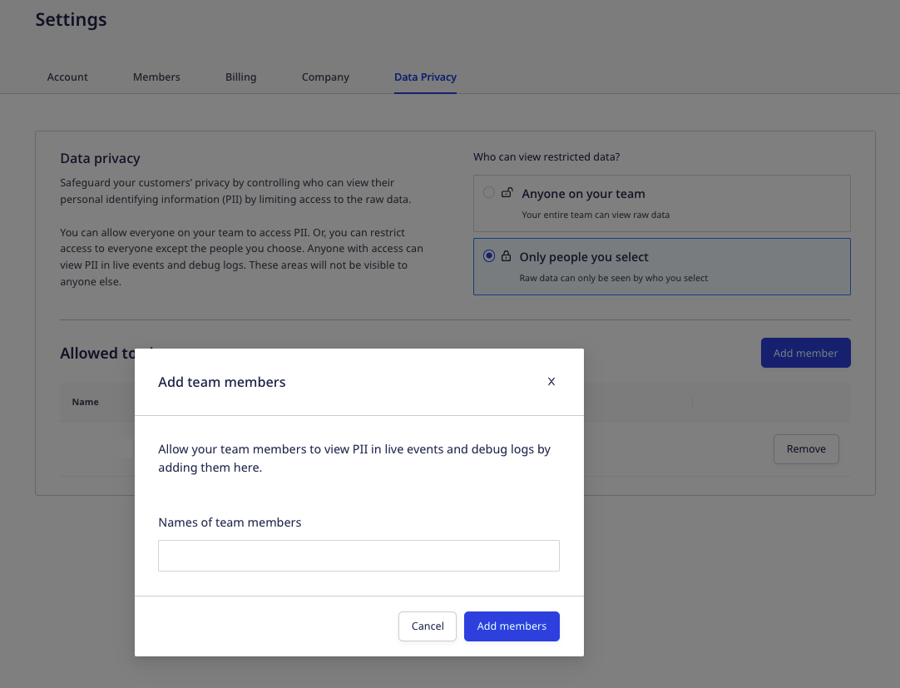

RudderStack's permissions management feature gives you the ability to:

- <Link to="#restricting-edit-permissions-for-individual-objects">Restrict edit permissions</Link> for business-critical objects in your workspace.
- <Link to="#limiting-access-to-pii-related-features">Limit access</Link> to the product features where PII is exposed (for example, Live Events, debug logs, etc.) for compliance purposes.

<GhBadge
  url={'https://rudderstack.com/enterprise-quote'}
  label={'Plan'}
  message={'Enterprise'}
  color={'blueviolet'}
/>

## Setting granular access controls

When you <Link to="/dashboard-guides/user-management/#inviting-users-to-your-workspace">invite a member to your workspace</Link>, RudderStack lets you assign any of the three default global roles to them - <Link to="/dashboard-guides/user-management/#read-only">Read-Only</Link>, <Link to="/dashboard-guides/user-management/#read-write">Read-Write</Link>, and <Link to="/dashboard-guides/user-management/#admin">Admin</Link>.

Although these permissions provide basic controls, they can end up being too broad or too narrow for certain use-cases. For example, admins cannot restrict access to modify a destination's settings without removing edit permissions for the user entirely. 

With RudderStack's granular access control features, admins can lock down business-critical objects to a select list of people. They can also restrict PII(Personally Identifiable Information) access to certain users.

With these features, you can allow certain data pipelines to be edited <strong>only</strong> by the users who have the required access. Also, you can ensure your access controls are in compliance with the major data regulations like SOC2, GDPR, CCPA, HIPAA, etc.

All the access-related changes are recorded in the <Link to="/dashboard-guides/audit-logs/">audit logs</Link>.

### Restricting edit permissions for individual objects

The **Permissions** tab in the RudderStack dashboard lets you specify the list of members having edit permissions to a given object or resource. 

Only users with the <Link to="/dashboard-guides/user-management/#admin">Admin</Link> role have access to the <strong>Permissions</strong> tab.

This tab is visible for every source, destination, and model present in the workspace, as seen below:

The edit permissions include the ability to:

- Connect/disconnect a resource with another resource. For example, source to destination, source to tracking plan, transformation to destination, model to reverse ETL source, etc.
- Enable, disable, or delete a resource.
- Edit or change the resource-specific configuration.

Any action involving setting up a connection between two resources or linking/de-linking a resource with another resource requires edit permissions for both the resources. The only exception is the <Link to="/sources/reverse-etl/features/models/">SQL Models</Link> which can used without explicitly setting any edit permissions.

To specify the list of users who can make changes to a given resource, follow these steps:

1. Go to the resource and click on the **Permissions** tab, as shown:

2. Under **Who can make changes?**, select any of the following two options:

    - **Anyone with write access**: All the members with the **Read-Write** or **Admin** role can make changes to the resource.
    - **Only people you select**: With this option, only the members who are given the edit permission can make changes to the resource.
3. To allow specific members of your team to edit the resource, click **Only people you select**, followed by **Add member**.
4. Finally, select the team members from the drop-down and click **Add Members**, as shown:

Members with <Link to="/dashboard-guides/user-management/#read-only">Read-Only</Link> permissions cannot be added as they do not have permissions to modify a resource, by default.

### Limiting access to PII-related features

With this feature, you can safeguard your customers' privacy by controlling who has access to the raw event data containing the PII. You can either allow anyone on your team to access the PII or restrict the access only to a select list of members.

Anyone with the access can view the customers' PII in the <Link to="/dashboard-guides/live-events/">Live Events</Link> and the error logs under the <strong>Events</strong> tab for your <Link to="/dashboard-guides/destinations/#destination-details">destination</Link>, as shown:

To set the PII permissions, follow these steps:

1. In your RudderStack dashboard, go to **Settings** > **Data Privacy**, as shown:

Only users with the <Link to="/dashboard-guides/user-management/#admin">Admin</Link> role have access to this tab.

2. Under **Who can view restricted data?**, select the appropriate option:

    - **Anyone on your team**: All the members in your workspace can view the raw event data containing your customers' PII.
    - **Only people you select**: With this option, only the people you select can view the raw data.
3. To allow specific members of your team to edit the object, click **Only people you select**, followed by **Add member**.
4. Finally, select the team members from the drop-down and click **Add Members**, as shown:

If the admins are removed from the access list, they will be restricted from viewing the PII.

