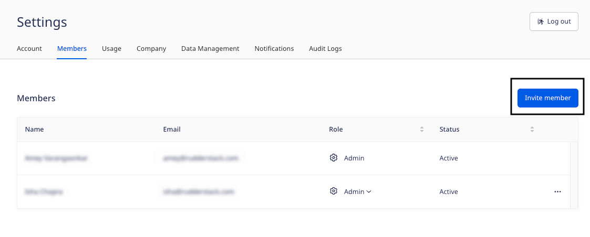
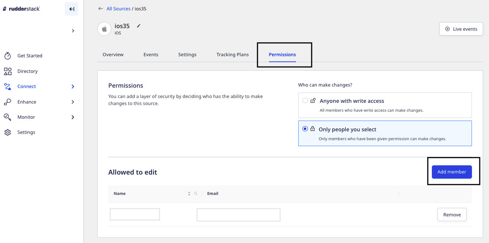
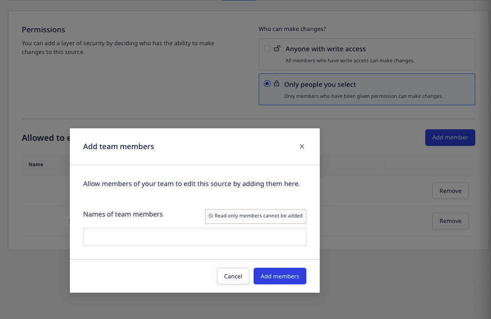
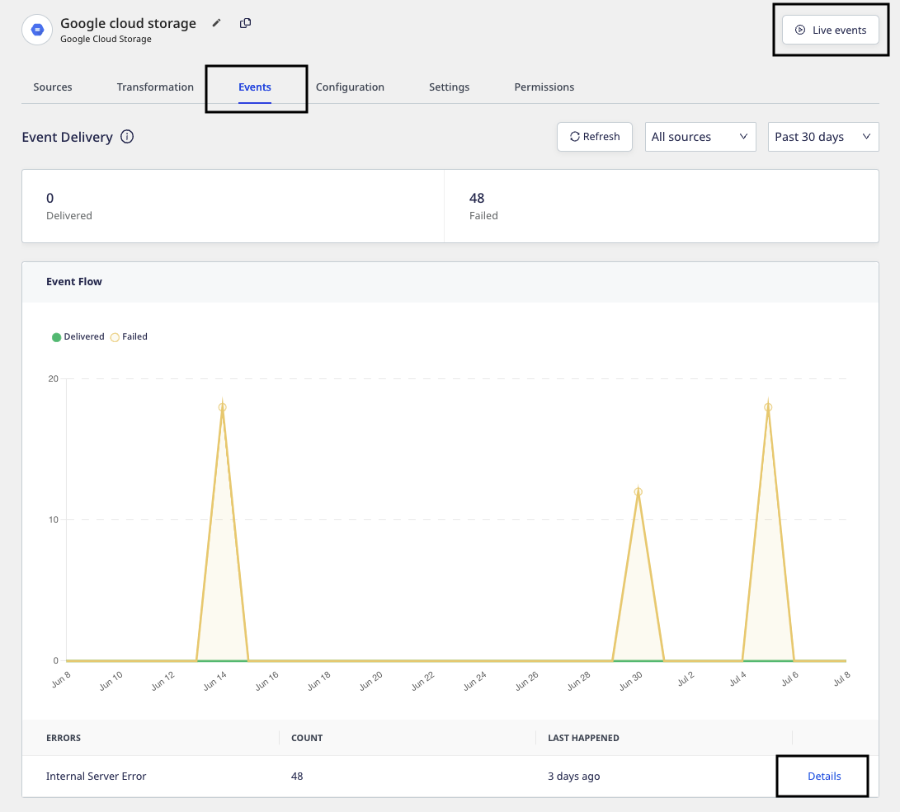
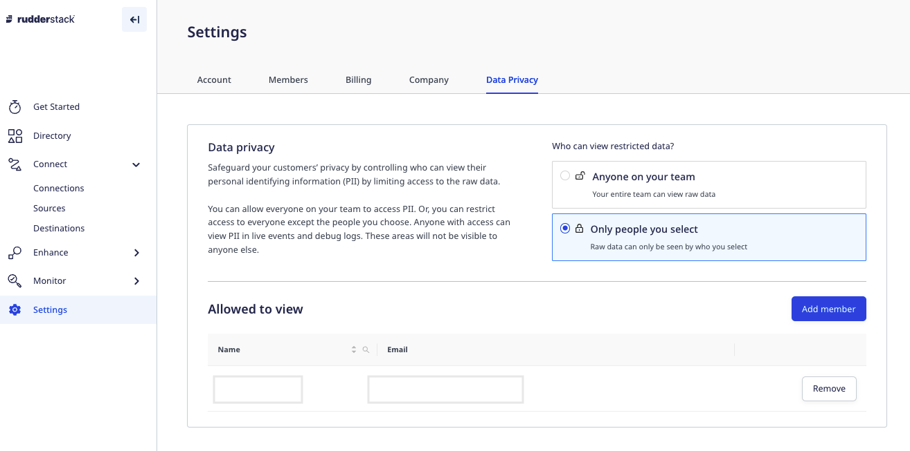
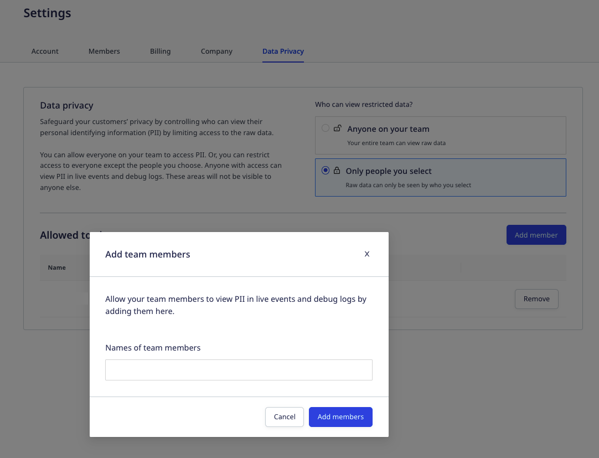

RudderStack's permissions management feature lets you manage users and the permissions assigned to them in your RudderStack workspace. 

This feature allows also you to:
- Enable easier collaboration between you and other members of your organization.
- <Link to="#restricting-edit-permissions-for-individual-objects">Restrict edit permissions</Link> for business-critical objects in the workspace.
- <Link to="#limiting-access-to-pii-related-features">Limit access</Link> to product features where PII is exposed (for example, Live Events, debug logs, etc.) for compliance purposes.

## Inviting users

To invite a member to your RudderStack workspace, follow these steps:
1. Go to **Settings** > **Members** and click the **Invite Teammate** button, as shown:

2. Enter the **Email** of the member and select a role from the dropdown.

Refer to the <Link to="#role-permissions">Role permissions</Link> section below for more information on the Read-Only, Read-Write, and Admin roles.

3. Finally, click **Invite**.

Your teammate will be automatically added to the workspace once they accept the invite.

### Member limit

The following table lists the number of teammates you can add to your workspace, according to your RudderStack plan:

| Plan                        | Number of permissible teammates |
| :----------------- | :---------------------- |
| [RudderStack Cloud Free](https://app.rudderstack.com/signup?type=freetrial)       | 3                       |
| [RudderStack Cloud Pro](https://www.rudderstack.com/pricing/)      | 10                      |
| [RudderStack Cloud Enterprise](https://www.rudderstack.com/pricing/) | Unlimited               |

Refer to the <a href="https://rudderstack.com/pricing/">RudderStack pricing plans</a> for a complete list of features supported by each plan. To upgrade your plan, <a href="https://app.rudderstack.com/profile/billing">click here</a>.

## Role permissions

You can assign any of the following three roles to the member you want to invite to your workspace:

- Read-Only
- Read-Write
- Admin

The following sections list the **default permissions** associated with each role.

You can also set granular access controls and lock down access to specific RudderStack objects and features to a select list of members in your workspace. For more information, refer to the <Link to=""></Link> section below.

### Read-Only

This user role has the following permissions:

| Feature       | View | Add | Modify | Delete |
| :----------- | :--- | :-- | :----- | :----- |
| <Link to="/sources/">Sources</Link>   | Yes  | No  | No     | No     |
| <Link to="/destinations/">Destinations</Link> | Yes  | No  | No     | No     |
| <Link to="/get-started/quickstart/">Connections</Link>     | Yes  | No  | No     | No     |
| <Link to="/dashboard-guides/live-events/">Live Events</Link> | Yes | - | - | - |
| <Link to="/features/transformations/">Transformations</Link> | Yes  | No  | No     | No     |
| <Link to="/dashboard-guides/audit-logs/">Audit Logs</Link> | No | - | - | - |
| <Link to="/features/data-governance/tracking-plans/">Tracking Plans</Link> | Yes  | No  | No     | No     |
| <Link to="/sources/reverse-etl/features/models/">Models</Link> | Yes | No  | No     | No     |

Some things to note regarding the read-only user permissions:
- Read-only users can view the settings of all the destinations. However, secrets like access keys are hidden from them.
- They can run tests on existing transformations but they cannot add, modify, or delete transformations.
- They can also view any secrets, like API keys in the transformation code.

### Read-Write

A read-write user has all the permissions of a read-only user in addition to modifying the key workspace features and options, as listed below:

| Feature          | View | Add | Modify | Delete |
| :-------------- | :--- | :-- | :----- | :----- |
| <Link to="/sources/">Sources</Link>         | Yes  | Yes | Yes    | Yes    |
| <Link to="/destinations/">Destinations</Link>    | Yes  | Yes | Yes    | Yes    |
| <Link to="/get-started/quickstart/">Connections</Link>     | Yes  | Yes | Yes    | Yes    |
| <Link to="/dashboard-guides/live-events/">Live Events</Link> | Yes | - | - | - |
| <Link to="/features/transformations/">Transformations</Link> | Yes  | Yes | Yes    | Yes    |
| <Link to="/dashboard-guides/audit-logs/">Audit Logs</Link> | Yes | - | - | - |
| <Link to="/features/data-governance/tracking-plans/">Tracking Plans</Link> | Yes  | Yes | Yes    | Yes    |
| <Link to="/sources/reverse-etl/features/models/">Models</Link> | Yes  | Yes | Yes    | Yes    |

### Admin

This user role has complete access to the RudderStack workspace, including all the features in the current plan:

| Feature          | View | Add | Modify | Delete |
| :------------ | :--- | :-- | :----- | :----- |
| <Link to="/sources/">Sources</Link>       | Yes  | Yes | Yes    | Yes    |
| <Link to="/destinations/">Destinations</Link>    | Yes  | Yes | Yes    | Yes    |
| <Link to="/get-started/quickstart/">Connections</Link>    | Yes  | Yes | Yes    | Yes    |
| <Link to="/dashboard-guides/live-events/">Live Events</Link> | Yes | - | - | - |
| <Link to="/features/transformations/">Transformations</Link> | Yes  | Yes | Yes    | Yes    |
| <Link to="/dashboard-guides/audit-logs/">Audit Logs</Link> | Yes | - | - | - |
| <Link to="/features/data-governance/tracking-plans/">Tracking Plans</Link> | Yes  | Yes | Yes    | Yes    |
| <Link to="/sources/reverse-etl/features/models/">Models</Link> | Yes  | Yes | Yes    | Yes    |

The Admin role also has some additional permissions related to configuring the workspace settings, including managing users, modifying user permissions, enforcing MFA (multi-factor authentication), and more. This role also has the required permissions to <Link to="#setting-granular-access-controls">set granular access controls</Link> for certain business-critical objects and <Link to="#limiting-access-to-pii-related-features">limit PII access</Link> to certain users.

## Detailed role-specific permissions

For detailed role-specific permissions for various RudderStack features and settings, refer to the <Link to="/dashboard-guides/permissions-management/permissions-matrix/">Permissions Matrix</Link> guide.

## Setting granular access controls

When you add a member to your workspace, RudderStack lets you assign any of the three default global roles - <Link to="#read-only">Real-Only</Link>, <Link to="#read-write">Real-Write</Link>, and <Link to="#admin">Admin</Link>. 

Although these permissions provide basic controls, they can end up being too broad or too narrow for certain use-cases. For example, admins cannot restrict access to modifying a certain destination's settings without removing edit permissions for the user entirely. 

With RudderStack's latest granular access control features, admins can lock down business-critical objects to a select list of people. You can also restrict certain users from accessing RudderStack features where the PII (Personally Identifiable Information) is exposed.

With these features, you can allow certain data pipelines to be edited <strong>only</strong> by the users who have the required access. Also, you can ensure your access controls are in compliance with the major data regulations like SOC2, GDPR, CCPA, HIPAA, etc.

All the access changes are recorded in the <Link to="/dashboard-guides/audit-logs/">audit log</Link>.

### Restricting edit permissions for individual objects

This tab lets you specify the list of members having edit permissions to a given object. These permissions include:

- Connecting / disconnecting the object with other objects.
- Enabling, disabling, or deleting the object
- Editing or changing the object-specific configuration

Only users with the Admin role have access to the <strong>Permissions</strong> tab. This tab is visible for every source, destination, transformation, tracking plan, and model present in the workspace.

To specify who can make changes to a given object, follow these steps:

1. Go to the object and click on the **Permissions** tab, as shown:

2. Under **Who can make changes?**, select any of the following two options:

    - **Anyone with write access**: All the members having the Read-Write or Admin role can make changes to the object.
    - **Only people you select**: With this option, only the members who are given the permission can make changes to the object.
3. To allow specific members of your team to edit the object, click **Only people you select**, followed by **Add member**.
4. Finally, select the team members from the drop-down and click **Add Members**, as shown:

Members with Read-Only permissions cannot be added as they do not have permissions to modify an object, by default.

## Limiting access to PII-related features

With this feature, you can safeguard your customers' privacy by controlling who has access to the raw event data containing the PII. You can allow everyone on your team to access the PII, or restrict access to a select list of members.

Anyone with the access can view the customers' PII in the <Link to="/dashboard-guides/live-events/">Live Events</Link> and the error logs under the <strong>Events</strong> tab for your <Link to="/dashboard-guides/sources/#source-details">source</Link> or <Link to="/dashboard-guides/destinations/#destination-details">destination</Link>, as shown:

To set the PII permissions, follow these steps:

1. In your RudderStack dashboard, go to **Settings** > **Data Privacy**, as shown:

2. Under **Who can view restricted data?**, select the appropriate option:

    - **Anyone on your team**: All the members in your workspace can view the raw event data containing your customers' PII.
    - **Only people you select**: With this option, only the people you select can view the raw data.
3. To allow specific members of your team to edit the object, click **Only people you select**, followed by **Add member**.
4. Finally, select the team members from the drop-down and click **Add Members**, as shown:

If the PII is restricted globally, even the admins will be restricted from viewing the PII.

## Contact us

For queries on any of the sections covered in this guide, you can [contact us](mailto:%20docs@rudderstack.com) or start a conversation in our [Slack](https://rudderstack.com/join-rudderstack-slack-community) community.
