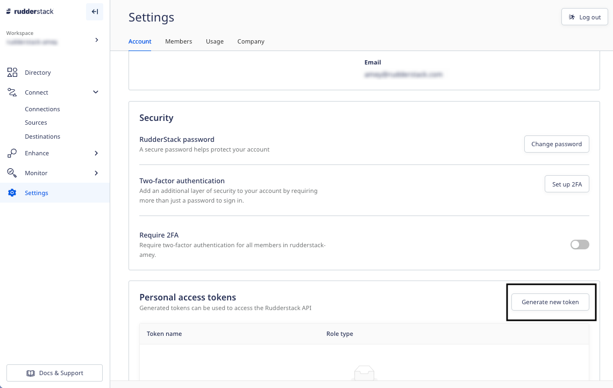
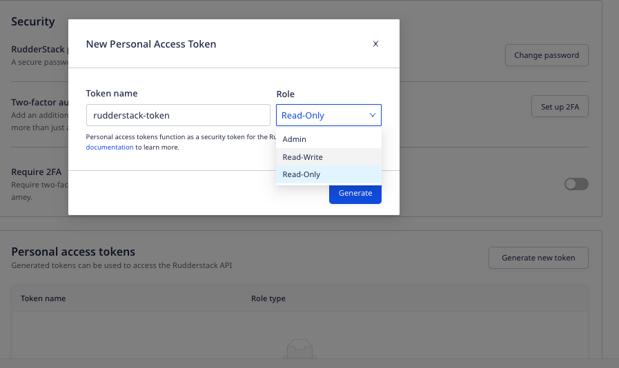
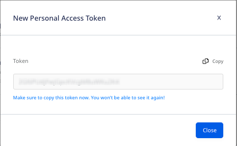

To consume all the public RudderStack APIs, you need an access token associated with your RudderStack account. This guide describes the steps to generate a **personal access token** and the operations associated with it.

You can create and use the personal access tokens with the permissions specific to your role type. For example, <Link to="/dashboard-guides/user-management/#read-only">Read-only</Link> users can create access tokens with only read-only privileges, <Link to="/dashboard-guides/user-management/#read-write">Read-Write</Link> users with read-only and read-write privileges, and <Link to="/dashboard-guides/user-management/#admin">Admin</Link> users with all the privileges.

## Generating a personal access token

Follow these steps to generate a personal access token:

1. Log into your [RudderStack dashboard](https://app.rudderstack.com/).
2. Go to **Settings** and scroll down to **Personal access tokens** under the **Account** tab.
3. Click the **Generate new token** button, as shown:

4. Enter the **Token name** and select the **Role** (access permissions) from the dropdown:

For more information on the Read-Only, Read-Write, and Admin permissions, refer to the <Link to="/dashboard-guides/user-management/#role-permissions">User Management</Link> guide.

5. Then, click **Generate**.
6. Copy and save the personal access token details securely. 

Make sure you copy the generated token as it will not be visible again once you close this window.

## Deleting a personal access token

To delete an existing token, click the corresponding **Delete** option next to that token, and confirm by clicking **Yes, delete**.