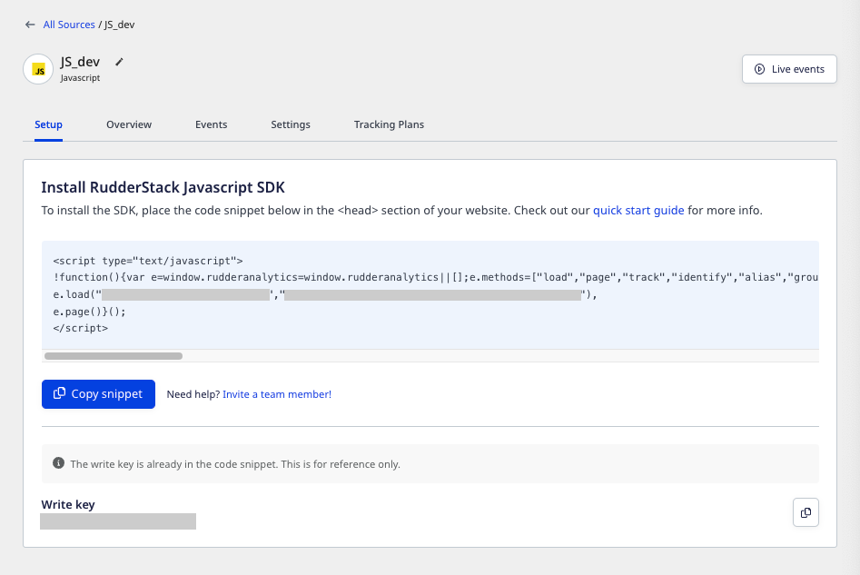

A **source** is a platform or an application (web, mobile, server-side, or a third-party cloud app) from where RudderStack tracks and collects the event data.

<div class="infoBlock">
You can configure a source for every unique source of data. You can also create multiple sources for each website or application from where you want to track the data.
</div>

The **Sources** option is provided in the left navigation bar in the RudderStack dashboard. It lets you view all your configured sources, as shown:


## Adding a source

Follow these steps to add a source in RudderStack:

1. Log into your [RudderStack dashboard](https://app.rudderstack.com/).
2. Click **Add Source** and select the source you want to set up in RudderStack.

<div class="infoBlock">
RudderStack classifies the sources into following
  categories:
  <ul>
    <li>
      <Link to="/sources/cloud-apps/">Event Stream</Link>
    </li>
    <li>
      <Link to="/sources/extract/">Cloud Extract</Link>
    </li>
    <li>
      <Link to="/sources/reverse-etl/">Reverse ETL</Link>
    </li>
  </ul>
</div>

3. Assign a name to the source and click **Next** to configure the source successfully.


<div class="infoBlock">
Note the source <strong>Write Key</strong> in the above image. It is required while configuring the RudderStack SDK to track and collect events from your source platform.
</div>

<div class="warningBlock">
Setting up <Link to="/sources/extract/">Cloud Extract</Link> or <Link to="/sources/reverse-etl/">Reverse ETL</Link> sources require some additional configuration. Refer to the relevant source-specific documentation for details.
</div>

## Source details

To get details about a configured source, click on it to see the following options:

- **Rename**: Lets you rename the source by clicking the edit icon next to the source's name.


- **Live Events**: Lets you view the real-time event data flowing through RudderStack. Refer to <Link to="/dashboard-guides/live-events/">Live Events</Link> for more information.
- **Setup**: Includes the installation snippet and the write key to set up your source.



- **Write Key**: Required to send the data from your source. For example, you can load the <Link to="/sources/sdks/rudderstack-javascript-sdk/">RudderStack JavaScript SDK</Link> on your website to track and collect the events by running the following snippet:

```javascript
  rudderanalytics.load(WRITE_KEY, DATA_PLANE_URL, options);
```

- **Overview**: Gives you a quick overview of the source, including metrics like the number of events ingested in the last 24 hours.
- **Add Destination**: Lets you add a new destination connected to this source.

<div class="infoBlock">
If you have already configured a destination in RudderStack, you can also use it by clicking on <strong>Add Destination</strong> > <strong>Use Existing Destination</strong>.
</div>

- **Events**: Displays all the latest metrics related to the event delivery such as number of events successfully delivered, failed events, etc. You can also filter these by the time period (past 1 day, 7 days, or 30 days).
- **Settings**: Provides additional source-related settings, like:
  - **Enabled**: Lets you enable or disable syncing data from this source.
  - **Source ID**: Unique identifier associated with your source.
  - **Permanently delete source**: Lets you delete a source by clicking on the **Delete** button.

<div class="warningBlock">
Before deleting a source, make sure there are no destinations connected to it.
</div>

- **Tracking Plans**: Lets you link a <Link to="/features/data-governance/tracking-plans/">tracking plan</Link> with the source.
- **Permissions**: Lets you determine which members in your workspace can make changes to this source.

<div class="infoBlock">
Refer to the <Link to="/dashboard-guides/permissions-management/#restricting-edit-permissions-for-individual objects">Permissions Management</Link> guide for more details on this option.
</div>

## FAQ

### What is a write key? Why is it required?

The write key (also referred to as the source write key) is used to integrate the RudderStack SDK with your application before tracking events from it. You can click on a source and view it in the **Setup** tab.