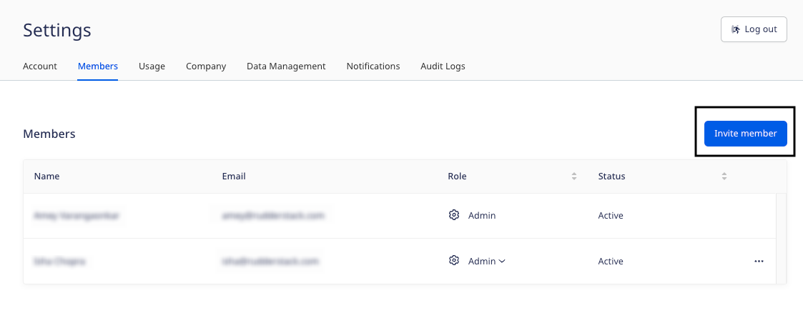

RudderStack's user management feature lets you manage users and their permissions in your RudderStack workspace. It lets you easily collaborate with other members of your organization.

## Inviting users to your workspace

To invite a member to your RudderStack workspace, follow these steps:

1. Go to **Settings** > **Members** and click the **Invite Teammate** button, as shown:

2. Enter the member's **Email** and select an appropriate role from the dropdown.

Refer to the <Link to="#role-permissions">Role permissions</Link> section below for more information on the Read-Only, Read-Write, and Admin roles.

3. Finally, click **Invite**.

Your teammate will be automatically added to the workspace once they accept the invite.

## Role permissions

You can assign any of the following three roles to the member you want to invite to your workspace:

- Read-Only
- Read-Write
- Admin

The following sections list the **default permissions** associated with each role.

You can also set granular access controls and lock down access to specific RudderStack objects and features to a select list of members in your workspace. For more information, refer to the <Link to="/dashboard-guides/permissions-management/">Permissions Management</Link> guide.

### Read-Only

This user role has the following permissions:

| Feature       | View | Add | Modify | Delete |
| :----------- | :--- | :-- | :----- | :----- |
| <Link to="/sources/">Sources</Link>   | Yes  | No  | No     | No     |
| <Link to="/destinations/">Destinations</Link> | Yes  | No  | No     | No     |
| <Link to="/get-started/quickstart/">Connections</Link>     | Yes  | No  | No     | No     |
| <Link to="/dashboard-guides/live-events/">Live Events</Link> | Yes | - | - | - |
| <Link to="/features/transformations/">Transformations</Link> | Yes  | No  | No     | No     |
| <Link to="/dashboard-guides/audit-logs/">Audit Logs</Link> | No | - | - | - |
| <Link to="/features/data-governance/tracking-plans/">Tracking Plans</Link> | Yes  | No  | No     | No     |
| <Link to="/sources/reverse-etl/features/models/">Models</Link> | Yes | No  | No     | No     |

The members with read-only user permissions can:
- View the connection settings for all the destinations. However, they do not have access to view secrets like the access keys.
- View any secrets in the transformation code like API keys.

### Read-Write

A read-write user has all the permissions of a read-only user in addition to modifying the key workspace features and options listed below:

| Feature          | View | Add | Modify | Delete |
| :-------------- | :--- | :-- | :----- | :----- |
| <Link to="/sources/">Sources</Link>         | Yes  | Yes | Yes    | Yes    |
| <Link to="/destinations/">Destinations</Link>    | Yes  | Yes | Yes    | Yes    |
| <Link to="/get-started/quickstart/">Connections</Link>     | Yes  | Yes | Yes    | Yes    |
| <Link to="/dashboard-guides/live-events/">Live Events</Link> | Yes | - | - | - |
| <Link to="/features/transformations/">Transformations</Link> | Yes  | Yes | Yes    | Yes    |
| <Link to="/dashboard-guides/audit-logs/">Audit Logs</Link> | Yes | - | - | - |
| <Link to="/features/data-governance/tracking-plans/">Tracking Plans</Link> | Yes  | Yes | Yes    | Yes    |
| <Link to="/sources/reverse-etl/features/models/">Models</Link> | Yes  | Yes | Yes    | Yes    |

### Admin

This user role has complete access to the RudderStack workspace, including all the features in the current plan:

| Feature          | View | Add | Modify | Delete |
| :------------ | :--- | :-- | :----- | :----- |
| <Link to="/sources/">Sources</Link>       | Yes  | Yes | Yes    | Yes    |
| <Link to="/destinations/">Destinations</Link>    | Yes  | Yes | Yes    | Yes    |
| <Link to="/get-started/quickstart/">Connections</Link>    | Yes  | Yes | Yes    | Yes    |
| <Link to="/dashboard-guides/live-events/">Live Events</Link> | Yes | - | - | - |
| <Link to="/features/transformations/">Transformations</Link> | Yes  | Yes | Yes    | Yes    |
| <Link to="/dashboard-guides/audit-logs/">Audit Logs</Link> | Yes | - | - | - |
| <Link to="/features/data-governance/tracking-plans/">Tracking Plans</Link> | Yes  | Yes | Yes    | Yes    |
| <Link to="/sources/reverse-etl/features/models/">Models</Link> | Yes  | Yes | Yes    | Yes    |

The Admin role also has some additional permissions related to the configuration of the workspace settings, including managing users, modifying user permissions, enforcing MFA(multi-factor authentication), and more. This role also has the required permissions to <Link to="/dashboard-guides/permissions-management/#setting-granular-access-controls">set granular access controls</Link> for certain business-critical objects and <Link to="/dashboard-guides/permissions-management/#limiting-access-to-pii-related-features">limit PII access</Link> to certain users.

