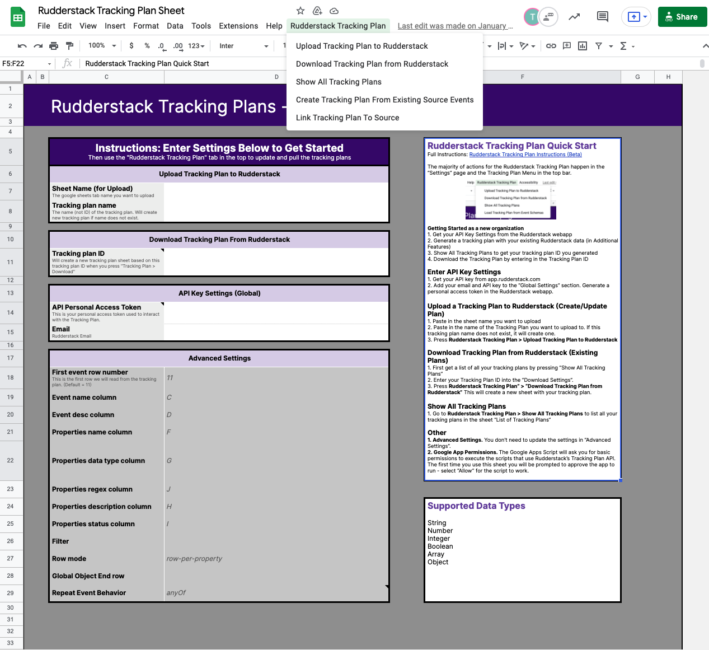
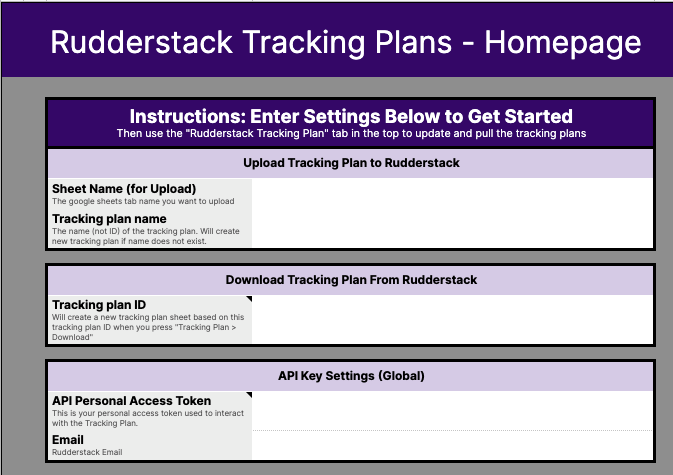
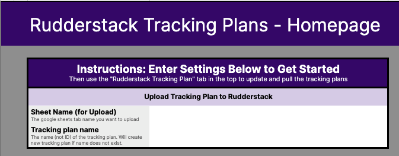
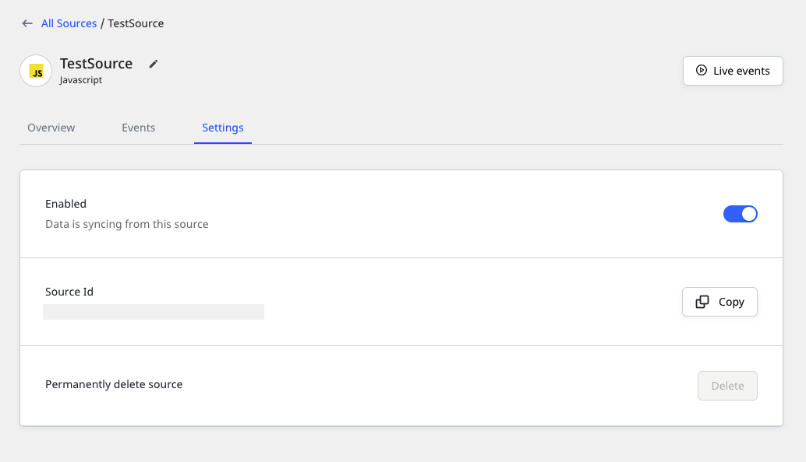
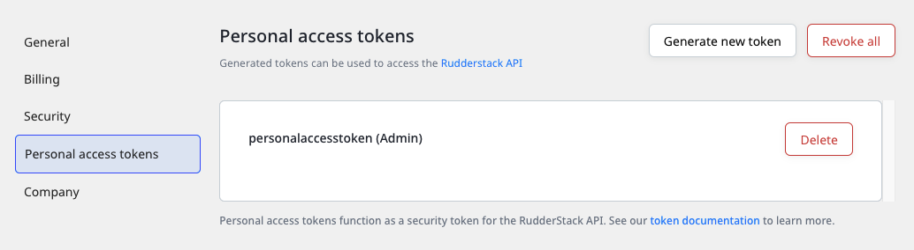
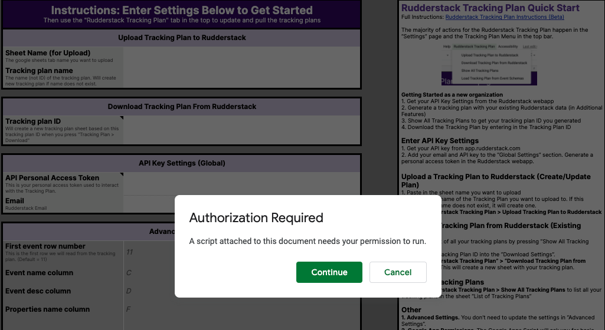

# Tracking Plan Spreadsheet

By default, the Tracking Plan configuration is in JSON format. The [Tracking Plan spreadsheet](https://docs.google.com/spreadsheets/d/1QnCY3dbzyz2InB68W3AGIJshsuY3Zu8WA3AfMMxIzAQ/edit#gid=1810167975) is a no-code, spreadsheet representation of your Tracking Plan configuration. It lets you easily create or use an existing Tracking Plan.

This guide details the various options and spreadsheet settings that let you configure your Tracking Plan.

##  Spreadsheet overview

The Tracking Plan spreadsheet uses the Google Sheets' scripts functionality to integrate with the Rudderstack Tracking Plan API.

The configuration settings for your Tracking Plan are listed in the **Homepage** and **Additional Features** tabs of the Tracking Plan spreadsheet. They are linked to the actions listed in the **RudderStack Tracking Plan** menu in the Google Sheets top bar, as shown:

The Tracking Plan spreadsheet currently supports only simple datatypes (strings, numbers, Boolean, arrays, and objects).

You can create, delete, or update the events or the properties within these events. Once you upload the changes, RudderStack creates a new version of the Tracking Plan to keep track of your changes.

## Creating a Tracking Plan from existing event data

RudderStack lets you create a Tracking Plan from an existing event data source. This option uses the Data Governance API and the Tracking API features to generate an initial plan.

This is the easiest way to kickstart your Tracking Plan program without having to start from scratch.

To create a Tracking Plan from an existing RudderStack source, follow these steps:

1. Go to the **Additional Features** tab of your Tracking Plan spreadsheet. 
2. Under **Create Tracking Plan from Existing Source**, enter the following settings:

    - **Data Plane URL**: Enter the data plane URL of your workspace or where the data plane is hosted.
    - **Write key**: Enter the write key for the RudderStack source. You can find it in the **Sources** page.
    - **Username**: Enter your admin username.
    - **Password**: Enter your admin password.
    - **Tracking Plan Name**: Assign a name to this Tracking Plan.

The <strong>Username</strong> and <strong>Password</strong> are your Grafana dashboard credentials and not your RudderStack account credentials. If you are unsure, contact your Account Manager.

3. Click on the **RudderStack Tracking Plan** > **Create Tracking Plan from Existing Source Events** option in the top bar to create a new Tracking Plan.

For the first time you use the Tracking Plan spreadsheet, you will be prompted with an approval request. Select <strong>Allow</strong> to permit Google Apps to execute the scripts. Refer to the <a href="#google-apps-permissions">Google Apps Permissions</a> section below for more information.

4. To verify if the Tracking Plan is created, refer to the [Getting the Tracking Plans](#getting-the-tracking-plans) section below.

## Getting the Tracking Plans

To get a list of all your existing Tracking Plans, go to **RudderStack Tracking Plan** > **Show All Tracking Plans**.

This option lists all your existing Tracking Plans along with their respective Tracking Plan IDs in the **List of Tracking Plans** sheet.

## Downloading existing Tracking Plans from RudderStack

To download existing Tracking Plans from RudderStack, follow these steps:

1. Get a list of all your Tracking Plans by going to **RudderStack Tracking Plan** > **Show All Tracking Plans**. Note the Tracking Plan ID.
2. Go to the **Download Tracking Plan from RudderStack** option in the spreadsheet and enter the **Tracking Plan ID**, as shown:

3. Click on **RudderStack Tracking Plan** > **Download Tracking Plan from RudderStack** in the top bar. 

This will create a new sheet with your Tracking Plan.

## Uploading a Tracking Plan to RudderStack

You can use this option to create or update a Tracking Plan.

To upload a Tracking Plan to RudderStack, follow these steps:

1. Go to the **Upload Tracking Plan to RudderStack** section in the **Homepage** tab of your spreadsheet.

2. Enter the following settings:

    - **Sheet Name (for Upload)**: Enter the tab name of the sheet containing the Tracking Plan. 
    - **Tracking Plan name**: Enter the name of the Tracking Plan you want to upload to RudderStack. 

RudderStack will create a new Tracking Plan if the name does not exist.

3. Upload the Tracking Plan by going to **RudderStack Tracking Plan** > **Upload Tracking Plan to RudderStack** in the top bar.

## Linking Tracking Plan to a source

When you link a Tracking Plan to a source, all the events will be processed in accordance with that plan. 

This option lets you define the events that will be allowed to pass through or dropped by RudderStack, and the permissible errors in the event's context field.

Refer to the <a href="#server-side-validation">Server-side validation</a> section below for more information on how RudderStack enforces the Tracking Plans on your source events.

To link a Tracking Plan to a source, follow these steps:

1. In the **Additional Features** tab, go to the **Link Tracking Plan to Source**.
2. Then, enter the following settings:

    - **Tracking Plan ID**: Enter the Tracking Plan ID. Refer to the [Getting the Tracking Plans](#getting-the-tracking-plans) section for more information.
    - **Source ID**: Enter your source ID.  The following image highlights the source ID's location in the RudderStack dashboard:

A source ID uniquely identifies a RudderStack source. It is different to the source write key which is used by RudderStack to send events from the source to your specified destinations.

### Global settings

1. Specify the following settings under **Global Settings** (applicable for **all** events):

    - **Allow unplanned events**: This setting has the following options:

    
    | Option | Description |
    | :-------| :-----------|
    | **TRUE**| RudderStack will not drop the events not defined in your Tracking Plan |
    | **FALSE** | RudderStack will drop the events not defined in the Tracking Plan. |
    
    - **Unplanned Properties**: This setting has the following options:

    | Option | Description |
    | :-------| :-----------|
    | **FORWARD**| The event's `context` field will be updated with the erroneous/unplanned property and forwarded to RudderStack. |
    | **DROP** | RudderStack will drop the event containing the unplanned properties. |

    - **Other Violations**: These violations include discrepancies such as type mismatch, missing required properties, etc. 
    
    | Option | Description |
    | :-------| :-----------|
    | **FORWARD**| The event's `context` field will be updated with these violations and forwarded to RudderStack. |
    | **DROP** | RudderStack will drop the event containing the violations. |

    - **Propagate Errors**: This setting has the following options:

    | Option | Description |
    | :-------| :-----------|
    | **TRUE**| The validation errors are captured in the event's `context` and sent downstream (user transformations, destinations) |
    | **FALSE** | RudderStack will drop the event containing the validation errors. |

You can use <strong>Settings for track</strong> to explicitly define the Tracking Plan rules for <code class="inline-code">track</code> events.

2. After finalizing the settings, go to **RudderStack Tracking Plan** > **Link Tracking Plan to Source** in the top bar.

## Other spreadsheet settings

This section contains the noteworthy spreadsheet settings required to interact with your Tracking Plan.

### API key settings (Global)

- **API Personal Access Token**: Enter your Personal Access Token obtained from the RudderStack dashboard.

For more information, refer to the [Personal Access Token]() documentation.

- **Email**: Enter the email ID associated with your RudderStack account.

### Advanced settings

These settings define how RudderStack should pick the data (event/property values) from the Tracking Plan.

Do not change these settings unless absolutely necessary as it may impact the entire Tracking Plan workflow.

### Google Apps permissions

When you run the **RudderStack Tracking Plan** menu options for the first time, Google Apps will prompt you to authorize the scripts using the Tracking Plan API.

Click on **Allow** to set the permissions required for the script to work.

## Server-side validation

RudderStack uses server-side validation to enforce your Tracking Plans. When you [link a Tracking Plan to a source](#linking-tracking-plan-to-a-source), RudderStack will check all the new events against the Tracking Plan.

The  validation adds two new columns for each table and each row that specify:

- Which Tracking Plan was used
- The error message associated with the Plan

These columns will then propagate to both your data warehouse as well as cloud destinations. This lets you monitor the state of your violations and choose to act on them through manual operations or through the transformations.

## FAQ

### Does RudderStack propagate the context related to any tracking plan violations?

Currently, RudderStack propagates any context related to the tracking plan violation to the <strong>data warehouses</strong> and not all the destinations.

You can use this context in the transformations for filtering or modifying the events before they reach the destination. If you have defined the <Link to="data-governance/tracking-plans/tracking-plan-spreadsheet/#global-settings">global settings</Link> to **drop unplanned events**, the events that are explicitly dropped via the tracking plan will not reach any destination.

## Contact us

For queries on any of the sections covered in this guide, you can [**contact us**](mailto:%20docs@rudderstack.com) or get in touch with your Account Manager.
