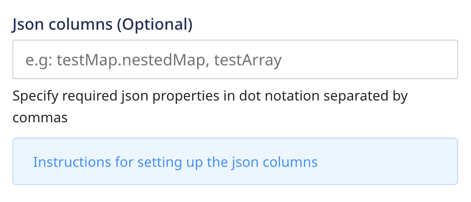

# JSON Column Support

With JSON support, you can now ingest semi-structured event data not defined by a fixed schema. Also, you can directly store a nested event payload as a whole without worrying about the warehouse columns' length limit.

<div class="infoBlock">

The JSON column feature is supported by the following warehouse destinations:
<ul>
  <li><Link to="/data-warehouse-integrations/amazon-redshift/">Amazon Redshift</Link></li>
  <li><Link to="/data-warehouse-integrations/google-bigquery">Google BigQuery</Link></li>
  <li><Link to="/data-warehouse-integrations/postgresql">PostgreSQL</Link></li>
  <li><Link to="/data-warehouse-integrations/snowflake">Snowflake</Link></li>
</ul>
</div>

<div class="warningBlock">

This feature is applicable only for the <Link to="/rudderstack-api/api-specification/rudderstack-spec/track/"><code class="inline-code">track</code></Link> events.
</div>

## Using the JSON column feature

You can use the JSON column feature using any of the following approaches:

### Declaring JSON columns at the event level

You can use the SDK's `integrations` options to specify the JSON columns at the event level. The following example demonstrates the use of the <Link to="/stream-sources/rudderstack-sdk-integration-guides/rudderstack-javascript-sdk/#integrationopts">JavaScript SDK's</Link> `IntegrationOpts` parameter to declare the JSON columns:

```javascript
"integrations": {
  "All": true,
  "RS": {
    "options": {
      "jsonPaths": ["testArray", "testMap.nestedMap"]
    }
  }
```

Here, `nestedMap` is declared as a JSON and is in the following format:

```javascript
{
  "testMap": {
    "nestedMap": {
      ...
    }
  }
}
// To declare nestedMap as a JSON column, add "testMap.nestedMap" in the above list.

```
<div class="infoBlock">

Make sure you configure the SDK to load the integration options by default. Refer to the following SDK guides for more context:
<ul>
  <li><Link to="/stream-sources/rudderstack-sdk-integration-guides/rudderstack-javascript-sdk/#the-options-parameter">JavaScript</Link></li>
  <li><Link to="/stream-sources/rudderstack-sdk-integration-guides/rudderstack-android-sdk/#1-passing-destinations-while-initializing-the-sdk">Android</Link></li>
  <li><Link to="/stream-sources/rudderstack-sdk-integration-guides/rudderstack-ios-sdk/#1-passing-destinations-while-initializing-the-sdk">iOS</Link></li>
</ul>

Then, include the column path from the event payload in the <code class="inline-code">destination_type.options.jsonPaths</code> list, as seen in the above code snippet.
</div>

### User transformations

You can also declare the JSON columns using a custom transformation, as shown:

```javascript
export function transformEvent(event, metadata) {
  const meta = metadata(event);
  if (event.event === 'product_clicked' && meta.sourceId === "source_id" && meta.destinationType === "RS") { // ex: BQ, POSTGRES, SNOWFLAKE 
    event.integrations["RS"] = {
      options: {
        jsonPaths: ["testArray", "testMap.nestedMap"]
      }
    }
  }
  return event;
}
```

The above transformation applies the JSON column to only `product_clicked` type of `track` events coming from a particular `sourceId`.

### Declaring JSON columns during destination configuration in RudderStack

While configuring your warehouse destination settings in RudderStack, you can pass the required JSON column paths using the dot notation and separated by a comma in the **JSON columns** field as shown:



<div class="infoBlock">

This option applies to all the <code class="inline-code">track</code> events sent to the warehouse destination.
</div>

## FAQ

### Which events are supported in this feature?

The JSON column feature supports only [`track`](https://www.rudderstack.com/docs/rudderstack-api/api-specification/rudderstack-spec/track/) events.

### Which data types are supported in this feature?

The JSON data type includes String, Integers, Float, Arrays, Booleans, and Maps.

### How can I use this feature in Google BigQuery?

Google BigQuery has released JSON support only as a preview feature. Hence, RudderStack will treat the JSON columns as strings and insert the JSON strings as the values. You can use the JSON functions to query the semi-structured data.

For more information, refer to the [BigQuery documentation](https://cloud.google.com/bigquery/docs/reference/standard-sql/json_functions).

## Contact us

For queries on any of the sections covered in this guide, you can [contact us](mailto:%20docs@rudderstack.com) or start a conversation in our [Slack](https://rudderstack.com/join-rudderstack-slack-community) community.
