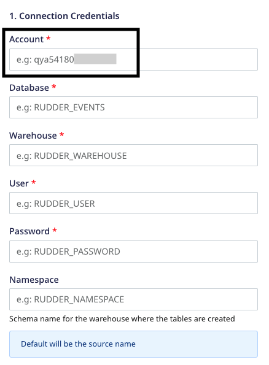

# FAQ

### When does Rudderstack load data into the data warehouse(s)?

RudderStack lets you choose how frequently it should sync the data into the data warehouse. The default time is 30 minutes. However, you can choose to extend this value up to 24 hours. You can also configure the time of the day when RudderStack loads the data.

### Is there a way to force load my data into the warehouses?

Yes, there is - you can configure the below values in your `config.yaml` file:

```yaml
warehouseSyncFreqIgnore = true #if set true this will ignore syncFrequency and syncStartingAt values which are configured in UI. By default this is false
uploadFreqInS=1800 #This field lets you control syncPeriod if above field set to true 
```

### Where can I view the status of my data load?

You can view the warehouse upload status in the **Live Events** section of the destination in the RudderStack dashboard.

### Can I change the namespace (schema name) of my data warehouse in RudderStack?

Yes, you can. Although the default namespace will be the source name with some modifications to it, RudderStack also provides an option in the dashboard to explicitly set the namespace of the dataset in the warehouse.

<div class="infoBlock">

Refer to the warehouse-specific destination settings to configure a namespace in the RudderStack dashboard.
</div>

### How can I achieve identity resolution with multiple sources connected to one warehouse destination?

The default namespace will be the source name with some modifications. This will cause issues while creating mappings for identity resolution across different sources, leading to multiple `RUDDER_ID` created for the same user.

To avoid this, you can set the same namespace for each source.


This will ensure that the mappings are on the consistent namespace and only one `RUDDER_ID` is created for each user - irrespective of the number of sources connected to your warehouse destination.

### How can I delete the staging files in my buckets?

RudderStack loads all the events configured with your warehouse into staging buckets. You can set a retention policy to delete these files from the staging bucket after a certain time. If you do not set any retention policy, the files will keep on accumulating.

Make sure that the retention policy duration is longer than the warehouse sync frequency duration so that RudderStack can re-run event uploads for a longer time, if required. It is recommended to set the retention policy duration to **30 days/1 month**. 

### Which RudderStack IPs should I whitelist?

You will need to whitelist the following RudderStack IPs to enable network access:

- 3.216.35.97
- 34.198.90.241
- 54.147.40.62
- 23.20.96.9
- 18.214.35.254
- 35.83.226.133
- 52.41.61.208
- 44.227.140.138
- 54.245.141.180

The EU cluster IPs are listed below:

- 3.66.99.198
- 3.64.201.167

<div class="infoBlock">

All the outbound traffic is routed through these RudderStack IPs.
</div>

### How do I avoid lags in data syncs while heavy loads are running on my data warehouse?

You can use either of the following approaches to avoid data sync lags in your warehouse:

- **Approach 1**: In the warehouse destination connection settings, set an **exclusion window** which lets you set a start and end time when Rudderstack will not sync data to your warehouse. You can run heavy loads during this time interval.


- **Approach 2**: In the warehouse destination connection settings, your can increase the **sync frequency** interval so that there are lesser number of warehouse syncs throughout the day. You can also run the data syncs during the non-peak hours by setting the **Sync Starting At** time interval.


- **Approach 3**: If you are performing only writes/updates on your data warehouse, you can set up a read replica of your database and connect it to your load generation tool. Connect the read/write replica to RudderStack, as shown:


### How can I speed-up my warehouse uploads?

You can speed-up your warehouse uploads by using the following parameters:

<table style="width:100%">
  <tr>
    <th style="width:300px">Parameter</th>
    <th>Description</th>
     <th>Tip</th>
    <th>Default value</th>
  </tr>
  <tr>
    <td style="width:300px"><code class="inline-code">RSERVER_WAREHOUSE_REDSHIFT_MAX_PARALLEL_LOADS</code></td>
    <td>Defines the number of concurrent tables that are synced to redshift in a given upload.</td>
    <td>Increase this as per your infra capability.</td>
    <td><code class="inline-code">3</code></td>
  </tr>
  <tr>
    <td style="width:300px"><code class="inline-code">RSERVER_WAREHOUSE_STAGING_FILES_BATCH_SIZE</code></td>
    <td>Defines the number of staging files that are batched and synced in a single upload.</td>
    <td>Increase this to batch more files together and reduce the number of uploads needed for a given volume of data.</td>
    <td><code class="inline-code">960</code></td>
  </tr>
  <tr>
    <td style="width:300px"><code class="inline-code">RSERVER_WAREHOUSE_NO_OF_WORKERS</code></td>
    <td>Number of concurrent uploads to a warehouse. For example, 8 uploads to different schemas in Redshift can be done simultaneously.</td>
    <td>-</td>
    <td><code class="inline-code">8</code></td>
  </tr>
   <tr>
    <td style="width:300px"><code class="inline-code">warehouse_slave.replicaCount</code></td>
    <td>Number of warehouse slaves (responsible for load file generation) when the warehouse is run as separate service in Kubernetes.</td>
    <td>Increase this for speeding up the load file generation step of the upload.</td>
    <td><code class="inline-code">2</code></td>
  </tr>
   <tr>
    <td style="width:300px"><code class="inline-code">RSERVER_WAREHOUSE_NO_OF_SLAVE_WORKER_ROUTINES</code></td>
    <td>Number of go-routines creating load files in a warehouse slave process.</td>
    <td>Increase or decrease this as per memory allocated to the warehouse slave pod.</td>
    <td><code class="inline-code">4</code></td>
  </tr>
</table>

### How is the Namespace field populated for a Warehouse destination?

RudderStack sets the **Namespace** field depending on the following conditions:

- If the **Namespace** and **Database** fields are present in your warehouse configuration:
  - For ClickHouse destination, the **Database** field is set as the namespace.
  - For all the other destinations, the **Namespace** field is populated as it is.

- If `RSERVER_WAREHOUSE_(DEST_TYPE)_CUSTOM_DATA_SET_PREFIX` parameter is present, the Namespace is populated as `(DEST_TYPE)_(CUSTOM_DATA_SET_PREFIX)_(SOURCE_NAME)`. For example:

```
Parameter value:
RSERVER_WAREHOUSE_RS_CUSTOM_DATA_SET_PREFIX="<random_value>"
RSERVER_WAREHOUSE_SNOWFLAKE_CUSTOM_DATA_SET_PREFIX="<random_value>"

Namespace:
RS_<random_value>_<source_name>
SNOWFLAKE_<random_value>_<source_name>
```

- If none of the above are specified, the source name is populated as Namespace for the first sync and picked up from cache for the subsequent syncs. In case the source name is changed, the Namespace still remains the same as it is picked from cache. In order to update the Namespace as the new source name, you need to configure a new source.


### How does Rudderstack configure table names?

RudderStack sets the table names by picking up the event names and modifying them to follow the snake case convention (for example, `source name` -> `source_name`). 

For the following sample snippet, RudderStack sets the table name as **product_purchased**.

```json
{
  "userId": "user123",
  "event": "Product Purchased",
  "properties": {
    "name": "Rubik's Cube",
    "revenue": 4.99
  },
  "context": {
    "ip": "14.5.67.21"
  },
  "timestamp": "2020-02-02T00:23:09.544Z"
}
```

The table name truncation logic is as follows:

- For **PostgreSQL**, the table name is truncated after 63 characters.
- For **Data Lake** destinations (**S3 Data Lake, GCS Data Lake, Azure Data Lake**), there is no set limit.
- For **other** destinations, the table name is truncated after 127 characters.

### How does Rudderstack configure the column names? 

### How does RudderStack normalize arrays and complex event properties in the warehouse schema? 

RudderStack flattens the event properties and converts them into snake case (for example, `source name` -> `source_name`). Further, each of these event properties acts as a warehouse column.

1. The below example shows how the normal properties are normalized:

```javascript
{
  product: {
    name: "iPhone",
    version: 11
  }
}
```

Normalized properties (Column names)

```javascript
product_name : "iPhone"
product_version : 11
```

2. The below example shows how the array properties are normalized:

```javascript
{
  products: [
    {
      name: "iPhone",
      version: 11
    },
    {
      name: "Android",
      version: 16
    }
  ]
}
```

Normalized property (Column name)

```javascript
products: "[{ \"name\": \"iPhone\", \"version\": 11  },  { \"name\": \"Android\", \"version\": 16  }]"
```

3. The below example shows how the complex properties are normalized:

```javascript
{
  products: {
    iPhone: {
      version: 11
    },
    Android: {
      version: 16
    }
  }
}
```

Normalized properties (Column names)

```javascript
products_i_phone_version : 11
products_android_version : 16
```

### While configuring the Snowflake destination, what should I enter in the Account field?

While configuring Snowflake as a destination in RudderStack, you need to enter your <Link to="/data-warehouse-integrations/snowflake/#connection-settings">Snowflake connection credentials</Link> which includes the **Account** field, as shown below:



The **Account** field corresponds to your Snowflake account ID and is a part of the Snowflake URL.

The following examples illustrate the slight differences in the Snowflake account ID for various cloud providers:

| Account ID example            | Corresponding Snowflake URL                                                    | Snowflake cloud provider                                        |
| :-------------------------- | :--------------------------------------------------------------- | :-------------------------------------------------------------- |
| `qya56091.us-east-1`<br /><br />  `qya56091.us-east-2.aws`        | `https://`**`qya56091.us-east-1`**`.snowflakecomputing.com`  <br /><br />  `https://`**`qya56091.us-east-2.aws`**`.snowflakecomputing.com`   | AWS                                   |
| `rx18795.east-us-2.azure` | `https://`**`rx18795.east-us-2.azure`**`.snowflakecomputing.com` | Microsoft Azure  |
| `ah76025.us-central1.gcp` | `https://`**`ah76025.us-central1.gcp`**`.snowflakecomputing.com` | Google Cloud Platform                          |

<div class="warningBlock">

In case of AWS, <code class="inline-code">.aws</code> is present in the account locator of some region accounts and hence must be included in the <strong>Account</strong> field above. 

For more information on the different account locator formats depending on your region or cloud provider, refer to the <a href="https://docs.snowflake.com/en/user-guide/admin-account-identifier.html#non-vps-account-locator-formats-by-cloud-platform-and-region">Snowflake documentation</a>.
</div>

## Contact us

For any other queries on the RudderStack warehouse integrations, you can [contact us](mailto:%20docs@rudderstack.com) or start a conversation in our [Slack](https://rudderstack.com/join-rudderstack-slack-community) community.
