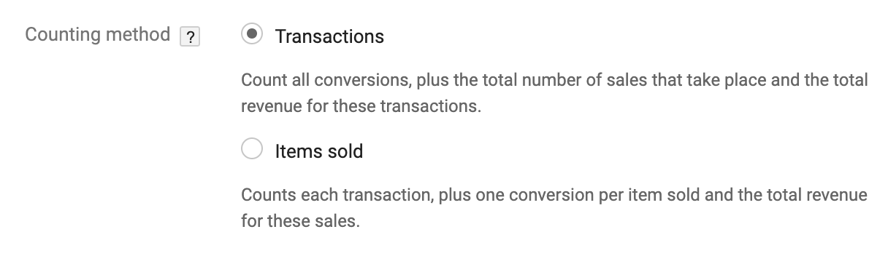
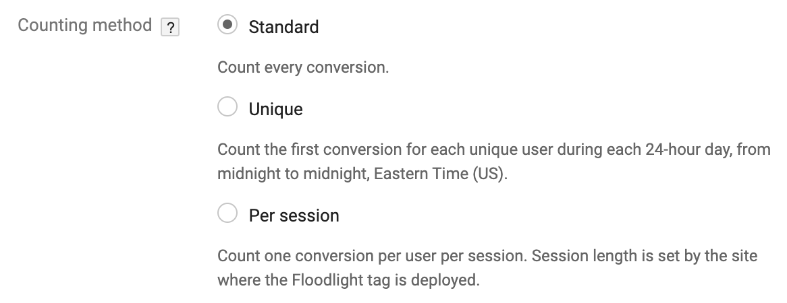

# Device Mode

RudderStack lets you send your event data to DCM Floodlight destination via the <Link to="/rudderstack-cloud/rudderstack-connection-modes/#device-mode">device mode</Link> using the native web SDK. RudderStack uses global site tagging in device mode.

<div class="successBlock">

Find the open-source transformer code for this destination in the [GitHub repository](https://github.com/rudderlabs/rudder-sdk-js/tree/production/integrations/DCMFloodlight/).
</div>

## Track

The <Link to="/rudderstack-api/api-specification/rudderstack-spec/track">`track`</Link> call lets you capture user events along with the properties associated with them.

A sample `track` call is as shown below:

```javascript
rudderanalytics.track('tshirt', {
  countingMethod: "transactions",
  revenue: "2605846",
  orderId: "2605847"
});
```
The `countingMethod` is a required property that specifies how to count the conversions for a Floodlight activity. The methods to count conversions depend on whether you  are creating or editing a [counter](https://support.google.com/campaignmanager/answer/7554821#zippy=%2Cfields-in-event-snippets-for-counter-tags)/[sales](https://support.google.com/campaignmanager/answer/7554821#zippy=%2Cfields-in-event-snippets-for-sales-tags) tag activity. Refer to the <Link to="/#faq">FAQ</Link> section for more information on counting methods for these tags.

The following table details the mapping of `integrations` object for DCM Floodlight:

| **RudderStack property** | **DCM Floodlight property** | **Description** |
| :--- | :--- | :---|
| `COPPA`| `tag_for_child_directed_treatment`  | Imposes requirements on the websites/online services operators directed to children under 13 years of age. [Reference](https://www.ftc.gov/tips-advice/business-center/privacy-and-security/children%27s-privacy). |
| `GDPR` | `tfua` |  EU law on general data protection and privacy. [Reference](http://eur-lex.europa.eu/legal-content/EN/TXT/?uri=CELEX%3A32016R0679). |
| `npa` | `npa` | Law catering to users who wish to opt-out of remarketing. | 

The following table details the mapping between RudderStack and DCM Floodlight's (optional) properties:

| RudderStack property | DCM Floodlight property | Tag|
| :--- | :--- |:--- |
| `context.device.adTrackingEnabled` | `dc_lat` | Counter/Sales|
| `properties.ord` | `ord` |Counter |
| `properties.orderId` | `ord` |  Sales |
| `properties.quantity` | `qty` | Sales |
| `properties.revenue` | `value` |  Sales |
| `properties.matchId` | `matchId` |  Sales |
| `properties.num` | `num` | Sales |

The following table provides a brief description of the above DCM Floodlight properties:

| DCM Floodlight property | Description |
| :----| :-----|
| `dc_lat` | Indicates if the user has enabled the **Limited Ad Tracking** option for IDFA/Android Advertising ID. |
| `ord` | Used to make the Floodlight tag unique and prevent browser caching. |
| `qty` | Applicable for **Sales** tags only - RudderStack adds the quantity of all the products in the `products` array or refers to the top-level `quantity` property. |
| `value` | Applicable for **Sales** tags only - RudderStack sends the `revenue` parameter to DCM Floodlight. |
| `matchId` | Advertiser created identifier used to attribute offline conversions.   |
| `num` | Used to control cache busting manually. |

## Custom parameters

You can also send custom data to DCM Floodlight using the custom fields as mentioned below:

| Custom field | Counting method| 
| :--- | :--- |
| `ord` | All| 
| `dc_lat` | All |
| `tag_for_child_directed_treatment` | All | 
| `tfua` |  All | 
| `npa` | All | 
| `matchId` | All | 
| `num` | Counter - unique | 

## Page

The <Link to="/rudderstack-api/api-specification/rudderstack-spec/page"><code class="inline-code">page</code></Link> call lets you record your website's page views with any additional relevant information about the viewed page.

When you pass the `name` field in the `page` call, it is transformed to the **Viewed `PAGE NAME` Page** format.

### Page with category

When you pass the `category` and `name` fields in the `page` call, it is transformed to the **Viewed `CATEGORY NAME` `PAGE NAME` Page** format.

A sample `page` call is as shown below:

```javascript
rudderanalytics.page('landing', {
  countingMethod: "standard"
});
```
## FAQ

### What are the counting methods for sales and counter tag?

For Sales tag, there are following counting methods:



For Counter tag, there are following counting methods:


## Contact us

For queries on any of the sections covered in this guide, you can, [contact us](mailto:%20docs@rudderstack.com) or start a conversation in our [Slack](https://rudderstack.com/join-rudderstack-slack-community) community.
