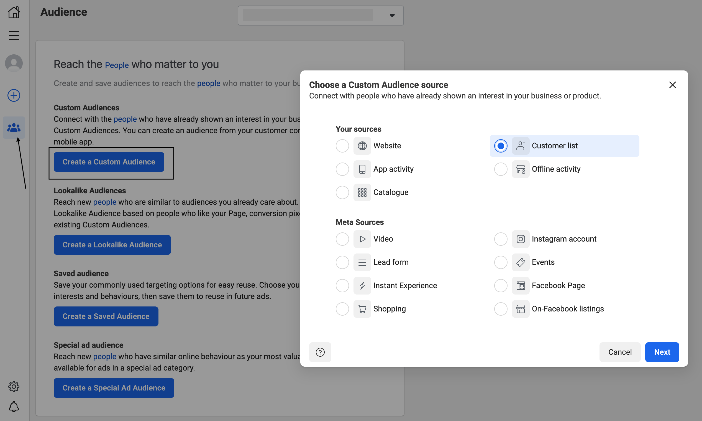
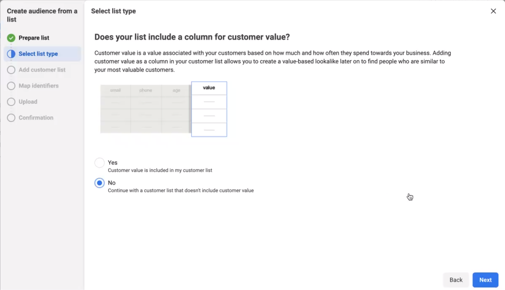
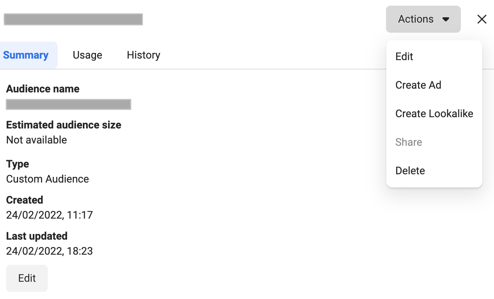
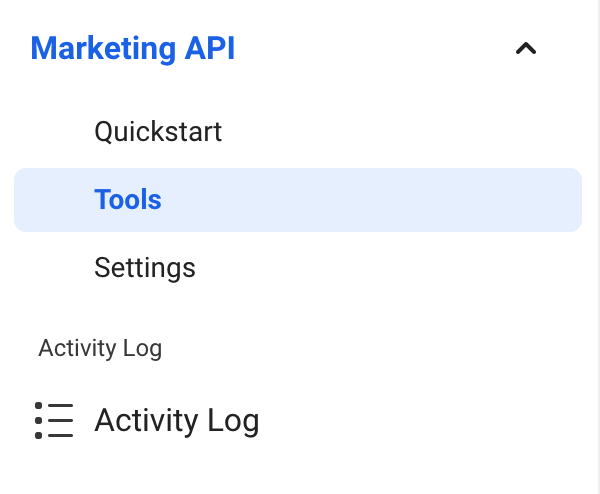
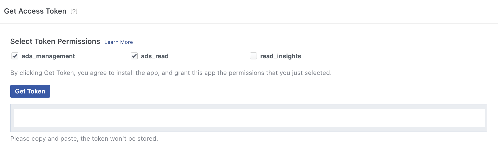

[Yahoo DSP](https://developers.facebook.com/docs/marketing-api/audiences/guides/custom-audiences) is a popular targeting tool that lets you find people on Facebook, who are interested in your business. It lets you create custom audiences through customer lists, Facebook engagement, and website/app traffic.

RudderStack supports Yahoo DSP as a destination where you can send your event data seamlessly.

<div class="successBlock">

Find the open source transformer code for this destination in the <a href="https://github.com/rudderlabs/rudder-transformer/tree/master/v0/destinations/snapchat_conversion">GitHub repository</a>.
</div>

## Getting started

Before configuring Yahoo DSP as a destination in RudderStack, verify if the source platform is supported by referring to the table below:

| **Connection Mode** | **Web**       | **Mobile**    | **Server**    |
| :------------------ | :------------ | :------------ | :------------ |
| **Device mode**     |  -            | -             | -             |
| **Cloud mode**      |  -            | -             |  **Supported** |

<div class="infoBlock">

To know more about the difference between cloud mode and device mode in RudderStack, refer to the <a href="https://rudderstack.com/docs/rudderstack-cloud/rudderstack-connection-modes/">RudderStack Connection Modes</a> guide.
</div>

Once you have confirmed that the source platform supports sending events to Yahoo DSP, follow these steps:

1. From your [RudderStack dashboard](https://app.rudderstack.com/), add the source. Then, from the list of destinations, select **Yahoo DSP**.
2. Assign a name to your destination and click on **Next**.

## Connection settings

To successfully configure Yahoo DSP as a destination, configure the following settings:


- **Client ID**:


- **Client Secret**: Enter the access token of your business application set up for accessing the Facebook Marketing API.

<div class="infoBlock">

  Check the <strong>FAQ</strong> section for more information on how to find your User Access Token.
</div>

- **Account ID**: This is the custom Audience ID to which the audiences will be added/removed.

<div class="infoBlock">

  Check the <strong>FAQ</strong> section for more information on how to find your Audience ID.
</div>

- **Audience Type** Choose your schema fields \(at least one\) from the available options. **This is a mandatory field**. RudderStack expects the user events to consist of **every** schema field that has been chosen on the dashboard.
- **Audience ID**:
- **Hasg Required**:

<div class="infoBlock">

RudderStack will ignore any user information which does not adhere to the schema fields specified in the dashboard settings.
</div>

## `audiencelist` event structure to send user data to Custom Audience

<div class="warningBlock">

<strong>The Facebook Custom Audience destination supports only <code class="inline-code">audiencelist</code> calls.</strong>
</div>

<div class="infoBlock">
  
  Note that the custom audience should have edit permissions. Otherwise, RudderStack will not be able to add or remove users from the list.
</div>

The `add` and `remove` arrays containing the user data objects are expected inside the properties field of the `audiencelist` event. These arrays are wrapped inside the object `listData`.

- **add**: This array refers to the user information that needs to be added to Custom Audience.
- **remove**: This array refers to the user information that needs to be deleted from Custom Audience.

## Schema fields mapping

The following table details the mapping of the schema fields specified in the [**RudderStack dashboard**](https://app.rudderlabs.com/) and the Facebook Marketing API.

| **Dashboard Field Name** | **Marketing API Schema Field \(Rudderstack Supported Field Name\)** | **Field Guidelines**                                                                                                                                                         |
| :----------------------- | :------------------------------------------------------------------ | :--------------------------------------------------------------------------------------------------------------------------------------------------------------------------- |
| `EMAIL`                  | `EMAIL`                                                             | Trim any leading or trailing whitespaces and convert all the characters to lower case.                                                                                       |
| `PHONE`                  | `PHONE`                                                             | Remove symbols, letters, and any leading zeroes. The country code is needed as a prefix, if the `COUNTRY` field is not specified in the dashboard.                           |
| `GENDER`                 | `GEN`                                                               | Use these values: `m` or `male` for male and `f` or `female` for female.                                                                                                     |
| `MADID`                  | `MADID`                                                             | Use lowercase and keep the hyphens. This information will not be hashed.                                                                                                     |
| `EXTERN_ID`              | `EXTERN_ID`                                                         | This information will not be hashed.                                                                                                                                         |
| `DOB YEAR (YYYY)`        | `DOBY`                                                              | Use the YYYY format from `1900` to the current year.                                                                                                                         |
| `DOB MONTH (MM)`         | `DOBM`                                                              | Use the MM format from `01` to `12`.                                                                                                                                         |
| `DOB DATE (DD)`          | `DOBD`                                                              | Use the DD format from `01` to `31`.                                                                                                                                         |
| `LAST NAME`              | `LN`                                                                | Use a-z only. Lower case only, no punctuation. Use special characters in the UTF-8 format.                                                                                   |
| `FIRST NAME`             | `FN`                                                                | Use a-z only. Lower case only, no punctuation. Use special characters in the UTF-8 format.                                                                                   |
| `FIRST NAME INITIAL`     | `FI`                                                                | Use a-z only. Lower case only. Use special characters in the UTF-8 format.                                                                                                   |
| `CITY`                   | `CT`                                                                | Use a-z only. Lower case only, with no punctuation, no special characters, and no whitespace.                                                                                |
| `US STATES`              | `ST`                                                                | Use the 2-character ANSI abbreviation code in lower case. Normalize the states outside the US in lowercase, with no punctuation, no special characters, and no white space.  |
| `ZIP`                    | `ZIP`                                                               | Use lower case and no white space. For the US, use only the first 5 digits. For the UK, use the Area/District/Sector format.                                                 |
| `COUNTRY`                | `COUNTRY`                                                           | Use lower case, 2-letter ISO 3166-1 alpha-2 country codes.                                                                                                                   |

<div class="warningBlock">

RudderStack modifies the schema names visible in the dashboard to ensure better readability. However, during the event call, the field names <strong>must be exactly the same as</strong> the schema names specified by Facebook Marketing API, as mentioned in the table above.
</div>

## Explicit formatting feature

If the **Disable Formatting** option is enabled in the RudderStack dashboard, RudderStack will not format the user data in the format prescribed by the Facebook Marketing API. If it is disabled, RudderStack formats the schema fields input by the user as shown in the table below:

| **Schema Field Name** | **Example Input** | **Formatted Output \(Before Hashing\)** |
| :-------------------- | :---------------- | :-------------------------------------- |
| `EMAIL`               | `ABC@gmail.com`   | `abc@gmail.com`                         |
| `PHONE`               | `0@96346895`      | `96346895`                              |
| `GEN`                 | `FEMALE`          | `f`                                     |
| `DOBD`                | `2`               | `02`                                    |
| `DOBM`                | `1`               | `01`                                    |
| `LN & FN`             | `Abc,@`           | `abc@`                                  |
| `FI`                  | `Mr.`             | `mr.`                                   |
| `CT`                  | `HN#`             | `hn`                                    |
| `ST`                  | `? AL ?`          | `al`                                    |
| `ZIP`                 | `11502 @bc`       | `11502@bc`                              |
| `COUNTRY`             | `IN`              | `in`                                    |

The following code snippet shows a `audiencelist` event with the schema fields \(e.g.`EMAIL`,`FIRST NAME`\) specified in the RudderStack dashboard:

```JSON
{
  "type": "audiencelist",
  "properties": {
    "listData": {
      "add": [{
          "EMAIL": "name1@abc.com",
          "FN": "name1"
        },
        {
          "EMAIL": " 'name2@abc.com",
          "FN": "name2"
        },
        {
          "EMAIL": " 'name3@abc.com",
          "FN": "name3"
        }
      ],
      "remove": [{
          "EMAIL": "'name4@abc.com",
          "FN": "name4"
        },
        {
          "EMAIL": "'name5@abc.com",
          "FN": "name5"
        }
      ]
    }
  }
}
```

## Facebook Custom Audience payload restrictions

| **Payload Field**                 | **Transformed?** |
| :-------------------------------- | :--------------- |
| Using only `add`                  | Yes              |
| Using only `remove`               | Yes              |
| Using both `add` and `remove`     | Yes              |
| Not using both `add` and `remove` | No               |

The following code snippet shows a `audiencelist` event having only `add` with the schema fields \(e.g.`EMAIL`,`FIRST NAME`\) specified in the RudderStack dashboard:

```JSON
{
  "type": "audiencelist",
  "properties": {
    "listData": {
      "add": [{
          "EMAIL": 'name1@abc.com',
          "FN": 'name1'
        },
        {
          "EMAIL": 'name2@abc.com',
          "FN": 'name2'
        }
      ]
    }
  }
}
```

<div class="infoBlock">

Similarly, you can use <code class="inline-code">remove</code> in order to remove users from a particular custom audience without creating a session.
</div>

<div class="warningBlock">

The event payload must include <code class="inline-code">add</code> or <code class="inline-code">remove</code> . Otherwise, the user data won’t be transformed and sent to Custom Audience.
</div>

### FAQs

### How do I create a new audience list?

1. Go to the **Audiences** option in your [Facebook Ad Manager account](https://www.facebook.com/adsmanager/audiences?act=1546877239033017&tool=AUDIENCES).
2. Select **Customer list** as your Custom Audience source and click on **Next**.

 

3. If your list includes a column for customer value, then select the **Yes** option, else select **No** and click on **Next**.

 

4. Add the list that you want to use for your new Custom Audience and give it a name. You can upload either a CSV or a text file.
5. Prepare your customer list by selecting and mapping the identifiers.
6. Once your list is added and ready for use, click on **Upload and Create**.

<div class="infoBlock">
Make sure you have enough identifiers before uploading the list.
</div>

<div class="warningBlock">
  
  The custom audience you create should have edit permissions. Otherwise, RudderStack will not be able to add or remove users from the list. 
</div>

### How do I check if the custom audience has edit permissions?

To check if the audience has edit permissions enabled, go to the **Audiences** tab, select your custom audience, and check the **Actions** dropdown. You should see the **Edit** option as seen below:



### Where can I find the Custom Audience ID?

- To get your Custom Audience ID, go to your Facebook Ads Manager account. On the left navigation bar, select **Audiences** and choose the Ad account you have created the custom audience for.


- Then, click on **All Audience** and select the specific custom audience from the list.
- Finally, click on the **History** tab. Here, you will find the audience ID under the **Item Changed** column, as shown:


### Where can I find the user Access Token for the application?

To use the Facebook Marketing API, you need to generate a user access token. Follow these steps to generate a user access token using your [**Facebook Developer account**](https://developers.facebook.com/):

1. Log into your [Facebook Developer account](https://developers.facebook.com/).
2. If you haven't created an app already, do so with the type **Business**, as shown:


3. Set your app up with the **Marketing API** as the product, as shown:


4. Next, in the left navigation click bar, click on the **Tools** option under **Marketing API** , as shown:

 

5. Under **Get Access Token**, select **ads_management** and **ads_read** as the token permissions and click on **Get Token**:



6. Copy this access token. Note that this access token will expire after a specified time and hence should not be hardcoded into your app.

<div class="infoBlock">

For more information on using this access token or generating the access token via your app, refer to the Facebook <a href="https://developers.facebook.com/docs/marketing-apis/overview/authentication">developer documentation</a>.
</div>

### Should I use `sessionIdAdd` or `sessionIdDelete` before adding/removing users in Custom Audience?

`sessionIdAdd` and `sessionIdDelete` helps you track and use a particular session ID while adding or removing users. This is useful when you are sending data in chunks. If you do not include these fields, Facebook creates a session ID itself.

Refer to the [**Facebook documentation**](https://developers.facebook.com/docs/marketing-api/audiences/guides/custom-audiences#step-2--specify-a-list-of-users) for more information on this.

## Contact us

For queries on any of the sections covered in this guide, you can [contact us](mailto:%20docs@rudderstack.com) or start a conversation in our [Slack](https://rudderstack.com/join-rudderstack-slack-community) community.
