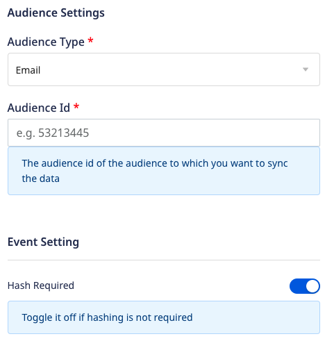
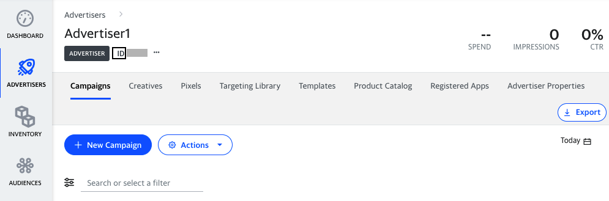

[Yahoo demand-side platform](https://www.adtech.yahooinc.com/advertising/solutions/dsp) (formerly Verizon Media DSP) is the only independent and unified programmatic video advertising platform for reaching audiences across web, mobile and connected TV.

RudderStack supports Yahoo DSP as a destination where you can send your event data seamlessly.

<div class="successBlock">

Find the open source transformer code for this destination in the <a href="https://github.com/rudderlabs/rudder-transformer/tree/master/v0/destinations/yahoo_dsp">GitHub repository</a>.
</div>

## Getting started

Before configuring Yahoo DSP as a destination in RudderStack, verify if the source platform is supported by referring to the table below:

| **Connection Mode** | **Web**       | **Mobile**    | **Server**    |
| :------------------ | :------------ | :------------ | :------------ |
| **Device mode**     |  -            | -             | -             |
| **Cloud mode**      |  -            | -             |  **Supported** |

<div class="infoBlock">

To know more about the difference between cloud mode and device mode in RudderStack, refer to the <a href="https://rudderstack.com/docs/rudderstack-cloud/rudderstack-connection-modes/">RudderStack Connection Modes</a> guide.
</div>

Once you have confirmed that the source platform supports sending events to Yahoo DSP, follow these steps:

1. From your [RudderStack dashboard](https://app.rudderstack.com/), add the source. Then, from the list of destinations, select **Yahoo DSP**.
2. Assign a name to your destination and click on **Continue**.

## Connection settings

To successfully configure Yahoo DSP as a destination, configure the following settings:





- **Client ID**: Enter your Client ID.
- **Client Secret**: Enter your Client Secret.

<div class="infoBlock">
Refer to the [Yahoo DSP documentation](https://developer.yahooinc.com/dsp/api/docs/authentication/vmdn-auth-overview.html#get-your-id) for more information on how to obtain the client ID and client secret.
</div>

- **Account ID**: Enter the Advertiser Id linked with the audience type.
- **Audience Type** Specify the type of the audience you want to update by choosing `email`, `device ID`or `IP Address` from the dropdown. The default audience type is `email`.
- **Audience ID**: Enter the ID of the created audience.

<div class="infoBlock">
Refer to the <link to="#faq">FAQ</Link> section for more information.
</div>

- **Hash Required**: This option is enabled by default and hash encodes the user data. However, you can disable it to prevent hashing.

<div class="infoBlock">

RudderStack will ignore any user information which does not adhere to the schema fields specified in the dashboard settings.
</div>

## `audiencelist` event structure

The following code snippet shows a sample `audienceList` call:

```json
{
    "type": "audiencelist",
    "properties": {
        "listData": {
            "add": [{
                    "email": 'alex@example.com'
                },
                {
                    "email": 'john@example.com'
                }
            ]
        }
    }
}
```

For deviceId, email can be replaced with deviceId and for IP Address with ipAddress
Only add is supported, not remove

## FAQ

### How do I obtain the Account ID?

1. Go to the **Audiences** option in your [Facebook Ad Manager account](https://www.facebook.com/adsmanager/audiences?act=1546877239033017&tool=AUDIENCES).
2. Select **Customer list** as your Custom Audience source and click on **Next**.

 

3. If your list includes a column for customer value, then select the **Yes** option, else select **No** and click on **Next**.



### How do I obtain the Audience ID?


### How do I create an audience?

To check if the audience has edit permissions enabled, go to the **Audiences** tab, select your custom audience, and check the **Actions** dropdown. You should see the **Edit** option as seen below:


## Contact us

For queries on any of the sections covered in this guide, you can [contact us](mailto:%20docs@rudderstack.com) or start a conversation in our [Slack](https://rudderstack.com/join-rudderstack-slack-community) community.
