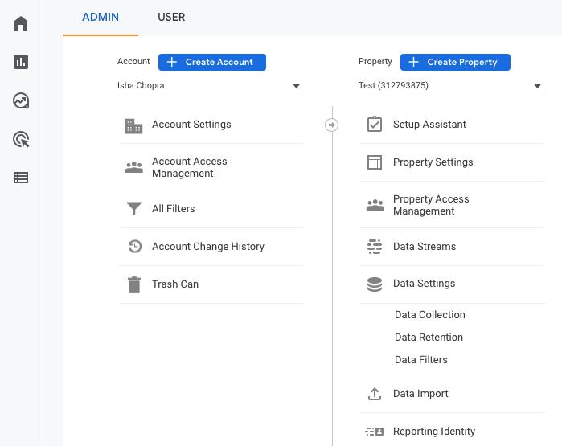
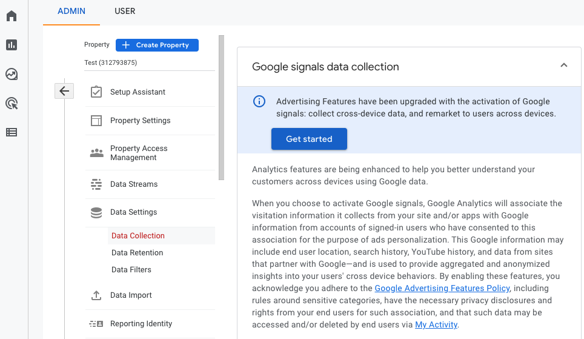
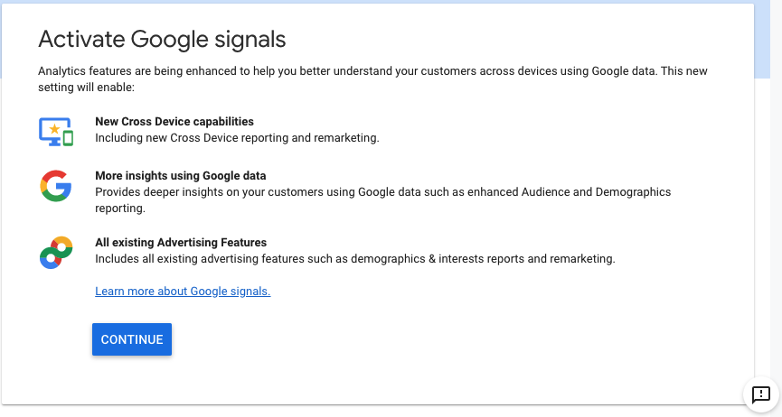

# Device Mode

RudderStack lets you send your event data to Google Analytics 4 destination via the device mode using the native web SDK. It supports the `gtag` way of tagging in websites in the device mode. 

You need to select `gtag.js` as the **Client Type** and enable **Use device-mode to send events** in the Rudderstack dashboard to send events via the device mode. For more information on device mode settings in the Rudderstack dashboard, refer to the [Setting up Google Analytics 4](https://www.rudderstack.com/docs/destinations/analytics/google-analytics-4/#setting-up-google-analytics-4-in-rudderstack) guide. 

<div class="infoBlock">

For more information on sending events via the device mode, refer to the <a href="https://rudderstack.com/docs/rudderstack-cloud/rudderstack-connection-modes/">RudderStack connection modes</a> guide.

</div>

<div class="successBlock">

Find the open-source JavaScript SDK code for this destination in our <a href="https://github.com/rudderlabs/rudder-sdk-js/tree/production/integrations/GA4">GitHub repository</a>.
</div>


## Identify

The [`identify`](https://rudderstack.com/docs/rudderstack-api/api-specification/rudderstack-spec/identify/) call lets you identify a visiting user and associate them to their actions. It also lets you record the traits about them like their name, email address, etc.

User-ID is an advanced feature that lets GA4 present a cross-device, cross-platform view of your customers' behavior. Google Analytics 4 uses `userId` and `deviceId` \(GA's `cid` value from Universal Analytics terminology\) to identify users.

A sample `identify` call is as shown:

```javascript
rudderanalytics.identify("1hKOmRA4el9Zt1WSfVJIVo4GRlm", {
  name: "Alex Keener",
  email: "alex@example.com",
})
```

In the above snippet, the `userId` will be set to `1hKOmRA4el9Zt1WSfVJIVo4GRlm` for Google Analytics and the name and email will be set as `user_properties`.


## Page
  
The [`page`](https://www.rudderstack.com/docs/rudderstack-api/api-specification/rudderstack-spec/page/) call lets you record your website's page views with any additional relevant information about the viewed page.

Google Analytics 4 `gtag` sends a `page_view` event to Google Analytics by default every-time it is loaded. You can also send `page_view` event to Google Analytics whenever you make an explicit `page()` call to RudderStack SDK.

RudderStack sends the following properties by default:

- `path` mapped to `page_location`
- `title` mapped to `page_title`
- `referrer` mapped to `page_referrer`

You can also make `page()` call with any custom and standard properties as shown below:

```javascript
rudderanalytics.page({
  path: "/test_browser.html",
  url: "http://example.com/test_browser.html?param1=true",
  title: "Page Load",
  search: "?param1=true",
  referrer: "referrer",
})
```


## Track

The [`track`](https://www.rudderstack.com/docs/rudderstack-api/api-specification/rudderstack-spec/track/) call lets you capture user events along with the properties associated with them.

A sample `track` call is as shown:

```javascript
rudderanalytics.track("Track me")
```

RudderStack SDK sends the track event name and any properties as custom properties to Google Analytics 4.

<div class="infoBlock">

RudderStack SDK flattens the properties that are nested and not standard Google Analytics 4 properties before sending them to Google Analytics.
</div>

<div class="infoBlock">

There are limits on the number of custom properties per event that can be sent to Google Analytics 4. The RudderStack SDK <code class="inline-code">**does not drop**</code> the payload based on these limits. If the events are don't show up in the debug view or in the Google Analytics dashboard reports, refer to <a href="https://support.google.com/analytics/answer/9267744?hl=en">Google support page</a> to know more about the collection limits.
</div>

## E-Commerce

RudderStack supports e-commerce tracking for Google Analytics 4. Use the [RudderStack e-commerce spec](https://rudderstack.com/docs/rudderstack-api/api-specification/rudderstack-ecommerce-events-specification/) for sending events while instrumenting your site with the RudderStack SDK.

Below are some examples of the track event names that are passed to Google Analytics 4-specific e-commerce event name:

| RudderStack event name    | Google Analytics 4 event name |
| :------------------------ | :---------------------------- |
| Products Searched         | `search`                      |
| Product List Viewed       | `view_item_list`              |
| Promotion Viewed          | `view_promotion`              |
| Product Clicked           | `select_item`                 |
| Product Added To Wishlist | `add_to_wishlist`             |
| Product Added             | `add_to_cart`                 |
| Cart Shared               | `share`                       |
| Checkout Started          | `begin_checkout`              |
| Order Completed           | `purchase`                    |

<div class="infoBlock">

For each product in the order, there must be an <code class="inline-code">id</code> and <code class="inline-code">name</code> associated. More info on Google Analytics 4 e-commerce event and corresponding properties can be found <a href="https://developers.google.com/gtagjs/reference/ga4-events#view_item_list">here</a>.
</div>

## Enable Google Signals

Google Signals helps you understand the interaction of users with your website across multiple devices and sessions. To enable Google Signals and capture user data, the following conditions must be true:
- The user must be signed in to their Google Account on a website or an app.
- Ad Personalization must be turned on for their account.

<div class="infoBlock">

Refer to the [Google documentation](https://support.google.com/analytics/answer/9445345?hl=en#zippy=%2Cin-this-article) for more information on Google Signals.
</div>

You can enable Google Signals in GA4 to reflect the data collected for a user, in your GA4 reports by following the below steps:

1. Log into your [Google Analytics dashboard](https://analytics.google.com/). 
2. Open the Admin panel by clicking on the gear icon at the bottom left.


3. Select the property for which you want to enable Google Signals. Then, go to **Data Settings**>**Data Collection**.
4. Click **Get Started** in the **Google signals data collection section**, as shown:


6. Click on **Continue**.


7. Read the additional information and click on **Activate**.


Google Signals is now enabled. You will be able to see the **Age**, **Gender**, and other relevant data in Demographics reports in GA4 after 24 hours.

## Contact us

For queries on any of the sections covered in this guide, you can [contact us](mailto:%20docs@rudderstack.com) or start a conversation in our [Slack](https://rudderstack.com/join-rudderstack-slack-community) community.
