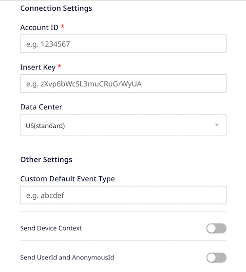
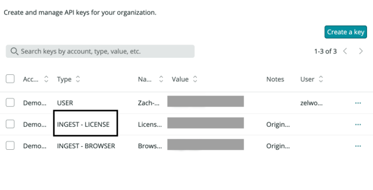

# New Relic

[New Relic](https://newrelic.com/) is a leading observability platform that lets you monitor, debug, and enhance your tech stack.

RudderStack supports New Relic as a destination to which you can seamlessly send your event data.

## Getting started

Before configuring New Relic as a destination in RudderStack, verify if the source platform is supported by New Relic by referring to the table below:

| **Connection Mode** | **Web** | **Mobile** | **Server** |
| :--- | :--- | :--- | :--- |
| **Device mode** | - | - | - |
| **Cloud mode** | **Supported**  | **Supported** | **Supported** |

<div class="infoBlock">
    
To know more about the difference between cloud mode and device mode in RudderStack, refer to the <a href="https://rudderstack.com/docs/rudderstack-cloud/rudderstack-connection-modes/">RudderStack Connection Modes</a> guide.
</div>

Once you have confirmed that the source platform supports sending events to New Relic, follow these steps:

1. From your [RudderStack dashboard](https://app.rudderstack.com/), add a source. Then, from the list of destinations, select **New Relic**.
2. Assign a name to the destination and click on **Next**.

### Connection settings

To successfully configure New Relic as a destination, you will need to configure the following settings:



- **Account ID**: Enter your [New Relic account ID](https://docs.newrelic.com/docs/accounts/accounts-billing/account-structure/account-id/).

<div class="infoBlock">

For more information on finding the account ID based on your New Relic user model, refer to the <a href="#faq">FAQ</a> section below.
</div>

- **Insert Key**: Enter your New Relic insert key.

<div class="infoBlock">

For more information on getting your New Relic insert key, refer to the <a href="#faq">FAQ</a> section below.
</div>

- **Data Center**: Choose your data center associated with your New Relic account. By default, it is set to **US**.
- **Custom Default Event Type**: Use this field to define any custom `eventType` for any unmapped `track` calls. By default, RudderStack sets the `eventType` as `rudderstack`.
- **Send Device Context**: If this setting is enabled, RudderStack flattens all the contextual fields delimited by a period (`.`) before sending them to New Relic.

<div class="successBlock">

Enabling this setting is recommended as getting rich device context is very useful in New Relic.
</div>

- **Send User ID and Anonymous ID**: Enable this option to send `userId` and `anonymousId` in your events to New Relic.

## Track

The [`track`](https://www.rudderstack.com/docs/rudderstack-api/api-specification/rudderstack-spec/track/) method lets you capture user events along with the properties associated with them.

RudderStack uses the `track` calls to send custom events to New Relic via the [Event API](https://docs.newrelic.com/docs/data-apis/ingest-apis/event-api/introduction-event-api/).

A sample `track` call is shown below:

```javascript
rudderanalytics.track(
  "Email Opened", {
    subject: "Resume validation",
    sendtime: "2022-01-01",
    sendlocation: "alex@example.com"
  }, {
    context: {
      traits: {
        email: "alex@example.com"
      }
    }
  }
);
```

RudderStack applies the following rules to the event properties before sending them to New Relic:

- Booleans are transformed into strings.
- NRQL words are wrapped with backticks. [Reference](https://docs.newrelic.com/docs/data-apis/custom-data/custom-events/data-requirements-limits-custom-event-data/#:~:text=to%20the%20logs.-,NRQL%20syntax%20terms,-If%20you%20need).
- Reserved words are removed. [Reference](https://docs.newrelic.com/docs/data-apis/custom-data/custom-events/data-requirements-limits-custom-event-data/#reserved-words).

## FAQ

### Where can I find the New Relic Account ID?

To find the New Relic account ID, log into your [New Relic dashboard](https://one.newrelic.com). 

Depending on your [user model](https://docs.newrelic.com/docs/accounts/original-accounts-billing/original-users-roles/overview-user-models/), the steps are listed below:

- **New Relic One user model**:  In the top right section of the dashboard, go to your account settings and navigate to **Administration** > **Organization and access** >  **Accounts**. You can find your account ID here.
- **Original user model**: In the top right section of your New Relic dashboard, go to your account settings and click on **API keys**. Your account ID will be displayed here.

### Where can I find the New Relic Insert Key?

To find your New Relic insert key, follow these steps:

1. Log into your [New Relic dashboard](https://one.newrelic.com).
2. Go to **API Keys**.
3. Find the key of type **INGEST-LICENSE**, as shown:



## Contact us

For queries on any of the sections covered in this guide, you can [contact us](mailto:%20docs@rudderstack.com) or start a conversation in our [Slack](https://rudderstack.com/join-rudderstack-slack-community) community.