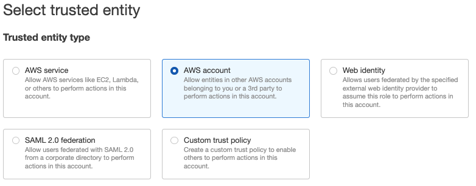
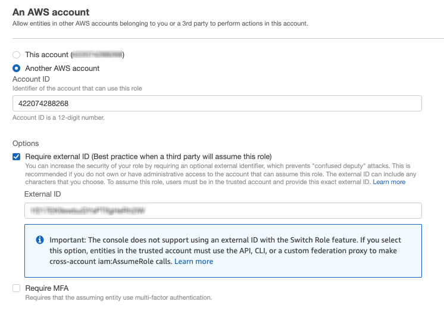
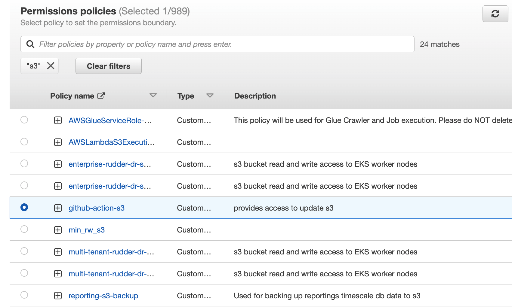
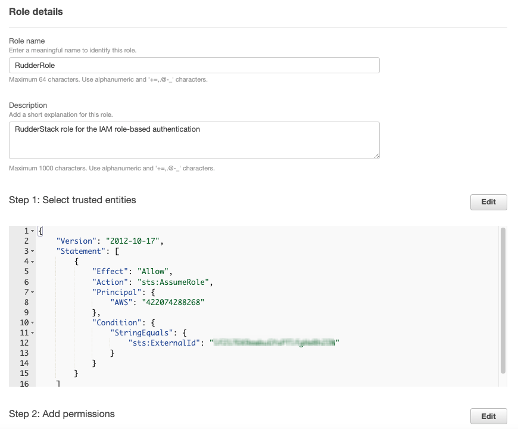
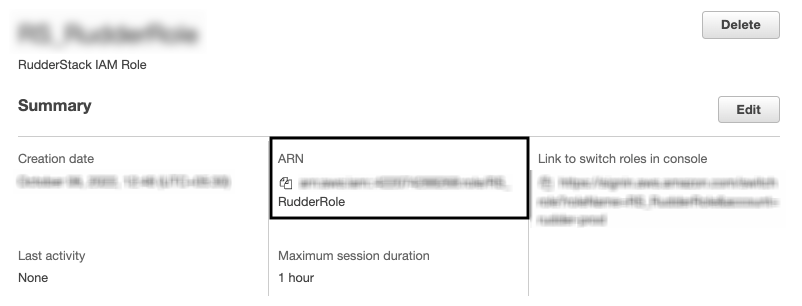
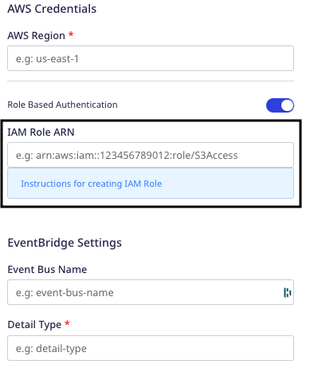

This guide walks you through the steps for creating a RudderStack IAM role. This role will be used for authenticating RudderStack in the following AWS-based destinations:

- <Link to="/destinations/streaming-destinations/amazon-eventbridge/">EventBridge</Link>
- <Link to="/destinations/streaming-destinations/amazon-kinesis/">Kinesis</Link>
- <Link to="/destinations/streaming-destinations/amazon-kinesis-firehose/">Kinesis Firehose</Link>
- <Link to="/destinations/streaming-destinations/aws-lambda/">Lambda</Link>
- <Link to="/destinations/streaming-destinations/aws-personalize/">Personalize</Link>
- <Link to="/destinations/streaming-destinations/amazon-s3/">S3</Link>

Access keys-based authentication method will be deprecated in the future. Hence, setting up a RudderStack IAM role is strongly recommended.

## Creating a RudderStack IAM role

To set up a new RudderStack IAM role, follow these steps:

1. Sign in to your AWS Management Console and open the <a href="https://console.aws.amazon.com/iam/">IAM console</a>.
2. In the left navigation pane, click **Roles** followed by **Create role**.
3. Under **Trusted entity type**, select **AWS account**, as shown:

4. Select **Another AWS account** and under **Account ID**, enter `422074288268`, the account ID associated with RudderStack.
5. Under **Options** check **Require external ID** and enter your <Link to="/dashboard-guides/overview/#workspace-id">workspace ID</Link> as the **External ID**.

RudderStack currently <strong>does not support</strong> MFA setting that restricts the role only to the users who sign in using <a href="https://docs.aws.amazon.com/IAM/latest/UserGuide/id_credentials_mfa.html">multi-factor authentication (MFA)</a>. Hence, do not check the <strong>Require MFA</strong> option.

6. Review all the settings carefully and click **Next** to proceed.
7. Select your destination-specific permission policies applicable for the RudderStack IAM role. To create a new policy from scratch, click **Create policy**. For more information, refer to the <a href="https://docs.aws.amazon.com/IAM/latest/UserGuide/access_policies_create-console.html#access_policies_create-start">Creating IAM policies</a> guide.
8. **Optional**: You can also set a <a href="https://docs.aws.amazon.com/IAM/latest/UserGuide/access_policies_boundaries.html">permissions boundary</a>. Expand the **Set permissions boundary** section, choose **Use a permissions boundary to control the maximum role permissions**, and select the policy to use for the permissions boundary. An example is shown below:

9. Review all the settings carefully and click **Next** to proceed.
10. Enter a unique name for your role. Note that this name cannot be distinguished by case. For example, you cannot create a role named `RUDDERSTACK` if `rudderstack` already exists.

You cannot edit the name of the role after it has been created.

11. **Optional**: Enter the description for this role.
12. To edit the use cases and permissions for the role, click the **Edit** button next to the **Step 1: Select trusted entities** or **Step 2: Add permissions** sections.

13. **Optional**: You can also add metadata to the role by attaching tags as key-value pairs. For more information, refer to the <a href="https://docs.aws.amazon.com/IAM/latest/UserGuide/id_tags.html">Tagging IAM resources</a> guide.
14. Click **Create role** to complete the setup.

You also need to give the individual users the trusted account permissions to switch to this newly created role in the console, or assume the role programmatically. For more information, refer to the <a href="https://docs.aws.amazon.com/IAM/latest/UserGuide/id_roles_use_permissions-to-switch.html">Granting a user permissions to switch roles</a> guide.

15. Finally, note the **ARN** of this newly created role. 

This ARN is required while configuring your AWS destination when you enable the **Role-based Authentication** setting, as shown:

## Destination-specific policy permissions

Refer to the following sections for the destination-specific policy permissions:

- <Link to="/destinations/streaming-destinations/amazon-eventbridge/#policy-permissions">EventBridge</Link>
- <Link to="/destinations/streaming-destinations/amazon-kinesis/#policy-permissions">Kinesis</Link>
- <Link to="/destinations/streaming-destinations/amazon-kinesis-firehose/#policy-permissions">Kinesis Firehose</Link>
- <Link to="/destinations/streaming-destinations/aws-lambda/#policy-permissions">Lambda</Link>
- <Link to="/destinations/streaming-destinations/aws-personalize/#policy-permissions">Personalize</Link>
- <Link to="/destinations/streaming-destinations/amazon-s3/#permissions">S3</Link>