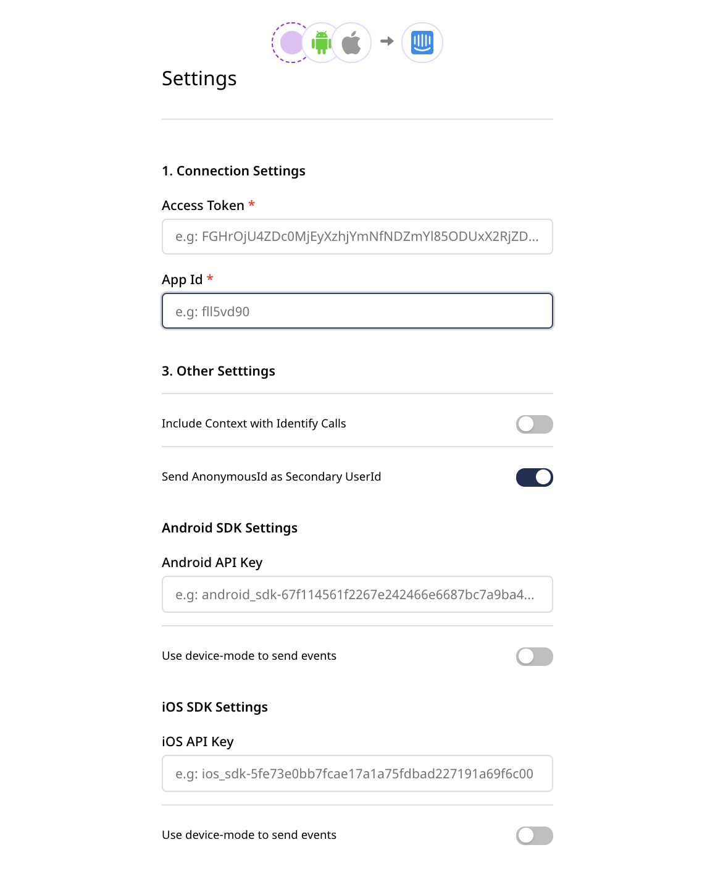

# Intercom

[Intercom](https://www.intercom.com/) is a real-time business messaging platform that lets you bring together and manage all your customer life cycle activities in a single platform.

<div class="successBlock">

Find the open source transformer code for this destination in the <a href="https://github.com/rudderlabs/rudder-transformer/tree/master/v0/destinations/intercom">GitHub repository</a>.
</div>

<div class="warningBlock">

<strong>This destination supports Intercom API v1.4.</strong>.
</div>

## Getting started

Before configuring Intercom as a destination in RudderStack, verify if the source platform is supported by Intercom by referring to the table below:

| Connection mode | Web       | Mobile    | Server             |
| :------------------ | :------------ | :------------ | :--------------------- |
| **Device mode**     | **Supported** | **Supported** | -                      |
| **Cloud mode**      | **Supported** | **Supported** | **Supported**          |

<div class="infoBlock">

To know more about the difference between cloud mode and device mode in RudderStack, refer to the <a href="https://rudderstack.com/docs/rudderstack-cloud/rudderstack-connection-modes/">RudderStack Connection Modes</a> guide.
</div>

Once you have confirmed that your source platform supports sending events to Intercom, follow these steps:

* From your [RudderStack dashboard](https://app.rudderstack.com/), add the source. Then, from the list of destinations, select **Intercom**.
* Assign a name to the destination and click on **Next**.

### Connection settings

To successfully configure Intercom as a destination, you will need to configure the following settings:



- **Access Token**: Enter your Intercom API access token. You can obtain the token by going to your Intercom dashboard and navigating to **Settings** > **Apps & Integrations** > **Developer Hub**. Then, select your app and go to **Configure** > **Authentication**.

<div class="infoBlock">
 
For more information on obtaining the Intercom API access token, refer to the <a href="https://help-desk-migration.com/help/get-intercom-api-access-token/">Intercom Knowledge Base</a>.
</div>

- **App ID**: The Intercom app ID is required for sending events via the web and mobile SDKs. You can get this ID from your Intercom dashboard by going to **Settings** > **Installation** and selecting the relevant platform.

<div class="infoBlock">
 
For more information on obtaining the your Intercom app ID,  refer to the <a href="https://www.intercom.com/help/en/articles/3539-where-can-i-find-my-workspace-id-app-id">Intercom Knowledge Base</a>.
</div>

- **Android API Key** / **iOS API Key**: This is required for sending events from your mobile apps to Intercom. You can get it from your Intercom dashboard by going to **Settings** > **Installation** and selecting the relevant platform.
- **Include Context with Identify Calls**: Enable this option to send the user context details to Intercom in the [`identify`](#collecting-identify-context) calls.
- **Send AnonymousId as Secondary UserId**: Enable this option to send `anonymousId` as the user ID to Intercom when the `userId` is absent from the event payload.

<div class="successBlock">
 
This option is helpful for tracking anonymous users on your site. For more information on the scenario where this setting is useful, refer to the <a href="#faq">FAQ</a> section below.
</div>

## Adding device mode integration

Depending on your platform of integration, follow the steps below to add Intercom to your project:

<Tabs>
  <TabList>
    <Tab>Android</Tab>
    <Tab>iOS</Tab>
  </TabList>
    <TabPanels>
      <TabPanel>
        If this is the first time you are integrating the RudderStack Android SDK to your project, refer to the <a href="https://rudderstack.com/docs/stream-sources/rudderstack-sdk-integration-guides/rudderstack-android-sdk/">Android SDK</a> documentation for more information.<br/><br/>
       
Your Android app must be on <strong>version 5.0 (API level 21) or higher</strong> for RudderStack to be able to send events to Intercom.<br/><br/>

Once confirmed, follow these steps to add Intercom to your Android project:

<ol>
<li>In your app-level <code class="inline-code">build.gradle</code> file, add the following <code class="inline-code">repository</code>:
<span>

```groovy
repositories {
    mavenCentral()
}
```
</span>
</li>
<li>Then, add the following under <code class="inline-code">dependencies</code>:
<span>

```groovy
// Rudder core sdk and intercom extension
implementation 'com.rudderstack.android.sdk:core:1.0.2'
implementation 'com.rudderstack.android.integration:intercom:0.1.1'

// intercom core sdk
implementation 'io.intercom.android:intercom-sdk-base:6.+'

// gson
implementation 'com.google.code.gson:gson:2.8.6'

// FCM
implementation 'com.google.firebase:firebase-messaging:20.2.0'
```
</span>
</li>
<li>Change the initialization of your RudderStack client with the following:
<span>

```kotlin
val rudderClient:RudderClient = RudderClient.getInstance(
    this,
    WRITE_KEY,
    RudderConfig.Builder()
        .withDataPlaneUrl(DATA_PLANE_URL)
        .withLogLevel(RudderLogger.RudderLogLevel.DEBUG) // optional
        .withFactory(IntercomIntegrationFactory.FACTORY)
        .build()
)
```
</span>
</li>
</ol>
      </TabPanel>
      <TabPanel>
        If this is the first time you are integrating the RudderStack iOS SDK to your project, refer to the <a href="https://rudderstack.com/docs/stream-sources/rudderstack-sdk-integration-guides/rudderstack-ios-sdk">iOS SDK</a> documentation for more information.<br/><br/>

To add the RudderStack iOS SDK to your project, follow these steps:
<ol>
<li>Add the required pod followed by <code class="inline-code">pod install</code>:
<span>

```ruby
pod 'Rudder-Intercom'
```
</span>
</li>
<li>Initialize the client as follows:
<span>

```objectivec
RSConfigBuilder *builder = [[RSConfigBuilder alloc] init];
[builder withDataPlaneUrl:DATA_PLANE_URL];
[builder withFactory:[RudderIntercomFactory instance]];
[builder withLoglevel:RSLogLevelDebug]; // optional
[RSClient getInstance:WRITE_KEY config:[builder build]];
```
</span>
</li>
<li>Add a <strong>Privacy - Photo Library Usage Description</strong> entry to your <code class="inline-code">Info.plist</code>. This is <a href="https://developer.apple.com/library/content/qa/qa1937/_index.html">required by Apple</a> for applications that can access the photo library.

<div class="infoBlock">

  Users will be prompted for the permission to access the photo library only
  when they tap the button to upload their images.
</div>
</li>
</ol>
      </TabPanel>
    </TabPanels>
</Tabs>

## Identify

The [`identify`](https://www.rudderstack.com/docs/rudderstack-api/api-specification/rudderstack-spec/identify/) call captures the details about a visiting user.

A sample`identify` call looks like the following code snippet:

```javascript
rudderanalytics.identify("1hKOmRA4GRlm", {
  name: "Alex Keener",
  email: "alex@example.com",
  company: {
    id: "group01",
    name: "Tech Group",
  },
  createdAt: "Mon May 19 2019 18:34:24 GMT+0000 (UTC)",
})
```

### Using `identify` calls

You can use the `identify` call to create or update user information in Intercom, as explained below:

- **Create/update a user**: When you make an`identify` call, RudderStack creates or updates the user in Intercom using their [Users API](https://developers.intercom.com/reference#users).
- **Remove users from a company**: To remove users from a company, you can pass `remove: true` inside the `company` object, as shown:

```javascript
rudderanalytics.identify("1hKOmRA4GRlm", {
  name: "Alex Keener",
  email: "alex@example.com",
  company: {
    id: "group01",
    name: "Tech Group",
    remove: true
  },
  createdAt: "Mon May 19 2019 18:34:24 GMT+0000 (UTC)",
})
```

- **Unsubscribe users**: To unsubscribe users from emails, you can pass `unsubscribedFromEmails: true` inside the `context` object, as shown:

```javascript
rudderanalytics.identify("1hKOmRA4GRlm", {
  name: "Alex Keener",
  email: "alex@example.com",
  company: {
    id: "group01",
    name: "Tech Group",
  },
  unsubscribedFromEmails: true,
  createdAt: "Mon May 19 2019 18:34:24 GMT+0000 (UTC)",
})
```

<div class="infoBlock">

RudderStack does not support Intercom's <strong>Last Seen</strong> feature currently.
</div>

### Traits mapping

The following table lists the mapping of the RudderStack traits to the Intercom properties:

| RudderStack trait | Intercom iOS property | Intercom Android property |
| :------------------- | :-------------------- | :------------------------ |
| `traits.userId`      | `user_id`             | `user_id`                 |
| `traits.email`       | `email`               | `email`                   |
| `traits.name`        | `name`                | `name`                |
| `traits.phone`       | `phone`               | `phone`                   |
| `traits.company`     | `company`             | `company`                 |
| `traits.createdAt`   | `signedUpAt`          | `signed_up_at`            |

### Collecting `identify` context

If you enable the **Include Context with Identify Calls** option in the RudderStack dashboard, RudderStack collects the following contextual properties through its mobile libraries \(if available\):

- `device.type`
- `device.model`
- `device.manufacturer`
- `os.name`
- `os.version`
- `app.name` 
- `app.version`

### Identity verification

Intercom's [identity verification](https://www.intercom.com/help/en/articles/183-enable-identity-verification-for-web-and-mobile) feature ensures the privacy of the conversations between you and your users. It also makes sure that one user cannot impersonate another.

<div class="infoBlock">

RudderStack supports the identity verification feature for the events sent through the <strong>web device mode</strong>.
</div>

To enable the identity verification feature for the web device mode, you can pass `user_hash` within the <Link to="/stream-sources/rudderstack-sdk-integration-guides/rudderstack-javascript-sdk/#integrationopts">integrations</Link> object, as shown in the following snippet:

```javascript
rudderanalytics.identify(
  "1hKOmRA4GRlm", {
    name: "Alex Keener",
    country: "USA"
  }, {
    Intercom: {
      user_hash: "9c56cc51b374c3ba189210d5b6d4bf57790d351c96c47c02190ecf1e430635ab",
    },
  }
);
```

<div class="warningBlock">

The <code class="inline-code">user_hash</code> is a SHA256 hash of your Intercom API secret and the <code class="inline-code">userId</code>. Note that this hash is <strong>not</strong> based on the user's email.
</div>

<div class="infoBlock">

To obtain your Intercom API secret, go to your Intercom dashboard and navigate to <strong>Settings</strong> > <strong>Apps & Integrations</strong> > <strong>Developer Hub</strong>. Then select your app and go to <strong>Configure</strong> > <strong>Basic information</strong>. You will find the API secret listed here under <strong>Client secret</strong>.
</div>

## Track

The [`track`](https://www.rudderstack.com/docs/rudderstack-api/api-specification/rudderstack-spec/track/) call lets you record the customer events, that is, the actions they perform, along with any properties associated with them.

A sample `track` call is shown below:

```javascript
rudderanalytics.track("Order Completed", {
  order_id: "140021222",
  checkout_id: "WAP3211",
  products: "sports_shoes"
  revenue: 77.95,
  currency: "USD",
})
```

<div class="infoBlock">

RudderStack converts and sends all the <code class="inline-code">track</code> event properties as per the <a href="https://developers.intercom.com/intercom-api-reference/reference#event-metadata-types">Intercom API</a>.
</div>

## Page

The [`page`](https://www.rudderstack.com/docs/rudderstack-api/api-specification/rudderstack-spec/page/) call lets you record your website's page views with any additional relevant information about the viewed page.

<div class="warningBlock">

The <code class="inline-code">page</code> call is supported <strong>only</strong> for the <strong><a href="https://www.rudderstack.com/docs/stream-sources/rudderstack-sdk-integration-guides/rudderstack-javascript-sdk/">JavaScript SDK</a></strong> when sending events via the <strong><a href="https://www.rudderstack.com/docs/rudderstack-cloud/rudderstack-connection-modes/#device-mode">device mode</a></strong>. It works by triggering Intercom's <code class="inline-code">update</code> method, which looks for a list of new open conversations to be displayed to the current user.
</div>

A sample `page` call looks like the following code snippet:

```javascript
rudderanalytics.page("Best Seller")
```

## Reset

The `reset` method resets the previously identified user and any related information.

<Tabs>
  <TabList>
    <Tab>Android</Tab>
    <Tab>iOS</Tab>
  </TabList>
    <TabPanels>
      <TabPanel>
        To reset user identification in your Android app, run the following command:

<span>

```kotlin
rudderClient.reset();
```
</span>
      </TabPanel>
      <TabPanel>
        To reset user identification in your iOS app, run the following command:

<span>

```objectivec
[[RSClient sharedInstance] reset];
```
</span>
      </TabPanel>
    </TabPanels>
</Tabs>

## FAQ

### Does RudderStack support Intercom's push notification and deep linking features?

Unfortunately, none of the RudderStack SDKs support push notifications and deep linking features currently. Refer to the [Intercom documentation](https://developers.intercom.com/installing-intercom/docs) for more information on configuring these features for your project.

### What happens if both `userId` or `email` are missing in the `identify` / `track` calls sent to Intercom?

For both `identify` and `track` calls, either `userId` or `email` is a mandatory field. In case both these fields are missing, RudderStack will drop the event.

It is highly recommended to enable the [Send AnonymousId as Secondary UserId](#connection-settings) setting in your RudderStack dashboard to avoid any event loss in such a scenario.

## Contact us

For queries on any of the sections covered in this guide, you can [contact us](mailto:%20docs@rudderstack.com) or start a conversation in our [Slack](https://rudderstack.com/join-rudderstack-slack-community) community.
