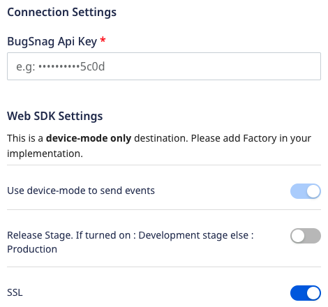
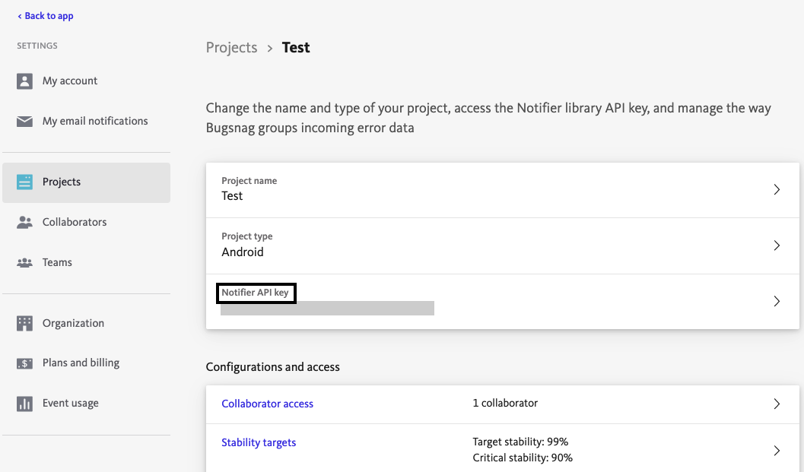

# Bugsnag

[Bugsnag](https://www.bugsnag.com/) provides error reporting libraries for [major software platforms](https://docs.bugsnag.com/platforms/) which automatically detect and report errors in your applications, and capture diagnostic data required to help you reproduce and fix each error.

RudderStack supports Bugsnag as a destination to which you can seamlessly send your event data.

## Getting started

Before configuring Bugsnag as a destination in RudderStack, verify if the source platform is supported by Bugsnag by referring to the table below:

| **Connection Mode** | **Web**       | **Mobile**    | **Server** |
| :------------------ | :------------ | :------------ | :--------- |
| **Device mode**     | **Supported** | **Supported** | -          |
| **Cloud mode**      | -             | -             | -          |

<div class="infoBlock">

To know more about the difference between cloud mode and device mode in RudderStack, read the <a href="https://rudderstack.com/docs/rudderstack-cloud/rudderstack-connection-modes/">RudderStack connection modes</a> guide.
</div>

Once you have confirmed that the platform supports sending events to Bugsnag, follow these steps:

1. From your [RudderStack dashboard](https://app.rudderstack.com/), add a source. Then, from the list of destinations, select **Bugsnag**.
2. Assign a name to the destination and click on **Next**.

### Connection settings

To successfully configure Bugsnag as a destination, you will need to configure the following settings:



* **BugSnag Api Key**: Enter your BugSnag API key. You can find the API key in your Bugsnag dashboard under **Settings** > **Project Settings**.

<div class="infoBlock">

For more information on getting your BugSnag Api Key, refer to the <a href="#faq">FAQ</a> section below.
</div>

* **Use device-mode to send events**: As this is a device mode-only destination, this setting is enabled by default and cannot be disabled.
* **Release Stage**: Use this setting to specify the release stage of your app:
   - Enable it for Development stage. 
   - Keep it dsabled for Production stage.
* **SSL**: Enabled by default, this option uses SSL while sending data to Bugsnag.

## Adding Bugsnag to mobile project

<Tabs>
  <TabList>
    <Tab>Android</Tab>
    <Tab>iOS</Tab>
    <Tab>iOS v2</Tab>
  </TabList>
    <TabPanels>
      <TabPanel>
        Please follow the steps below to add Bugsnag to your Android Project:
<ol>
<li>Add the following <code class="inline-code">repository</code> to your <code class="inline-code">app/build.gradle</code> file.
<span>

```groovy
repositories {
    mavenCentral()
}
```
</span>
</li>
<li>After that, add the following <code class="inline-code">dependencies</code> in the same file:
<span>

```groovy
implementation 'com.rudderstack.android.sdk:core:1.0.1-beta.1'
implementation 'com.rudderstack.android.integration:bugsnag:0.1.0-beta.1'
```
</span>
</li>
<li>Finally, change the initialization of your <code class="inline-code">RudderClient</code> in your <code class="inline-code">Application</code> class
<span>

```kotlin
val rudderClient = RudderClient.getInstance(
    this,
    <YOUT_WRITE_KEY>,
    RudderConfig.Builder()
        .withDataPlaneUrl(<YOUR_DATA_PLANE_URL>)
        .withFactory(BugsnagIntegrationFactory.FACTORY)
        .build()
)
```
</span>
</li>
</ol>
      </TabPanel>
      <TabPanel>
        Follow these steps to add Bugsnag to your iOS project:
<ol>
<li>Go to <code class="inline-code">Podfile</code> and add the <code class="inline-code">Rudder-Bugsnag</code> extension:
<span>

```ruby
pod 'Rudder-Bugsnag', '0.1.0-beta.1'
```
</span>
</li>
<li>After adding the dependency followed by <code class="inline-code">pod install</code> , you can add the imports to your <code class="inline-code">AppDelegate.m</code> file as shown:
<span>

```objectivec
#import "RudderBugsnagFactory.h"
```
</span>
</li>
<li>Finally, change the initialization of your <code class="inline-code">RudderClient</code> as shown:
<span>

```objectivec
RudderConfigBuilder *builder = [[RudderConfigBuilder alloc] init];
[builder withDataPlaneUrl:<YOUR_DATA_PLANE_URL>];
[builder withFactory:[RudderBugsnagFactory instance]];
[RudderClient getInstance:<YOUR_WRITE_KEY> config:[builder build]];
```
</span>
</li>
</ol>
      </TabPanel>
       <TabPanel>
          <div class="warningBlock">
          This device mode integration is supported for Bugsnag v6.16.4 and above.
        </div>
        Follow these steps to add Bugsnag to your iOS project:
<ol>
<li>Go to <code class="inline-code">Podfile</code> and add the <code class="inline-code">RudderBugsnag</code> extension:
<span>

```ruby
pod 'RudderBugsnag', '~> 1.0.0'
```
</span>
</li>
<li>After adding the dependency followed by <code class="inline-code">pod install</code> , you can add the imports to the <code class="inline-code">AppDelegate.m</code> file depending on your preferred platform:
<span>

```swift
import RudderBugsnag
```
</span>
<span>

```objectivec
@import RudderBugsnag;
```
</span>
</li>
<li>Finally, change the initialization of your <code class="inline-code">RudderClient</code> as shown:
<span>

```swift
let config: RSConfig = RSConfig(writeKey: WRITE_KEY)
            .dataPlaneURL(DATA_PLANE_URL)
        
RSClient.sharedInstance().configure(with: config)
RSClient.sharedInstance().addDestination(RudderBugsnagDestination())
```
</span>
<span>

```objectivec
RSConfig *config = [[RSConfig alloc] initWithWriteKey:WRITE_KEY];
[config dataPlaneURL:DATA_PLANE_URL];

[[RSClient sharedInstance] configureWith:config];
[[RSClient sharedInstance] addDestination:[[RudderBugsnagDestination alloc] init]];
```
</span>
</li>
</ol>
      </TabPanel>
    </TabPanels>
</Tabs>

## Identify

The <Link to="/rudderstack-api/api-specification/rudderstack-spec/identify">`identify`</Link> method lets you identify a user and associate them to their actions. It also lets you record any traits about them like their name, email, etc.

A sample `identify` call is shown below:

```javascript
rudderanalytics.identify("1hKOmRA4el9Zt1WSfVJIVo4GRlm", {
  name: "Alex Keener",
  email: "alex@example.com",
});
```

Bugsnag will show the `userId` and `traits` in the Users tab of each error.

## Error Reporting

Along with user-specific information, you can also use Bugsnag to track handled exceptions data to your dashboard using Bugsnag's native methods. For more information on these functions, refer to [Bugsnag documentation](https://docs.bugsnag.com/platforms/browsers/#reporting-handled-exceptions).

## FAQ

### Where can I find the Bugsnag API Key?

1. Log into your [Bugsnag dashboard](https://app.bugsnag.com/).
2. Click on **Settings** at the top right corner.
3. Click on **Project Settings** to find the API key as shown:



### What is meant by Release Stage?

You can distinguish errors that happen in different stages of your app's release process, for example, `production`, `development`, etc.

### Do I need to use SSL?

You should use SSL while sending data to Bugsnag in web device mode.

## Contact us

For queries on any of the sections covered in this guide, you can [contact us](mailto:%20docs@rudderstack.com) or start a conversation in our [Slack](https://rudderstack.com/join-rudderstack-slack-community) community.
