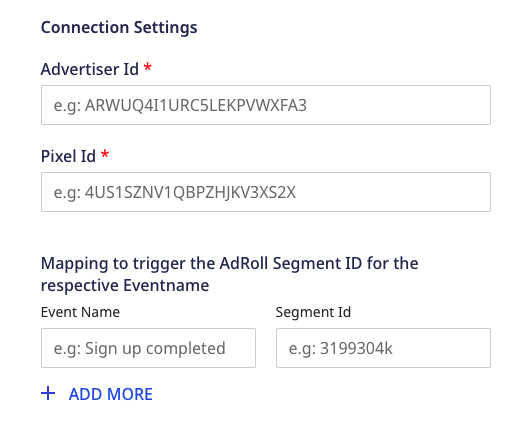
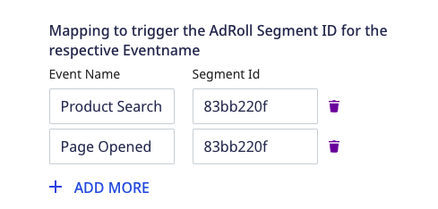
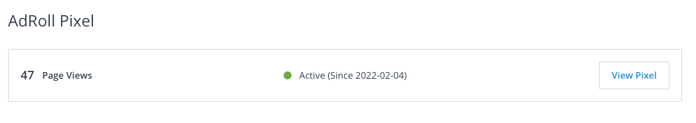
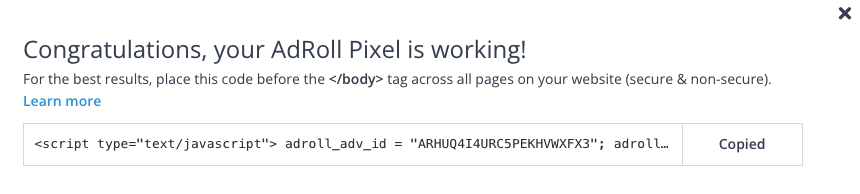
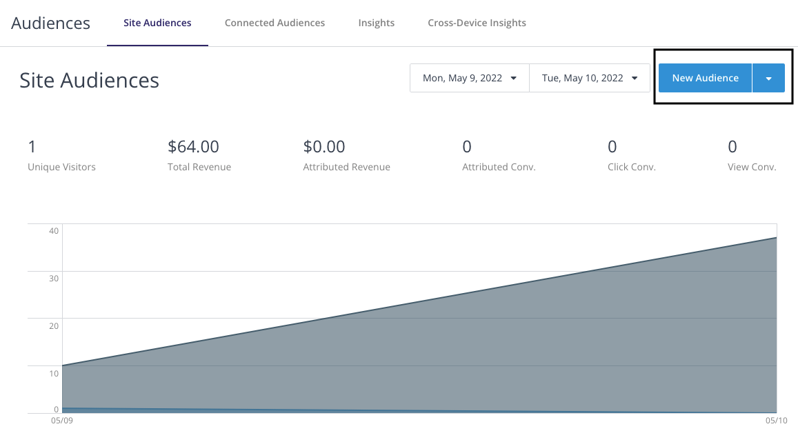
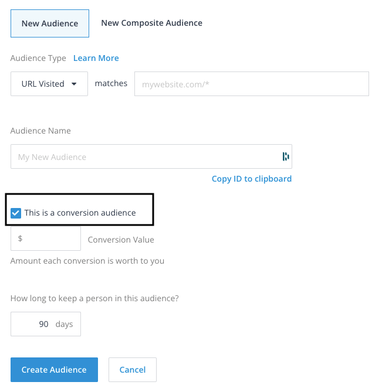

# AdRoll

[AdRoll](https://www.adroll.com/) is a digital and growth marketing platform that lets you display relevant ads, engage with your customers, and grow your revenue.

RudderStack supports AdRoll as a destination to which you can seamlessly send your event data.

## Getting started

Before configuring AdRoll as a destination in RudderStack, verify if the source platform is supported by AdRoll by referring to the table below:

| **Connection Mode** | **Web** | **Mobile** | **Server** |
| :--- | :--- | :--- | :--- |
| **Device mode** | **Supported** | - | - |
| **Cloud mode** | -  | - | - |

<div class="infoBlock">
    
To know more about the difference between cloud mode and device mode in RudderStack, refer to the <a href="https://rudderstack.com/docs/rudderstack-cloud/rudderstack-connection-modes/">RudderStack Connection Modes</a> guide.
</div>

Once you have confirmed that the source platform supports sending events to AdRoll, follow these steps:

1. From your [RudderStack dashboard](https://app.rudderstack.com/), add a source. Then, from the list of destinations, select **AdRoll**.
2. Assign a name to the destination and click on **Next**.

### Connection settings

To successfully configure AdRoll as a destination, you will need to configure the following settings:



- **Advertiser ID**: Enter your AdRoll advertiser ID here. 
- **Pixel ID**: Enter your AdRoll pixel ID here.

<div class="infoBlock">

For more information on getting your AdRoll advertiser ID and pixel ID, refer to the <a href="#faq">FAQ</a> section below.
</div>


- **Mapping to trigger the AdRoll Segment ID for the resepective event name**: Enter the event names which you want to map to specific AdRoll audience segments. 

<div class="infoBlock">

For more information on creating new audiences in AdRoll and getting the audience segment ID, refer to the <a href="#faq">FAQ</a> section below.
</div>

<div class="infoBlock">

When sending events via the device mode, RudderStack lets you specify which events should be discarded or allowed to flow through. For more information, refer to the <a href="https://www.rudderstack.com/docs/stream-sources/rudderstack-sdk-integration-guides/event-filtering/"  target="_blank">Client-side Event Filtering</a> guide.
</div>

- **Use device mode to send events**: As this is a device mode-only destination, this setting is enabled by default and cannot be disabled.

## Identify 

The [`identify`](https://www.rudderstack.com/docs/rudderstack-api/api-specification/rudderstack-spec/identify/) method lets you identify a user and associate them to their actions. It also lets you record any traits about them like their name, email, etc.

A sample `identify` call is shown below:

```javascript
rudderanalytics.identify("1hKOmRA4GRlm",{
    "email": "alex@example.com"
})
```

RudderStack uses the `identify` call to set a `userId` which is passed to AdRoll every time a subsequent `track` call is made. 

<div class="infoBlock">

<code class="inline-code">email</code> is a required attribute for successfully making an <code class="inline-code">identify</code> call. RudderStack maps <code class="inline-code">email</code> to AdRoll's <code class="inline-code">window._adroll_email</code> property.
</div>

<div class="infoBlock">

It is not mandatory to make an <code class="inline-code">identify</code> call every time before making a <code class="inline-code">track</code> call.
</div>

## Track

The [`track`](https://www.rudderstack.com/docs/rudderstack-api/api-specification/rudderstack-spec/track/) method lets you capture user events along with the properties associated with them.

RudderStack uses `track` events to segment your users in AdRoll.

A sample `track` call is shown below:

```javascript
rudderanalytics.track("Order Completed", {
  order_id: "123454387",
  products: [
    {
      product_id: "345676543",
      sku: "G214",
      name: "Cards",
      price: 14.99,
      position: 1,
      category: "Games",
      url: "https://www.estore.com/best-seller/1",
    }
  ]
})
```

To use the RudderStack `track` calls to segment users in AdRoll, you must first create an audience segment in AdRoll. Then, you need to map the audience ID to your corresponding event in the RudderStack dashboard, as shown:



<div class="infoBlock">

For more information on creating an audience in AdRoll and mapping it to your events, refer to the <a href="#faq">FAQ</a> section below.
</div>

When the mapped event is triggered, the appropiate pixel is fired in AdRoll and the user is segmented in the audience.

### Property mapping

RudderStack maps the following event properties to the corresponding AdRoll attributes:

| RudderStack property | AdRoll attribute | Comments |
| :-----| :------| :-------|
| `revenue` | `adroll_conversion_value` | - |
| `userId` | `user_id` | - |
| `price` | `adroll_conversion_value` | Mapped only for the product type events, for example, `Product Clicked`, `Product Viewed`, `Product Added`. |
| `orderId` | `order_id` | - |
| `currency` | `adroll_currency` | - |

## Page

The [`page`](https://www.rudderstack.com/docs/rudderstack-api/api-specification/rudderstack-spec/page/) method lets you record your website's page views with any additional relevant information about the viewed page.

RudderStack internally uses the `page` and `track` calls to segment your users.

<div class="warningBlock">

For RudderStack to successfully send both <code class="inline-code">page</code> and <code class="inline-code">track</code> calls to AdRoll, the events must be mapped to the AdRoll audience segment ID in the RudderStack dashboard. 
</div>

A sample `page` call is shown below:

```javascript

rudderanalytics.page(
  "Best Seller",
  {
    path: "/best-seller/1",
    referrer: "https://www.google.com/search?q=estore+bestseller",
    search: "estore bestseller",
    title: "The best sellers offered by EStore",
    url: "https://www.estore.com/best-seller/1"
  },
);
```

## FAQ

### Where can I find the AdRoll advertiser ID and pixel ID?

To find the AdRoll advertiser ID and pixel ID, follow these steps:

1. Log into your [AdRoll dashboard](https://app.adroll.com/).
2. In the left sidebar, go to **Website** under **Audiences**.
3. Under the **AdRoll Pixel** section, click on **View Pixel**, as shown:



4. In the resulting pop-up, you can find your AdRoll advertiser ID associated with the `adroll_adv_id` parameter. You can also find the AdRoll pixel ID associated with the `adroll_pix_id` parameter, as shown:



### How do I create a new audience segment in AdRoll?

To create a new audience segment in AdRoll, follow these steps:

1. Log into your [AdRoll dashboard](https://app.adroll.com/).
2. In the left sidebar, go to **Website** under **Audiences**.
3. Click on **New Audience**, as shown:



4. Enter the name of the audience segment in the **Audience Name** field.

<div class="infoBlock">

Make sure you copy the ID before creating the audience by clicking the <strong>Copy ID to clipboard</strong> link.
</div>

<div class="warningBlock">

RudderStack supports only the <strong>conversion audience</strong> type, so make sure you check the <strong>This is a conversion audience</strong> option.
</div>



5. Specify the **Conversion Value** and the duration for which the user should be a part of this audience segment.
6. Finally, click on **Create Audience**.

You can then specify the ID you copied above in the RudderStack dashboard to map specific events to your audience segment, as shown:


## Contact us

For queries on any of the sections covered in this guide, you can [contact us](mailto:%20docs@rudderstack.com) or start a conversation in our [Slack](https://rudderstack.com/join-rudderstack-slack-community) community.