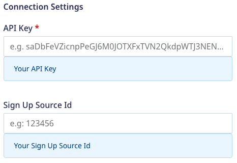
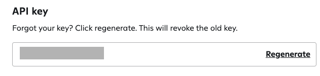
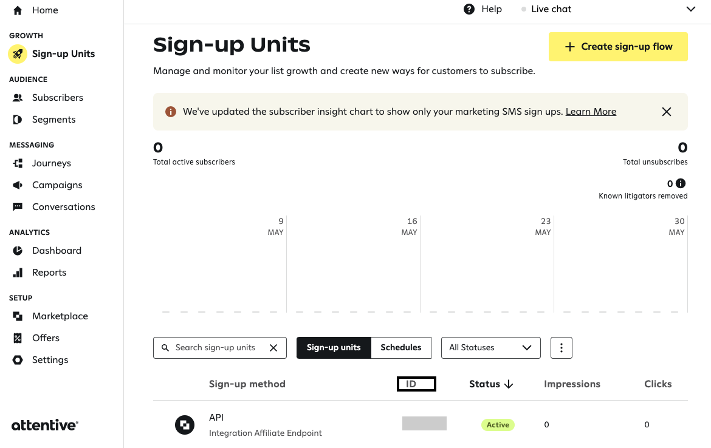

# Attentive Tag

[Attentive](https://www.attentivemobile.com/) is a mobile messaging platform that helps consumers and companies to communicate with each other by sending personalized text messages. It also provides [Attentive Tag](https://docs.attentivemobile.com/pages/developer-guides/tag-management/the-attentive-tag/) which can be added to your website to utilize Attentive features like capturing behaviorial data, triggering events, tracking revenue, etc.

RudderStack supports Attentive Tag as a destination to which you can seamlessly send your event data.

<div class="successBlock">

Find the open-source transformer code for this destination in our [GitHub repository](https://github.com/rudderlabs/rudder-transformer/tree/master/v0/destinations/attentive_tag).
</div>

## Getting started

Before configuring Attentive Tag as a destination in RudderStack, verify if the source platform is supported by Attentive Tag by referring to the table below:

| **Connection Mode** | **Web**       | **Mobile**    | **Server**    |
| :------------------ | :------------ | :------------ | :------------ |
| **Device mode**     | -             | -             | -             |
| **Cloud mode**      | **Supported** | **Supported** | **Supported** |

<div class="infoBlock">

To know more about the difference between cloud mode and device mode in RudderStack, refer to the <a href="https://rudderstack.com/docs/rudderstack-cloud/rudderstack-connection-modes/">RudderStack Connection Modes</a> guide.
</div>

Once you have confirmed that the source platform supports sending events to Attentive Tag, follow these steps:

1. From your [RudderStack dashboard](https://app.rudderstack.com/), add a source. Then, from the list of destinations, select **Attentive Tag**.
2. Assign a name to the destination and click on **Next**.

## Connection settings

To successfully configure Attentive Tag as a destination, you will need to configure the following settings:




- **API Key**: Enter the API key present in the app you have created in the Attentive dashboard.
- **Sign Up Source Id**: Enter the Sign-up method's ID present in the **Sign-up Units** option in the Attentive dashboard.

<div class="infoBlock">

For more information on getting the API Key and Sign Up Source Id, refer to the <a href="#faq">FAQ</a> section below.
</div>
  
## Identify

You can choose to subscribe or unsubscribe a user from an Attentive Tag list using the <Link to="/rudderstack-api/api-specification/rudderstack-spec/identify/">`identify`</Link> call.

The default behavior of `identify` call is to subscribe a user. To unsubscribe, you can pass `identifyOperation` as `unsubscribe` in the <code class="inline-code">integrations</code> object.

### Subscribe user

RudderStack maps the following properties to the Attentive Tag properties while subscribing a user:

| RudderStack Property | Attentive Tag Property | Presence |
|:--------------------------------|:--------------------------|:--------------------------|
| `traits.email`/`context.traits.email`/`properties.email` | `email` | Required if `phone` is not provided|
| `traits.phone` | `phone` | Required if `email` is not provided |
| `externalId` | `externalIdentifiers` | Optional |
| `integrations.attentive_tag.signUpsourceId` | `signUpSourceId` | Required |
| `context.traits.customIdentifiers`/`traits.customIdentifiers` | `customIdentifiers` | Optional |

<div class="infoBlock">

The <code class="inline-code">externalIdentifiers</code> property can be an array of objects - any identifier other than the specified ones, like <code class="inline-code">clientUserId</code>, <code class="inline-code">shopifyId</code>, <code class="inline-code">klaviyoId</code> and <code class="inline-code">customIdentifiers</code>.
</div>

<div class="infoBlock">

The <code class="inline-code">signUpSourceId</code> property in the <code class="inline-code">integrations</code> object is given a higher priority than in the destination definition.
</div>

A sample `identify` call to subscribe a user is shown below:

```javascript
rudderanalytics.identify("jbu3471", {
  "email": "new-val",
  "phone": "+1-202-555-0146",
  "customIdentifiers": [{
    "name": "string",
    "value": "string"
  }]
}, {
  "externalId": [{
      "type": "clientUserId",
      "id": "144"
    },
    {
      "type": "shopifyId",
      "id": "224"
    },
    {
      "type": "klaviyoId",
      "id": "132"
    }
  ],
  "integrations": {
    "signUpSourceId": "347393"
  }
});
```

### Unsubscribe user

You can pass `identifyOperation` as `unsubscribe` in the <code class="inline-code">integrations</code> object to unsubscribe a user, as shown:

```javascript
rudderanalytics.identify("1hKOmRA4el9Zt1WSfVJIVo4GRlm", {
  "email": "alex@example.com",
  "phone": "+1-202-555-0146",
}, {
  "integrations": {
    "attentive_tag": {
      "identifyOperation": "unsubscribe",
    },
    "subscriptions": [{
      "type": "MARKETING",
      "channel": "TEXT"
    }],
    "notification": {
      "language": "en-US"
    }
  }
});
```

RudderStack maps the following properties to the Attentive Tag properties while unsubscribing a user:

| RudderStack Property | Attentive Tag Property | Presence |
|:--------------------------------|:--------------------------|:--------------------------|
| `traits.email`/`context.traits.email`/`properties.email` | `email` | Required if `phone` is not provided |
| `traits.phone` | `phone` | Required if `email` is not provided|
| `integrations.attentive_tag.subscriptions` | `subscriptions` | Optional |
| `integrations.attentive_tag.notification` | `notification` | Optional |

A user can unsubscribe from any specific channel by passing it inside the `subscriptions` in the `integrations` object. Also, they can provide the `language` in the `notification` inside the `integrations` object to change the notification language. 

<div class="infoBlock">

Currently, only <code class="inline-code">en-US</code> and <code class="inline-code">fr-CA</code> are supported as notification languages and are case sensitive.
</div>

<div class="infoBlock">

Passing an <code class="inline-code">email</code> attribute does not locate or unsubscribe a user from SMS subscription. Similarly, passing the <code class="inline-code">phone</code> attribute does not locate or unsubscribe a user from email subscription.
</div>


## Track

<div class="warningBlock">
  
An event is not triggered if the timestamp is older than 12 hours.
</div>

The <Link to="https://www.rudderstack.com/docs/rudderstack-api/api-specification/rudderstack-spec/track/">`track`</Link> call allows you to capture user actions along with the properties associated with these actions. 

### Property mapping

RudderStack maps the following `track` call properties to the Attentive Tag properties:

| RudderStack Property | Attentive Tag Property | Presence |
|:--------------------------------|:--------------------------|:--------------------------|
| `event` | `type` | Required |
| `traits.email`/`context.traits.email`/`properties.email` | `email` | Required if `phone` is not provided |
| `traits.phone` | `phone` | Required if `email` is not provided |
| `externalId` | `externalIdentifiers` | Optional |
| `properties` | `properties` | Optional |
| `properties.timestamp` | `occuredAt` | Optional |
| `properties.eventId` | `externalEventId` | Optional |
| `context.traits.customIdentifiers`/`traits.customIdentifiers` | `customIdentifiers` | Optional |

<div class="infoBlock">

Make sure to pass the timestamp in ISO 8601 format.
</div>

<div class="infoBlock">

The event type is case sensitive. For example, `Order shipped` and `Order Shipped` would be considered as different event types. Also, the keys of properties object should not contain characters, such as [`'`, `"`, `{`, `}`, `[`, `]`, \ , `,`]
</div>

### E-Commerce events

RudderStack converts the following e-commerce events to the corresponding Attentive Tag events:

| RudderStack event | Attentive Tag event |
|:--------------------------------|:--------------------------|
| Product List Viewed <br /> Product Viewed | `product-view` |
| Product Added | `add-to-cart` |
| Order Completed | `purchase` |

#### Product List Viewed

The `Product List Viewed` event properties are mapped to the following Attentive Tag properties:

| RudderStack Property | Attentive Tag Property | Presence |
|:--------------------------------|:--------------------------|:--------------------------|
| `properties.products.product_id` | `productId` | Required |
| `properties.products.price` | `value` | Required |
| `traits.email`/`context.traits.email`/`properties.email` | `email` | Required if `phone` is not provided |
| `traits.phone` | `phone` | Required if `email` is not provided |
| `externalId` | `externalIdentifiers` | Optional |
| `properties.products.variant` | `productVariantId` | Required |
| `properties.products.price` | `currency` | Optional |
| `properties.products.name` | `name` | Optional |
| `properties.products.url` | `productUrl` | Optional |
| `properties.products.image_url` | `productImage` | Optional |
| `context.traits.customIdentifiers`/`traits.customIdentifiers` | `customIdentifiers` | Optional |


#### Product Viewed/Product Added

The `Product Viewed` and `Product Added` event properties are mapped to the following Attentive Tag properties:

| RudderStack Property | Attentive Tag Property | Presence |
|:--------------------------------|:--------------------------|:--------------------------|
| `properties.products.product_id` | `productId` | Required |
| `properties.products.price` | `value` | Required |
| `traits.email`/`context.traits.email`/`properties.email` | `email` | Required if `phone` is not provided |
| `traits.phone` | `phone` | Required if `email` is not provided |
| `externalId` | `externalIdentifiers` | Optional |
| `properties.products.variant` | `productVariantId` | Required |
| `properties.products.currency` | `currency` | Optional |
| `properties.products.name` | `name` | Optional |
| `properties.products.url` | `productUrl` | Optional |
| `properties.products.image_url` | `productImage` | Optional |
| `context.traits.customIdentifiers`/`traits.customIdentifiers` | `customIdentifiers` | Optional |

#### Order Completed

The `Order Completed` event properties are mapped to the following Attentive Tag properties:

| RudderStack Property | Attentive Tag Property | Presence |
|:--------------------------------|:--------------------------|:--------------------------|
| `properties.products.product_id` | `productId` | Required |
| `properties.products.price` | `value` | Required |
| `traits.email`/`context.traits.email`/`properties.email` | `email` | Required if `phone` is not provided |
| `traits.phone` | `phone` | Required if `email` is not provided |
| `properties.products.variant` | `productVariantId` |  Required |
| `externalId` | `externalIdentifiers` | Optional |
| `properties.products.price` | `currency` | Optional |
| `properties.products.name` | `name` | Optional |
| `properties.products.url` | `productUrl` | Optional |
| `properties.products.image_url` | `productImage` | Optional |

A sample `track` call for the above e-commerce event parameters is shown below:

```javascript
rudderanalytics.track("Order Completed", {
  "products": [{
    "product_id": "507f1f77bcf86cd799439011",
    "name": "MOBILE",
    "variant": "green",
    "price": "19",
    "image_url": "image.com",
    "url": "url.com",
    "quantity": "2",
    "currency": "USD"
  }]
}, {
  "traits": {
    "email": "alex@example.com",
    "phone": "+1-202-555-0146"
  },
  "externalId": [{
      "type": "clientUserId",
      "id": "144"
    },
    {
      "type": "shopifyId",
      "id": "224"
    },
    {
      "type": "klaviyoId",
      "id": "132"
    }
  ]
});
```

## FAQ

### Where can I find the Attentive Tag API Key?

To obtain the Attentive Tag API Key, follow these steps:

1. In your Attentive dashboard, go to **Marketplace**.
2. Create an app by clicking on **Create App**.
3. Then, click on **Create** and you will be able to see the API Key, as shown:



### Where can I find the Attentive Tag Sign Up Source Id?

Go to the **Sign-up Units** option in the Attentive dashboard where you will be able to locate the ID across Sign-up method, as shown:



## Contact us

For queries on any of the sections covered in this guide, you can [contact us](mailto:%20docs@rudderstack.com) or start a conversation in our [Slack](https://rudderstack.com/join-rudderstack-slack-community) community.
