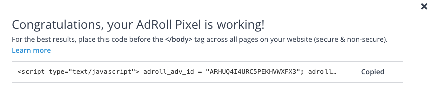

# Attentive Tag

[Attentive](https://www.attentivemobile.com/) is a personalized mobile messaging platform that helps consumers and companies to communicate with each other. It manages user subscriptions, triggers messages related to user actions, saves subscriber attributes, and sends personalized text messages. To utilize all the Attentive features, you need to add [Attentive Tag](https://docs.attentivemobile.com/pages/developer-guides/tag-management/the-attentive-tag/) to your website.

RudderStack supports Attentive Tag as a destination to which you can seamlessly send your event data.

<div class="successBlock">

Find the open-source transformer code for this destination in our [GitHub repository](https://github.com/rudderlabs/rudder-transformer/tree/master/v0/destinations/klaviyo).
</div>

## Getting started

Before configuring Attentive Tag as a destination in RudderStack, verify if the source platform is supported by Attentive Tag by referring to the table below:

| **Connection Mode** | **Web**       | **Mobile**    | **Server**    |
| :------------------ | :------------ | :------------ | :------------ |
| **Device mode**     | -             | -             | -             |
| **Cloud mode**      | **Supported** | **Supported** | **Supported** |

<div class="infoBlock">

To know more about the difference between cloud mode and device mode in RudderStack, refer to the <a href="https://rudderstack.com/docs/rudderstack-cloud/rudderstack-connection-modes/">RudderStack Connection Modes</a> guide.
</div>

Once you have confirmed that the source platform supports sending events to Attentive Tag, follow these steps:

1. From your [RudderStack dashboard](https://app.rudderstack.com/), add a source. Then, from the list of destinations, select **Attentive Tag**.
2. Assign a name to the destination and click on **Next**.

## Connection settings

To successfully configure Attentive Tag as a destination, you will need to configure the following settings:


- **API Key**: Your API Key is the unique key generated against your Klaviyo account. It can be found in your Klaviyo dashboard in the **Account** section under **Settings**.

- **Sign Up Source Id**: Your Sign Up Source Id can be generated for your account in the **Account** section under **Settings**. This key allows you to add users to a list or subscribe them using personalised emails/SMS.

<div class="infoBlock">

For more information on getting the API Key and Sign Up Source Id, refer to the <a href="#faq">FAQ</a> section below.
</div>

## Identify

The <Link to="https://www.rudderstack.com/docs/rudderstack-api/api-specification/rudderstack-spec/identify/">`identify`</Link> call lets you identify a visiting user and associate them to their actions. It also lets you record the traits about them like their name, email address, etc.

You can choose to  the user can be subscribed or unsubscribed from an Attentive Tag list using the identify call?

Subscribe will be the default operation for identify and for unsubscribe, user needs to provide identifyOperation as unsubscribe in the integrations object

A sample `identify` call is shown below:


### Subscribe user

Property mapping

| RudderStack Property | Attentive Tag Property | Presence |
|:--------------------------------|:--------------------------|:--------------------------|
| `traits.email`/`context.traits.email`/`properties.email` | `email` | Optional |
| `traits.phone` | `phone` | Optional |
| `externalId` | `externalIdentifiers` | Required |
| `integrations.attentive_tag.signUpsourceId` | `signUpSourceId` | Required |
| `context.traits.customIdentifiers`/`traits.customIdentifiers` | `customIdentifiers` | Optional |

<div class="infoBlock">

externalIdentifiers can be clientUserId, shopifyId, klaviyoId and customIdentifiers(Array of objects  - any other Identifier other than specified ones)
</div>

<div class="infoBlock">

signUpSourceId provided in integrations object will be prioritized over from destination definition.
</div>

A sample `identify` call to subscribe a user is shown below:

```javascript
{
  "context": {
    "traits": {
      "email": "new-val",
      "phone": "+13115552368",
      "customIdentifiers": [{
        "name": "string",
        "value": "string"
      }]
    },
    "externalId": [{
        "type": "clientUserId",
        "id": "144"
      },
      {
        "type": "shopifyId",
        "id": "224"
      },
      {
        "type": "klaviyoId",
        "id": "132"
      }
    ]
  },
  "integrations": {
    "signUpSourceId": "347393"
  }
}
```

### Unsubscribe user

Property mapping

| RudderStack Property | Attentive Tag Property | Presence | Notes |
|:--------------------------------|:--------------------------|:--------------------------|:--------------------------|
| `traits.email`/`context.traits.email`/`properties.email` | `email` | Optional |
| `traits.phone` | `phone` | Optional |
| `integrations.attentive_tag.subscriptions` | `subscriptions` | Optional | contains the specific type of channels the user wants to unsubscribe from |
| `integrations.attentive_tag.notification` | `notification` | Optional | contains the notification language|


A sample `identify` call to unsubscribe a user is shown below:

```javascript
{
  "user": {
    "phone": "+13115552368",
    "email": "test@gmail.com"
  },
  "subscriptions": [{
    "type": "MARKETING",
    "channel": "TEXT"
  }],
  "notification": {
    "language": "string"
  }
}
```

- For unsubscribe operation, user needs to provide identifyOperation as unsubscribe in the integrations object.
- Passing in an email does not locate, nor unsubscribe, a user from any sms subscriptions. Similarly, passing in a phone does not locate, nor unsubscribe, a user from any email subscriptions.
- For unsubscribe operation, user can unsubscribe from some specific type or channels by providing it inside the subscriptions in the integrations object.
- For unsubscribe operation, user can provide the `language` in the `notification` inside the integrations object. Currently only supports `en-US` and `fr-CA` as language. Case sensitive, must match exactly.

## Track

The <Link to="https://www.rudderstack.com/docs/rudderstack-api/api-specification/rudderstack-spec/track/">`track`</Link> call allows you to capture user actions along with the properties associated with these actions. 

A sample `track` call is shown below:

```javascript
{
  "type": "Order Shipped",
  "properties": {
    "orderStatusURL": "example.com/orderstatus/54321",
    "delivery_date": "May 10",
    "Order Id": "54321"
  },
  "externalEventId": "37fb97a9-6cfd-4983-bd65-68d104d53b70",
  "occurredAt": "2021-03-30T14:38:29+0000",
  "user": {
    "phone": "+13115552368",
    "email": "test@gmail.com",
    "externalIdentifiers": {
      "clientUserId": "string",
      "customIdentifiers": [{
        "name": "string",
        "value": "string"
      }]
    }
  }
}
```

### Property mapping

| RudderStack Property | Attentive Tag Property | Presence |
|:--------------------------------|:--------------------------|:--------------------------|
| `event` | `type` | Required |
| `properties` | `properties` | Optional |
| `properties.timestamp` | `occuredAt` | Optional |
| `properties.eventId` | `externalEventId` | Optional |
| `traits.email`/`context.traits.email`/`properties.email` | `email` | Optional |
| `traits.phone` | `phone` | Optional |
| `externalId` | `externalIdentifiers` | Optional |
| `context.traits.customIdentifiers`/`traits.customIdentifiers` | `customIdentifiers` | Optional |

<div class="infoBlock">

The timestamps should be in ISO 8601 format.
</div>

### E-Commerce events

RudderStack converts the following E-Commerce event names to the corresponding Klaviyo event names, before sending the events to Klaviyo:

| RudderStack event | Attentive Tag event |
|:--------------------------------|:--------------------------|
| Product List Viewed <br />OR<br /> Product Viewed | `product-view` |
| Product Added | `add-to-cart` |
| Order Completed | `purchase` |

The following table lists the RudderStack and Attentive Tag properties mappings based on the specific RudderStack events:

#### Product List Viewed

As mentioned in the table above, RudderStack converts the `Product List Viewed` event to `product-view`. The event properties are also mapped to the Attentive Tag properties, as shown:

| RudderStack Property | Attentive Tag Property | Presence |
|:--------------------------------|:--------------------------|:--------------------------|
| `properties.products.product_id` | `productId` | Required |
| `properties.products.price` | `value` | Required |
| `properties.products.price` | `currency` | Optional |
| `properties.products.name` | `name` | Optional |
| `properties.products.variant` | `productVariantId` | Required |
| `properties.products.url` | `productUrl` | Optional |
| `properties.products.image_url` | `productImage` | Optional |
| `traits.email`/`context.traits.email`/`properties.email` | `email` | Optional |
| `traits.phone` | `phone` | Optional |
| `externalId` | `externalIdentifiers` | Optional |
| `context.traits.customIdentifiers`/`traits.customIdentifiers` | `customIdentifiers` | Optional |


#### Product Viewed/Product Added

As mentioned in the table above, RudderStack converts the `Product Viewed` and `Product Added` event to `product-view` and `add-to-cart` respectively. The event properties are also mapped to the Attentive Tag properties, as shown:

| RudderStack Property | Attentive Tag Property | Presence |
|:--------------------------------|:--------------------------|:--------------------------|
| `properties.products.product_id` | `productId` | Required |
| `properties.products.price` | `value` | Required |
| `properties.products.currency` | `currency` | Optional |
| `properties.products.name` | `name` | Optional |
| `properties.products.variant` | `productVariantId` | Required |
| `properties.products.url` | `productUrl` | Optional |
| `properties.products.image_url` | `productImage` | Optional |
| `traits.email`/`context.traits.email`/`properties.email` | `email` | Optional |
| `traits.phone` | `phone` | Optional |
| `externalId` | `externalIdentifiers` | Optional |
| `context.traits.customIdentifiers`/`traits.customIdentifiers` | `customIdentifiers` | Optional |

#### Order Completed

As mentioned in the table above, RudderStack converts the `Order Completed` event name to `purchase`. The event properties are also mapped to the Attentive Tag properties, as shown:

| RudderStack Property | Attentive Tag Property | Presence |
|:--------------------------------|:--------------------------|:--------------------------|
| `properties.products.product_id` | `productId` | Required |
| `properties.products.price` | `value` | Required |
| `properties.products.price` | `currency` | Optional |
| `properties.products.name` | `name` | Optional |
| `properties.products.variant` | `productVariantId` |  Required |
| `properties.products.url` | `productUrl` | Optional |
| `properties.products.image_url` | `productImage` | Optional |
| `traits.email`/`context.traits.email`/`properties.email` | `email` | Optional |
| `traits.phone` | `phone` | Optional |
| `externalId` | `externalIdentifiers` | Optional |


A sample `track` call containing the above e-commerce event parameters is shown below:

```javascript
{
  "items": [{
    "productId": "AB12345",
    "productVariantId": "CD12345",
    "productImage": "http://my.cdn.com/products/new-product.png",
    "productUrl": "http://my-store.com/products/shirts/my-shirt",
    "name": "T-Shirt",
    "price": [{
      "value": 19.99,
      "currency": "USD"
    }],
    "quantity": 1
  }],
  "occurredAt": "2021-03-30T14:38:29+0000",
  "user": {
    "phone": "+13115552368",
    "email": "test@gmail.com",
    "externalIdentifiers": {
      "clientUserId": "string",
      "customIdentifiers": [{
        "name": "string",
        "value": "string"
      }]
    }
  }
}
```

## FAQ

### Where can I find the Attentive Tag API Key?

To find the AdRoll advertiser ID and pixel ID, follow these steps:

1. Log into your [AdRoll dashboard](https://app.adroll.com/).
2. In the left sidebar, go to **Website** under **Audiences**.
3. Under the **AdRoll Pixel** section, click on **View Pixel**, as shown:


4. In the resulting pop-up, you can find your AdRoll advertiser ID associated with the `adroll_adv_id` parameter. You can also find the AdRoll pixel ID associated with the `adroll_pix_id` parameter, as shown:



### Where can I find the Attentive Tag Sign Up Source Id?

## Contact us

For queries on any of the sections covered in this guide, you can [contact us](mailto:%20docs@rudderstack.com) or start a conversation in our [Slack](https://rudderstack.com/join-rudderstack-slack-community) community.
