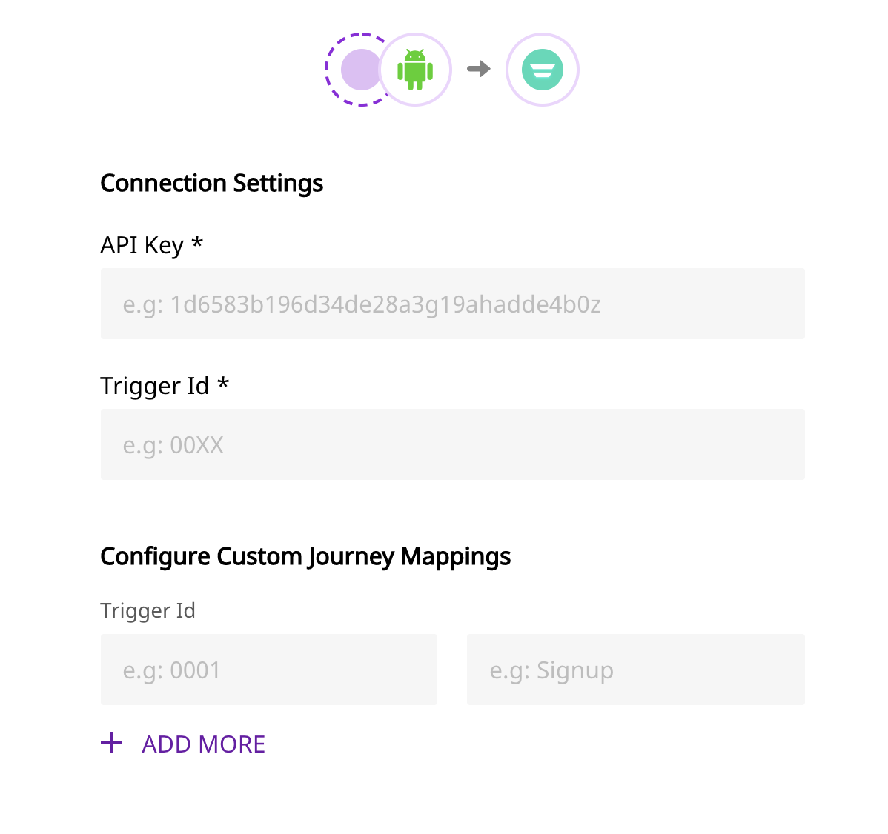

# Autopilot

[Autopilot ](https://www.autopilothq.com/)is a popular marketing automation platform that allows you to track and capture new leads and create detailed customer journeys. With Autopilot, you can connect with your existing customers by sending them personalized messages, and surveys to improve your product design. Autopilot allows you to boost your customer retention rate, and automate repetitive tasks with ease.

RudderStack allows you to configure Autopilot as a destination to which you can send your event data seamlessly.

<div class="successBlock">

  **Find the open-source transformer code for this destination in our <a href="https://github.com/rudderlabs/rudder-transformer/tree/master/v0/destinations/autopilot">GitHub repo</a>.**
</div>

## Getting Started

To enable sending data to Autopilot, you will first need to add it as a destination to the source from which you are sending your event data. Once the destination is enabled, events from our SDK will start flowing to Autopilot.

| **Connection Mode** | **Web** | **Mobile**    | **Server**    |
| :------------------ | :------ | :------------ | :------------ |
| **Device mode**     | -       | -             | -             |
| **Cloud mode**      | -       | **Supported** | **Supported** |

<div class="infoBlock">

To know more about the difference between Cloud mode and Device mode in RudderStack, read the <a href="https://rudderstack.com/docs/rudderstack-cloud/rudderstack-connection-modes/">RudderStack connection modes</a> guide.

</div>

Once you have confirmed that the platform supports sending events to Autopilot, perform the steps below:

- From your [RudderStack dashboard](https://app.rudderlabs.com/), add the source. From the list of destinations, select **Autopilot.**
- Give a name to the destination and click on **Next**. You should then see the following screen.

<span class="imageTitle">Autopilot Settings</span>

- Fill up the details and click on **Next** to complete the configuration. Autopilot should now be added and enabled as a destination in RudderStack.

## Identify

The `identify` call captures the relevant details about the visiting user.

<div class="infoBlock">

For more information on the `identify` method, please refer to our guide on [RudderStack API Specification](https://rudderstack.com/docs/rudderstack-api/api-specification/rudderstack-spec/).

</div>

A sample `identify` payload is as shown in the snippet below:

```objectivec
[[RSClient sharedInstance] identify:@"developer_user_id"
                                 traits:@{@"foo": @"bar", @"foo1": @"bar1"}];
```

## Track

The `track` call captures the information related to the actions performed by the user, along with their properties, or traits.

<div class="infoBlock">

For more information on the `track` method, please refer to our guide on [RudderStack API Specification](https://rudderstack.com/docs/rudderstack-api/api-specification/rudderstack-spec/).

</div>

A sample `track` payload is as shown in the snippet below:

```objectivec
[[RudderClient sharedInstance] track:@"test_event"
                          properties:@{@"key":@"value", @"foo": @"bar"}]
```

## FAQs

### Where can I get the API Key from?

You can retrieve the API key from the settings page of the [Autopilot](https://dashboard.branch.io/#/settings) dashboard. For more information, please check the [Getting Started](https://rudderstack.com/docs/destinations/marketing/autopilot/#getting-started) section above.

## Contact Us

If you come across any issues while configuring Autopilot with RudderStack, please feel free to [contact us](mailto:%20docs@rudderstack.com). You can also start a conversation in our [Slack](https://rudderstack.com/join-rudderstack-slack-community) community; we will be happy to talk to you!
