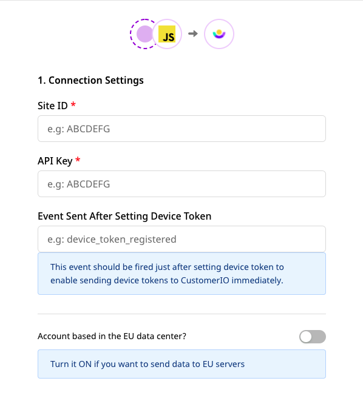
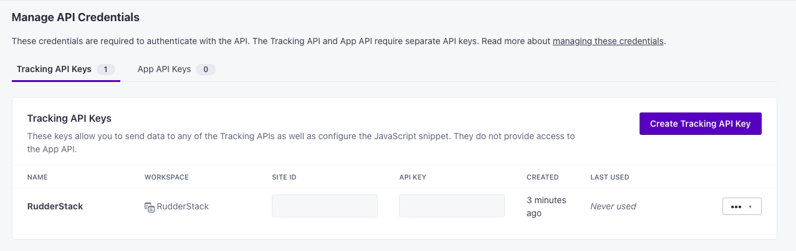

# Customer.io

[**Customer.io**](https://customer.io/) is a popular platform for sending automated messages and emails to your customers, with a focus on security and privacy. With Customer.io, you get complete information about your customers in one place, and use it to create personalized messages and campaigns for them.

RudderStack supports Customer.io as a destination to which you can seamlessly send your event data.

<div class="successBlock">

<strong>Find the open-source transformer code for this destination in our <a href="https://github.com/rudderlabs/rudder-transformer/tree/master/v0/destinations/customerio">GitHub repo</a></strong>.
</div>

## Getting started

Before configuring Customer.io as a destination in RudderStack, verify if the source platform is supported by Customer.io by referring to the table below:

| **Connection Mode** | **Web**       | **Mobile**    | **Server**    |
| :------------------ | :------------ | :------------ | :------------ |
| **Device mode**     | **Supported** | -             | -             |
| **Cloud mode**      | **Supported** | **Supported** | **Supported** |

<div class="infoBlock">

To know more about the difference between cloud mode and device mode in RudderStack, read the <a href="https://rudderstack.com/docs/rudderstack-cloud/rudderstack-connection-modes/">RudderStack Connection Modes</a> guide.
</div>

Once you have confirmed that the platform supports sending events to Customer.io, follow these steps:

- From your [**RudderStack dashboard**](https://app.ruddestack.com/), add the source. From the list of destinations, select **Customer.io**.
- Assign a name to the destination and click on **Next**. You should then see the following screen:


### Connection settings

The connection settings required to configure Customer.io as a destination in RudderStack are listed below:

- **Site ID**: Enter your Customer.io site ID.

- **API Key**: Enter your Customer.io API key. 

<div class="infoBlock">

For more information on obtaining your Customer.io site ID and API key, refer to the <a href="https://rudderstack.com/docs/destinations/marketing/customer.io/#where-do-i-find-the-api-key-and-site-id-for-configuring-customerio-in-rudderstack">FAQ</a> section below.
</div>

- **Event sent after setting device token**: Enter the name of the event that is fired immediately after setting the device token.

- **Account based in the EU data center?**: Enable this option in case your account is based in the EU region.

<div class="infoBlock">

Refer to the <a href="https://customer.io/docs/api/?region=eu#section/Overview">Customer.io documentation</a> for more information on this setting.
</div>

#### Web SDK settings

- **Use native SDK to send events**: Enable this setting to send the events through Customer.io's native JavaScript SDK.

- **OneTrust Cookie Category**: Specify the OneTrust category name for mapping the OneTrust consent settings to RudderStack's consent purposes.

<div class="infoBlock">

For more information on this setting, refer to the <a href="https://rudderstack.com/docs/stream-sources/rudderstack-sdk-integration-guides/rudderstack-javascript-sdk/consent-managers/onetrust/">OneTrust Consent Manager</a> guide.
</div>

Finally, click on **Next** to complete the setup. Customer.io will now be enabled as a destination in RudderStack.

## Identify

The `identify` call sends the event data to Customer.io along with the properties that you pass as the RudderStack traits.

<div class="infoBlock">

<code class="inline-code">userId</code> is a mandatory field for Customer.io. If it is not provided, RudderStack uses <code class="inline-code">anonymousId</code> instead.
</div>

RudderStack also sends the `createdAt` field as `created_at` to Customer.io to register the user signup time.

A sample `identify` call is as shown:

```javascript
rudderanalytics.identify("userId", {
  name: "Tintin",
  city: "Brussels",
  country: "Belgium",
  email: "tintin@herge.com"
});
```

As `createdAt` is not present in the above call, RudderStack will append the current timestamp value and send the field to Customer.io.

<div class="infoBlock">

The same <code class="inline-code">email</code> cannot be used to make consecutive <code class="inline-code">identify</code> calls with different <code class="inline-code">userId</code>.
</div>

### Unsubscribing users

You can pass `unsubscribed: true` in the `identify` call to unsubscribe a user in Customer.io, as shown in the following snippet:

```javascript
rudderanalytics.identify("userId", {
  email: "tintin@herge.com",
  unsubscribed: true
});
```

<div class="infoBlock">
 
 Make sure the user ID and the email values match the Customer.io attributes. You can verify this by selecting that user in the <a href="https://customer.io/docs/getting-started-people/">People</a> page in your Customer.io dashboard and clicking on <strong>Attributes</strong>.
</div>

## Page

If you are using a native SDK, the Customer.io JavaScript snippet is loaded and captures the page view automatically. You can also call `rudderanalytics.page()` that sends the `page` event along with any associated properties that you want to pass along with the call.

A sample `page` call is as shown below:

```javascript
// "home" is the name of the page.
rudderanalytics.page("home", {
  path: "path",
  url: "url",
  title: "title",
  search: "search",
  referrer: "referrer",
});
```

## Screen

The `screen` call lets you record whenever your user views their mobile screen, with any additional relevant information about the screen. 

If you have turned on the screen views in your app implementation from the [**iOS**](https://rudderstack.com/docs/stream-sources/rudderstack-sdk-integration-guides/rudderstack-ios-sdk) or [**Android**](https://rudderstack.com/docs/stream-sources/rudderstack-sdk-integration-guides/rudderstack-android-sdk) SDK, they will be registered as `Viewed <screen_name> Screen` under the **Activities** tab for the user. 

RudderStack will also forward the event properties passed along with the `screen` call to Customer.io as they are received.

A sample `screen` call using RudderStack's iOS SDK is shown below:

```objectivec
[[RudderClient sharedInstance] screen:@"Main"
            properties:@{@"prop_key" : @"prop_value"}];
```

The above event will be transformed as `Viewed Main Screen` and sent to Customer.io.

## Track

The `track` call lets you record the user events, i.e. the actions that they perform, along with any properties associated with them. You may call `rudderanalytics.track()`with or without the event properties. 

A sample `track` call is as shown below:

```javascript
rudderanalytics.track("Track me", {
  category: "category",
  label: "label",
  value: "value",
});
```

<div class="infoBlock">

For anonymous users, Customer.io does not allow an event name of size more than 100 Bytes. RudderStack will automatically trim the event names in such a scenario.
</div>

## Alias

The <Link to="/rudderstack-api/api-specification/rudderstack-spec/alias/">`alias`</Link> call lets you merge different identities of a known user. RudderStack merges the attributes of both the user identities by retaining the attributes of the primary identity and merging the additional attributes of the secondary identity.

A sample `alias` call is as shown below:

```javascript
rudderanalytics.alias("test_new_id", "old_user_id");
```

<div class="infoBlock">
  
The <code class="inline-code">alias</code> call is applicable only when both the users are present in Customer.io.
</div>

## Device token registration

RudderStack registers the device token to Customer.io for the following application lifecycle events:

- `Application Installed`
- `Application Opened`
- `Application Unistalled`

<div class="infoBlock">

To use this feature, turn on the <code class="inline-code">trackApplicationLifecycleEvents</code> feature in your mobile SDK implementation code. Moreover, you will have to register your device token after initializing the SDK.
</div>

The following snippets demonstrate registering the device token for iOS and Android:

<Tabs>
  <TabList>
    <Tab>iOS</Tab>
    <Tab>Android</Tab>
  </TabList>
    <TabPanels>
      <TabPanel>
<span>

```objectivec
[[[RudderClient sharedInstance] getContext] putDeviceToken:[self getDeviceToken]];
```
</span>
      </TabPanel>
      <TabPanel>
<span>

```kotlin
RudderClient.putDeviceToken(getDeviceToken())
```
</span>
      </TabPanel>
    </TabPanels>
</Tabs>

Alternatively, you can also enter the event name of your choice in the Customer.io settings in the RudderStack dashboard, as shown:



<div class="warningBlock">

Make sure you send the event just after setting the device token in your app, so RudderStack can immediately register the device token on that event and not delay until the next lifecycle event.
</div>

The following snippets highlight sending the `device_token_registered` event after setting the device token in your app:

<Tabs>
  <TabList>
    <Tab>iOS</Tab>
    <Tab>Android</Tab>
  </TabList>
    <TabPanels>
      <TabPanel>
<span>

```objectivec
[[RSClient sharedInstance] track:@"device_token_registered"];
```
</span>
      </TabPanel>
      <TabPanel>
<span>

```kotlin
rudderClient!!.track("device_token_registered")
```
</span>
      </TabPanel>
    </TabPanels>
</Tabs>

## FAQ

### Where do I find the API Key and Site ID for configuring Customer.io in RudderStack?

To obtain the API Key and Site ID, follow these steps:

- Sign into your [**Customer.io dashboard**](https://fly.customer.io/).

- In the left panel, click on **Settings** and select **Account Settings**.

- Then, click on **API Credentials**. You should find the site ID and API key for your project listed here, as shown:



## Contact us

For queries on any of the sections covered in this guide, you can [**contact us**](mailto:%20docs@rudderstack.com) or start a conversation in our [**Slack**](https://rudderstack.com/join-rudderstack-slack-community) community.
