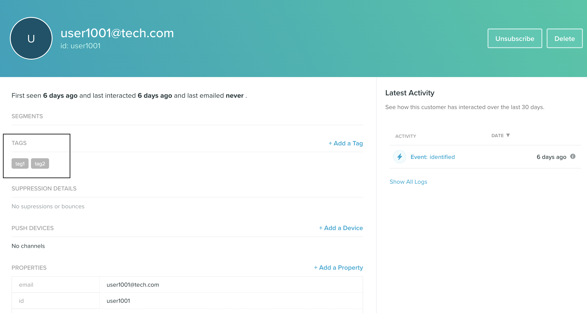

RudderStack lets you send your event data to Vero via the <Link to="/rudderstack-cloud/rudderstack-connection-modes/#device-mode">web device mode</Link>.

## Identify

The <Link to="/rudderstack-api/api-specification/rudderstack-spec/identify/">`identify`</Link> call lets you identify a user and associate them to their actions. It also lets you record any traits about them like their name, email, etc.

RudderStack sends the `identify` events to Vero via their [`users`](https://api.getvero.com/api/v2/users/track) endpoint to create, update, and manage your user records.

A sample `identify` call is shown below:

```javascript
rudderanalytics.identify("1hKOmRA4GRlm", {
  "email": "alex@example.com",
  "gender": "Male",
  "randomKey": "randomData"
})
```

### Supported mappings

The following table shows the mapping of the RudderStack properties to the corresponding Vero fields:

| RudderStack trait | Vero property | Presence |
| :-----| :------| :-------|
| `userId`/`anonymousId` | `id` | Required |
| `email` | `email` | Required, if `userId`/`anonymousId` is not present. |
| `context.traits`/`traits` | `traits` |  Optional |

<div class="infoBlock">
If the event includes <code class="inline-code">email</code> and no <code class="inline-code">id</code>, Vero will automatically use <code class="inline-code">email</code> as the <code class="inline-code">id</code>.
</div>

## Track

The <Link to="/rudderstack-api/api-specification/rudderstack-spec/track/">`track`</Link> call lets you capture user events along with the properties associated with them.

RudderStack sends the `track` events to Vero via their [`events`](https://api.getvero.com/api/v2/events/track) endpoint to track events for a specific user based on the actions they take.

<div class="warningBlock">
You need to first create a user by explicitly calling <code class="inline-code">identify</code> before making any <code class="inline-code">track</code> calls to Vero. Otherwise, the <code class="inline-code">track</code> calls will fail.
</div>

A sample `track` event is as shown:

```javascript
rudderanalytics.track("Product Viewed", {
  SKU: "P001",
  "revenue": 77.6,
  "currency": "USD",
  "review_id": "R1619" 
})
```

<div class="infoBlock">
Vero's API treats the capitalized or lower case letters, spaces, and underscores in the event names in the same way. For example, Vero will match <code class="inline-code">Purchased Item</code>, <code class="inline-code">purchased item</code>, and <code class="inline-code">purchased_item</code> as the same event.
</div>

### Supported mappings

The following table shows the mapping of the RudderStack properties to the corresponding Vero fields:

| RudderStack property | Vero property | Presence |
| :-----| :------| :-------|
| `event`  | `event_name` | Required |
| `properties` | `data` | Optional |

### Unsubscribing and resubscribing users

RudderStack supports unsubscribing and resubscribing users in Vero by passing the `userId` in the `track` call, as shown:

```javascript
rudderanalytics.track("unsubscribe", {
  userId: "user01"
})
```

## Page

The <Link to="/rudderstack-api/api-specification/rudderstack-spec/page/">`page`</Link> call lets you record your website's page views with any additional relevant information about the viewed page.

A sample `page` call is shown below:

```javascript
rudderanalytics.page(
  "Cart",
  "Cart Viewed", {
    path: "/best-seller/1",
    referrer: "https://www.google.com/search?q=estore+bestseller",
    search: "estore bestseller",
    title: "The best sellers offered by EStore",
    url: "https://www.estore.com/best-seller/1"
  }
);
```

## Alias

RudderStack sends the <Link to="/rudderstack-api/api-specification/rudderstack-spec/alias/">`alias`</Link> events to Vero via their [`users`](https://api.getvero.com/api/v2/users/reidentify) endpoint to change a user's identifier (`id`).

A sample `alias` call is shown below:

```javascript
rudderanalytics.alias("userId", "previousId");
```

### Supported mappings

The following table shows the mapping of the RudderStack properties to the corresponding Vero fields:

| RudderStack property | Vero property | Presence |
| :-----| :------| :-------|
| `userId` | `new_id` | Required |
| `previousId` | `id` | Required |

## Adding and removing tags

RudderStack supports adding and removing `tags` to all the `identify`, `track`,  and `page` calls by passing them via the `integrations` object. An example snippet is shown below:

```javascript
rudderanalytics.identify(
  "1hKOmRA4GRlm", {
    email: "alex@example.com"
  }, {
    integrations: {
      Vero: {
        tags: {
          add: ["alex", "keener", "neworleans"],
          remove: ["james", "ducker", "newyork"]
        }
      }
    }
  }
);
```

You can then view the updated tags associated with that user in the Vero dashboard, as shown:



## Contact us

For queries on any of the sections covered in this guide, you can [contact us](mailto:%20docs@rudderstack.com) or start a conversation in our [Slack](https://rudderstack.com/join-rudderstack-slack-community) community.