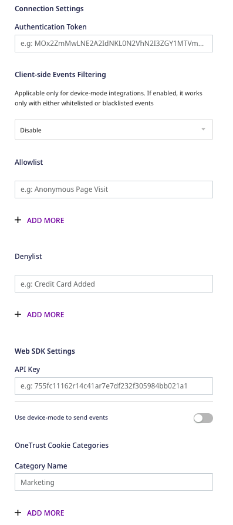
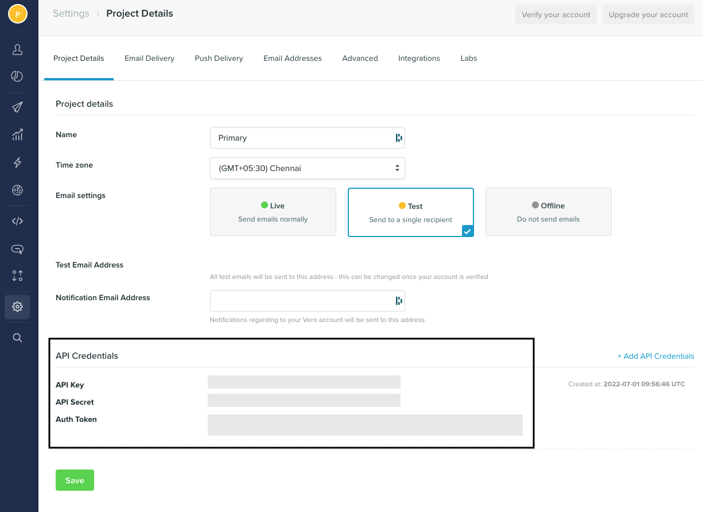

Before configuring Vero as a destination in RudderStack, verify if the source platform is supported by Vero by referring to the table below:

| **Connection Mode** | **Web**       | **Mobile**    | **Server**    |
| :------------------ | :------------ | :------------ | :------------ |
| Device mode     | **Supported** | - | - |
| Cloud mode  | **Supported** | **Supported** | **Supported** |

To know more about the difference between cloud mode and device mode in RudderStack, refer to the <Link to="/rudderstack-cloud/rudderstack-connection-modes/">RudderStack Connection Modes</Link> guide.

Once you have confirmed that the source supports sending events to Vero, follow these steps:

1. From your [RudderStack dashboard](https://app.rudderstack.com/), add the source. Then, from the list of destinations, select **Vero**.
2. Assign a name to your destination and click on **Continue**.

## Connection settings

To successfully set up Vero as a destination in RudderStack, you need to configure the following settings:

- **Authentication Token**: Enter your Vero authentication token.
- **API key**: Enter your Vero API key.

For more information on obtaining your Vero authentication token and API key, refer to the <Link to="#faq">FAQ</Link> section below.

### Web device mode settings

If you are sending events to Vero via the <Link to="/rudderstack-cloud/rudderstack-connection-modes/#device-mode">web device mode</Link>, then you need to configure the following settings:

- **Client-side Events Filtering**: This optional setting lets you specify which events should be blocked or allowed to flow through.

For more information on this option, refer to the <Link to="/stream-sources/rudderstack-sdk-integration-guides/event-filtering/">Client-side Event Filtering</Link> guide.

- **Use device-mode to send events**: Enable this option to send events via the <Link to="/rudderstack-cloud/rudderstack-connection-modes/#device-mode">web device mode</Link>.
- **OneTrust Cookie Categories**: This setting lets you map OneTrust cookie/consent groups to RudderStack's consent purposes.

For more information on this option, refer to the <Link to="/stream-sources/rudderstack-sdk-integration-guides/rudderstack-javascript-sdk/consent-managers/onetrust/">OneTrust Consent Manager</Link> guide.

## FAQ

### Where can I find the Vero API Key and Authentication Token?

To obtain your Vero API key and authentication token, follow these steps:

1. Log into your [Vero dashboard](https://app.getvero.com/).
2. In the left panel, go to **Settings** and scroll down to find the **API Credentials** section. You will find the **API Key** and **Auth Token** listed here, as shown:

## Contact us

For queries on any of the sections covered in this guide, you can [contact us](mailto:%20docs@rudderstack.com) or start a conversation in our [Slack](https://rudderstack.com/join-rudderstack-slack-community) community.
