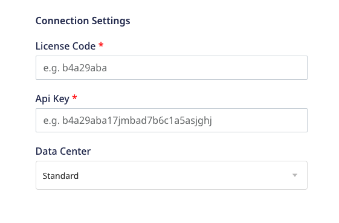
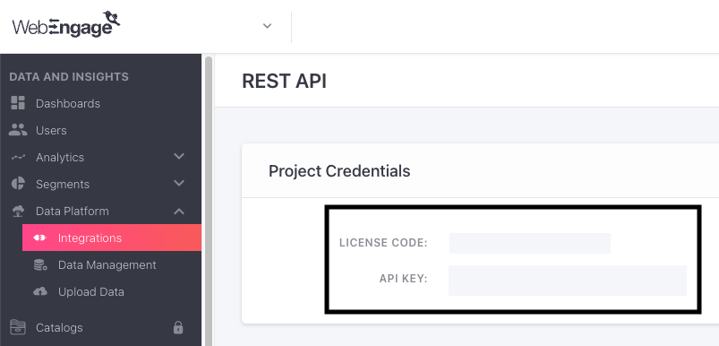

# WebEngage

[WebEngage](https://webengage.com/) is a full stack marketing automation tool. It lets you drive growth for your businesses by engaging your users via push and in-app notifications, email campaigns, etc. You can also leverage WebEngage's analytics capabilities to get a 360-degree view of your users and the product.

RudderStack supports WebEngage as a destination to which you can seamlessly send your event data for efficient marketing and analytics.

<div class="successBlock">

Find the open source transformer code for this destination in the <a href="https://github.com/rudderlabs/rudder-transformer/tree/master/v0/destinations/">GitHub repository</a>.
</div>

## Getting started

Before configuring WebEngage as a destination in RudderStack, verify if the source platform is supported by WebEngage by referring to the table below:

| **Connection Mode** | **Web** | **Mobile** | **Server** |
| :--- | :--- | :--- | :--- |
| **Device mode** | - | - | - |
| **Cloud mode** | **Supported**  | **Supported** | **Supported** |

<div class="infoBlock">
    
To know more about the difference between cloud mode and device mode in RudderStack, refer to the <a href="https://rudderstack.com/docs/rudderstack-cloud/rudderstack-connection-modes/">RudderStack Connection Modes</a> guide.
</div>

Once you have confirmed that the source platform supports sending events to WebEngage, follow these steps:

1. From your [RudderStack dashboard](https://app.rudderstack.com/), add a source. Then, from the list of destinations, select **WebEngage**.
2. Assign a name to the destination and click **Continue**.

### Connection settings

To successfully configure WebEngage as a destination, you will need to configure the following settings:



- **License Code**: Enter your WebEngage license code.
- **API Key**: Enter your WebEngage API key.

<div class="infoBlock">

To get your WebEngage license code and API key, log into your WebEngage dashboard and go to <strong>Data Platform</strong> > <strong>Integrations</strong> > <strong>REST API</strong>. For more information, refer to the <Link to="#faq">FAQ</Link> section below.
</div>

- **Data Center**: Select your WebEngage data center from the dropdown.

## Identify 

The <Link to="/rudderstack-api/api-specification/rudderstack-spec/identify"><code class="inline-code">identify</code></Link> method lets you identify a user and associate them to their actions. It also lets you record any traits about them like their name, email, etc.

RudderStack uses the `identify` call to create or update the customer information in WebEngage. It maps `userId` (a required trait in every event) to WebEngage's `userIdOnly` before sending the data via the [`users`](https://docs.webengage.com/docs/rest-api-tracking-users#users) API.

A sample `identify` call is shown below:

```javascript
rudderanalytics.identify("1hKOmRA4GRlm", {
  email: "alex@example.com",
  phone: "+1-202-555-0146",
});
```

### Traits mapping

RudderStack maps the following `identify` traits to the corresponding WebEngage attributes:

| RudderStack trait | WebEngage attribute | Presence | Notes |
| :-------| :--------| :------| :------|
| `userId` | `userId` | Required if `anonymousId` is not present. | `userId` cannot exceed 100 characters. |
| `anonymousId` | `anonymousId` | Required if `userId` is not present. | `anonymousId` cannot exceed 100 characters. |
| `firstName` | `firstName` | Optional | The user's first name. |
| `lastName` | `lastName` | Optional | The user's last name. |
| `dateOfBirth`/`dateofbirth`/`birthday`/`dob`/`DOB` | `birthDate` | Optional | The user's birth date in the ISO format: `yyyy-MM ddTHH:mm:ss±hhmm`. |
| `gender` | `gender` | Optional | The user's gender. |
| `email` | `email` | Optional | The user's email. |
| `phone` | `phone` | Optional | The user's phone. |
| `emailOptIn` | `emailOptIn` | Optional | The user's email subscription preference. |
| `smsOptIn` | `smsOptIn` | Optional | The user's SMS subscription preference. |
| `whatsappOptIn` | `whatsappOptIn` | Optional | The user's WhatsApp subscription preference. |
| `company.name` | `company` | Optional | The user's company. |
| `hashedEmail` | `hashedEmail` | Optional | The user's hashed email for email services. |
| `hashedPhone` | `hashedPhone` | Optional | The user's encrypted phone number for SMS services. |
| `postalcode` / `address.postalCode` | `postalCode` | Optional | The user's postal code. |
| `region` / `address.region` | `region` | Optional | The user's region. |
| `locality` / `address.locality` | `locality` | Optional | The user's locality. |
| `city` / `address.city` | `city` | Optional | The user's city. |
| `country` / `address.country` | `country` | Optional | The user's country. |
| `attributes` | `attributes` | Optional | The user's custom attributes as key-value pairs. |

### Identify traits considerations

Note the following when sending `identify` traits to WebEngage:

- Either `userId` or `anonymousId` must be present in the `identify` call. 
- If both `userId` and `anonymousId` are present in the `identify` call, RudderStack ignores `anonymousId`.
- WebEngage prioritizes `hashedEmail` over `email`. Hence, once you set `hashedEmail`, it can then be updated only through a new `hashedEmail`.
- WebEngage prioritizes `hashedPhone` over `phone`. Hence, once you set `hashedPhone`, it can then be updated only through a new `hashedPhone`.

## Track

The <Link to="/rudderstack-api/api-specification/rudderstack-spec/track"><code class="inline-code">track</code></Link> method lets you capture user events along with the properties associated with them.

RudderStack uses the `track` call to send the custom events to WebEngage via the [`events`](https://docs.webengage.com/docs/rest-api-tracking-events#events) API.

A sample `track` call is shown below:

```javascript
rudderanalytics.track("Order Completed", {
  timestamp: "2022-05-05T14:58:10.000Z",
  currency: "USD",
  checkout_id: "X23441",
  order_id: "ORD00123"
});
```

<div class="warningBlock">

Make sure you call <code class="inline-code">identify</code> before <code class="inline-code">track</code> for RudderStack to include the <code class="inline-code">userId</code> in the <code class="inline-code">track</code> events. Otherwise, RudderStack will send the <code class="inline-code">track</code> calls to WebEngage with an <code class="inline-code">anonymousId</code>.
</div>

### Property mapping

RudderStack maps the following event properties to the corresponding WebEngage attributes:

| RudderStack trait | WebEngage attribute | Presence | Notes |
| :-------| :--------| :------| :------|
| `userId` | `userId` | Required if `anonymousId` is not present. | `userId` cannot exceed 100 characters. |
| `anonymousId` | `anonymousId` | Required if `userId` is not present. | `anonymousId` cannot exceed 100 characters. |
| `eventName` | `event` | Required | The event name. |
| `timestamp`/`originalTimestamp` | `eventTime` | Optional | The date and time of the event in ISO format: `yyyy-MM-ddTHH:mm:ss±hhmm`. |
| `properties` | `eventData` | Optional | The custom event attributes as key-value pairs. |

### Setting custom attributes

WebEngage lets you send custom attributes as key-value pairs in the `eventData` parameter as described in the <Link to="#property-mapping">above section</Link>. However, there are a few things you should keep in mind:

- WebEngage ignores any custom attributes starting with `we_` as these are reserved for internal use.
- User attribute names must be less than 50 characters, while the `string` attribute values cannot exceed 1000 characters. WebEngage automatically truncates any additional characters.
- You can create a maximum of 25 custom user attributes of each data type.
- If the attribute value is a JSON object, it can only be used to personalize your campaigns. These attributes cannot be used to create user segments.
- Once defined, the data type of a custom user attribute cannot be changed again.

## Page

The <Link to="/rudderstack-api/api-specification/rudderstack-spec/page"><code class="inline-code">page</code></Link> call lets you record your website's page views with any additional relevant information about the viewed page.

RudderStack internally transforms the `page` call into a `track` call before sending it as a custom event to WebEngage. It sends the event/category name by transforming it in the `Viewed ${name} ${category} page` format.

For example, consider the following `page` call:

```javascript
rudderanalytics.page("Cart", "Cart Viewed", {
  path: "/best-seller/1",
  referrer: "https://www.google.com/search?q=estore+bestseller",
  search: "estore bestseller",
  title: "The best sellers offered by EStore",
  url: "https://www.estore.com/best-seller/1"
});
```

RudderStack transforms the above event into a `track` call named `Viewed Cart Viewed page` and sends it to WebEngage as a custom event.

<div class="infoBlock">

RudderStack sends the <code class="inline-code">page</code> event properties to WebEngage, similar to the <code class="inline-code">track</code> event properties.
</div>

## Screen

The <Link to="/rudderstack-api/api-specification/rudderstack-spec/screen"><code class="inline-code">screen</code></Link> method lets you record whenever your user views their mobile screen with any additional relevant information about the screen. It is the mobile equivalent of a <Link to="#page"><code class="inline-code">page</code></Link> call.

RudderStack internally transforms the `screen` call into a `track` call before sending it as a custom event to WebEngage. It sends the event/category name by transforming it in the `Viewed ${name} ${category} screen` format.

For example, consider the following `screen` call:

```kotlin
rudderClient.screen(
    "home",
    "Games",
    RudderProperty().putValue("foo", "bar"),
    null
)
```

RudderStack transforms the above event into a `track` call named `Viewed home Games screen` and sends it to WebEngage as a custom event.

<div class="infoBlock">

RudderStack sends the <code class="inline-code">screen</code> event properties to WebEngage, similar to the <code class="inline-code">track</code> event properties.
</div>

## FAQ

### Where can I find the WebEngage License Code and API key?

To get your WebEngage License Code and API key, follow these steps:

1. Log into your [WebEngage dashboard](https://dashboard.webengage.com/).
2. Go to **Data Platform** > **Integrations** > **REST API**.
3. You will find the WebEngage **License Code** and **API Key** listed under **Project Credentials**, as shown:



## Contact us

For queries on any of the sections covered in this guide, you can, [contact us](mailto:%20docs@rudderstack.com) or start a conversation in our [Slack](https://rudderstack.com/join-rudderstack-slack-community) community.
