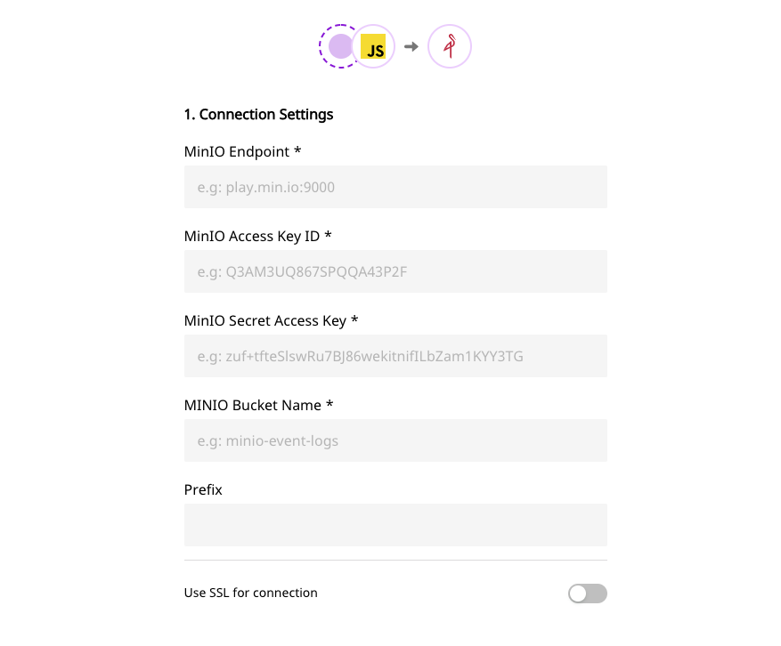

# MinIO

[MinIO](https://min.io/) is a High Performance Object Storage released under GNU Affero General Public License v3.0. It is API compatible with Amazon S3 cloud storage service. Use MinIO to build high performance infrastructure for machine learning, analytics and application data workloads.

RudderStack allows you to configure MinIO as a destination to which you can dump your event data seamlessly.

  **Find the open-source transformer code for this destination in our <a href="https://github.com/rudderlabs/rudder-transformer/tree/master/v0/destinations/minio">GitHub repo</a>.**

## Setting up MinIO

Please follow these steps to set up MinIO before adding it as a destination in RudderStack:

- Login to your MinIO service
- Create a new bucket. Alternatively, you can also use an already existing bucket.
- You will need to provide `access key ID` and `secret access key` to authorize RudderStack to write to your bucket.

`access key ID` is the user ID that uniquely identifies your MinIO account, and `secret access key` is the password to your account.

- Make a note of both the `access key ID` and `secret access key` as these will be required while configuring MinIO as a destination.

## **Configuring** MinIO **in RudderStack**

In order to enable dumping data to MinIO, you will first need to add it as a destination to the source from which you are sending event data. Once the destination is enabled, events from RudderStack will start to flow to MinIO. You will start seeing the files created in your MinIO bucket.

To do so, please follow these steps:

- Choose a source to which you would like to add MinIO as a destination. You can also simply create a destination and connect it to a source later.
- Select the destination as **MinIO** to your source. Give your destination a name and then click on **Next**.
- Next, in the **Connection Settings**, fill all the fields with the relevant information \(please refer to the [Setting up MinIO](https://rudderstack.com/docs/destinations/storage-platforms/minio#setting-up-minio) section above\) and click on **Next**.

MinIO connection settings

- If you need any transformation, choose one from the list. Else, click on **Next**.

That's it! You have successfully added MinIO as a destination in RudderStack. Once you send an event from your source, you can find it dumped to your MinIO bucket.

## Contact Us

If you come across any issues while configuring MinIO with RudderStack, please feel free to [contact us](mailto:%20docs@rudderstack.com). You can also start a conversation in our [Slack](https://rudderstack.com/join-rudderstack-slack-community) community; we will be happy to talk to you!
