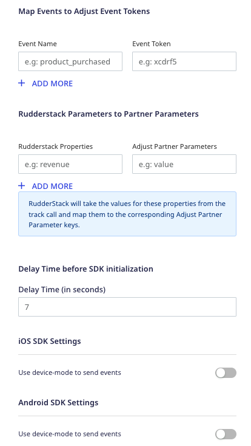
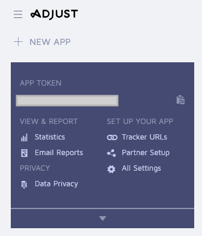
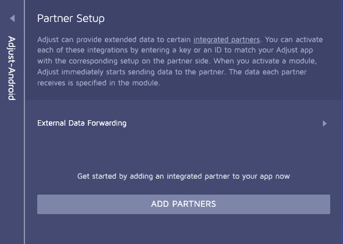

[Adjust](https://adjust.com) is an industry-leading mobile attribution provider that allows you to bring all your business data together to get powerful insights from it.

RudderStack supports Adjust as a destination to which you can seamlessly send your event data.

<div class="infoBlock">
Find the open source transformer code for this destination in the <a href="https://github.com/rudderlabs/rudder-transformer/tree/master/v0/destinations/adj">GitHub repository</a>. You can also refer to the specific repositories for the <a href="https://github.com/rudderlabs/rudder-integration-adjust-android">Android</a> and <a href="https://github.com/rudderlabs/rudder-integration-adjust-ios">iOS</a> implementations.
</div>

## Getting started

Before configuring Adjust as a destination in RudderStack, verify if the source platform is supported by Adjust by referring to the table below:

| Connection Mode | Web       | Mobile    | Server    |
| :------------------ | :------------ | :------------ | :------------ |
| **Device mode**     | -             | **Supported** | -             |
| **Cloud mode**      | **Supported** | **Supported** | **Supported** |

<div class="infoBlock">
To know more about the difference between cloud mode and device mode in RudderStack, refer to the <Link to="/destinations/rudderstack-connection-modes/">RudderStack Connection Modes</Link> guide.
</div>

Once you have confirmed that the platform supports sending events to Adjust, follow these steps:

1. From your [RudderStack dashboard](https://app.rudderstack.com/), add the source. Then, from the list of destinations, select **Adjust**.
2. Assign a name to the destination and click **Continue**.

## Connection settings

To successfully configure Adjust as a destination, you will need to configure the following settings:




- **APP Token**: Enter your Adjust app token.

<div class="infoBlock">
For more information on obtaining your Adjust app token, refer to the <Link to="#faq">FAQ</Link> section below.
</div>

- **Send to Production Environment on Adjust**: Enable this setting to send the data to the <a href="https://help.adjust.com/en/article/server-to-server-events?src=search#:~:text=event%20currency%20code-,environment,-Environment%20to%20post">production environment</a> in Adjust. By default, RudderStack sends the data to the Adjust sandbox environment.
- **Client-side Events Filtering**: This setting lets you specify which events should be blocked or allowed to flow through to Adjust.

<div class="infoBlock">
This setting is applicable only when sending events to Adjust via the <Link to="/destinations/rudderstack-connection-modes/#device-mode">device mode</Link>. For more information, refer to the <Link to="https://www.rudderstack.com/docs/sources/sdks/event-filtering/">Client-side Events Filtering</Link> guide.
</div>

- **Map events to Adjust Event Tokens**: This setting lets you map the RudderStack events to Adjust's [event tokens](https://help.adjust.com/en/article/basic-event-setup#create-an-event-token).

<div class="infoBlock">
For more information on creating an event token in Adjust, refer to the <Link to="#how-can-i-create-a-new-event-token-in-adjust">FAQ</Link> section below.
</div>

- **Rudderstack Parameters to Partner Parameters**: This setting lets you map your event properties to specific Adjust [partner parameters](https://help.adjust.com/en/article/event-tracking-ios-sdk?src=search_page#partner-parameters).
- **Delay Time before SDK initialization**: This setting is applicable only for sending events via the <Link to="/destinations/rudderstack-connection-modes/#device-mode">device mode</Link>. You can use it to initiate a delay in loading the SDK for the first time.

<div class="infoBlock">
For more information on delaying the SDK's first launch, refer to the <a href="https://help.adjust.com/en/article/ios-sdk-adjconfig-class?src=search#delay-launch">Adjust documentation</a>.
</div>

- **Use device mode to send events**: Enable this setting for the Android/iOS SDK to send events to Adjust via the <Link to="/destinations/rudderstack-connection-modes/#device-mode">device mode</Link>.

<div class="warningBlock">
Do not add native Adjust SDK to your project as it will prevent you from integrating it successfully.
</div>

## Adding device mode integration

Follow the below steps to add Adjust to your project depending on your integration platform:

<Tabs>
  <TabList>
    <Tab>iOS</Tab>
    <Tab>iOS v2</Tab>
    <Tab>Android</Tab>
    <Tab>Unity</Tab>
  </TabList>
    <TabPanels>
      <TabPanel>
        To add Adjust to your iOS project, follow these steps:
<ol>
<li>Add the following line to your <a href="https://cocoapods.org">CocoaPods</a> <code class="inline-code">Podfile</code>:
<span>

```ruby
pod 'Rudder-Adjust'
```
</span>
</li>
<li>After adding the dependency, register the <code class="inline-code">RudderAdjustFactory</code> with your <code class="inline-code">RudderClient</code> initialization as a <code class="inline-code">factory</code> of <code class="inline-code">RudderConfig</code>. Run the following command to import <code class="inline-code">RudderAdjustFactory.h</code> file in your <code class="inline-code">AppDelegate.m</code> file:
<span>

```objectivec
#import <Rudder-Adjust/RudderAdjustFactory.h>
```
</span>
</li>
<li>Then, change the SDK initialization to the following:
<span>

```objectivec
RudderConfigBuilder *builder = [[RudderConfigBuilder alloc] init];
[builder withDataPlaneUrl:DATA_PLANE_URL];
[builder withFactory:[RudderAdjustFactory instance]];
[RudderClient getInstance:WRITE_KEY config:[builder build]];
```
</span>
</li>
</ol>
      </TabPanel>
      <TabPanel>
       <div class="warningBlock">
          This device mode integration is supported for Adjust v4.29.7 and above.
        </div>
        To add Adjust to your iOS project, follow these steps:
<ol>
<li>Install <code class="inline-code">RudderAdjust</code> (available through <a href="https://cocoapods.org/">CocoaPods</a>) by adding the following line to your <code class="inline-code">Podfile</code>:
<span>

```ruby
pod 'RudderAdjust', '~> 1.0.0'
```
</span>
</li>
<li>Run the <code class="inline-code">pod install</code> command. </li>
<li>Next, import the SDK depending on your preferred platform:
<span>

```swift
import RudderAdjust
```
</span>

<span>

```objectivec
@import RudderAdjust;
```
</span>
</li>
<li>Add the imports to your <code class="inline-code">AppDelegate</code> file under the <code class="inline-code">didFinishLaunchingWithOptions</code> method, as shown:
<span>

```swift
let config: RSConfig = RSConfig(writeKey: WRITE_KEY)
            .dataPlaneURL(DATA_PLANE_URL)
        
RSClient.sharedInstance().configure(with: config)
RSClient.sharedInstance().addDestination(RudderAdjustDestination())
```
</span>

<span>

```objectivec
RSConfig *config = [[RSConfig alloc] initWithWriteKey:WRITE_KEY];
[config dataPlaneURL:DATA_PLANE_URL];

[[RSClient sharedInstance] configureWith:config];
[[RSClient sharedInstance] addDestination:[[RudderAdjustDestination alloc] init]];
```
</span>
</li>
</ol>
      </TabPanel>
      <TabPanel>
        To add Adjust to your Android project, follow these steps:
<ol>
<li>Add <code class="inline-code">mavenCentral()</code> to the <code class="inline-code">repositories</code> section of your <code class="inline-code">build.gradle</code> file:
<span>

```groovy
repositories {
  mavenCentral()
}
```
</span>
</li>
<li>Next, add the following permissions to your <code class="inline-code">AndroidManifest.xml</code> file:
<span>

```groovy
<uses-permission android:name="android.permission.INTERNET"/>
<uses-permission android:name="android.permission.ACCESS_NETWORK_STATE"/>
// If you are not targeting the Google Play Store, you need to add the following permission:
<uses-permission android:name="android.permission.ACCESS_WIFI_STATE"/>
// If you are targeting Android 13 and above (API level 33), you need to add the com.google.android.gms.AD_ID permission to read the device's advertising ID.
<uses-permission android:name="com.google.android.gms.permission.AD_ID"/>
```
</span>
</li>
<li>Finally, add the following lines in your <code class="inline-code">build.gradle</code> file under <code class="inline-code">dependencies</code>:
<span>

```groovy
// RudderStack Android-SDK 
implementation 'com.rudderstack.android.sdk:core:[1.0,2.0)'
// RudderStack Adjust-SDK
implementation 'com.rudderstack.android.integration:adjust:1.0.1'
// Add Google Play Services library to enable the Google Advertising ID for Adjust SDK
implementation 'com.google.android.gms:play-services-ads-identifier:17.0.1'
// To support the Google Play Referrer API, make sure you have the following in your build.gradle file:
implementation 'com.android.installreferrer:installreferrer:2.2'
```
</span>

<div class="infoBlock">
For more information on the implementation <code class="inline-code">com.google.android.gms:play-services-ads-identifier:17.0.1</code>, refer to the <a href="https://help.adjust.com/en/article/get-started-android-sdk#add-google-play-services">Adjust documentation</a>.
</div>
</li>
<li>After adding the dependency, register the <code class="inline-code">RudderAdjustFactory</code> with your <code class="inline-code">RudderClient</code> initialization as a <code class="inline-code">factory</code> of <code class="inline-code">RudderConfig</code>. Add the following line in your <code class="inline-code">Application</code> class:
<span>

```java
import com.rudderstack.android.integration.adjust.AdjustIntegrationFactory;
```
</span>
</li>
<li>Finally, change the SDK initialization to the following:
<span>

```kotlin
val rudderClient: RudderClient = RudderClient.getInstance(
    this,
    WRITE_KEY,
    RudderConfig.Builder()
        .withDataPlaneUrl(DATA_PLANE_URL)
        .withFactory(AdjustIntegrationFactory.FACTORY)
        .build()
)
```
</span>
</li>
</ol>
      </TabPanel>
      <TabPanel>
        To add Adjust to your Unity app, follow these steps:
<ol>
<li>First, add the <Link to="/sources/sdks/rudderstack-unity-sdk/">RudderStack Unity SDK</Link> to your project.</li>
<li>Download the <a href="https://github.com/rudderlabs/rudder-sdk-unity/tree/master/Integrations/Adjust/RudderAdjust">Adjust SDK extension package</a> and import it in your project.

<div class="warningBlock">
The package comes with Adjust Unity SDK embedded in it along with the required <code class="inline-code">jar</code> files for Android Install Referrer. <strong>It is strongly recommended to not add the Adjust SDK separately</strong>.
</div>
</li>
<li>After importing the <code class="inline-code">rudder-unity-extension-adjust.unitypackage</code> to your project, attach the <code class="inline-code">RudderPreferbs.prefab</code> file from <code class="inline-code">RudderUnityPlugin</code> to your main <code class="inline-code">GameObject</code>.
</li>
<li>Finally, change the SDK initialization, as shown:
<span>

```csharp
// Build your config
RudderConfigBuilder configBuilder = new RudderConfigBuilder()
    .WithEndPointUrl(DATA_PLANE_URL)
    .WithFactory(RudderAdjustIntegrationFactory.GetFactory());

// Get instance for RudderClient
RudderClient rudderClient = RudderClient.GetInstance(
    WRITE_KEY,
    configBuilder.Build()
);
```
</span>
</li>
</ol>
      </TabPanel>
    </TabPanels>
</Tabs>

## Identify

RudderStack's <Link to="/event-spec/standard-events/identify/">`identify`</Link> call lets you identify a visiting user and associate them to their actions.

RudderStack sends the user information in the `identify` call to Adjust's [`addSessionPartnerParameter`](https://help.adjust.com/en/search?query=addSessionPartnerParameter) method to set the `userId` (or `anonymousId`, in case `userId` is absent), so that the user information is passed to the subsequent calls.

A sample `identify` call is shown below:

```objectivec
[[RudderClient sharedInstance] identify:@"developer_user_id"
                                 traits:@{@"foo": @"bar", @"foo1": @"bar1"}];
```

## Track

The <Link to="/event-spec/standard-events/track/">`track`</Link> call lets you record the user actions along with any properties associated with them.

When you make a `track` call, RudderStack maps the event name with the corresponding Adjust custom event in the dashboard using Adjust's [`trackEvent` method](https://help.adjust.com/en/article/ios-sdk-adjust-class#track-event).

<div class="warningBlock">
Make sure you have defined the event mapping in the <strong>Map events to Adjust Event Tokens</strong> dashboard setting. Adjust will reject any events apart from these mappings.
</div>

<div class="infoBlock">
The event token must already be created and present in the Adjust dashboard. For more information on creating a new event token, refer to the <Link to="#how-can-i-create-a-new-event-token-in-adjust">FAQ</Link> section below.
</div>

### Sending callback parameters to Adjust

RudderStack sends all the custom properties in your `track` calls as [callback parameters](https://help.adjust.com/en/article/event-tracking-ios-sdk?src=search_page#callback-parameters).

A sample `track` call is shown below:

```objectivec
[[RudderClient sharedInstance] track:@"test_event"
                          properties:@{@"key":@"value", @"foo": @"bar"}];
```

### Sending partner parameters to Adjust

You can also send custom properties in your `track` calls as [partner parameters](https://help.adjust.com/en/article/event-tracking-ios-sdk?src=search_page#partner-parameters) to Adjust. Adjust then sends those parameters to the external partners you have set up in your Adjust dashboard.

<div class="infoBlock">
For more information on adding a partner in Adjust, refer to the <Link to="#how-can-i-set-up-new-partners-in-adjust">FAQ</Link> section below.
</div>

<div class="warningBlock">
Make sure you have defined the property mapping in the <strong>RudderStack Parameters to Partner Parameters</strong> dashboard setting. Adjust will reject any properties apart from these mappings.
</div>

RudderStack uses the property mappings specified in the **RudderStack Parameters to Partner Parameters** setting to check if a key is present in the `track` event properties and maps it to the corresponding Adjust partner parameter object.

<div class="infoBlock">
The partner parameters only accept the String data type.
</div>

Suppose a customer sets the following mapping in the RudderStack dashboard:

| RudderStack property | Adjust partner parameter |
| :----| :----|
| `revenue` | `price` |
| `quantity` | `quantity` |

A sample `track` call with the above properties is shown below:

```objectivec
[[RudderClient sharedInstance] track:@"purchase"
                          properties:@{@"revenue":@20.99, 
                          @"currency": @"USD",
                          @"quantity": @10}];
```

The corresponding Adjust payload highlighting the parameters is shown below:

```json
"params": {
  "android_id": "3f034872-5e28-45a1-9eda-ce22a3e36d1a",
  "gps_adid": "3f034872-5e28-45a1-9eda-ce22a3e36d1a",
  "att_status": 3,
  "tracking_enabled": true,
  "currency": "USD",
  "ip_address": "[::1]",
  "s2s": 1,
  "app_token": "t1yurrb968zk",
  "event_token": "tf4gm5",
  "environment": "production",
  "partner_params": {"price":"20.99","quantity":"10"}
},
```

<div class="infoBlock">
RudderStack converts numeric values into strings before sending the data to Adjust.
</div>

### Sending revenue tracking events to Adjust

To send [revenue tracking](https://help.adjust.com/en/article/event-tracking-ios-sdk?src=search_page#revenue-tracking) events to Adjust, your can add `total` and `currency` to your event properties, as shown:

```objectivec
[[RudderClient sharedInstance] track:@"purchase"
                          properties:@{@"total":@2.99, @"currency": @"USD"}];
```

## Reset

You can use RudderStack's <Link to="/event-spec/standard-events">`reset`</Link> method to call [`resetSessionCallbackParameters`](https://help.adjust.com/en/search?query=resetSessionCallbackParameters) of the Adjust SDK to reset the user ID and the associated traits.

A sample `reset` call is shown below:

```objectivec
[[RudderClient sharedInstance] reset];
```

## App install attribution

Adjust's native SDK handles app install attribution out of the box with RudderStack.

<div class="warningBlock">
This feature is not supported when sending events via the <Link to="/destinations/rudderstack-connection-modes/#cloud-mode">cloud mode</Link>.
</div>

<div class="infoBlock">
For testing install attribution and troubleshooting tips, refer to the <a href="https://help.adjust.com/en/article/testing-console">Adjust documentation</a>.
</div>

## Adjust environment dependency on log level 

RudderStack sends data to the Adjust environment depending on the `RudderLogLevel` set in the SDK, as listed in the below table:

| `RudderLogLevel` | Adjust Environment | Adjust SDK `LogLevel ` |
| :----------------| :-------------------| :-----------------|
| `DEBUG` / `VERBOSE` | Sandbox | `VERBOSE` | 
| `NONE`/ `ERROR` / `WARN`/ `INFO` | Production | `ERROR` |

<div class="infoBlock">
For more information on the <code class="inline-code">RudderLogLevel</code>, refer to the following SDK documentation:
<ul>
  <li><a href="/sources/sdks/rudderstack-android-sdk/#configuring-your-rudderstack-client">Android</a></li>
  <li><a href="/sources/sdks/rudderstack-ios-sdk/#configuring-the-rudderstack-client">iOS</a></li>
</ul>
</div>

## FAQ

### Where can I find the Adjust app token?

To get your Adjust app token, follow these steps:

1. Log into your [Adjust dashboard](https://dash.adjust.com/#/).
2. Find your app and select the app options caret (^), as shown:


3. You will find your app token listed here.



### How can I create a new event token in Adjust?

To create a new event token, follow these steps:

1. Log into your [Adjust dashboard](https://dash.adjust.com/#/).
2. Find your app and select the app options caret (^), as shown:


3. Go to **All Settings** > **Events**, as shown:


4. Under **CREATE NEW EVENT**, enter the name of the event token and click **CREATE**.

### How can I set up new partners in Adjust?

Adjust lets you provide additional data to certain [integrated partners](https://help.adjust.com/en/integrated-partners). To set up a new partner in Adjust, follow these steps:

1. Log into your [Adjust dashboard](https://dash.adjust.com/#/).
2. Find your app and select the app options caret (^), as shown:


3. Go to **All Settings** > **Partner Setup** > **ADD PARTNERS**, as shown:



4. Select the partner from the list and click the <strong>+</strong> option on the right to add.
5. Enter the relevant details to complete the configuration and click **SAVE** to complete the setup.


