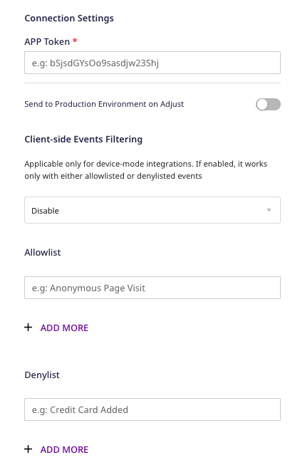
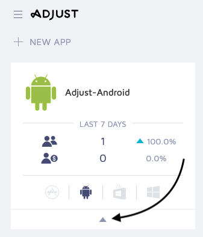
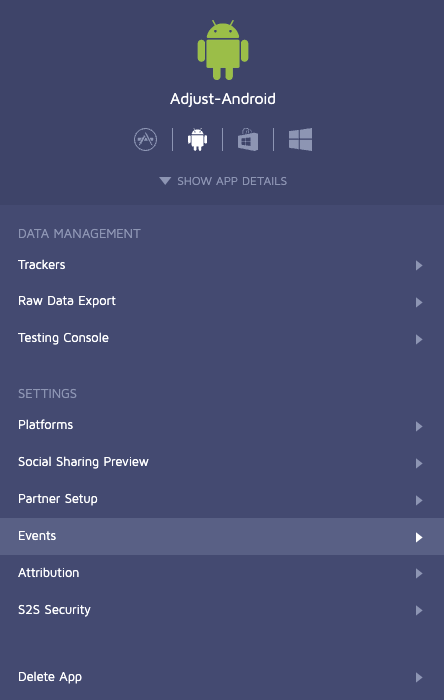

[Adjust](https://adjust.com) is an industry-leading mobile attribution provider that allows you to bring all your business data together to get powerful insights from it.

RudderStack supports Adjust as a destination to which you can seamlessly send your event data.

RudderStack allows you to configure your mobile devices with our SDKs to send your customer event data to Adjust - without any hassle. You can refer to the code for [Android]() and [iOS]() in the GitHub repository.

<div class="successBlock">
Find the open source transformer code for this destination in the <a href="https://github.com/rudderlabs/rudder-transformer/tree/master/v0/destinations/adj">GitHub repository</a>. You can also refer to the specific repositories for the <a href="https://github.com/rudderlabs/rudder-integration-adjust-android">Android</a> and <a href="https://github.com/rudderlabs/rudder-integration-adjust-ios">iOS</a> implementations.
</div>

## Getting started

Before configuring Adjust as a destination in RudderStack, verify if the source platform is supported by Adjust by referring to the table below:

| Connection Mode | Web       | Mobile    | Server    |
| :------------------ | :------------ | :------------ | :------------ |
| **Device mode**     | -             | **Supported** | -             |
| **Cloud mode**      | **Supported** | **Supported** | **Supported** |

<div class="infoBlock">
To know more about the difference between cloud mode and device mode in RudderStack, refer to the <Link to="/destinations/rudderstack-connection-modes/">RudderStack Connection Modes</Link> guide.
</div>

Once you have confirmed that the platform supports sending events to Adjust, follow these steps:

1. From your [RudderStack dashboard](https://app.rudderstack.com/), add the source. Then, from the list of destinations, select **Adjust**.
2. Assign a name to the destination and click **Continue**.

## Connection settings

To successfully configure Adjust as a destination, you will need to configure the following settings:




- **APP Token**: Enter your Adjust app token.

<div class="infoBlock">
For more information on obtaining your Adjust app token, refer to the <Link to="#faq">FAQ</Link> section below.
</div>

- **Send to Production Environment on Adjust**: Enable this setting to send the data to the <a href="https://help.adjust.com/en/article/server-to-server-events?src=search#:~:text=event%20currency%20code-,environment,-Environment%20to%20post">production environment</a> in Adjust. 

<div class="infoBlock">
By default, RudderStack sends the data in the sandbox environment.
</div>

<div class="infoBlock">
The <strong>Client-side Events Filtering</strong> setting is applicable only for the <Link to="/destinations/rudderstack-connection-modes/#device-mode">device mode</Link> integrations. It lets you specify which events should be blocked or allowed to flow through to Adjust. For more information, refer to the <Link to="https://www.rudderstack.com/docs/sources/sdks/event-filtering/">Client-side Events Filtering</Link> guide.
</div>

- **Map events to Adjust Event Tokens**: This setting lets you map the RudderStack events to Adjust's [event tokens](https://help.adjust.com/en/article/basic-event-setup#create-an-event-token).

<div class="infoBlock">
For more information on creating an event token in Adjust, refer to the <Link to="#faq">FAQ</Link> section below.
</div>

- **Map Rudderstack Parameters to Partner Parameters**: This setting lets you map your event properties to specific Adjust [partner parameters](https://help.adjust.com/en/article/event-tracking-ios-sdk?src=search_page#partner-parameters).
- **Delay Time before SDK initialization**: Use this setting to initiate a delay in loading the SDK for the first time.

<div class="infoBlock">
For more information on delaying the SDK's first launch, refer to the <a href="https://help.adjust.com/en/article/ios-sdk-adjconfig-class?src=search#delay-launch">Adjust documentation</a>.
</div>

<div class="warningBlock">
Do not add native Adjust SDK to your project as it will prevent you from successful integration.
</div>

## Adding device mode integration

Follow the below steps to add Adjust to your project depending on your integration platform:

<Tabs>
  <TabList>
    <Tab>iOS</Tab>
    <Tab>iOS v2</Tab>
    <Tab>Android</Tab>
    <Tab>Unity</Tab>
  </TabList>
    <TabPanels>
      <TabPanel>
        To add Adjust to your iOS project, please follow these steps:
<ol>
<li>Add the following line to your <a href="https://cocoapods.org">CocoaPods</a> <code class="inline-code">Podfile</code>
<span>

```ruby
pod 'Rudder-Adjust'
```
</span>
</li>
<li>After adding the dependency, you must register the <code class="inline-code">RudderAdjustFactory</code> with your <code class="inline-code">RudderClient</code> initialization as a <code class="inline-code">factory</code> of <code class="inline-code">RudderConfig</code>. To do this, run the following command to import the <code class="inline-code">RudderAdjustFactory.h</code> file in your <code class="inline-code">AppDelegate.m</code> file.
<span>

```objectivec
#import <Rudder-Adjust/RudderAdjustFactory.h>
```
</span>
</li>
<li>Then, change the SDK initialization to the following:
<span>

```objectivec
RudderConfigBuilder *builder = [[RudderConfigBuilder alloc] init];
[builder withDataPlaneUrl:DATA_PLANE_URL];
[builder withFactory:[RudderAdjustFactory instance]];
[RudderClient getInstance:WRITE_KEY config:[builder build]];
```
</span>
</li>
</ol>
      </TabPanel>
      <TabPanel>
       <div class="warningBlock">
          This device mode integration is supported for Adjust v4.29.7 and above.
        </div>
        To add Adjust to your iOS project, follow these steps:
<ol>
<li>Install <code class="inline-code">RudderAdjust</code> (available through <a href="https://cocoapods.org/">CocoaPods</a>) by adding the following line to your <code class="inline-code">Podfile</code>:
<span>

```ruby
pod 'RudderAdjust', '~> 1.0.0'
```
</span>
</li>
<li>Run the <code class="inline-code">pod install</code> command. </li>
<li>Next, import the SDK depending on your preferred platform:
<span>

```swift
import RudderAdjust
```
</span>

<span>

```objectivec
@import RudderAdjust;
```
</span>
</li>
<li>Add the imports to your <code class="inline-code">AppDelegate</code> file under the <code class="inline-code">didFinishLaunchingWithOptions</code> method, as shown:
<span>

```swift
let config: RSConfig = RSConfig(writeKey: WRITE_KEY)
            .dataPlaneURL(DATA_PLANE_URL)
        
RSClient.sharedInstance().configure(with: config)
RSClient.sharedInstance().addDestination(RudderAdjustDestination())
```
</span>

<span>

```objectivec
RSConfig *config = [[RSConfig alloc] initWithWriteKey:WRITE_KEY];
[config dataPlaneURL:DATA_PLANE_URL];

[[RSClient sharedInstance] configureWith:config];
[[RSClient sharedInstance] addDestination:[[RudderAdjustDestination alloc] init]];
```
</span>
</li>
</ol>
      </TabPanel>
      <TabPanel>
        To add Adjust to your Android project, follow these steps:
<ol>
<li>Add <code class="inline-code">mavenCentral()</code> to the <code class="inline-code">repositories</code> section of your <code class="inline-code">build.gradle</code> file:
<span>

```groovy
repositories {
  mavenCentral()
}
```
</span>
</li>
<li>Add the following permissions to your <code class="inline-code">AndroidManifest.xml</code> file:
<span>

```groovy
<uses-permission android:name="android.permission.INTERNET"/>
<uses-permission android:name="android.permission.ACCESS_NETWORK_STATE"/>
// If you are not targeting the Google Play Store, you need to add the following permission:
<uses-permission android:name="android.permission.ACCESS_WIFI_STATE"/>
// If you are targeting Android 13 and above (API level 33), you need to add the com.google.android.gms.AD_ID permission to read the device's advertising ID.
<uses-permission android:name="com.google.android.gms.permission.AD_ID"/>
```
</span>
</li>
<li>Add the following lines in your <code class="inline-code">build.gradle</code> file under <code class="inline-code">dependencies</code>:
<span>

```groovy
// RudderStack Android-SDK 
implementation 'com.rudderstack.android.sdk:core:[1.0,2.0)'
// RudderStack Adjust-SDK
implementation 'com.rudderstack.android.integration:adjust:1.0.1'
// Add Google Play Services library to enable the Google Advertising ID for Adjust SDK
implementation 'com.google.android.gms:play-services-ads-identifier:17.0.1'
// To support the Google Play Referrer API, make sure you have the following in your build.gradle file:
implementation 'com.android.installreferrer:installreferrer:2.2'
```
</span>

<div class="infoBlock">

For more information on the implementation <code class="inline-code">com.google.android.gms:play-services-ads-identifier:17.0.1</code>, refer to this [Adjust help guide](https://help.adjust.com/en/article/get-started-android-sdk#add-google-play-services).
</div>
</li>
<li>After adding the dependency, register the <code class="inline-code">RudderAdjustFactory</code> with your <code class="inline-code">RudderClient</code> initialization as a <code class="inline-code">factory</code> of <code class="inline-code">RudderConfig</code>. To do so, add the following line in your <code class="inline-code">Application</code> class:
<span>

```java
import com.rudderstack.android.integration.adjust.AdjustIntegrationFactory;
```
</span>
</li>
<li>Finally, change the SDK initialization to the following:
<span>

```kotlin
val rudderClient: RudderClient = RudderClient.getInstance(
    this,
    WRITE_KEY,
    RudderConfig.Builder()
        .withDataPlaneUrl(DATA_PLANE_URL)
        .withFactory(AdjustIntegrationFactory.FACTORY)
        .build()
)
```
</span>
</li>
</ol>
      </TabPanel>
      <TabPanel>
        To enable Adjust to track your game event data through RudderStack, follow these steps:
<ol>
<li>First, add RudderStack's Unity SDK to your project.

<div class="infoBlock">
Follow the <Link to ="/sources/sdks/rudderstack-unity-sdk/">RudderStack Unity SDK</Link> guide for more information.
</div>
</li>
<li>Once you have added the SDK to your project, download the <a href="https://github.com/rudderlabs/rudder-sdk-unity/tree/master/Integrations/Adjust/RudderAdjust">Adjust SDK extension package</a> from GitHub and import it in your project.

<div class="warningBlock">
The package comes with Adjust Unity SDK embedded in it along with the required <code class="inline-code">jar</code> files for Android Install Referrer. It is <strong>not recommended</strong> to add the Adjust SDK separately.
</div>
</li>
<li>After importing the <code class="inline-code">rudder-unity-extension-adjust.unitypackage</code> to your project, attach the <code class="inline-code">RudderPreferbs.prefab</code> file from <code class="inline-code">RudderUnityPlugin</code> to your main <code class="inline-code">GameObject</code>
</li>
<li>Finally, change the initialization of the SDK using the following code:
<span>

```csharp
// Build your config
RudderConfigBuilder configBuilder = new RudderConfigBuilder()
    .WithEndPointUrl(DATA_PLANE_URL)
    .WithFactory(RudderAdjustIntegrationFactory.GetFactory());

// Get instance for RudderClient
RudderClient rudderClient = RudderClient.GetInstance(
    WRITE_KEY,
    configBuilder.Build()
);
```
</span>
</li>
</ol>
      </TabPanel>
    </TabPanels>
</Tabs>

## Identify

When you call `identify` for tracking user data, RudderStack will call Adjust's [`addSessionPartnerParameter`](https://github.com/adjust/ios_sdk#session-partner-parameters) method to set `anonymousId` and/or `userId` so that the value is passed from Adjust to the subsequent calls.

Here is an example:

```objectivec
[[RudderClient sharedInstance] identify:@"developer_user_id"
                                 traits:@{@"foo": @"bar", @"foo1": @"bar1"}];
```

## Track

When you make the `track` call, RudderStack maps the `eventName` with the pre-defined list of custom events from Adjust.

<div class="warningBlock">
You must define the map of Adjust <code class="inline-code">eventToken</code> to <code class="inline-code">eventName</code> in the dashboard. If you don't define the mapping Adjust will not accept the event.
</div>

We add all the properties as `callbackParameter` in the Adjust event.

The following snippet is a simple demonstration of the `track`call:

```objectivec
[[RudderClient sharedInstance] track:@"test_event"
                          properties:@{@"key":@"value", @"foo": @"bar"}];
```

For `revenue` event, add the fields `total` and `currency` to `properties` and it will be mapped to Adjust's `revenue` event.

```objectivec
[[RudderClient sharedInstance] track:@"purchase"
                          properties:@{@"total":@2.99, @"currency": @"USD"}];
```

## Reset

if you call `reset` method, RudderStack will call [`resetSessionCallbackParameters`](https://github.com/adjust/ios_sdk#session-callback-parameters) of the Adjust SDK to reset the user ID as well as the associated traits and properties of that user.

```objectivec
[[RudderClient sharedInstance] reset];
```

## Install attribution

Adjust's native SDK handles install attribution out of the box with RudderStack. For testing Install Attribution as well as troubleshooting tips, please follow [this guide](https://help.adjust.com/resources/testing-console).

<div class="warningBlock">
Install Attribution is not supported in <code class="inline-code">cloud-mode</code>
</div>

## Environment and logging

The Adjust environment depends on the `RudderLogLevel`. `RudderLogLevel.DEBUG` or higher will set the environment to `Sandbox` and `logLevel` to `VERBOSE` . For anything below that, the environment will be set to `Production` and `logLevel` to `ERROR`.

## FAQ

### Where can I find the Adjust app token?

To get your Adjust app token, follow these steps:

1. Log into your [Adjust dashboard](https://dash.adjust.com/#/).
2. Find your app and select the app options caret (^), as shown:



3. You will find your app token listed here.


### How can I create a new event token in Adjust?

To create a new event token, follow these steps:

1. Log into your [Adjust dashboard](https://dash.adjust.com/#/).
2. Find your app and select the app options caret (^), as shown:


3. Go to **All Settings** > **Events**, as shown:



4. Under **CREATE NEW EVENT**, enter the name of the event token and click **CREATE**.

## Contact us

For queries on any of the sections covered in this guide, you can [contact us](mailto:%20docs@rudderstack.com) or start a conversation in our [Slack](https://rudderstack.com/join-rudderstack-slack-community) community.
