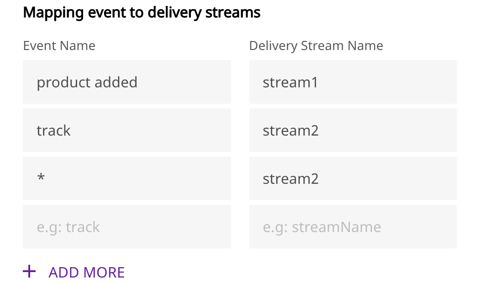

[Amazon Kinesis Firehose](https://aws.amazon.com/kinesis/data-firehose/) gives you an easy and reliable way to load your streaming data into data lakes, data stores, and a host of other analytics tools. It is a fully-managed service that can be scaled automatically to match the load and throughput of your data, without requiring any additional administration.

RudderStack supports Amazon Kinesis Firehose as a destination where you can seamlessly send your event data.

<div class="infoBlock">
Find the open source code for this destination in the <a href="https://github.com/rudderlabs/rudder-transformer/tree/master/v0/destinations/firehose">GitHub repository</a>.
</div>

## Getting started

RudderStack supports sending event data to Kinesis Firehose via the following <Link to="/rudderstack-cloud/rudderstack-connection-modes/">connection modes</Link>:

| **Connection Mode** | **Web**       | **Mobile**    | **Server**    |
| :------------------ | :------------ | :------------ | :------------ |
| **Device mode**     | -             | -             | -             |
| **Cloud mode**      | **Supported** | **Supported** | **Supported** |

Once you have confirmed that the source platform supports sending events to Kinesis Firehose, follow these steps:

1. From your RudderStack dashboard, add the source. Then, from the list of destinations, select **Amazon Kinesis Firehose**.
2. Assign a name to your destination and click **Continue**.

### Connection settings

To successfully set up Kinesis Firehose as a destination, you need to configure the following settings:

- **AWS Region**: Enter the AWS region in which you have created the Kinesis Firehose stream. This is a required field.
 **Role-based Authentication**: Enable this setting to use the RudderStack IAM role for authentication. For more information on creating a AWS IAM role for RudderStack, refer to <Link to="/destinations/aws-iam-role-for-rudderstack/#creating-a-rudderstack-iam-role">this guide</Link>.
  - **IAM Role ARN**: Enter the ARN of the IAM role.

<div class="warningBlock">
It is highly recommended to enable this setting as the access keys-based authentication will be deprecated in the future.
</div>

- If **Role-based Authentication** is disabled, you need to enter the **AWS Access Key ID** and **AWS Secret Access Key** to authorize RudderStack in order to write to the configured stream. Refer to the <Link to="#policy-permissions">Policy permissions</Link> section below for more information on specifying the required permissions to write to your Kinesis Firehose stream.
- **Mapping event to delivery streams**: Use this setting to map the RudderStack  **Event Name** to a Kinesis Firehose **Delivery Stream**.

## Sending events to Kinesis Firehose

RudderStack supports sending `identify`, `page`, and `track` events to specific Kinesis Firehose streams by configuring them in the dashboard.

You can also send an event `type` as `page`, `identify`, or `track`. For the `track` events, you can specify the event name based on the event name in the payload. For example:

- If the event name is `page`, RudderStack sends all the events with the `type` set to `page`.
- If event name is `Product Added` , RudderStack sends all the track events with the `event` as `Product Added`.

<div class="infoBlock">
To send all the events to a particular stream irrespective of the type or name, you can use <code class="inline-code">*</code> as the event name in the dashboard settings.
</div>

<div class="warningBlock">
Note that the field <strong>Delivery Stream Name</strong> is case sensitive and has to be specified exactly as named in AWS. On the other hand, the <strong>Event Name</strong> field is not case sensitive, and thus RudderStack does not differentiate between <code class="inline-code">Page</code> or <code class="inline-code">page</code> before sending it to the Firehose stream.
</div>

## Policy permissions

To use the Firehose destination with RudderStack correctly, you must have a Firehose stream created in AWS. For more information on creating a Kinesis Firehose data delivery stream, refer to this <a href="http://docs.aws.amazon.com/firehose/latest/dev/basic-create.html">AWS documentation</a>. 

You also need to create an IAM role and attach the policy containing the necessary permissions (`PutRecord`) for RudderStack to write to the stream. 

- To create an IAM role, follow the instructions on [Creating an IAM role](http://docs.aws.amazon.com/IAM/latest/UserGuide/id_roles_create_for-user.html#roles-creatingrole-user-console).
- For more information on creating an IAM policy, refer to this <a href="http://docs.aws.amazon.com/IAM/latest/UserGuide/access_policies_create.html">AWS documentation</a>.

A sample permissions policy that allows a user to put event data into Kinesis Firehose is shown below:

```javascript
{
  "Version": "2012-10-17",
  "Statement": [
    {
      "Effect": "Allow",
      "Action": [
        "firehose:PutRecord"
      ],
      "Resource": [
        "arn:aws:firehose:{region}:{account-id}:stream/{stream-name}"
      ]
    }
  ]
}
```

## FAQ

### How does event mapping work with the delivery stream?

- If there is no delivery stream set for an event in the dashboard settings, RudderStack will not send the event to the Firehose stream.
- If an event is set with a delivery stream, RudderStack sends the payload to the configured delivery stream.
- If you have set the event `type`, **Event Name**, and `*` for mapping purposes, RudderStack gives the topmost priority to event name, followed by `type`, and then `*`.  For example. let the type of event be `track` and **Event Name** be `Product Added`. RudderStack does the mapping as shown:



Then all the events go to the stream mapped with `Product Added`.