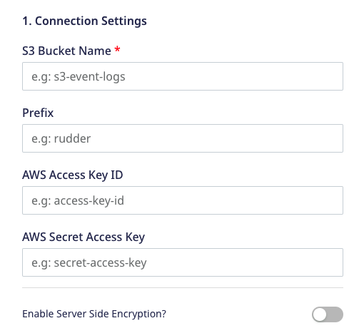
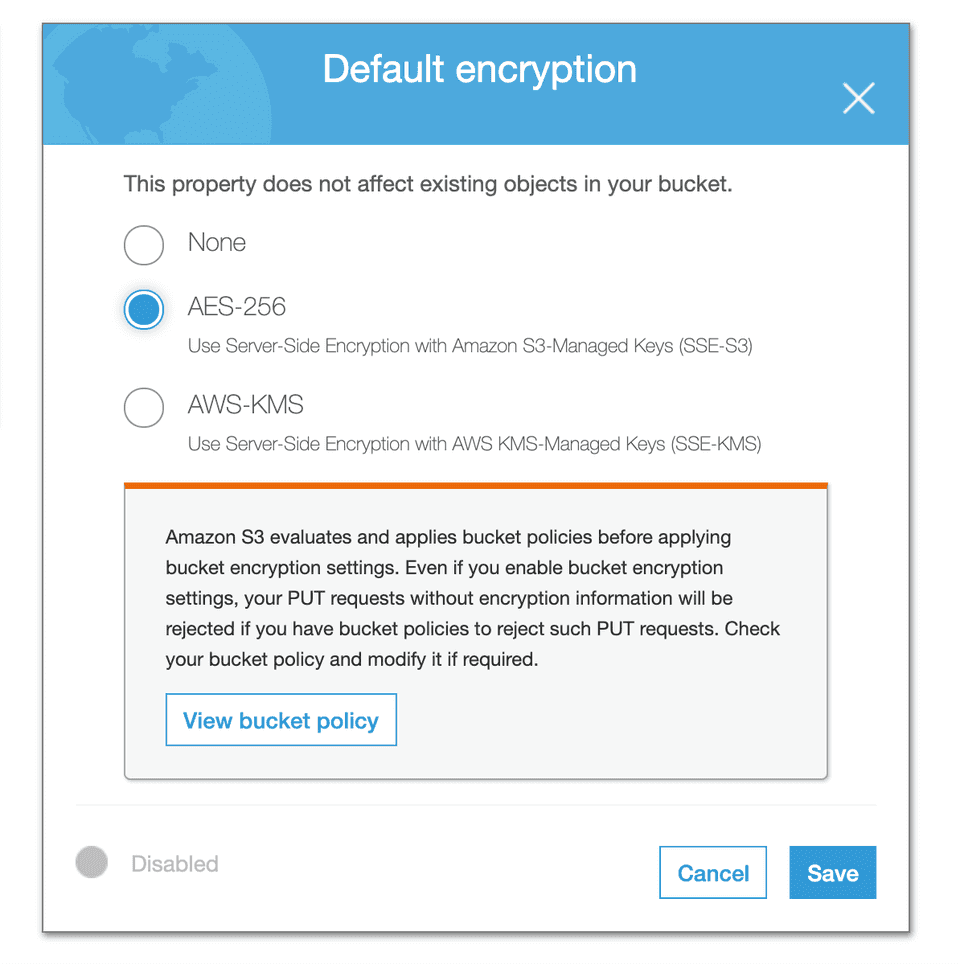

[Amazon S3](https://aws.amazon.com/s3/) (Simple Storage Service) is a cloud-based object storage service that allows customers and businesses to store their data securely and at scale.

RudderStack lets you configure Amazon S3 as a destination where you can seamlessly store your event data.

<div class="infoBlock">
Find the open source transformer code for this destination in the <a href="https://github.com/rudderlabs/rudder-transformer/tree/master/v0/destinations/s3">GitHub repository</a>.
</div>

## Setting up Amazon S3

Follow these steps to set up your S3 bucket before adding it as a destination in RudderStack:

1. Login to your [Amazon AWS S3 console](https://aws.amazon.com/console/).
2. Create a new bucket. Alternatively, you can also choose an already-existing bucket.

## Permissions

There are three ways to give RudderStack the relevant permissions for writing in your bucket. You can choose any one of them based on your internal security policies.

### Option 1: Creating credentials for the IAM user

This option involves creating the necessary user credentials and providing them in the S3 destination setup in RudderStack.

1. Login to your [Amazon AWS IAM Console](https://console.aws.amazon.com/iam/home?region=us-east-1).
2. Create an IAM user with the programmatic access and choose a policy that has **write** access to your bucket. Here is a sample reference for the policy:

```json
{
  "Version": "2012-10-17",
  "Statement": [
    {
      "Effect": "Allow",
      "Action": "s3:PutObject",
      "Resource": "arn:aws:s3:::YOUR_BUCKET_NAME/*"
    }
  ]
}
```

3. Make a note of both **access key ID** and **secret access key**, as these credentials will be required while configuring S3 as a destination in RudderStack.

<div class="successBlock">
If the AWS credentials are already configured on your instance where the RudderStack server is set up, you will not need the security credentials.
</div>

### Option 2: Allow RudderStack user to write into the bucket

To allow the RudderStack user to write into your bucket, add the following JSON in your bucket policy:

```json
{
  "Version": "2012-10-17",
  "Statement": [
    {
      "Effect": "Allow",
      "Principal": {
        "AWS": "arn:aws:iam::422074288268:user/s3-copy"
      },
      "Action": ["s3:PutObject", "s3:PutObjectAcl"],
      "Resource": ["arn:aws:s3:::YOUR_BUCKET_NAME/*"]
    }
  ]
}
```
<div class="warningBlock">
Make sure you replace <code class="inline-code">YOUR_BUCKET_NAME</code> in the above JSON with your S3 bucket name.
</div>

By adding the above policy, the RudderStack user `arn:aws:iam::422074288268:user/s3-copy` will get the permission to write into your bucket.

<div class="infoBlock">
The above approach works <strong>only if</strong> you are using RudderStack Cloud (dashboard). 
</div>

### Option 3: For self-hosting RudderStack

If you are hosting RudderStack in your own instance and don't want to follow the above method, then you need to follow these steps:

1. Create a new IAM user with programmatic access and attach the below policy:

```json
{
  "Version": "2012-10-17",
  "Statement": [
    {
      "Effect": "Allow",
      "Action": "*",
      "Resource": "arn:aws:s3:::*"
    }
  ]
}
```

2. Then, add the following policy to your bucket and replace `ACCOUNT_ID`, `USER_ARN`, and `BUCKET_NAME` with the AWS account ID and the user ARN for the above-created user, and the S3 bucket name.

```json
{
  "Version": "2012-10-17",
  "Statement": [
    {
      "Effect": "Allow",
      "Principal": {
        "AWS": "arn:aws:iam::ACCOUNT_ID:user/USER_ARN"
      },
      "Action": ["s3:PutObject", "s3:PutObjectAcl"],
      "Resource": ["arn:aws:s3:::BUCKET_NAME/*"]
    }
  ]
}
```

3. Finally, add the programmatic access credentials for the above-created IAM user to the environment of your RudderStack setup, as shown:

```markup
RUDDER_AWS_S3_COPY_USER_ACCESS_KEY_ID=<access_key_id>
RUDDER_AWS_S3_COPY_USER_ACCESS_KEY=<secret_access_key>
```

### S3 permissions for warehouse destinations

If you're using your S3 bucket as an **intermediary object storage** for a <Link to="/destinations/warehouse-destinations/">warehouse destination</Link>, then you will need to set the following bucket permissions:

```json
"Action": [
    "s3:GetObject",
    "s3:PutObject",
    "s3:PutObjectAcl",
    "s3:ListBucket"
]
```

## Configuring S3 destination in RudderStack

Follow these steps to set up S3 as a destination in RudderStack:

1. From your [RudderStack dashboard](https://app.rudderstack.com/), add a source. Then, from the list of destinations, select **Amazon S3**.
2. Assign a name to the destination and click on **Continue**.

### Connection settings

In the **Connection Settings** page, enter the following settings to configure the S3 destination: 



- **S3 Bucket Name**: Enter your S3 bucket name.
- **Prefix**: If specified, RudderStack creates a folder in the bucket with this name and pushes all the data within that folder. For example, `s3://<bucket_name>/<prefix>/`
- **AWS Access Key ID**: Enter the AWS access key ID associated with the IAM user with the programmatic access.
- **AWS Secret Access Key**: Enter the AWS secret key.

<div class="infoBlock">
Refer to the <Link to="#permissions">Permissions</Link> section above for more information on obtaining the access key ID and secret access key.
</div>

- **Enable Server Side Encryption**: When this setting is enabled, RudderStack adds a header `x-amz-server-side-encryption` with the value `AES256` to the `PutObject` request when sending the data to the S3 bucket.

<div class="infoBlock">
If the AWS credentials are already configured in your RudderStack setup via the <a href="https://docs.aws.amazon.com/sdk-for-go/v1/developer-guide/configuring-sdk.html#specifying-credentials">environment credentials</a> or by following these <Link to="#permissions">steps</Link>, you can skip adding the credentials in this step. Only the <strong>S3 Bucket Name</strong> is required to set up the destination.
</div>

## Encryption

Amazon S3 provides encryption at rest. The object gets encrypted while saving it to the S3 bucket and is decrypted before downloading from S3. 

S3 provides a way to set the default encryption behavior for a bucket. You can set the default encryption on a bucket from its properties. The objects are encrypted using server-side encryption with either Amazon S3-managed keys (SSE-S3) or AWS Key Management Service (AWS KMS) customer managed keys (CMKs), as shown:



### Server-side encryption using AWS KMS (SSE-KMS)

RudderStack can write to S3 buckets when the default encryption is set to AWS-KMS. The objects are encrypted using the customer managed keys (CMK) when uploaded to the bucket. A CMK can be created in your AWS Key Management Service (KMS). 

Follow the steps below to enable encryption using the AWS KMS-managed keys:

1. Create a new customer-managed key in AWS Key Management Services (KMS) and add your IAM user in the **Key Usage Permission** section. This will allow the IAM user to use the key for the cryptographic operations.
2. Select the above-created CMK when you set the AWS-KMS option in the default encryption property for the bucket, as seen above.

<div class="infoBlock">
S3 supports only <a href="https://docs.aws.amazon.com/kms/latest/developerguide/symm-asymm-concepts.html#symmetric-cmks">symmetric CMKs</a>.
</div>

### Server-side encryption using Amazon S3-managed Keys (SSE-S3)

When the **Enable Server Side Encryption** is enabled in the S3 destination settings, RudderStack adds a header `x-amz-server-side-encryption` with the value `AES256` to the `PutObject` request. S3 then encrypts the object with the AES256 encryption algorithm. 

<div class="infoBlock">
For more information on the Amazon S3 encryption, refer to the <a href="https://docs.aws.amazon.com/AmazonS3/latest/dev/SSEUsingRESTAPI.html">Amazon S3 documentation</a>.
</div>

You can set the default encryption property to `AES-256` for your bucket as seen in the <Link to="#encryption">Encryption</Link> section above.

S3 will then encrypt the object when it is uploaded in the bucket, irrespective of whether the **Enable Server Side Encryption** is enabled in the RudderStack dashboard, or the header `x-amz-server-side-encryption` is present.


