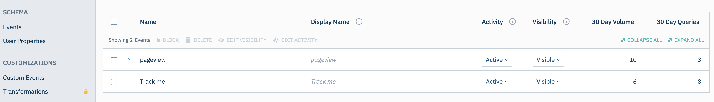
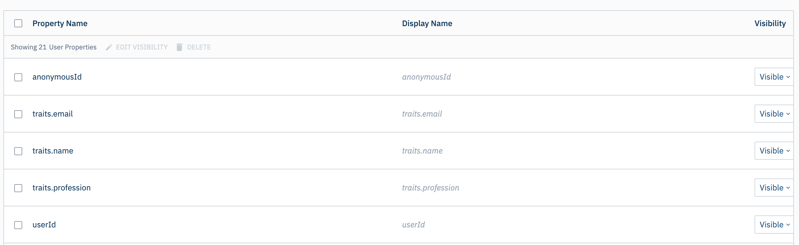

[Amplitude](https://amplitude.com) is a comprehensive product analytics service for web and mobile platforms. 12,000+ companies use Amplitude to get marketing insights that drive product strategy, conversion, and customer retention.

RudderStack provides native libraries for Amplitude integrations for the following languages:

  - [Android](https://github.com/rudderlabs/rudder-integration-amplitude-android)
  - [iOS: Obj-C](https://github.com/rudderlabs/rudder-integration-amplitude-ios)
  - [iOS: Swift](https://github.com/rudderlabs/rudder-integration-amplitude-swift)


## Getting started

The Amplitude destination supports `alias`, `group`, `identify`, `page`, `screen`, and `track` calls.

Before configuring Amplitude as a destination in RudderStack, confirm that your source is supported by Amplitude by referring to the table below. See <Link to="/destinations/rudderstack-connection-modes/">connection modes</Link> for details.

| **Connection Mode** | **Web**       | **Mobile**    | **Server**    |
| :------------------ | :------------ | :------------ | :------------ |
| **Device mode**     | **Supported** | **Supported** | -             |
| **Cloud mode**      | **Supported** | **Supported** | **Supported** |

## Connection Settings

1. If you haven’t already, first create a source in your [RudderStack dashboard](https://app.rudderstack.com/). Your source will be where you intend on sending data from. See <Link to="/dashboard-guides/sources">Sources</Link> to learn more.
2. Connect your source to Amplitude. You can do this directly from your source by navigating to **Overview** > **Add Destination** > **Create a New Destination**. Or, you can create the Amplitude destination first by navigating to **Destinations** > **New Destination** in your dashboard.
3. Verify that your desired source is supported by Amplitude by referencing the **Connection Modes** table above.
4. In the **Connection Settings** modal, provide the following information:

  - **Name**: Choose a name for your destination that will be easily identifiable later. Often, users like to include suffixes such as `-prod`, `-dev`, `-testing` to differentiate connection environments.
  - **API key**:  To find your API key, go to your project in Amplitude and look in the general tab. 
  - **Residency server**: Choose whether you want to connect to Amplitude’s Standard Server (US) or EU-based residency server.

<div class="infoBlock"> Save your <em>Secret Key</em> in a safe place if you plan on deleting users. You may want to consider this option for GDPR purposes. </div>

5. Choose the Connection Mode for each of your sources. This determines how your data will be routed from your source to your destination. Learn more about Cloud Mode vs. Device Mode <Link to="/destinations/rudderstack-connection-modes/">here</Link>. We recommend using cloud mode as you will have access to Transformations and more reliable performance (compared to device mode).
6. Press **Continue** to create your connection.
7. Review the Configuration Settings to ensure that you are OK with all of the default settings and/or to customize your settings further.
8. Once you are happy with your settings, toggle the **Enable** switch at the top of your Configurations page to begin sending events to Amplitude.

## Adding device mode integration

Once you add Amplitude as a destination in the [RudderStack dashboard](https://app.rudderstack.com/), follow these steps to add it to your project depending on your integration platform:

<Tabs>
  <TabList>
    <Tab>iOS</Tab>
    <Tab>iOS v2</Tab>
    <Tab>Android</Tab>
    <Tab>React Native</Tab>
    <Tab>Flutter</Tab>
  </TabList>
    <TabPanels>
      <TabPanel>
        Follow these steps to add Amplitude to your iOS project:
<ol>
<li>In your <code class="inline-code">Podfile</code>, add the <code class="inline-code">Rudder-Amplitude</code> extension, as shown:
<span>

```ruby
pod 'Rudder-Amplitude'
pod 'Amplitude', '~> 7.2.0'
```
</span>
</li>
<li>After adding the dependency followed by <code class="inline-code">pod install</code> , you can add the imports to your <code class="inline-code">AppDelegate.m</code> file as shown:
<span>

```objectivec
#import <Rudder/Rudder.h>
#import "RudderAmplitudeFactory.h"
// for using IDFA as device id, location listening only
#import <Amplitude/Amplitude.h>
```
</span>
</li>
<li>and also add the initialization of your <code class="inline-code">RSClient</code> as shown:
<span>

```objectivec
RSConfigBuilder *builder = [[RSConfigBuilder alloc] init];
[builder withDataPlaneUrl:DATA_PLANE_URL];
[builder withFactory:[RudderAmplitudeFactory instance]];
[RSClient getInstance:WRITE_KEY config:[builder build]];
```
</span>
</li>
<li>Add the below logic just after initializing <code class="inline-code">RudderClient</code> in <code class="inline-code">AppDelegate.m</code> if you would like to send <code class="inline-code">IDFA</code> of iOS device as <code class="inline-code">device id</code> to Amplitude

<div class="warningBlock">

Make sure that you enable <code class="inline-code">use IDFA as device id</code> under <code class="inline-code">iOS SDK settings</code> on dashboard.
</div>
<span>

```javascript
// for using IDFA as device id only
[Amplitude instance].adSupportBlock = ^{
    return [[ASIdentifierManager sharedManager] advertisingIdentifier];
};
```
</span>
</li>
<li>and then add the below logic if you would like to <code class="inline-code">track location</code> (latitude, longitude)
<span>

```javascript
[Amplitude instance].locationInfoBlock = ^{
        return @{
                @"lat" : @37.7,
                @"lng" : @122.4
              };
};
```
</span>
</li>
</ol>
      </TabPanel>
        <TabPanel>
          <div class="warningBlock">
          This device mode integration is supported for Amplitude v8.8.0 and above.
        </div>
        Follow these steps to add Amplitude to your iOS project:
<ol>
<li> Install <code class="inline-code">RudderAmplitude</code> (available through <a href="https://cocoapods.org/">CocoaPods</a>) by adding the following line to your <code class="inline-code">Podfile</code>:
<span>

```ruby
pod 'RudderAmplitude', '~> 1.0.0'
```
</span>
</li>
<li>Run the <code class="inline-code">pod install</code> command.</li>
<li>Then, import the SDK depending on your preferred platform:
<span>

```swift
import RudderAmplitude
```
</span>
<span>

```objectivec
@import RudderAmplitude;
```
</span>
</li>
<li>Next, add the imports to your <code class="inline-code">AppDelegate</code> file under the <code class="inline-code">didFinishLaunchingWithOptions</code> method, as shown:
<br /><br />
<span>

```swift
let config: RSConfig = RSConfig(writeKey: WRITE_KEY)
            .dataPlaneURL(DATA_PLANE_URL)
        
RSClient.sharedInstance().configure(with: config)
RSClient.sharedInstance().addDestination(RudderAmplitudeDestination())
```
</span>
<span>

```objectivec
RSConfig *config = [[RSConfig alloc] initWithWriteKey:WRITE_KEY];
[config dataPlaneURL:DATA_PLANE_URL];

[[RSClient sharedInstance] configureWith:config];
[[RSClient sharedInstance] addDestination:[[RudderAmplitudeDestination alloc] init]];
```
</span>
</li>
</ol>
      </TabPanel>
      <TabPanel>
        To add Amplitude to your Android Project please follow these steps :
<ol>
<li>Open your <code class="inline-code">app/build.gradle</code> (Module: app) file, and add the following under the <code class="inline-code">dependencies</code> section :
<span>

```javascript
implementation 'com.rudderstack.android.sdk:core:1.+'
implementation 'com.rudderstack.android.integration:amplitude:1.+'
implementation 'com.google.code.gson:gson:2.8.6'

// Amplitude
implementation 'com.amplitude:android-sdk:2.25.2'
implementation 'com.squareup.okhttp3:okhttp:4.2.2'

// For using Google Advertising Id as device id
implementation 'com.google.android.gms:play-services-ads:18.3.0'
```
</span>
</li>
<li>Add the following under <code class="inline-code">compileOptions</code> in the android tag :
<span>

```groovy
compileOptions {
    sourceCompatibility JavaVersion.VERSION_1_8
    targetCompatibility JavaVersion.VERSION_1_8
}
```
</span>
</li>
<li>Initialize the Rudder SDK in the <code class="inline-code">Application</code> class's <code class="inline-code">onCreate()</code> method as following:
<span>

```kotlin
// initializing Rudder SDK
val rudderClient = RudderClient.getInstance(
    this,
    WRITE_KEY,
    RudderConfig.Builder()
        .withDataPlaneUrl(DATA_PLANE_URL)
        .withFactory(AmplitudeIntegrationFactory.FACTORY)
        .build()
)
```
</span>
</li>
<li>If you would like to send <code class="inline-code">Google Advertising Id</code> of the device as <code class="inline-code">device id</code> to the Amplitude then add the below code in the <code class="inline-code">AndroidManifest.xml</code> of your app under <code class="inline-code">&lt;application&gt;</code> tag:

<div class="infoBlock">

Make sure that you enable <code class="inline-code">Use Advertising ID for Device ID</code> under <code class="inline-code">Android SDK settings</code> on the <a href="https://app.rudderstack.com">dashboard</a>
</div>

<span>

```javascript
<meta-data
  android:name="com.google.android.gms.ads.AD_MANAGER_APP"
  android:value="true"
/>
```
</span>

</li>
</ol>
      </TabPanel>
      <TabPanel>
        To add Amplitude to your React Native project:
<ol>
<li>Add the RudderStack-Amplitude module to your app using :
<span>

```bash
npm install @rudderstack/rudder-integration-amplitude-react-native
```
</span>
<span>

```bash
yarn add @rudderstack/rudder-integration-amplitude-react-native
```
</span>
</li>
<li>Open your <code class="inline-code">android/app/build.gradle</code> (Module: <code class="inline-code">app</code>) file, and add the following under <code class="inline-code">compileOptions</code> in the Android tag :
<span>

```groovy
compileOptions {
    sourceCompatibility JavaVersion.VERSION_1_8
    targetCompatibility JavaVersion.VERSION_1_8
}
```
</span>
</li>

<li>Import the module added above and add it to your SDK initialization code as shown:
<span>

```typescript
import rudderClient from "@rudderstack/rudder-sdk-react-native"
import amplitude from "@rudderstack/rudder-integration-amplitude-react-native"
const config = {
  dataPlaneUrl: DATA_PLANE_URL,
  trackAppLifecycleEvents: true,
  withFactories: [amplitude],
}
rudderClient.setup(WRITE_KEY, config)
```
</span>
</li>
</ol>
      </TabPanel>
<TabPanel>
Follow the below steps to add Amplitude to your Flutter Project:
<ol>
<li>Add the following dependency to the <code class="inline-code">dependencies</code> section of your <code class="inline-code">pubspec.yaml</code> file.
<span>

```yaml
rudder_integration_amplitude_flutter: ^1.0.1
```
</span>
</li>
<li>Run the below command to install the dependency added in the above step:
<span>

```groovy
flutter pub get
```
</span>
</li>
<li>Import the <code class="inline-code">RudderIntegrationAmplitudeFlutter</code> in your application where you are initializing the SDK.
<span>

```dart
import 'package:rudder_integration_amplitude_flutter/rudder_integration_amplitude_flutter.dart';
```
</span>
</li>

<li>Finally, change the initialization of your <code class="inline-code">RudderClient</code> as shown:
<span>

```dart
final RudderController rudderClient = RudderController.instance;
RudderConfigBuilder builder = RudderConfigBuilder();
builder.withFactory(RudderIntegrationAmplitudeFlutter());  
rudderClient.initialize(<WRITE_KEY>, config: builder.build(), options: null);
```
</span>
</li>
</ol>

<div class="infoBlock">
For iOS platform, make sure that the minimum deployment target for your application's target is at least 10.
</div>
      </TabPanel>
    </TabPanels>
</Tabs>

## Configuration Settings

Configure how you want your events to be sent to Amplitude directly in your RudderStack dashboard without touching any code.

### Page settings

This section allows you to set how you want your page calls to be sent to Amplitude. 


<div class="infoBlock">
These settings are only applicable when you’ve connected a source in web or mobile device mode. 
</div>


| Field                   | Description                                                                                                                                | Note                                                                             |   |   |
|-------------------------|--------------------------------------------------------------------------------------------------------------------------------------------|----------------------------------------------------------------------------------|---|---|
| Track all pages         | Toggling this on will send all pageview events to Amplitude with either `Loaded a page` or `Viewed a screen` event names                      |                                                                                  |   |   |
| Track categorized pages | With this on, any page call with a category will be sent to Amplitude as either a `Loaded {Category} Page` or `Viewed {Category} Screen` event |                                                                                  |   |   |
| Track named pages       | With this on, any page call with a name will be sent to Amplitude as either a `Loaded {Name} Page` or `Viewed {Name} Screen` event             | If `name` is absent, then the event is sent as `Loaded a page` or `Viewed a screen`   |   |   |

We suggest checking your event volume setup with Amplitude prior to configuring this section.

If multiple settings are enabled, then multiple events may be sent for a single `page`/`screen` call. For example, if both `Track categorized page` and `Track named page` settings are enabled, one `Viewed {name} page` / `Viewed {name} Screen` and one `Viewed {category} page` / `Viewed {category} Screen` event will be generated for a single page/screen call.


### Identify & Group settings

This section allows you to set how you want your Group or Identify call user properties to be sent to Amplitude


| Field                         | Description                                                                                                                                                                                                                                                                                                                               | Note                                                          |   |   |
|-------------------------------|-------------------------------------------------------------------------------------------------------------------------------------------------------------------------------------------------------------------------------------------------------------------------------------------------------------------------------------------|---------------------------------------------------------------|---|---|
| Group type trait              | Specify the group type to send as `groupType` in your group calls to Amplitude. Examples of a group type could be: Org ID, Org Name, or Industry.                                                                                                                                                                                     |                                                               |   |   |
| Group value trait             | Specify the group value to send as `groupValue` in your group calls to Amplitude. This would be a specific value of the group type. For example, if you set group_type: "industry", group_value might be "retail".                                                                                                                    |                                                               |   |   |
| Identify: traits to increment | Set the traits to increment on an `identify` call. These traits will then be incremented by the numerical value associated with the trait in your `identify` call.                                                                                                                                                                        |                                                               |   |   |
| Identify: traits to set once  | Specify the traits where you want to set values only once, which prevents overriding the property value.                                                                                                                                                                                                                              |                                                               |   |   |
| Identify: traits to append    | Append a value or multiple values to a user property array. If the corresponding trait does not have a value set yet, it will be initialized to an empty list before the new values are appended. If the corresponding trait has an existing value and it is not a list, it will be converted into a list with the new value appended. | Supported for all connection modes except for web device mode |   |   |
| Identify: traits to prepend   | Prepend a value or multiple values to a user property array. If the corresponding trait does not have a value set yet, it will be initialized to an empty list before the new values are prepended. If the corresponding trait has an existing value and it is not a list, it will be converted into a list with the new value prepended. | Supported for all connection modes except for web device mode |   |   |

## Other settings: 

### Amplitude IT

| Field            | Description                                                                                                                                                                    | Note                               |   |   |
|------------------|--------------------------------------------------------------------------------------------------------------------------------------------------------------------------------|------------------------------------|---|---|
| Version name     | Assign a version name for your page, and we'll send it to Amplitude for more detailed events                                                                                   | Only supported for web device mode |   |   |
| Map device brand | Capture brand, manufacturer, and model information for mobile devices. Amplitude computes `device_family` as `device_family: {device_brand} {device_manufacturer} {device_model}` |                                    |   |   |
|                  |                                                                                                                                                                                |                                    |   |   |


### Client-side events filtering

RudderStack's <Link to="/sources/event-streams/sdks/event-filtering">client-side event filtering</Link> feature lets you specify which events should be discarded or allowed to flow through by allowlisting or denylisting them. 

<div class="infoBlock">
This is only applicable for destinations that are connecting in device mode and implementing track calls. For mobile SDKs, it also applies to the following application lifecycle events: installed, opened, backgrounded, updated.
</div>

1. Select whether you would like to turn on events filtering.
    - The default setting is **No events filtering**, meaning that no filters are applied and RudderStack will allow all events to flow through.
    - Select **Allowlist** if you would like to be able to specify the names of the events that you want RudderStack to allow to flow through to the destination. Any events you do not list in the subsequent modals will be blocked.
    - Select **Denylist** if you would like to be able to specify the names of the events that you want RudderStack to block from flowing to the destination. Any events you do not list in the subsequent modals will be allowed to flow through to the destination.
2. Input event names to **Allowlist** (only possible if Allowlist was selected above): provide the event name(s) you would like to allow to flow through to the destination. Input one event name per line, and click **add more** for each additional event name you would like to add to the list. Note that any event names that you do not add to this list will be blocked.
3. Input event names to **Denylist** (only possible if Denylist was selected above): provide the event name(s) you would like to block from flowing to the destination. Input one event name per line, and click **add more** for each additional event name you would like to add to the list. Note that any event names that you do not add to this list will be allowed to flow through to the destination.

### OneTrust cookie categories

OneTrust is a popular consent management platform that provides data governance, privacy management, and security solutions to thousands of businesses worldwide. 

RudderStack’s Javascript SDK integrates seamlessly with the OneTrust SDK. It lets you map the OneTrust cookie/consent groups to RudderStack's consent purposes. RudderStack, in turn, uses this consent information to enable/disable tracking and sending the data.

To use this feature, please ensure that you have activated the integration by following the steps outlined here.

| Field         | Description                                                                                    | Note                              |
|---------------|------------------------------------------------------------------------------------------------|-----------------------------------|
| Category name | Input the consent category name(s) defined when you set up OneTrust for your JavaScript source | Insert one category name per line |

See <Link to="/sources/event-streams/sdks/rudderstack-javascript-sdk/onetrust-consent-manager">OneTrust Consent Manager</Link> in our JavaScript SDK docs to learn more.

### Ecommerce settings

These settings allow you to define how you want your `Order Completed` events to be passed to Amplitude.

| Field                          | Description                                                                                                                                                                                                                                    | Note                                           |   |   |
|--------------------------------|------------------------------------------------------------------------------------------------------------------------------------------------------------------------------------------------------------------------------------------------|------------------------------------------------|---|---|
| Track products as single event | Turn this on to track an array of products as a single event. The event will be passed as the original event name, and all the products as properties. Otherwise, each product is tracked as a separate event with the name `Product purchased`. | This feature is only supported for cloud mode. |   |   |
| Track revenue per product      | Turn this on to track the revenue of each product in an event individually. Otherwise, the event will be sent as an aggregate revenue of all products                                                                                         | This feature is only supported for cloud mode. |   |   |

## SDK settings

These settings allow you to customize the Amplitude SDK. Remember to also follow these steps to add the Amplitude SDK to your project.

### Web

If you are connecting to Amplitude in web device mode, these settings allow you to configure Amplitude’s native web SDK.

| Field                                                  | Description                                                                                                                                                                                                                                                   | Note                                                                 |   |   |
|--------------------------------------------------------|---------------------------------------------------------------------------------------------------------------------------------------------------------------------------------------------------------------------------------------------------------------|----------------------------------------------------------------------|---|---|
| Set device ID from URL parameter                       | Turning this on will set the device ID by parsing the URL parameter from `amp_device_ID`.                                                                                                                                                                   |  Web device mode only                                 |   |   |
| Force HTTPS                                            | Turning this on will upload events to the HTTPS endpoint. Otherwise, it will use the embedding site’s protocol.                                                                                                                                         |  Web device mode only                                 |   |   |
| Track GCLID                                            | When on, this captures the GCLID URL parameters along with the user's initial_gclid parameters                                                                                                                                                                |  Web device mode only                                 |   |   |
| Track referrer information                             | When on, this captures the user's referrer, initial referrer, and referring domain as user properties                                                                                                                                                         |  Web device mode only                                 |   |   |
| Track UTM properties                                   | When on, this captures the UTM parameters as user properties by either parsing the query string or from the _utmz cookie                                                                                                                                      |  Web device mode only                                 |   |   |
| Save referrer, UTM params, GCLID only once per session | When on, this tracks referrer, UTM parameters, and GCLID only once per session, ignoring any new values which may enter a user’s session                                                                                                                      |  Web device mode only                                 |   |   |
| Reset referrer or UTM params for new sessions          | Turning this on will set referrer and utm_parameter properties to null upon instantiating a new session; otherwise, existing referrer and utm_parameter values will be passed to each new session                                                             |  Web device mode only                                 |   |   |
| Batch events prior to upload                           | Turning this on will batch events to upload only after the number of queued events is greater than or equal to eventUploadThreshold, or after events to upload after eventUploadPeriodMillis milliseconds have passed since the first unsent event was logged |  Web device mode only                                 |   |   |
| Batch event upload period (ms)                         | Set the time limit (in ms) between batch uploads                                                                                                                                                                                                              | This can only be set if you turned on "batch events prior to upload" |   |   |
| Batch event upload threshold                           | Set the minimum number of events to be sent in a batch                                                                                                                                                                                                        | This can only be set if you turned on "batch events prior to upload" |   |   |


### iOS

If you are connecting to Amplitude in mobile device mode, these settings allow you to configure Amplitude’s native iOS SDK.

| Field                          | Description                                                          | Note                    |
|--------------------------------|----------------------------------------------------------------------|-------------------------|
| Track session events           | Turning this on will send start and end session events               |  Mobile device mode only|
| Use IDFA for device ID         | Turning this on will send the IDFA instead of device ID to Amplitude |  Mobile device mode only|
| Batch event upload period (ms) | Set the time limit (in ms) between batch uploads                     |  Mobile device mode only|
| Batch event upload threshold   | Set the minimum number of events to be sent in a batch               |  Mobile device mode only|

### Android

If you are connecting to Amplitude in mobile device mode, these settings allow you to configure Amplitude’s native Android SDK.

| Field                            | Description                                                                                   | Note                                   |   |   |
|----------------------------------|-----------------------------------------------------------------------------------------------|----------------------------------------|---|---|
| Enable location listening        | When on, capture user location information for anyone who has granted app location permission |  Mobile device mode only|   |   |
| Track session events             | Turning this on will send start and end session events                                        |  Mobile device mode only|   |   |
| Use advertising ID for device ID | Turning this on will send Advertising ID instead of Device ID to Amplitude                    |  Mobile device mode only|   |   |
| Batch event upload period (ms)   | Set the time limit (in ms) between batch uploads                                              |  Mobile device mode only|   |   |
| Batch event upload threshold     | Set the minimum number of events to be sent in a batch                                        |  Mobile device mode only|   |   |


## Page

The `page` call allows you to record information whenever a user sees a web page, along with the associated optional properties of that page. This method must be called at least once per page load.

A sample `page` call looks like the following:

```javascript
rudderanalytics.page({
  userId: "user_id",
  category: "Category",
  name: "Sample",
})
```

In the above sample, we capture information related to the page being viewed such as the category of the page \(`Category`\), as well as the name of the page \(`Sample`\) along with the unique user ID.

## Screen

The `screen` method allows you to record whenever a user sees the mobile screen, along with any associated optional properties. This call is similar to the `page` call, but is exclusive to your mobile device.

A sample `screen` call looks like the following code snippet:

```javascript
rudderanalytics.screen({
  userId: "user_id",
  category: "Category",
  name: "Sample",
})
```

In the above snippet, we capture information related to the screen being viewed, such as screen's name and category.

## Tracking Named, Categorized, or All Pages


If you are connecting in **web or device mode**, the settings you choose in your web app configurations will determine how the `page` or `screen` call is sent to RudderStack.

We highly recommend checking your RudderStack event volume setup prior to configuring this section.


| Field          | When events are sent to RudderStack  | RudderStack event name                    | Example for `{ "name": "settings", "category": "merchant" }` |
|-------------------------|------------------------------------|---------------------------------------------|-----------------------------------------------------------|
| Track Named Pages       | A page/screen name is provided     | Loaded/Viewed (Category) (Name) Page/Screen | “Loaded Merchant Settings Page”                           |
| Track Categorized Pages | A page/screen category is provided | Loaded/Viewed (Category) Page/Screen        | “Loaded Merchant Page”                                    |
| Track All Pages         | Always                             | Loaded/Viewed a Page/Screen                 | “Loaded a Page”                                           |


When you enable Track Named Pages or Track Categorized Pages, RudderStack will send a Page or Screen call when ‘Name’ or ‘Category’ are provided. These will also be passed as a top-level event type, and will count towards a unique event type count in Amplitude.  If ‘Name’ or ‘Category’ are absent, then the event will be sent as Loaded a Page or Loaded a Screen.

When you enable Track All Pages, RudderStack will send a Loaded a Page call to Amplitude, with the ‘name’ or ‘category’ included as an attribute or event property.  Loaded a Page will be sent as one event type.

## Track

The `track` call allows you to capture any action that the user might perform, and the properties associated with that action. Each action is considered to be an event. The following settings

| Field                   | Description                                                                                                                                | Note                                                                             |
|-------------------------|--------------------------------------------------------------------------------------------------------------------------------------------|----------------------------------------------------------------------------------|
| Track all pages         | Toggling this on will send all pageview events to Amplitude with either  Loaded a page or Viewed a screen event names                      |                                                                                  |
| Track categorized pages | With this on, any page call with a category will be sent to Amplitude as either a Loaded {Category} Page or Viewed {Category} Screen event |                                                                                  |
| Track named pages       | With this on, any page call with a name will be sent to Amplitude as either a Loaded {Name} Page or Viewed {Name} Screen event             | If name is absent, then the event is sent as Loaded a page or Viewed a screen.   |

A sample `track` call looks like the following:

```javascript
rudderanalytics.track("Track me")
```

<div class="infoBlock">
<strong>Applicable for mobile only</strong>: If you set a property with the name <code class="inline-code">optOutOfSession</code> and value <code class="inline-code">true</code> then this <code class="inline-code">track</code> call will be opted out of the current session if it exists or does not start a new session if there isn't any active session.
</div>

### Revenue events

Revenue events are available in **web device mode only**. To track revenue events, we use Amplitude's `logRevenueV2()` API which expects `revenue` as a top level attribute.

To track a revenue event, you must include a <code class="inline-code">revenue</code> key in the event, like so:

```javascript
rudderanalytics.track("Item Purchased", {
  revenue: 30,
  revenue_type: "add-on purchase",
})
```

If you send a `price` and `quantity` with the revenue key, the revenue will be calculated in Amplitude as `price * quantity`

You may also set a `product_id`, but only if `revenue` has been set.

If a `products` array is present in the event payload, then to track products individually at each product level, `price` or `revenue` must be present or revenue will not be tracked, as `logRevenueV2` uses both `price` and `quantity` to calculate `revenue`. 

If no `quantity` is present, we will assume a quantity of `1` as default as `1`.


### Order Completed

A sample `Order Completed` ecommerce event looks like this:

```javascript
rudderanalytics.track("Order Completed", {
  checkoutId: "ABCD1234",
  orderId: "order1234",
  revenue: 50,
  products: [
    {
      productId: "product1",
      sku: "45790-32",
      name: "Monopoly: 3rd Edition",
      price: 20,
      quantity: 1,
      category: "Games",
    },
    {
      productId: "product2",
      sku: "46493-32",
      name: "Uno Card Game",
      price: 15,
      quantity: 2,
      category: "Games",
    },
  ],
})
```

The above call will generate one `Order Completed` event, 2 individual `Product purchased` events and 2 revenue events \(one with `$price` as `15` and `$quantity` as `2` and the other one with `$price` as `20` and `$quantity` as `1` \) at Amplitude, provided that in the destination settings dashboard: `Track revenue per product settings` is enabled. The two separate revenue events are generated for device mode. For cloud mode, revenue will be tracked along with the 2 `Product purchased` events.

### Multi-product purchases

Amplitude allows you to define how you want to track multi-product purchases. This feature is available in **web device mode only**.

If you enable "Track revenue per product" in your ecommerce settings, you will then be able to track each product's revenue as a separate event. Otherwise, the event will be sent as an aggregate revenue of all products.

If you enable "Track products once", then an array of products will be tracked as a single event. The event would be passed as the original event name, with all the products as properties.

## Identify

The `identify` call lets you associate a user with their actions and capture all the relevant traits about them. This information includes unique `userId` as well as any optional information such as name, email address, etc.

<div class="infoBlock">
When sending events from your <Link to="/sources/reverse-etl/">Reverse ETL</Link> sources using the <Link to="/sources/reverse-etl/features/visual-data-mapper/">Visual Data Mapping</Link> feature, you can also pass a custom user ID in your <code class="inline-code">identify</code> calls. RudderStack adds this ID under <a href="https://github.com/rudderlabs/rudder-transformer/blob/5d716c2df82fca2e76c3bb17de17b1cabe72126d/v0/destinations/am/transform.js#L270"><code class="inline-code">context.externalId.0.identifierType</code></a> before sending it to Amplitude.
</div>

A sample `identify` call looks like the following:

```javascript
rudderanalytics.identify(
  "userId", {
    email: "name@surname.com",
    name: "John Doe",
    profession: "Student",
  })
```

A sample dashboard after making the above `identify`, `page`, and `track` calls is as follows:





<div class="infoBlock">
<strong>Applicable for mobile only</strong>: If a trait with the name <code class="inline-code">optOutOfSession</code> and value <code class="inline-code">true</code> then this <code class="inline-code">identify</code> call will be opted out of the current session if it exists or does not start a new session if there isn't any active session.
</div>

### Deleting a user

You can delete a user in Amplitude using the <Link to="/api/data-regulation-api/#adding-a-suppression-with-delete-regulation">Suppression with Delete regulation</Link> of the RudderStack <Link to="/api/data-regulation-api/">Data Regulation API</Link>.

<div class="infoBlock">
To delete a user, you must specify their <code class="inline-code">userId</code> in the event. Additionally, you can specify a custom identifier (optional) in the event.
</div>

A sample regulation request body for deleting a user in Amplitude is shown below:

```json
{
  "regulationType": "suppress_with_delete",
  "destinationIds": [
    "2FIKkByqn37FhzczP23eZmURciA"
  ],
  "users": [{
    "userId": "1hKOmRA4GRlm",
    "<customKey>": "<customValue>"
  }]
}
```

## Group

<div class="warningBlock">
<a href="https://developers.amplitude.com/docs/group-identify-api">Groups</a> are an enterprise-only feature in Amplitude and you need to purchase the <strong><a href="https://help.amplitude.com/hc/en-us/articles/115001765532">Accounts</a></strong> add-on to use them.
</div>

The `group` call lets you associate a particular identified user with a group, such as a company, organization, or an account.

<div class="infoBlock">
RudderStack supports sending the <code class="inline-code">group</code> calls in the cloud mode. However, when sending events via the device mode, <code class="inline-code">group</code> is currently supported only by the web (JavaScript) SDK.
</div>

<div class="infoBlock">
RudderStack does not support associating a user to more than one group per <code class="inline-code">group</code> API call sent to Amplitude. To send more than one group per user, you need to call the <code class="inline-code">group</code> API multiple times with the relevant group information specified in the <Link to="#group-settings">group settings</Link>.
</div>

To use the Amplitude Groups feature with RudderStack, you need to define the `Group name trait` and `Group value trait` in the dashboard settings and pass them as traits while making a `group` call.

Even if you don't have an enterprise account or the Groups add-on, RudderStack adds `groups` as a user property in the user's profile with <strong>Group Name Trait</strong> as its type and <strong>Group Value Trait</strong> as its value.

Suppose you have defined the <strong>Group Name Trait</strong> as `RS` and <strong>Group Value Trait</strong> as `RudderStack` and made the `group` call, then the user would be associated with the Group name: `RS` and the Group Value: `RudderStack`.
  
## Send `event_id` in device mode

RudderStack supports sending `event_id` to Amplitude in the device mode. You can include it under the `integrations` object and it is supported for all the above-mentioned API calls, namely, `identify`, `track`, `page`, `screen`, and `group`.
  
A sample `identify` call with `event_id` is as follows:

```javascript
rudderanalytics.identify(
  "1hKOmRA4el9Zt1WSfVJIVo4GRlm", {
    name: "Alex Keener"
  }, {
    integrations: {
      Amplitude: {
        event_id: 1234
      }
    }
  }
);
```

## Alias

<div class="infoBlock">
This feature is currently only available when sending events through the JavaScript SDK in the cloud mode.
</div>

Refer to the <Link to="/sources/event-streams/sdks/rudderstack-javascript-sdk/supported-api/#alias">JavaScript SDK documentation</Link> for information and examples on how to call the `alias` event.

### Mapping

Amplitude's `alias` call simply creates a mapping or link between the `user_id` specified in the `from` parameter to the `global_user_id` specified in the `to` parameter of the `alias` call.

```javascript
rudderanalytics.alias("user_id", "global_user_id", options, callback)
```

### Unmapping

With Amplitude, it is possible to **unmap** an already established link, or `alias`. In order to trigger Amplitude to unmap a connection, follow the code snippet template below.

```javascript
rudderanalytics.alias("user_id_to_unmapped", {
  integrations: {
    Amplitude: {
      unmap: true,
    },
  },
})
```

In the snippet above, `user_to_be_unmapped`, will be unmapped or unlinked from the `global_user_id` it is currently linked to.

<div class="infoBlock">
For the unmapping call, it is not necessary to provide <code class="inline-code">global_user_id</code> in the <code class="inline-code">to</code> parameter of the <code class="inline-code">alias</code> call. If it is included, RudderStack will dismiss this field.
</div>

For more information on how the `alias` call works for Amplitude, refer to this [Amplitude support page](https://help.amplitude.com/hc/en-us/articles/360002750712-Portfolio-Cross-Project-Analysis#h_76557c8b-54cd-4e28-8c82-2f6778f65cd4).

## Reset

<div class="infoBlock">
This feature is currently available as a part of RudderStack Mobile SDKs only.
</div>

The `reset` method resets the previously identified user and related information.

<Tabs>
  <TabList>
    <Tab>iOS</Tab>
    <Tab>Android</Tab>
  </TabList>
    <TabPanels>
      <TabPanel>
<span>

```objectivec
[[RSClient sharedInstance] reset];
```
</span>
      </TabPanel>
      <TabPanel>
<span>

```kotlin
rudderClient.reset();
```
</span>
      </TabPanel>
    </TabPanels>
</Tabs>

### FAQ

#### Why are all my session IDs `-1` in Amplitude?

Session tracking is only supported for the RudderStack <Link to="/destinations/rudderstack-connection-modes/#device-mode">device mode</Link> because the integration loads Amplitude's SDK. 
Events sent via the <Link to="/destinations/rudderstack-connection-modes/#cloud-mode">cloud mode</Link> connections will have session IDs as `-1`.

#### Can I send more than one group per user to Amplitude?

RudderStack does not support associating a user to more than one group per `group` API call sent to Amplitude. To send more than one group per user, you need to call the `group` API multiple times with the relevant group information specified in the <Link to="#group-settings">group settings</Link>.

