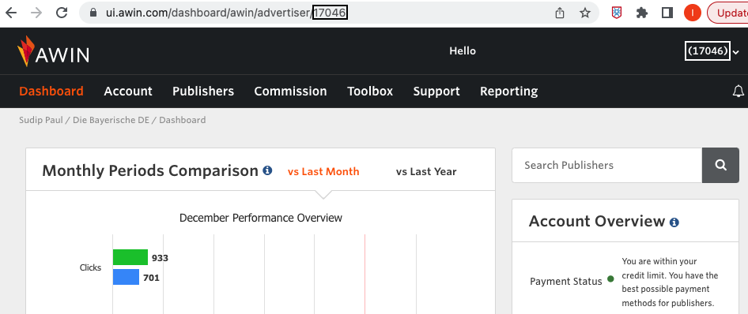

[Awin](https://www.Awin.com/) is an affiliate marketing program that connects advertisers and affiliates of all sizes. It provides a network of affiliate partners, click tracing and tracking, advertiser directory, reports and analytics, and more.

<div class="infoBlock">
Find the open source code for this destination in the <a href="https://github.com/rudderlabs/rudder-transformer/tree/master/src/v0/destinations/awin">GitHub repository</a>.
</div>

## Getting started

RudderStack supports sending event data to Awin via the following <a href="https://rudderstack.com/docs/rudderstack-cloud/rudderstack-connection-modes/">connection modes</a>:

| Connection Mode | Web | Mobile | Server |
| :--- | :--- | :--- | :--- |
| Device mode | - | - | - |
| Cloud mode | Supported  | Supported | Supported |

Once you have confirmed that the source platform supports sending events to Awin, follow these steps:

1. From your [RudderStack dashboard](https://app.rudderstack.com/), add a source. Then, from the list of destinations, select **Awin**.
2. Assign a name to the destination and click **Continue**.

## Connection settings

To successfully configure Awin as a destination, you will need to configure the following settings:

- **Advertiser ID**: Enter your Awin advertiser ID. For more information on obtaining your advertiser ID, refer to the <Link to="#faq">FAQ</Link> section below.
- **Events to Track**: Enter the event names for which you want to track the conversions. 

<div class="warningBlock">
You must enter all the event names for which you want to make a <code class="inline-code">track</code> call.
</div>

## Track

You can use the <Link to="/event-spec/standard-events/track">`track`</Link> call to [send the conversion data directly to Awin's servers](https://wiki.awin.com/index.php/Advertiser_Tracking_Guide/Conversion_Pixel_Only_Tracking#Server_To_Server_.28S2S.29).

A sample `track` call is shown below:

```javascript
rudderanalytics.track("Product Purchased New", {
  revenue: 4.99,
  currency: "USD",
  commissionGroup: "CD",
  name: "Shirt",
  voucherCode: "FIRSTSALE",
  order_id: "ORD123",
});
```

### Supported mappings

The following table lists the mappings between the RudderStack and Awin properties:

| RudderStack property | Awin property | Notes |
| :--------------| :---------| :--------------|
| `properties.revenue` <br/> `properties.totalAmount` <br/> `properties.amount` <br/> `properties.total_amount`| `totalAmount` | - |
| `properties.commissionGroup`<br/> `properties.commission_group` | `commissionGroup` | Default value is `DEFAULT` |
| `properties.voucherCode`<br/> `properties.voucher_code`  | `voucher_code` |- |
| `properties.currency` <br/> `properties.currencyCode` <br/> `properties.currency_code` | `currencyCode` | -|
| `properties.order_id`<br/>`properties.orderId` <br/> `properties.orderReference` <br/> `properties.order_reference` | `orderReference` |- |
| `properties.cks`<br/> `properties.awc`  | `awc` | - |
| `properties.testMode` <br/> `properties.test_mode` <br/> `properties.isTest`<br/> `properties.is_test` | `isTest` | Default value is `0` |

## FAQ

### Where can I find the Awin advertiser ID?

To obtain your Awin advertiser ID, log in to your [Awin dashboard](https://ui.awin.com/idp/en/awin/login) to see the advertiser ID in the top right corner as well as in the URL, as shown:


