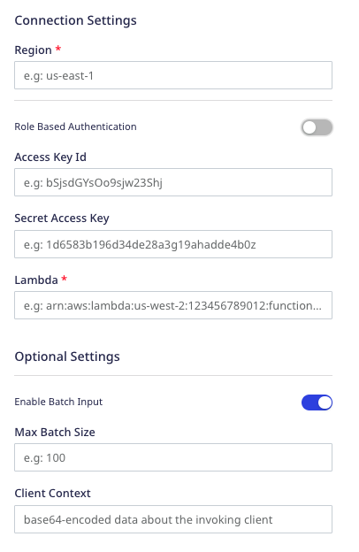
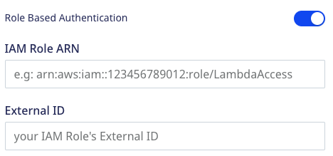

[AWS Lambda](https://aws.amazon.com/lambda/) is a serverless compute service that lets you seamlessly run any application code or service without managing or provisioning servers.

RudderStack supports AWS Lambda as a destination where you can send your event data seamlessly.

## Getting started

Before configuring AWS Lambda as a destination in RudderStack, verify if the source platform is supported by AWS Lambda by referring to the table below:

| **Connection Mode** | **Web**       | **Mobile**    | **Server**    |
| :------------------ | :------------ | :------------ | :------------ |
| **Device mode**     |  -             | -             | -             |
| **Cloud mode**      |  **Supported** | **Supported** |  **Supported** |

To know more about the difference between cloud mode and device mode in RudderStack, refer to the <Link to="/destinations/rudderstack-connection-modes/">RudderStack Connection Modes</Link> guide.

Once you have confirmed that the source platform supports sending events to AWS Lambda, follow these steps:

1. From your [RudderStack dashboard](https://app.rudderstack.com/), add the source. Then, from the list of destinations, select **AWS Lambda**.
2. Assign a name to the destination and click **Continue**.

## Connection settings

To successfully configure AWS Lambda as a destination, you need to configure the following settings:

- **Region**: Enter the region associated with your AWS Lambda service.

For more information on the AWS regions, refer to the <a href="https://aws.amazon.com/about-aws/global-infrastructure/regions_az/">AWS Regions and Availability Zones</a> guide.

- **Role Based Authentication**: Enable this setting to use role-based AWS authentication for this destination. If this setting is enabled, you need to configure the following settings:
  

  - **IAM Role ARN**: Enter your role ARN. For more information on the IAM ARNs, refer to the <a href="https://docs.aws.amazon.com/IAM/latest/UserGuide/reference_identifiers.html#identifiers-arns">AWS documentation</a>.
  - **External ID**: Enter the external ID associated with the role. For more information on using the external ID, refer to the <a href="https://docs.aws.amazon.com/IAM/latest/UserGuide/id_roles_create_for-user_externalid.html">AWS documentation</a>.

It is highly recommended to use the <Link to="/resources/glossary/#workspace-token">workspace token</Link> as the external ID while creating the IAM role.

If **Role Based Authentication** is disabled, you need to configure the following settings:
  - **Access Key ID**: Enter the AWS access key ID associated with your IAM user account.
  - **Secret Access Key**: Enter your secret access key.

For more information on creating an IAM user in AWS, refer to the <a href="https://docs.aws.amazon.com/IAM/latest/UserGuide/id_roles_common-scenarios_third-party.html">AWS documentation</a>.

- **Lambda**: Enter the name of the Lambda function to be invoked. RudderStack supports the following name formats:

| Format | Example |
| :-------| :---------|
| Function name | <ul><li>`lambda-function` (Name only)</li><li>`lambda-function:v1` (Name with alias)</li></ul>|
| Function ARN | `arn:aws:lambda:us-west-2:123456789012:function:my-function` |
| Partial ARN | `123456789012:function:lambda-function` |

You can also append a version number or alias to any of the above formats.

- **Enable Batch Input**: Enable this setting if your lambda function expects a batch input (array of events) in the event object.
  - **Max Batch Size**: If **Enable Batch Input** setting is enabled, use this field to set the maximum size of the event batch.
- **Client Context**: Use this field to pass up to **3583 bytes** of Base64-encoded data about the invoking client to the function in the context object.

## Supported events

This destination accepts raw event data similar to a webhook. RudderStack sends the entire event payload to AWS Lambda as is, without any transformation or modification. 

You can send your <Link to="/event-spec/standard-events/identify/">`identify`</Link>, <Link to="/event-spec/standard-events/track/">`track`</Link>, <Link to="/event-spec/standard-events/page/">`page`</Link>, <Link to="/event-spec/standard-events/group/">`group`</Link>, and <Link to="/event-spec/standard-events/alias/">`alias`</Link> events to your lambda function via RudderStack.

RudderStack leverages the <a href="https://docs.aws.amazon.com/sdk-for-go/api/service/lambda/">AWS SDK for Go</a> to send the events to the lambda function. It uses the SDK's [`Invoke`](https://docs.aws.amazon.com/sdk-for-go/api/service/lambda/#Lambda.Invoke) method to **asynchronously** invoke the lambda function.

As RudderStack supports only asynchronous invocation, it only guarantees the order in which the events are triggered. Also, the execution time is completely dependent on the complexity of your lambda function.

It is highly recommended to configure a <a href="https://docs.aws.amazon.com/lambda/latest/dg/invocation-async.html#invocation-dlq">dead-letter queue</a> to save the discarded events for further processing.

## Viewing error logs

RudderStack does not get any information related to the runtime errors for your lambda function. As a result, you will not be able to view these errors in the <Link to="/dashboard-guides/live-events/">Live Events</Link> tab of your dashboard.

To view these errors, you can configure the <a href="https://docs.aws.amazon.com/lambda/latest/dg/monitoring-cloudwatchlogs.html">AWS CloudWatch logs</a> for your lambda function.

## FAQ

### Why am I getting a `UnrecognizedClientException`/`InvalidSignatureException` error?

If you're getting a `UnrecognizedClientException` error with a 403 status code, verify if your AWS credentials (both **AWS Access Key ID** and **Secret Access Key**) are valid.

For the `InvalidSignatureException` error, verify if the provided secret access key is valid.