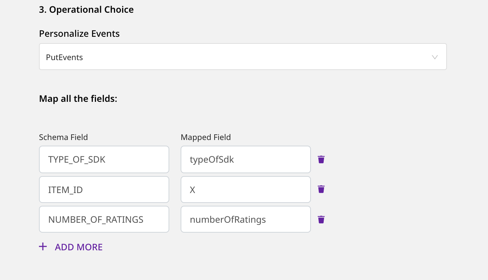

[Amazon Personalize](https://aws.amazon.com/personalize/) is a machine learning service by AWS. It enables you to create high-quality content recommendations, personalized product and marketing promotions, and much more.

RudderStack supports AWS Personalize as a destination where you can send your event data seamlessly.

<div class="infoBlock">
Find the open source code for this destination in the <a href="https://github.com/rudderlabs/rudder-transformer/tree/master/v0/destinations/personalize">GitHub repository</a>.
</div>

<div class="infoBlock">
To use <a href="https://docs.aws.amazon.com/personalize/latest/dg/API_UBS_PutUsers.html"><code class="inline-code">PutUsers</code></a> and <a href="https://docs.aws.amazon.com/personalize/latest/dg/API_UBS_PutItems.html"><code class="inline-code">PutItems</code></a> permissions for this destination, use the latest images for <a href="https://github.com/rudderlabs/rudder-server"><code class="inline-code">rudder-server</code></a> and <a href="https://github.com/rudderlabs/rudder-transformer"><code class="inline-code">rudder-transformer</code></a>.
</div>

## Getting started

RudderStack supports sending event data to Personalize via the following <Link to="/rudderstack-cloud/rudderstack-connection-modes/">connection modes</Link>:

| **Connection Mode** | **Web** | **Mobile** | **Server** |
| :--- | :--- | :--- | :--- |
| **Device mode** | - | - | - |
| **Cloud mode** | **Supported** | **Supported** | **Supported** |

Once you have confirmed that the source platform supports sending events to Personalize, follow these steps:

1. Generate a Tracking ID by following these [instructions](https://github.com/rudderlabs/rudder-transformer/blob/master/v0/destinations/personalize/scripts/README.md).
2. From your RudderStack dashboard, add the source. Then, from the list of destinations, select **Amazon Personalize**.
3. Assign a name to your destination and click **Continue**.

### Connection settings

To successfully set up Personalize as a destination, you need to configure the following settings:

- **Role-based Authentication**: Enable this setting to use the RudderStack IAM role for authentication. For more information on creating a AWS IAM role for RudderStack, refer to <Link to="/destinations/aws-iam-role-for-rudderstack/#creating-a-rudderstack-iam-role">this guide</Link>.
  - **IAM Role ARN**: Enter the ARN of the IAM role.

<div class="warningBlock">
It is highly recommended to enable this setting as the access keys-based authentication will be deprecated in the future.
</div>

- If **Role-based Authentication** is disabled, you need to enter the **AWS Access Key ID** and **AWS Secret Access Key** to authorize RudderStack to send data to Personalize. 

<div class="infoBlock">
In both the role-based and access key-based authentication methods, you need to set a policy specifying the required permissions for RudderStack to send data to Personalize. Refer to the <Link to="#policy-permissions">Policy permissions</Link> section below for more information. 
</div>

- **Region**: Enter the region associated with your AWS account in this field.
- **TrackingId**: Enter the Tracking ID generated in the <Link to="#getting-started">Getting started</Link> section above.
- **Dataset ARN**: Enter the dataset ARN of the dataset from the chosen dataset group.
* **Personalize Events**: Choose the type of Personalize event you want to avail.
* **Map all the fields**: Enter the **Schema Field** used to create the schema in AWS Personalize (for example, `USER_ID`, `TIMESTAMP`, `ITEM_ID`, etc.). Also, enter the corresponding **Mapped Field** - RudderStack takes the value from this field present in the event payload and maps it to the **Schema Field**.

<div class="infoBlock">
For more information on creating a schema in Personalize, refer to the <a href="https://docs.aws.amazon.com/personalize/latest/dg/data-prep-creating-datasets.html">Personalize documentation</a>.
</div>

<div class="warningBlock">
When using the <code class="inline-code">PutItems</code> operation, you need to provide the path to the <strong>Mapped Field</strong> corresponding to the <code class="inline-code">ITEM_ID</code> present in your Personalize database schema.
</div>

* **Disable Stringifying Additional Properties**: This setting disables the conversion of additional properties to string data type in Personalize. 

<div class="infoBlock">
This is an exclusive setting only applicable for the <code class="inline-code">putEvents</code> operation. If it is disabled, RudderStack converts any mapped fields other than <code class="inline-code">ITEM_ID</code>, <code class="inline-code">EVENT_VALUE</code>, <code class="inline-code">IMPRESSION</code>, <code class="inline-code">RECOMMENDATION_ID</code>, <code class="inline-code">TIMESTAMP</code>, <code class="inline-code">EVENT_TYPE</code>, and <code class="inline-code">USER_ID</code> to a string before forwarding to Personalize.
</div>

## Policy permissions

To use the Personalize destination with RudderStack correctly, you must have a Personalize service set up in AWS. Refer to the <a href="https://docs.aws.amazon.com/personalize/latest/dg/setup.html">AWS documentation</a> for more information on setting up your Amazon Personalize account.

You also need to create an IAM role and grant the necessary permissions for RudderStack to send data to Personalize. The following actions need to be attached to the role while setting up the AWS policy:

```json
"Action": [
    "personalize:PutEvents",
    "personalize:PutUsers",
    "personalize:PutItems"
]
```

You can use these actions based on the type of Personalize events you want to send. For example, to send only <code class="inline-code">putEvents</code> type of events, you can attach only <code class="inline-code">personalize:PutEvents</code>.

A sample permissions policy that allows a user to send event data into Personalize is shown below:

```json
{
  "Version": "2012-10-17",
  "Statement": [
    {
      "Sid": "CloudWatchEventsInvocationAccess",
      "Effect": "Allow",
      "Action": [
        "personalize:PutEvents"
        "personalize:PutUsers",
        "personalize:PutItems"
        ],
      "Resource": "*"
    }
  ]
}
```

## Identify

The <Link to="/event-spec/standard-events/identify">`identify`</Link> call lets you use the `PutUsers` operation of Personalize.

<div class="infoBlock">
For the <code class="inline-code">PutUsers</code> operation, the value of the <code class="inline-code">userId</code> or <code class="inline-code">anonymousId</code> field in the payload will be sent as <code class="inline-code">userId</code>.
</div>

<div class="warningBlock">
For <code class="inline-code">PutUsers</code>, you must specify the <strong>Dataset ARN</strong> field in the RudderStack dashboard.
</div>

The following snippet highlights a sample `identify` event with the **Mapped Field** setting specified in the dashboard:

```javascript
rudderanalytics.identify("1hKOmRA4GRlm", {
  name: "Alex",
  email: "alex@example.com"
  });
```

## Track

The <Link to="/event-spec/standard-events/track">`track`</Link> call lets you use [`PutEvents`](https://docs.aws.amazon.com/personalize/latest/dg/API_UBS_PutEvents.html) and [`PutItems`](https://docs.aws.amazon.com/personalize/latest/dg/API_UBS_PutItems.html) operations of Personalize.

<div class="infoBlock">
For <code class="inline-code">PutEvents</code>, RudderStack sends the value of the <code class="inline-code">event</code> field in the payload as <code class="inline-code">EVENT_TYPE</code>. Also, the value of the <code class="inline-code">timestamp</code> or <code class="inline-code">originalTimestamp</code> fields in the payload will be sent as <code class="inline-code">sentAt</code>.
</div>

<div class="warningBlock">
For the <code class="inline-code">PutItems</code> and <code class="inline-code">PutEvents</code> operations, it is mandatory to specify the <strong>Dataset ARN</strong> and <strong>Tracking ID</strong> settings in the RudderStack dashboard.
</div>

The following snippet shows a sample `track` event with the mapped field specified in the dashboard settings:

```javascript
rudderanalytics.track("Product Added", {
  typeOfSdk: "javascript",
  numberOfRatings: "12",
  X: "item 1",
});
```

When using the <code class="inline-code">PutItems</code>, the <strong>Schema Field</strong> <code class="inline-code">ITEM_ID</code> must be mapped to a specific key inside the payload. You also need to mention the path to the chosen key as the corresponding <strong>Mapped Field</strong>.

In the above example, if you map `ITEM_ID` to the payload field `X`, the corresponding **Mapped Field** will be `properties.X`.

<div class="infoBlock">
For any other <strong>Schema Field</strong> in your <code class="inline-code">ITEMS</code> dataset, it is <strong>not</strong> recommended to specify the path - only the field name is sufficient.
</div>

<div class="warningBlock">
When using <code class="inline-code">PutEvents</code>, the <strong>Mapped Field</strong> for <code class="inline-code">ITEM_ID</code> should <strong>not</strong> contain the path to the field. Only the name of the field will be sufficient. The same rule is applicable for any other <strong>Schema Field</strong>  mapping.
</div>

The following image shows an example of the dashboard configuration for `PutItems`:


The following image shows an example of the dashboard configuration for `PutEvents`:

