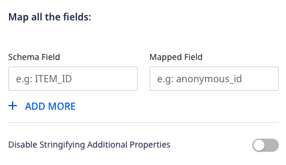
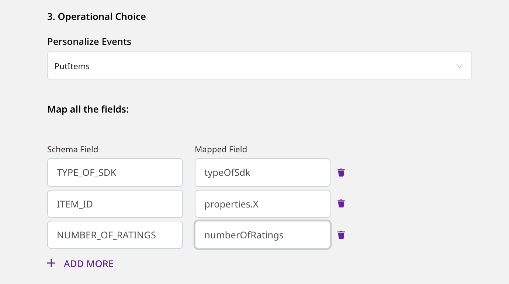

[Amazon Personalize](https://aws.amazon.com/personalize/), also known as **AWS Personalize**, is a machine learning service by Amazon. It enables you to create high-quality content recommendations, personalized product and marketing promotions, and much more.

RudderStack supports AWS Personalize as a destination where you can send your event data seamlessly.

<div class="infoBlock">
Find the open source transformer code for this destination in the <a href="https://github.com/rudderlabs/rudder-transformer/tree/master/v0/destinations/personalize">GitHub repository</a>.
</div>

<div class="infoBlock">

To use [<code class="inline-code">PutUsers</code>](https://docs.aws.amazon.com/personalize/latest/dg/API_UBS_PutUsers.html) and [<code class="inline-code">PutItems</code>](https://docs.aws.amazon.com/personalize/latest/dg/API_UBS_PutItems.html) for Personalize, use the latest images for [<code class="inline-code">rudder-server</code>](https://github.com/rudderlabs/rudder-server) and [<code class="inline-code">rudder-transformer</code>](https://github.com/rudderlabs/rudder-transformer) images.
</div>

## Getting started

Before configuring AWS Personalize as a destination in RudderStack, verify if the source platform is supported by referring to the table below:

| **Connection Mode** | **Web** | **Mobile** | **Server** |
| :--- | :--- | :--- | :--- |
| **Device mode** | - | - | - |
| **Cloud mode** | **Supported** | **Supported** | **Supported** |

<div class="infoBlock">
To know more about the difference between cloud mode and device mode in RudderStack, refer to the <Link to="/destinations/rudderstack-connection-modes/">RudderStack Connection Modes</Link> guide.
</div>

Once you have confirmed that the source platform supports sending events to AWS Personalize, follow these steps:

1. Generate a Tracking ID by following these [instructions](https://github.com/rudderlabs/rudder-transformer/blob/master/v0/destinations/personalize/scripts/README.md).

<div class="infoBlock">
Keep the Tracking ID handy. It is required to configure AWS Personalize as a destination.
</div>

2. From your [RudderStack dashboard](https://app.rudderstack.com/), add the source. Then, from the list of destinations, select **AWS Personalize**.
3. Assign a name to your destination and click on **Continue**.

### Connection settings

To successfully set up AWS Personalize as a destination, configure the following settings:




* **Access Key ID**: Enter the access key ID of your AWS account here.

<div class="infoBlock">

The following actions need to be attached to the Access Key while setting up the AWS policy for it:

```text
"Action": [
           "personalize:PutEvents",
           "personalize:PutUsers",
           "personalize:PutItems"
          ]
```

You can use these actions based on the type of Personalize events you want to send. For example, to send only <code class="inline-code">putEvents</code> type of events, you can attach only <code class="inline-code">personalize:PutEvents</code>.
</div>

* **Secret Access Key**: Enter the secret access key of your AWS account.
* **Region**: Enter the region associated with your AWS account in this field.
* **TrackingId**: Enter the Tracking ID generated in the first step.
* **Dataset ARN**: Enter the dataset ARN of the dataset from the chosen dataset group.
* **Personalize Events**: Choose the type of Personalize event you want to avail.
* **Map all the fields**: Enter the **Schema Field** you have used to create the schema in AWS Personalize (For example, `USER_ID`, `TIMESTAMP`, `ITEM_ID`, etc.). Also, enter the corresponding **Mapped Field** from which the value will be taken from your event payload.

<div class="infoBlock">

For more information on creating a schema in Personalize, refer to the [Personalize documentation](https://docs.aws.amazon.com/personalize/latest/dg/data-prep-creating-datasets.html).
</div>

<div class="infoBlock">

When using the <code class="inline-code">PutItems</code> operation, you need to provide the path to the <strong>Mapped Field</strong> corresponding to the <code class="inline-code">ITEM_ID</code> present in your Personalize database schema.
</div>

* **Disable Stringifying Additional Properties**: Disables the conversion of additional properties to string data type in AWS Personalize. 

<div class="infoBlock">
This is an exclusive setting only applicable for the <code class="inline-code">putEvents</code> operation. If it is disabled, any mapped fields other than <code class="inline-code">ITEM_ID</code>, <code class="inline-code">EVENT_VALUE</code>, <code class="inline-code">IMPRESSION</code>, <code class="inline-code">RECOMMENDATION_ID</code>, <code class="inline-code">TIMESTAMP</code>, <code class="inline-code">EVENT_TYPE</code>, and <code class="inline-code">USER_ID</code> will be converted to a string before being forwarded to Personalize.
</div>

## Identify

The <Link to="/event-spec/standard-events/identify">`identify`</Link> call lets you use `PutUsers` operation of AWS Personalize.

<div class="infoBlock">

For the <code class="inline-code">PutUsers</code> operation, the value of the <code class="inline-code">userId</code> or <code class="inline-code">anonymousId</code> field in the payload will be sent as <code class="inline-code">userId</code>.
</div>

<div class="infoBlock">

For <code class="inline-code">PutUsers</code>, the <strong>Dataset ARN</strong> field in the RudderStack dashboard is required.
</div>

The following snippet highlights a sample `identify` event with the **Mapped Field** specified in the [RudderStack dashboard](https://app.rudderstack.com/):

```javascript
rudderanalytics.identify("1hKOmRA4el9Zt1WSfVJIVo4GRlm", {
  name: "Alex",
  email: "alex@example.com"
  });
```

## Track

The <Link to="/event-spec/standard-events/track">`track`</Link> call lets you use [`PutEvents`](https://docs.aws.amazon.com/personalize/latest/dg/API_UBS_PutEvents.html) and [`PutItems`](https://docs.aws.amazon.com/personalize/latest/dg/API_UBS_PutItems.html) operations of AWS Personalize.

<div class="infoBlock">

For <code class="inline-code">PutEvents</code>, RudderStack sends the value of the <code class="inline-code">event</code> field in the payload as <code class="inline-code">EVENT_TYPE</code>. Also, the value of the <code class="inline-code">timestamp</code> or <code class="inline-code">originalTimestamp</code> field in the payload will be sent as <code class="inline-code">sentAt</code>.
</div>

<div class="infoBlock">

For <code class="inline-code">PutItems</code> and <code class="inline-code">PutEvents</code> operations, it is mandatory to specify the <code class="inline-code">Dataset ARN</code> and <code class="inline-code">Tracking ID</code> in the RudderStack dashboard.
</div>

The following snippet shows a sample `track` event with the mapped field specified in the [RudderStack dashboard](https://app.rudderstack.com/):

```javascript
rudderanalytics.track("PRODUCT ADDED", {
  typeOfSdk: "javascript",
  numberOfRatings: "12",
  X: "item 1",
});
```

<div class="infoBlock">

When using the <code class="inline-code">PutItems</code>, the <strong>Schema Field</strong> <code class="inline-code">ITEM_ID</code> must be mapped to a specific key inside the payload and you need to mention the path to the chosen key as the corresponding <strong>Mapped Field</strong>.
</div>

In the above example, if you map `ITEM_ID` to the payload field `X`, the corresponding **Mapped Field** will be `properties.X`.

<div class="infoBlock">

For any other <strong>Schema Field</strong> in your <code class="inline-code">ITEMS</code> dataset, it is <strong>not</strong> recommended to specify the path - only the field name is sufficient.
</div>

<div class="warningBlock">

While using <code class="inline-code">PutEvents</code>, the <strong>Mapped Field</strong> for <code class="inline-code">ITEM_ID</code> should <strong>not</strong> contain the path to the field. Only the name of the field will be sufficient. The same rule is applicable for any other <strong>Schema Field</strong>  mapping.
</div>

The following image shows an example of the dashboard configuration for `PutItems`:



The following image shows an example of the dashboard configuration for `PutEvents`:


