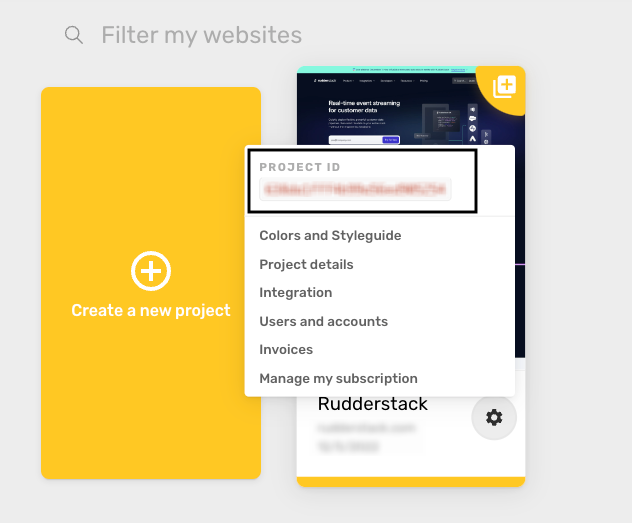
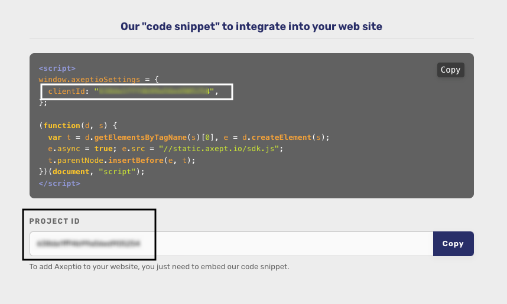

[Axeptio](https://www.axeptio.eu/) is a cookie and consent management platform. It enables you to use interesting widgets and compelling UI to enhance users' cookie/consent experience while keeping your web performance intact.

## Getting started

RudderStack supports sending event data to Axeptio via the following <a href="https://rudderstack.com/docs/rudderstack-cloud/rudderstack-connection-modes/">connection modes</a>:

| Connection Mode | Web | Mobile | Server |
| :--- | :--- | :--- | :--- |
| Device mode | Supported | - | - |
| Cloud mode | -  | - | - |

Once you have confirmed that the source platform supports sending events to Axeptio, follow these steps:

1. From your [RudderStack dashboard](https://app.rudderstack.com/), add a source. Then, from the list of destinations, select **Axeptio**.
2. Assign a name to the destination and click **Continue**.

## Connection settings

To successfully configure Axeptio as a destination, you will need to configure the following settings:

- **Client ID**: Enter your Axeptio client ID. For more information on obtaining the client ID, refer to the <Link to="#faq">FAQ</Link> section below.
- **Send data through callback**: Enable this setting to allow RudderStack to collect the callback data from the Axeptio SDK as `track` events.
- **Client-side Events Filtering**: This setting lets you specify which events should be blocked or allowed to flow through to Axeptio. For more information on this setting, refer to the <Link to="/sources/sdks/event-filtering/">Client-side Events Filtering</Link> guide.
- **Use device mode to send events**: Enable this setting to send your events to Axeptio via the <Link to="https://www.rudderstack.com/docs/destinations/rudderstack-connection-modes/#device-mode">web device mode</Link>.

<div class="infoBlock">
You can disable this setting if you only want to load the Axeptio SDK natively and not send any events.
</div>

- **OneTrust Cookie Categories**: This setting lets you associate <Link to="/sources/sdks/rudderstack-javascript-sdk/consent-managers/onetrust/">OneTrust</Link> cookie consent groups to Axeptio.

## Tracking callback events

<div class="warningBlock">
RudderStack does not support sending any specific <Link to="/event-spec/standard-events/identify/"><code class="inline-code">identify</code></Link> or <Link to="/event-spec/standard-events/track/"><code class="inline-code">track</code></Link> events to Axeptio.
</div>

The Axeptio SDK triggers events whenever a user interacts with the cookie/consent widgets integrated with your website. You can use these callback events to track and send this event data as <Link to="/event-spec/standard-events/track/">`track`</Link> events. To do so, enable the **Send data through callback** setting in the RudderStack dashboard.

A sample callback event generated by the Axeptio SDK is shown below:

```javascript
window._axcb.push(function(SDK) {
  // here you'll be able to access the methods and properties of the Axeptio SDK instance.
  window.__axeptioSDK.on(
    "cookies:*",
    function(payload, event) {
      rudderanalytics.track(event, payload);
    }, {
      replay: true
    }
  );
});
```

In the above snippet, `cookies:*` triggers a callback for each event occurred as a result of any user interaction. 

If `replay` is set to `true`, the past events that have been dispatched (before the event handler is set) trigger a call to the handler function. If set to `false`, only the subsequent events trigger a call to the handler.

The callback function contains two arguments - `event` and `payload` - which RudderStack maps to the <Link to="/event-spec/standard-events/track/">`track`</Link> event name and the corresponding properties.

## FAQ

### Where can I find the Axeptio client ID?

To get the client ID associated with your Axeptio project, follow these steps:

1. Log into your <a href="https://admin.axeptio.eu/">Axeptio dashboard</a>.
2. Click the settings icon on your project. You should be able to see the **Project ID** listed here, as shown:



You can also find the client ID in the code snippet to integrate into your website. Click the settings icon on your project and go to **Integration** to find the client ID, as shown:



<div class="infoBlock">
The Axeptio client ID is the same as the project ID.
</div>

<br />