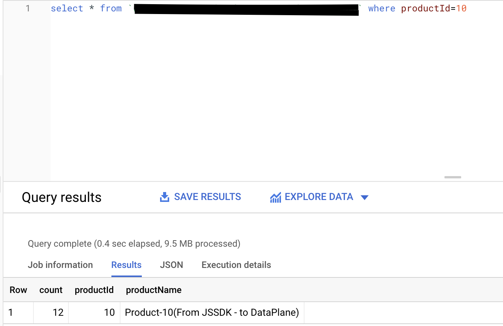

[Google BigQuery](https://cloud.google.com/bigquery) offers a [streaming API](https://cloud.google.com/bigquery/docs/samples/bigquery-table-insert-rows) which lets you insert data into BigQuery in near real-time and have it ready for analysis in no time.

Find the open source transformer code for this destination in the <a href="https://github.com/rudderlabs/rudder-transformer/tree/master/src/v0/destinations/bqstream">GitHub repository</a>.

## Getting started

<div class="warningBlock">
Before you set up BigQuery Stream as a destination in the <a href="https://app.rudderstack.com/">RudderStack dashboard</a>, make sure you <Link to="#creating-a-service-account">create a service account</Link> in your Google Cloud Console.
</div>

RudderStack supports sending event data to BigQuery Stream via the following <a href="https://rudderstack.com/docs/rudderstack-cloud/rudderstack-connection-modes/">connection modes</a>:

| Connection Mode | Web       | Mobile    | Server   |
| :------------------ | :------------ | :------------ | :------------ |
| **Device mode**     | -             | -             | -             |
| **Cloud mode**      | **Supported** | **Supported** | **Supported** |

Once you've confirmed that the source platform supports sending events to BigQuery Stream, follow these steps:

1. From your [RudderStack dashboard](https://app.rudderstack.com/), add the source. Then, from the list of destinations, select **BigQuery Stream**.
2. Assign a name to the destination and click **Continue**.

## Connection settings

To successfully configure BigQuery Stream as a destination, you will need to configure the following settings:

- **Project ID**: Enter your BigQuery project ID.
- **Dataset ID**: This is the ID of the project dataset for which you specified the **Project ID** above.
- **Table ID**: Provide the ID of the table into which you want to stream the event data.


- **Insert ID**: This is an **optional** field. Enter the `insertId` used by Google to deduplicate the data sent to BigQuery. For more information on this setting, refer to the <Link to="#deduplicating-data">Deduplicating data</Link> section.
- **Credentials**: Enter the contents of the credentials JSON you downloaded after <Link to="#creating-a-service-account">creating your service account</Link>.

<div class="infoBlock">
<Link to="#creating-a-service-account">Create a service account</Link> in your GCP Project for RudderStack with the <strong>BigQuery Data Editor</strong> role, which has the required access to write to BigQuery.
</div>

## Sending events to BigQuery Stream

RudderStack supports sending only <Link to="/event-spec/standard-events/track">`track`</Link> events to BigQuery Stream. Make sure your `track` event payload format matches the table schema corresponding to **Table ID** specified in the dashboard settings.

<div class="infoBlock">
RudderStack currently does not support the <code class="inline-code">templateSupportSuffix</code> feature which creates a table schema during a streaming insert action.
</div>

Suppose you want to stream the events from your web source to BigQuery and the table schema in your BigQuery dataset is as shown:


To successfully stream the events, the event tracked from your JavaScript SDK should look like the following:

```javascript
rudderanalytics.track("event", {
  productId: 10,
  productName: `Product-10`,
  count: 12
});
```

Note that the `track` properties in the above payload match with the fields specified in your table schema. Once streamed, you can view this event in your BigQuery console by running the following SQL command :



## Deduplicating data

Google leverages the `insertId` to deduplicate the data sent to BigQuery. `insertId` is essentially an event property that uniquely identifies an event.

<div class="warningBlock">
RudderStack currently supports only <strong>numeric</strong> or <strong>string</strong> values as <code class="inline-code">insertId</code>.
</div>

For more information on the deduplication process in BigQuery, refer to the <a href="https://cloud.google.com/bigquery/streaming-data-into-bigquery#dataconsistency">BigQuery documentation</a>.

### Use case

Consider the following table schema:


When sending an `Insert Product` event to BigQuery, you can use the `productId` field to uniquely identify the product. Upon setting `productId` as the `insertId`, BigQuery uses it to deduplicate the data.

## Dynamically configuring `insertId`

<div class="infoBlock">
Use this feature if you are <Link to="/user-guides/how-to-guides/dynamic-destination-configuration/">dynamically configuring BigQuery Stream via the event payload</Link>.
</div>

To dynamically configure `insertId` via the event payload, make sure that `insertId` is the column name present in your schema (or in the `properties` object in the event payload) used to uniquely identify an event.

Consider the following schema:


Suppose you have a dynamic configuration like `{{ message.uniqueId || "productId" }}` for the above schema. There are three cases to consider here:

### Case 1: Unique ID is sent as a value which is not a key in the event properties

Consider the following payload:

```javascript
{
  "properties": {
    "productId": 212,
    "productName": "my product",
    "count": 24
  },
  ...,
  "uniqueId": <some_value> ,
  ...
}
```

In the above case, deduplication **is not applicable** as the event properties do not contain `<some_value>` present in the payload.

### Case 2: Unique ID is sent as a value which is a key in  the event properties

Consider the following payload:

```javascript
{
  "properties": {
    "productId": 212,
    "productName": "my product",
    "count": 24
  },
  ...,
  "uniqueId": "productId",
  ...
}
```

In this case, deduplication **is applicable** as RudderStack sends the `productId` value (`212`) as the `insertId` to Google.

### Case 3: Unique ID is not sent in the event payload

Consider the following payload:

```javascript
{
  "properties": {
    "productId": 212,
    "productName": "my product",
    "count": 24
  },
  ...
}
```

In this case, deduplication **is applicable** as RudderStack sends the `productId` value (`212`) as the `insertId` to Google.

If you use the dynamic destination configuration for `insertId` by passing a random value (e.g. `1234`) in the above payload, deduplication will **not be applicable** as the `properties` object does not contain the value `1234`.

## Creating a service account

To create a service account in your [Google Cloud Console](https://console.cloud.google.com), follow these steps:

1. In the left sidebar, go to **APIs & Services** > **Credentials**.
2. Then, click **CREATE CREDENTIALS** > **Service account**, as shown:


3. Enter the service account details and click **CREATE AND CONTINUE**.
4. In the **Select a role** field, search and select the **BigQuery Data Editor** role and click **CONTINUE**.


5. Click **DONE** to finish the setup.
6. Next, you need the service account credentials JSON required for RudderStack to send the data to BigQuery. To obtain this JSON, go to your service account.


7. Then, go to **KEYS** > **ADD KEY** > **Create new key**.
8. Select the **Key type** as **JSON** and click **CREATE**.


Your JSON key will be automatically downloaded. Copy and paste the contents of this JSON key in the **Credentials** field while [configuring BigQuery Stream as a destination](#connection-settings) in RudderStack.
 
## Troubleshooting

For the different error messages you might get when sending your event data to BigQuery Stream and their troubleshooting steps, refer to the [BigQuery documentation](https://cloud.google.com/bigquery/docs/error-messages).

<br />
