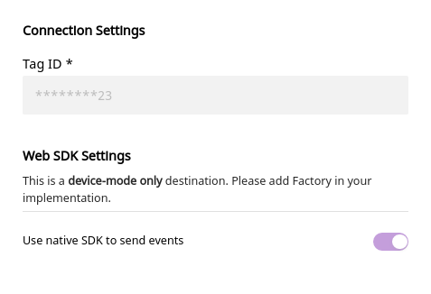

[Bing Ads](https://ads.microsoft.com/) is a pay per click \(PPC\) advertising platform that works on both Bing and Yahoo search engines. It allows marketers to track and monitor their ad campaigns, resulting clicks, CTRs, and more. With Bing Ads, you can also implement efficient ad retargeting for your customers who have completed actions like adding product to a cart or view a product without purchasing it.

RudderStack supports Bing Ads as a destination to which you can send your real-time event data seamlessly.

## Getting started

RudderStack supports sending event data to Bing Ads via the following <a href="https://rudderstack.com/docs/rudderstack-cloud/rudderstack-connection-modes/">connection modes</a>:

| **Connection Mode** | **Web**       | **Mobile** | **Server** |
| :------------------ | :------------ | :--------- | :--------- |
| **Device mode**     | **Supported** | -          | -          |
| **Cloud mode**      | -             | -          | -          |

<div class="infoBlock">
In the web device mode integration, that is, using <Link to="/sources/event-streams/sdks/rudderstack-javascript-sdk">JavaScript SDK</Link> as a source, the Bing Ads native SDK is loaded from <code class="inline-code">https://bat.bing.com/</code> domain. Based on your website's content security policy, you might need to <Link to="/sources/event-streams/sdks/rudderstack-javascript-sdk/load-js-sdk/#allowlist-destination-domain">allowlist this domain</Link> to load the Bing Ads SDK successfully.
</div>

Once you have confirmed that the platform supports sending events to Bing Ads, perform the steps below:

- From your [RudderStack dashboard](https://app.rudderstack.com/), add the source and Bing Ads as a destination.
- Give a name to the destination and click on **Next**. You should then see the following screen:

<span class="imageTitle">Configuration Settings for Bing Ads</span>

- Please enter the **Tag ID** of your Bing Ads account.
- Click on **Save** to finish the configuration. Bing Ads will now be added and enabled as a destination in RudderStack.

## Page

You can make a `page` call to Bing Ads to record a page view. The SDK will send this data to Bing Ads with event type `pageLoad`.

A sample `page` call is as shown:

```javascript
rudderanalytics.page()
```

## Track

You can use the <Link to="/event-spec/standard-events/track">`track`</Link> call to capture user events along with the properties associated with them.

### Supported mappings

The following table details the mappings between RudderStack and Bing Ads properties:

| RudderStack property | Bing Ads property |
| :-----| :--------| 
| `message.event` <br/> <span style="color: #4D4DFF;font-size:12px;">Required</span> | `event` | 
| `properties.category` | `category` | 
| `properties.currency`  | `currency` |
| `properties.eventValue` | `event_value` | 
| `properties.total` <br/>  `properties.revenue` <br/>  `properties.value` | `revenue` | 

<div class="infoBlock">
<code class="inline-code">properties.total</code> is given the highest priority followed by <code class="inline-code">properties.revenue</code> > <code class="inline-code">properties.value</code>.
</div>

A sample `track` call looks like the following:

```javascript
rudderanalytics.track("Item Purchased", {
  category: "MyCategory",
  currency: "INR",
  total: 5,
  revenue: 125,
  value: 100,
})
```


## Configuring the UET tag

Before you can track conversions or target audiences, you need to create a UET tag in Bing Ads and then add it to the **Connection Settings**. Follow the steps mentioned in the [Bing Ads documentation](https://about.ads.microsoft.com/en-us/resources/training/universal-event-tracking) to create a UET tag.

The UET tag can be created after logging into your Bing Ads account and navigating to **Tools** - **Conversion Tracking** - **UET tag** - **Create UET tag**.


