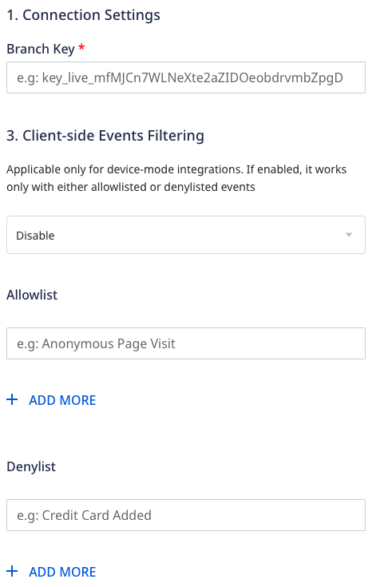

[Branch.io](https://branch.io) is an industry leader in cross-platform attribution, mobile app measurement, and deep linking. Many top-ranking apps use Branch to increase their performance and revenue through better performance and engagement.

RudderStack supports Branch as a destination where you can seamlessly send your customer data.

<div class="infoBlock">
Find the open source transformer code for this destination in the <a href="https://github.com/rudderlabs/rudder-transformer/tree/master/src/v0/destinations/branch">GitHub repository</a>.
</div>

## Getting started

Before configuring Branch as a destination in RudderStack, verify if the source platform is supported by Branch by referring to the table below:

| **Connection Mode** | **Web** | **Mobile**    | **Server** |
| :------------------ | :------ | :------------ | :--------- |
| **Device mode**     | -       | **Supported** | -          |
| **Cloud mode**      | -       | **Supported** | -          |

<div class="infoBlock">
To know more about the difference between cloud mode and device mode in RudderStack, refer to the <Link to="/destinations/rudderstack-connection-modes/">RudderStack Connection Modes</Link> guide.
</div>

Once you have confirmed that the source platform supports sending events to Branch, follow these steps:

1. From your [RudderStack dashboard](https://app.rudderstack.com/), add a source. Then, from the list of destinations, select **Branch Metrics**.
2. Assign a name to the destination and click **Continue**.

## Connection settings

To successfully configure Branch as a destination, you will need to configure the following settings: 



- **Branch key**: Enter your Branch key from the **Settings** section in the [Branch dashboard](https://dashboard.branch.io/#/settings).
- **Client-side Events Filtering**: This setting lets you specify which events should be blocked or allowed to flow through to Branch.

<div class="infoBlock">
For more information on this setting, refer to the <Link to="/sources/sdks/event-filtering/">Client-side Events Filtering</Link> guide.
</div>

## Adding device mode integration

Depending on your platform of integration, follow the below steps below to integrate Branch with your app.

<Tabs>
  <TabList>
    <Tab>iOS</Tab>
    <Tab>iOS v2</Tab>
    <Tab>Android</Tab>
  </TabList>
    <TabPanels>
      <TabPanel>
<ol>
<li>Open the <code class="inline-code">Podfile</code> of your project and add the following line
<span>

```ruby
pod 'Rudder-Branch', '0.1.3'
```
</span>

followed by
<span>

```bash
$ pod install
```
</span>
</li>
<li>Finally change the SDK initialization with the following
<span>

```objectivec
RudderConfigBuilder *builder = [[RudderConfigBuilder alloc] init];
[builder withDataPlaneUrl:<DATA_PLANE_URL>];
[builder withFactory:[RudderBranchFactory instance]];
[builder withLoglevel:RudderLogLevelDebug];
[RudderClient getInstance:<WRITE_KEY> config:[builder build]];
```
</span>
</li>
</ol>
</TabPanel>
<TabPanel>
        <div class="warningBlock">
          This device mode integration is supported for Branch v1.41.0 and above.
        </div>
        Follow these steps to add Branch to your iOS project:
<ol>
<li>Install <code class="inline-code">RudderBranch</code> (available through <a href="https://cocoapods.org/">CocoaPods</a>) by adding the following line to your <code class="inline-code">Podfile</code>:
<span>

```ruby
pod 'RudderBranch', '~> 1.0.0'
```
</span>
</li>
<li>Run the <code class="inline-code">pod install</code> command.</li>
<li>Then, import the SDK depending on your preferred platform:
<span>

```swift
import RudderBranch
```
</span>
<span>

```objectivec
@import RudderBranch;
```
</span>
</li>
<li>Next, add the imports to your <code class="inline-code">AppDelegate</code> file under the <code class="inline-code">didFinishLaunchingWithOptions</code> method, as shown:
<br /><br />
<span>

```swift
let config: RSConfig = RSConfig(writeKey: WRITE_KEY)
            .dataPlaneURL(DATA_PLANE_URL)

RSClient.sharedInstance().configure(with: config)
RSClient.sharedInstance().addDestination(RudderBranchDestination())
```
</span>
<span>

```objectivec
RSConfig *config = [[RSConfig alloc] initWithWriteKey:WRITE_KEY];
[config dataPlaneURL:DATA_PLANE_URL];

[[RSClient sharedInstance] configureWith:config];
[[RSClient sharedInstance] addDestination:[[RudderBranchDestination alloc] init]];
```
</span>
</li>
</ol>
    </TabPanel>
<TabPanel>
 Your Android project must be on <strong>version 5.0 (API level 21) or higher</strong> for RudderStack to be able to send events to Branch.

Once confirmed, follow these steps to add Branch to your Android project:
<ol>
<li>Open your <code class="inline-code">app/build.gradle</code> (Module: app) file, add the following
<span>

```groovy
repositories {
    mavenCentral()
}
```
</span>
</li>
<li>Add the following under <code class="inline-code">dependencies</code> section
<span>

```groovy
implementation 'com.rudderstack.android.sdk:core:1.0.1'
implementation 'com.rudderstack.android.integration:branch:0.1.3'

// branch SDK requirements
implementation 'io.branch.sdk.android:library:4.3.2'
implementation'com.android.installreferrer:installreferrer:1.1.2'
implementation 'com.google.firebase:firebase-appindexing:19.1.0'
implementation 'com.google.android.gms:play-services-ads:16+'
```
</span>
</li>
<li>Finally change the initialization of the SDK with the following
<span>

```kotlin
val rudderClient: RudderClient = RudderClient.getInstance(
    this,
    <WRITE_KEY>,
    RudderConfig.Builder()
        .withDataPlaneUrl(<DATA_PLANE_URL>)
        .withLogLevel(RudderLogger.RudderLogLevel.DEBUG)
        .withFactory(BranchIntegrationFactory.FACTORY)
        .build()
)
```
</span>
</li>
</ol>
      </TabPanel>
    </TabPanels>
</Tabs>

## Identify

The <Link to="/event-spec/standard-events/identify">`identify`</Link> call associates a user to their actions and also captures the traits associated with that user.

A sample `identify` call captured from the RudderStack iOS SDK is as shown:

```objectivec
[[RudderClient sharedInstance] identify:@"developer_user_id"
                                 traits:@{@"foo": @"bar", @"foo1": @"bar1"}];
```

<div class="infoBlock">
You can call <code class="inline-code">identify</code> when the user registers to the app for the first time, logs into the app, or updates their information.
</div>

## Track

The <Link to="/event-spec/standard-events/track">`track`</Link> call lets you record the customer events along with any properties associated with them.

A sample `track` call is shown below:

```objectivec
[[RudderClient sharedInstance] track:@"test_event"
                          properties:@{@"key":@"value", @"foo": @"bar"}]
```

All the events tracked by RudderStack are divided into three major Branch event categories:

- [Commerce events](https://help.branch.io/developers-hub/docs/tracking-commerce-content-lifecycle-and-custom-events#track-commerce-events)
- [Content events](https://help.branch.io/developers-hub/docs/tracking-commerce-content-lifecycle-and-custom-events#track-content-events)
- [Lifecycle events](https://help.branch.io/developers-hub/docs/tracking-commerce-content-lifecycle-and-custom-events#track-lifecycle-events)

### Commerce event mapping

The following table lists the mapping between the <Link to="/event-spec/ecommerce-events-spec/">RudderStack e-commerce events</Link> and the Branch events:

| RudderStack event           | Branch event        |
| :-------------------------- | :------------------ |
| `Product Added`             | `ADD_TO_CART`       |
| `Product Added to Wishlist` | `ADD_TO_WISHLIST`   |
| `Cart Viewed`               | `VIEW_CART`         |
| `Checkout Started`          | `INITIATE_PURCHASE` |
| `Payment Info Entered`      | `ADD_PAYMENT_INFO`  |
| `Order Completed`           | `ADD_PAYMENT_INFO`  |
| `Spend Credits`             | `SPEND_CREDITS`     |
| `Promotion Viewed`          | `VIEW_AD`           |
| `Promotion Clicked`         | `CLICK_AD`          |
| `Checkout Started`          | `PURCHASE`          |
| `Order Completed`           | `PURCHASE`          |
| `Reserve`                   | `RESERVE`           |

<div class="infoBlock">
RudderStack also maps the <code class="inline-code">Spend Credits</code> event to Branch's <code class="inline-code">SPEND_CREDITS</code>, although it is not directly a part of the e-commerce events.
</div>

### Content event mapping

The following table lists the mapping between the RudderStack events and the Branch Content events:

| RudderStack event     | Branch event      |
| :-------------------- | :---------------- |
| `Products Searched`   | `SEARCH`          |
| `Product Viewed`      | `VIEW_ITEM`       |
| `Product List Viewed` | `VIEW_ITEMS`      |
| `Product Reviewed`    | `RATE`            |
| `Product Shared`      | `SHARE`           |
| `Initiate Stream`     | `INITIATE_STREAM` |
| `Complete Stream`     | `COMPLETE_STREAM` |

<div class="infoBlock">
The above mentioned events are a part of the RudderStack e-commerce events but are mapped to Branch's Content events.
</div>

### Lifecycle event mapping

RudderStack supports mapping the following Branch lifecycle events:

| RudderStack event       | Branch event            |
| :---------------------- | :---------------------- |
| `Complete Registration` | `COMPLETE_REGISTRATION` |
| `Complete Tutorial`     | `COMPLETE_TUTORIAL`     |
| `Achieve Level`         | `ACHIEVE_LEVEL`         |
| `Unlock Achievement`    | `UNLOCK_ACHIEVEMENT`    |
| `Invite`                | `INVITE`                |
| `Login`                 | `LOGIN`                 |
| `Start Trial`           | `START_TRIAL`           |
| `Subscribe`             | `SUBSCRIBE`             |

### Property mappings

The following table lists the mapping of the accepted RudderStack properties common to all the events:

| RudderStack property | Branch property     |
| :----------------------- | :---------------------- |
| `title`                  | `$og_title`             |
| `description`            | `$og_description`       |
| `image_url`              | `$og_image_url`         |
| `canonical_identifier`   | `$canonical_identifier` |
| `publicly_indexable`     | `$publicly_indexable`   |
| `price`                  | `$price`                |
| `locally_indexable`      | `$locally_indexable`    |
| `quantity`               | `$quantity`             |
| `sku`                    | `$sku`                  |
| `name`                   | `$product_name`         |
| `brand`                  | `$product_brand`        |
| `category`               | `$product_category`     |
| `variant`                | `$product_variant`      |
| `rating_average`         | `$rating_average`       |
| `rating_count`           | `$rating_count`         |
| `rating_max`             | `$rating_max`           |
| `creating_timestamp`     | `$creation_timestamp`   |
| `exp_date`               | `$exp_date`             |
| `keywords`               | `$keywords`             |
| `address_street`         | `$address_street`       |
| `address_city`           | `$address_city`         |
| `address_region`         | `$address_region`       |
| `address_country`        | `$address_country`      |
| `address_postal_code`    | `$address_postal_code`  |
| `latitude`               | `$latitude`             |
| `longitude`              | `$longitude`            |
| `image_captions`         | `$image_captions`       |
| `condition`              | `$condition`            |

## FAQ

### Where can I find the Branch key?

To retrieve your Branch key, follow these steps:

1. Log into your [Branch dashboard](https://dashboard.branch.io).
2. Go to **Account Settings** > **Profile**.
3. You can find the Branch Key under **Branch Key and Secret** section, as shown:

