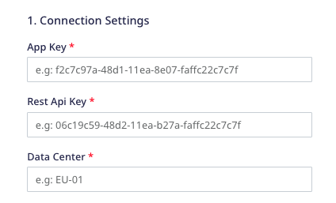
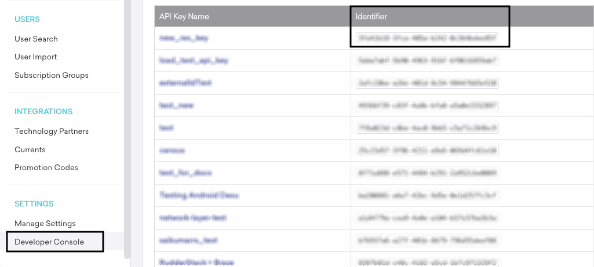
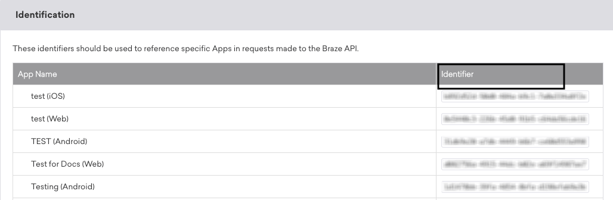

[Braze](https://www.braze.com/) is a customer engagement platform that helps you better understand your customers' in-app behavior and use the insights to improve your users' app experience.

RudderStack supports Braze as a destination where you can seamlessly send your event data.

<div class="infoBlock">
Find the open source transformer code for this destination in the <a href="https://github.com/rudderlabs/rudder-transformer/tree/master/v0/destinations/braze">GitHub repository</a>.
</div>

## Getting started

RudderStack supports sending event data to Braze via the following <a href="https://rudderstack.com/docs/rudderstack-cloud/rudderstack-connection-modes/">connection modes</a>:

| **Connection Mode** | **Web**       | **Mobile**    | **Server**    |
| :------------------ | :------------ | :------------ | :------------ |
| **Device mode**     | **Supported** | **Supported** | -             |
| **Cloud mode**      | **Supported** | **Supported** | **Supported** |

<div class="infoBlock">
In the web device mode integration, that is, using <Link to="/sources/event-streams/sdks/rudderstack-javascript-sdk">JavaScript SDK</Link> as a source, the Braze native SDK is loaded from <code class="inline-code">https://js.appboycdn.com/</code> domain. Based on your website's content security policy, you might need to <Link to="/sources/event-streams/sdks/rudderstack-javascript-sdk/load-js-sdk/#allowlist-destination-domain">allowlist this domain</Link> to load the Braze SDK successfully.
</div>

Once you have confirmed that the source platform supports sending events to Braze, follow these steps:

1. From your [RudderStack dashboard](https://app.rudderstack.com/), add a source. Then, from the list of destinations, select **Braze**.
2. Assign a name to the destination and click **Continue**.

### Connection settings

To successfully configure Braze as a destination, you need to configure the following settings:



- **App Key**: Enter your Braze app key.
- **REST API Key**: Enter the REST API key associated with your project.

<div class="infoBlock">
When creating a new Braze Rest API Key for your app, you only need to select the <strong>users.track</strong>, <strong>users.identify</strong>, and <strong>users.alias.new</strong> endpoints under the <strong>User Data</strong> permissions.
</div>

<div class="infoBlock">
For more information on obtaining your Braze app key and the REST API key, refer to the <Link to="#faq">FAQ</Link> section below.
</div>

- **Data Center**: Specify the data center associated with your Braze account. The easiest way to get your data center details is to log into your Braze account and observing your URL. Some examples are shown below:

| URL                            | Data Center instance |
| :------------------- | :---------------- |
| https://dashboard-01.braze.com | US-01             |
| https://dashboard-03.braze.com | US-03             |
| https://dashboard-01.braze.eu  | EU-01             |

<div class="infoBlock">
For more information on getting your data center instance, refer to the <a href="https://www.braze.com/docs/user_guide/administrative/access_braze/braze_instances">Braze instances</a> page.
</div>

- **Track events for anonymous users**: Enable this setting to track anonymous users.
- **Enable subscription groups in group call**: Enable this setting to send the subscription group information in your <code class="inline-code">group</code> events. For more information, refer to the <Link to="#group">Group</Link> section below.
- **Client-side Events Filtering**: This setting lets you specify which events should be blocked or allowed to flow through to Braze.

<div class="infoBlock">
For more information on this setting, refer to the <Link to="/sources/sdks/event-filtering/">Client-side Events Filtering</Link> guide.
</div>

- **Use device mode to send events**: Enable this setting to send events to Braze via the <Link to="https://www.rudderstack.com/docs/destinations/rudderstack-connection-modes/#device-mode">device mode</Link>.
- **OneTrust Cookie Categories**: This setting lets you associate the <Link to="/sources/sdks/rudderstack-javascript-sdk/consent-managers/onetrust/">OneTrust</Link> cookie consent groups to Braze.

## Adding device mode integration

Depending on your platform of integration, follow the steps below to add Braze to your project:

<Tabs>
  <TabList>
    <Tab>iOS</Tab>
    <Tab>iOS v2</Tab>
    <Tab>Android</Tab>
    <Tab>React Native</Tab>
    <Tab>Flutter</Tab>
  </TabList>
    <TabPanels>
      <TabPanel>
        Follow these steps to add Braze to your iOS project:
<ol>
<li>Open the <code class="inline-code">Podfile</code> of your project and add the following line:
<span>

```ruby
pod 'Rudder-Braze'
```
</span>
</li>
<li>Run the <code class="inline-code">pod install</code> command.</li>
<li>Finally, change the SDK initialization to the following snippet:
<span>

```objectivec
RudderConfigBuilder *builder = [[RudderConfigBuilder alloc] init];
[builder withDataPlaneUrl:<DATA_PLANE_URL>];
[builder withFactory:[RudderBrazeFactory instance]];
[RudderClient getInstance:<WRITE_KEY>; config:[builder build]];
```
</span>
</li>
</ol>
      </TabPanel>
      <TabPanel>
        <div class="warningBlock">
          This device mode integration is supported for Braze v4.4.4 and above.
        </div>
        Follow these steps to add Braze to your iOS project:
<ol>
<li>Install <code class="inline-code">RudderBraze</code> (available through <a href="https://cocoapods.org/">CocoaPods</a>) by adding the following line to your <code class="inline-code">Podfile</code>:
<span>

```ruby
pod 'RudderBraze', '~> 1.0.0'
```
</span>
</li>
<li>Run the <code class="inline-code">pod install</code> command.</li>
<li>Then, import the SDK depending on your preferred platform:
<span>

```swift
import RudderBraze
```
</span>
<span>

```objectivec
@import RudderBraze;
```
</span>
</li>
<li>Next, add the imports to your <code class="inline-code">AppDelegate</code> file under the <code class="inline-code">didFinishLaunchingWithOptions</code> method, as shown:
<br /><br />
<span>

```swift
let config: RSConfig = RSConfig(writeKey: WRITE_KEY)
            .dataPlaneURL(DATA_PLANE_URL)
RSClient.sharedInstance().configure(with: config)
RSClient.sharedInstance().addDestination(RudderBrazeDestination())
```
</span>
<span>

```objectivec
RSConfig *config = [[RSConfig alloc] initWithWriteKey:WRITE_KEY];
[config dataPlaneURL:DATA_PLANE_URL];
[[RSClient sharedInstance] configureWith:config];
[[RSClient sharedInstance] addDestination:[[RudderBrazeDestination alloc] init]];
```
</span>
</li>
<div class="infoBlock">
To send the push notification events, refer to the <Link to="#sending-push-notification-events">Sending push notifications</Link> section below.
</div>
</ol>
      </TabPanel>
      <TabPanel>
        To add Braze to your Android project, follow these steps:
<ol>
<li>Open your <code class="inline-code">app/build.gradle</code> (Module: app) file, and add the following:
<span>

```groovy
repositories {
  mavenCentral()
  maven { url "https://appboy.github.io/appboy-android-sdk/sdk" }
}
```
</span>
</li>
<li>Add the following under <code class="inline-code">dependencies</code> section:
<span>

```groovy
implementation 'com.rudderstack.android.sdk:core:[1.0,2.0)'
implementation 'com.rudderstack.android.integration:braze:[1.0.7,)'
implementation 'com.google.code.gson:gson:2.8.9'
```
</span>
</li>
<li>Add the following permissions to the <code class="inline-code">AndroidManifest.xml</code> file:
<span>

```groovy
<uses-permission android:name="android.permission.INTERNET" />
<uses-permission android:name="android.permission.ACCESS_NETWORK_STATE" />
```
</span>
</li>
<li>Finally, change the SDK initialization to the following:
<span>

```kotlin
  val rudderClient: RudderClient = RudderClient.getInstance(
      this,
      <WRITE_KEY>,
      RudderConfig.Builder()
          .withDataPlaneUrl(<DATA_PLANE_URL>)
          .withLogLevel(RudderLogger.RudderLogLevel.DEBUG)
          .withFactory(BrazeIntegrationFactory.FACTORY)
          .build()
  )
```
</span>
</li>
</ol>
      </TabPanel>
      <TabPanel>
        To add Braze to your React Native project, follow these steps:
<ol>
<li>Add the RudderStack-Braze module to your app by running the following command:
<span>

```bash
npm install @rudderstack/rudder-integration-braze-react-native
```
</span>

<span>

```bash
yarn add @rudderstack/rudder-integration-braze-react-native
```
</span>
</li>

<li>Open your <code class="inline-code">android/build.gradle</code> file (Project level), and add the following:
<span>

```groovy
repositories {
  maven { url "https://appboy.github.io/appboy-android-sdk/sdk" }
}
```
</span>
</li>

<li>Import the module you added above and add it to your SDK initialization code as shown:
<span>

```typescript
import rudderClient from "@rudderstack/rudder-sdk-react-native"
import braze from "@rudderstack/rudder-integration-braze-react-native"
const config = {
  dataPlaneUrl: DATA_PLANE_URL,
  trackAppLifecycleEvents: true,
  withFactories: [braze],
}
rudderClient.setup(WRITE_KEY, config)
```
</span>
</li>
</ol>
      </TabPanel>
<TabPanel>
Follow the below steps to add Braze to your Flutter Project:
<ol>
<li>Add the following dependency to the <code class="inline-code">dependencies</code> section of your <code class="inline-code">pubspec.yaml</code> file.
<span>

```yaml
rudder_integration_braze_flutter: ^1.0.1
```
</span>
</li>
<li>Run the below command to install the dependency added in the above step:
<span>

```groovy
flutter pub get
```
</span>
</li>
<li>Import the <code class="inline-code">RudderIntegrationBrazeFlutter</code> in your application where you are initializing the SDK.
<span>

```dart
import 'package:rudder_integration_braze_flutter/rudder_integration_braze_flutter.dart';
```
</span>
</li>

<li>Finally, change the initialization of your <code class="inline-code">RudderClient</code> as shown:
<span>

```dart
final RudderController rudderClient = RudderController.instance;
RudderConfigBuilder builder = RudderConfigBuilder();
builder.withFactory(RudderIntegrationBrazeFlutter());
rudderClient.initialize(<WRITE_KEY>, config: builder.build(), options: null);
```
</span>
</li>
</ol>
      </TabPanel>
    </TabPanels>
</Tabs>

## Identify

You can use the <Link to="/event-spec/standard-events/identify/">`identify`</Link> call to identify a user in Braze in any of the following cases:

- When the user registers to the app for the first time.
- When they log into their app.
- When they update their information.

A sample `identify` call is shown below:

```javascript
rudderanalytics.identify(
  "1hKOmRA4GRlm", {
    email: "alex@example.com",
    name: "Alex Keener"
  }
);
```

### Deleting a user

You can delete a user in Braze using the <Link to="/api/data-regulation-api/#adding-a-suppression-with-delete-regulation">Suppression with Delete regulation</Link> of the RudderStack <Link to="/api/data-regulation-api/">Data Regulation API</Link>.

<div class="infoBlock">
To delete a user, you must specify their <code class="inline-code">userId</code> in the event. Additionally, you can specify a custom identifier (optional) in the event.
</div>

A sample regulation request body for deleting a user in Braze is shown below:

```json
{
  "regulationType": "suppress_with_delete",
  "destinationIds": [
    "2FIKkByqn37FhzczP23eZmURciA"
  ],
  "users": [{
    "userId": "1hKOmRA4GRlm",
    "<customKey>": "<customValue>"
  }]
}
```

## Track

The <Link to="/event-spec/standard-events/track/">`track`</Link> call lets you record the customer events, that is, the actions that they perform, along with any properties associated with them.

A sample `track` call is shown below:

```javascript
rudderanalytics.track("Product Added", {
  numberOfRatings: "12",
  name: "item 1",
});
```

### Order Completed

When you call the `track` method for an `Order Completed` event, RudderStack sends the product information present in the event to Braze as **purchases**.

A sample `Order Completed` event is shown below:

```javascript
rudderanalytics.track("Order Completed", {
  userId: "1hKOmRA4GRlm",
  currency: "USD",
  products: [{
      product_id: "123454387",
      name: "Game",
      price: 15.99
    }
  ],
});
```

## Page

The <Link to="/event-spec/standard-events/page/">`page`</Link> call allows you to record your website's page views, with the additional relevant information about the viewed page.

A sample`page` call is as shown below:

```javascript
rudderanalytics.page("Cart", "Cart Viewed", {
  path: "/cart",
  referrer: "test.com",
  search: "term",
  title: "test_item",
  url: "http://test.in",
})
```

## Group

You can use the <Link to="/event-spec/standard-events/group/">`group`</Link> call to link an identified user with a group, such as a company, organization, or an account.

```javascript
rudderanalytics.group("12345", {
  name: "MyGroup",
  industry: "IT",
  employees: 450,
  plan: "basic"
})
```

Once you send a `group` event, RudderStack sends a custom attribute to Braze with the name as `ab_rudder_group_<groupId>` and the value as `true`. For example, if the `groupId` is `123456`, then RudderStack creates a custom attribute with the name `ab_rudder_group_123456` and sends it to Braze with its value to `true`.

While using Braze destination in <Link to="/destinations/rudderstack-connection-modes/#cloud-mode">cloud mode</Link>, you can also send [subscription groups](https://www.braze.com/docs/api/endpoints/subscription_groups) in the `group` call, as shown:

```javascript
rudderanalytics.group("12345", {
  subscriptionState: "subscribed",
  email: "alex@example.com"
})
```

<div class="infoBlock">
Either the <code class="inline-code">email</code> or <code class="inline-code">phone</code> is <strong>mandatory</strong> to send the subscription group in a <code class="inline-code">group</code> call.
</div>


## Sending push notification events

<div class="infoBlock">
This feature is applicable only for the <Link to="/sources/event-streams/sdks/rudderstack-ios-sdk/ios-v2/">RudderStack iOS SDK v2</Link>.
</div>

For sending the push notification events, add the following code to your <code class="inline-code">AppDelegate</code> file under the <code class="inline-code">didFinishLaunchingWithOptions</code> method:

<Tabs>
  <TabList>
    <Tab>Swift</Tab>
    <Tab>Objective-C</Tab>
  </TabList>
  <TabPanels>
      <TabPanel>

<span>

```swift
if #available(iOS 10, *) {
    let center = UNUserNotificationCenter.current()
    center.delegate = self
    var options: UNAuthorizationOptions = [.alert, .sound, .badge]
    if #available(iOS 12.0, *) {
        options = UNAuthorizationOptions(rawValue: options.rawValue | UNAuthorizationOptions.provisional.rawValue)
        }
        center.requestAuthorization(options: options) { (granted, error) in
            RSClient.sharedInstance().pushAuthorizationFromUserNotificationCenter(granted)
    }
    UIApplication.shared.registerForRemoteNotifications()
} else {
    let types: UIUserNotificationType = [.alert, .badge, .sound]
    let setting: UIUserNotificationSettings = UIUserNotificationSettings(types: types, categories: nil)
    UIApplication.shared.registerUserNotificationSettings(setting)
    UIApplication.shared.registerForRemoteNotifications()
}
```
</span>
</TabPanel>
<TabPanel>

<span>

```objectivec
if (floor(NSFoundationVersionNumber) > NSFoundationVersionNumber_iOS_9_x_Max) {
  UNUserNotificationCenter *center = [UNUserNotificationCenter currentNotificationCenter];
  center.delegate = self;
  UNAuthorizationOptions options = UNAuthorizationOptionAlert | UNAuthorizationOptionSound | UNAuthorizationOptionBadge;
  if (@available(iOS 12.0, *)) {
  options = options | UNAuthorizationOptionProvisional;
  }
  [center requestAuthorizationWithOptions:options
                        completionHandler:^(BOOL granted, NSError * _Nullable error) {
      [[RSClient sharedInstance] pushAuthorizationFromUserNotificationCenter:granted];
  }];
  [[UIApplication sharedApplication] registerForRemoteNotifications];
} else {
  UIUserNotificationSettings *settings = [UIUserNotificationSettings settingsForTypes:(UIUserNotificationTypeBadge | UIUserNotificationTypeAlert | UIUserNotificationTypeSound) categories:nil];
  [[UIApplication sharedApplication] registerForRemoteNotifications];
  [[UIApplication sharedApplication] registerUserNotificationSettings:settings];
}
```
</span>
</TabPanel>
</TabPanels>
</Tabs>

## FAQ

### Where can I find the Braze App Key and REST API Key?

To obtain your Braze App Key and REST API Key, follow these steps:

1. Log into your [Braze dashboard](https://dashboard.braze.com/auth).
2. Go to **Settings** > **Developer Console**.
3. You can find the REST API key for your app under the **Identifier** column, as shown:



4. You can find your Braze App Key in the **Identification** section, as shown:

