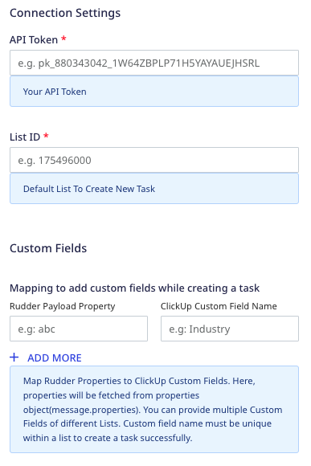
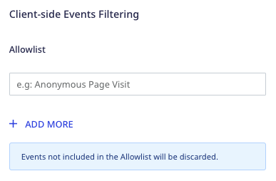
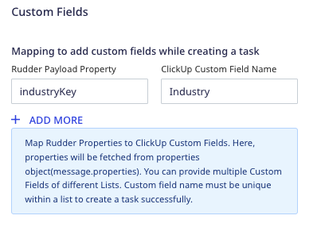
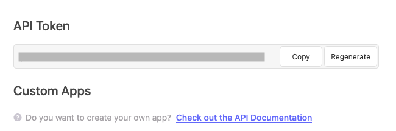
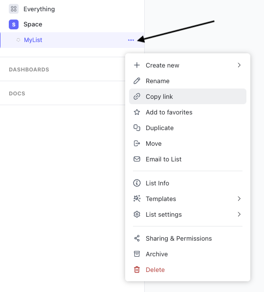
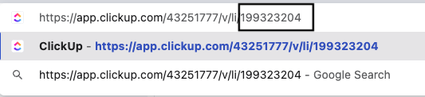
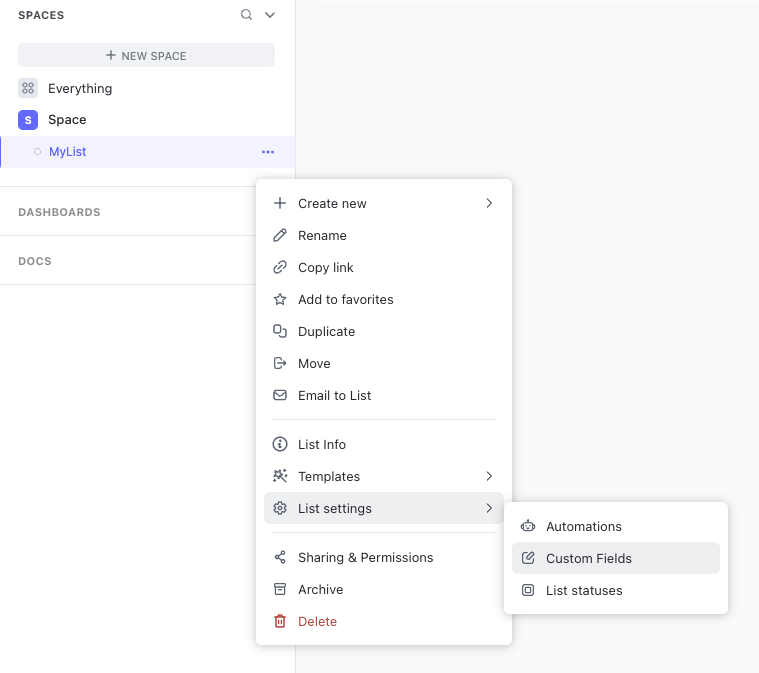
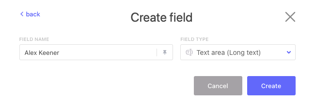

[ClickUp](https://clickup.com/) is a productivity tool that lets you set up project workflows and tasks, and enable smooth cross-team collaboration.

RudderStack supports ClickUp as a destination where you can seamlessly send your event data.

<div class="infoBlock">
Find the open source transformer code for this destination in the <a href="https://github.com/rudderlabs/rudder-transformer/tree/master/v0/destinations/clickup">GitHub repository</a>.
</div>

## Getting started

Before configuring ClickUp as a destination in RudderStack, verify if the source platform is supported by ClickUp by referring to the table below:

| Connection Mode | Web | Mobile | Server |
| :--- | :--- | :--- | :--- |
| Device mode | - | - | - |
| Cloud mode | Supported  | Supported | Supported |

<div class="infoBlock">
To know more about the difference between cloud mode and device mode in RudderStack, refer to the <Link to="/destinations/rudderstack-connection-modes/">RudderStack Connection Modes</Link> guide.
</div>

Once you have confirmed that the source platform supports sending events to ClickUp, follow these steps:

1. From your [RudderStack dashboard](https://app.rudderstack.com/), add a source. Then, from the list of destinations, select **ClickUp**.
2. Assign a name to the destination and click **Continue**.

## Connection settings

To successfully configure ClickUp as a destination, you will need to configure the following settings:



- **API Token**: Enter your ClickUp API token.

<div class="infoBlock">
For more information on obtaining your ClickUp API token, refer to the <Link to="#where-can-i-find-the-clickup-api-token">FAQ</Link> section below.
</div>

- **List ID**: Enter your ClickUp list ID.

<div class="infoBlock">
For more information on obtaining your ClickUp list ID, refer to the <Link to="#where-can-i-find-the-clickup-list-id">FAQ</Link> section below.
</div>

- **Mapping to add custom fields while creating a task**: Use this setting to map a specific RudderStack event property to a ClickUp Custom Field.

<div class="infoBlock">
For more information on using this setting, refer to the <Link to="#adding-custom-fields">Adding custom fields</Link> section below.
</div>

<div class="infoBlock">
You can provide multiple ClickUp custom fields associated with different lists. However, note that the custom field name <strong>must be unique</strong> within a list to successfully create a task.
</div>

- **Client-side Events Filtering**: This setting lets you specify which events should be allowed to flow through to ConvertFlow.



<div class="warningBlock">
RudderStack will discard the events <strong>not included</strong> in the allowlist. For more information on this setting, refer to the <Link to="/sources/sdks/event-filtering/">Client-side Events Filtering</Link> guide.
</div>

## Track

You can use the <Link to="/event-spec/standard-events/track/">`track`</Link> calls to create a task in ClickUp.

A sample `track` call is shown below:

```javascript
rudderanalytics.track(
  "Product Viewed", {
    "taskName": "Whole Foods Market",
    "tags": ["plan", "proposal", "marketing"],
    "timeEstimate": 10800000,
    "status": "Proposal",
    "dueDate": 1662102613,
    "startDate": "1546393209",
    "industryKey": "Retail",
    "paymentStatus": "Reject",
    "label": ["Transformer", "QA", "Testing"],
    "location": {
      "lat": -28.016667,
      "lng": 124,
      "formattedAddress": "New Orleans, Louisiana",
    },
    "phone": "+12025550146",
  }, {
    "externalId": [{
        "type": "clickUpAssigneeId",
        "id": 61205104,
      },
      {
        "type": "clickUpAssigneeId",
        "id": 61229682,
      },
    ],
  }
);
```

RudderStack uses the ClickUp [`task`](https://api.clickup.com/api/v2/list/list_id/task) endpoint to create a task within a list. 

To successfully create a task, you need to specify the <Link to="#where-can-i-find-the-clickup-list-id">**List ID**</Link> in the dashboard settings. You can also pass the list ID through `externalId`, as seen in the above sample snippet.

<div class="infoBlock">
RudderStack gives preference to the list ID passed via <code class="inline-code">externalId</code> over the list ID specified in the dashboard.
</div>

### Adding assignees to a task

While creating a task, you can assign it to a Team(Workspace) member by specifying a `userId`. You can also pass multiple `userId` in an `externalId` array, as shown:

```javascript
{
  "context": {
    "externalId": [{
        "type": "clickUpAssigneeId",
        "id": 1232
      },
      {
        "type": "clickUpAssigneeId",
        "id": 88765
      }
    ]
  }
}
```

### Adding custom fields

You can pass the custom fields to ClickUp by specifying the mapping in the **Mapping to add custom fields while creating a task** dashboard setting, as shown:



You can specify the **ClickUp Custom Field Name** corresponding to the <Link to="#how-can-i-create-custom-fields-in-clickup">custom field you created in the ClickUp dashboard</Link> and the **RudderStack Payload Property** corresponding to the event property present in the payload.

RudderStack uses the custom field name to retrieve the `id` using the [`field`](https://api.clickup.com/api/v2/list/list_id/field) endpoint.

### Supported custom fields

RudderStack supports specifying the following ClickUp custom fields in the dashboard settings:

| Custom Field | Notes |
| :-----| :-----| 
| URL | Must be in a valid URL format. |
| Email | Must be in a valid email format. | 
| Phone | Must be a valid phone number with a country code, for example, `+1 123 456 7890`. |
| Date | Must be a valid date in a datetime format, for example, `2022-02-25T13:39:21.032Z`. |
| Text | Must be a string. |
| Checkbox | Must be in a Boolean format. |
| Number | - |
| Currency | Must be a number |
| Emoji (integer) | Used for rating. The value must be in a range defined in the ClickUp dashboard. |
| Location | Latitude/longitude and the formatted address must be passed as the [Google Geocoding API](https://developers.google.com/maps/documentation/geocoding/overview?hl=en). |
| Dropdown | RudderStack will use the dropdown option name to find the UUID using the [`field`](https://api.clickup.com/api/v2/list/list_id/field) endpoint. |
| Label | RudderStack will use the label name to find the UUID using the [`field`](https://api.clickup.com/api/v2/list/list_id/field) endpoint. |

<div class="infoBlock">
For more information on the above-mentioned fields, refer to the the <a href="https://jsapi.apiary.io/apis/clickup20/reference/0/custom-fields.html">ClickUp Custom Fields API reference</a>.
</div>

RudderStack currently **does not support** specifying the following custom fields:

- Tasks 
- Users
- Automatic Progress
- Manual Progress

Note that when sending the custom fields to ClickUp:

- You can provide multiple custom fields of different ClickUp lists in the dashboard.
- To successfully create a task, you need to provide a **unique** custom field name within a list in the custom field mapping.

### Supported mapping

The following table lists the mappings between the **optional** RudderStack properties and the ClickUp properties:

| RudderStack property | ClickUp property | Data type |
| :---- | :-----| :----|
| `context.externalId.id` <br /> when `context.externalId.type` = `clickUpListId` | `list_id` | String | 
| `properties.taskName` / `message.event` | `name` | String |
| `properties.description` | `description` | String |
| `context.externalId.id` <br /> when `context.externalId.type` = `clickUpAssigneeId` |  `assignees` | Array |
| `properties.tags` |  `tags` | Array |
| `properties.priority` | `priority` | Integer |
| `properties.timeEstimate` | `time_estimate` | Integer (in ms) |
| `properties.status` | `status` | String |
| `properties.dueDate` | `due_date` | Datetime |
| `properties.includeDueDateTime` | `due_date_time` | Boolean | 
| `properties.startDate` | `start_date` | Datetime |
| `properties.includeStartDateTime` | `start_date_time` | Boolean |
| `properties.notifyAll` | `notify_all` | Boolean | 
| `properties` <br />(Only fields mentioned in the dashboard mapping) | `custom_fields` | Array | 

## Rate limits

Note that the ClickUp enforces rate limits per OAuth and personal token. This rate limit depends on your ClickUp plan and is summarized in the following table:

| ClickUp plan | Requests allowed per minute |
| :----- | :------ | 
| Free Forever, Unlimited, Business | 100 |
| Business Plus | 1000 | 
| Enterprise | 10000 | 

<div class="infoBlock">
For more information, refer to the <a href="https://clickup.com/pricing">ClickUp Pricing</a> page.
</div>

## FAQ

### Where can I find the ClickUp API Token?

To obtain your ClickUp API token, follow these steps:

1. Log into your [ClickUp dashboard](https://app.clickup.com/).
2. From the left sidebar, click the **Settings** button at the bottom and go to **MY APPS** > **Apps**.
3. You can find the API token listed here, as shown:



<div class="infoBlock">
To create a new app with the ClickUp API, refer to this <a href="https://help.clickup.com/hc/en-us/articles/6303422883095-Create-your-own-app-with-the-ClickUp-API">ClickUp Help Guide</a>.
</div>

### Where can I find the ClickUp List ID?

To get your ClickUp list ID, follow these steps:

1. In your [ClickUp dashboard](https://app.clickup.com/), click the ellipsis button next to your list and select **Copy Link**.



2. Paste the URL in your browser's URL bar. You can find the list ID in the URL as highlighted in the below image:



### How can I create custom fields in ClickUp?

To create custom fields in your ClickUp list, follow these steps:

1. In your [ClickUp dashboard](https://app.clickup.com/), click the ellipsis button next to your list and go to **List settings** > **Custom Fields**.



2. Choose the type of custom field you want to create and configure the **Field Name** and **Field Type** accordingly.



3. Finally, click **Create**.