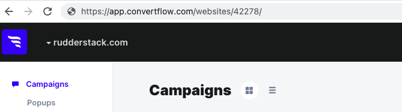

[ConvertFlow](https://www.convertflow.com/) is an e-commerce platform that enables you to create and deliver personalized, end-to-end user experiences, marketing campaigns, and product recommendations.

RudderStack supports ConvertFlow as a destination where you can seamlessly send your event data.

## Getting started

Before configuring ConvertFlow as a destination in RudderStack, verify if the source platform is supported by ConvertFlow by referring to the table below:

| Connection Mode | Web | Mobile | Server |
| :--- | :--- | :--- | :--- |
| Device mode | Supported | - | - |
| Cloud mode | -  | - | - |

<div class="infoBlock">
To know more about the difference between cloud mode and device mode in RudderStack, refer to the <Link to="/destinations/rudderstack-connection-modes/">RudderStack Connection Modes</Link> guide.
</div>

Once you have confirmed that the source platform supports sending events to ConvertFlow, follow these steps:

1. From your [RudderStack dashboard](https://app.rudderstack.com/), add a source. Then, from the list of destinations, select **ConvertFlow**.
2. Assign a name to the destination and click **Continue**.

## Connection settings

To successfully configure ConvertFlow as a destination, you will need to configure the following settings:


- **Client-side Events Filtering**: This setting lets you specify which events should be blocked or allowed to flow through to ConvertFlow.

<div class="infoBlock">
For more information on this setting, refer to the <Link to="/sources/sdks/event-filtering/">Client-side Events Filtering</Link> guide.
</div>

- **Use device mode to send events**: As this is a <Link to="https://www.rudderstack.com/docs/destinations/rudderstack-connection-modes/#device-mode">web device mode</Link>-only destination, this setting is enabled by default and cannot be disabled.

## Identify

You can use the <Link to="/event-spec/standard-events/identify/">`identify`</Link> call to set the user's email and username in ConvertFlow through their <a href="https://developer.ConvertFlow.com/javascript-api/#javascript-api">SDK</a>.

A sample `identify` call is shown below:

```javascript
rudderanalytics.identify(
  "1hKOmRA4GRlm", {
    email: "alex@example.com",
    name: "Alex Keener"
  }
);
```

### Supported mappings

The following table lists the mappings between the RudderStack and ConvertFlow properties:

| RudderStack property | ConvertFlow property | Data type | Presence
|:---------------------|:-------------|:--------------|:--------------|
| `traits.email` / `context.traits.email` | `email` | String | Required |
| `traits.name` / `context.traits.name` | `name` | String | Optional |

## Track

If the **Record Live Chat Events** dashboard setting is enabled during the destination setup, RudderStack records the ConvertFlow Live Chat events based on the user's interactions. You can then send them as <Link to="/event-spec/standard-events/track/">track</Link> events to any other tools (connected to the source in RudderStack).

### Supported events

RudderStack automatically records and sends the following Live Chat events:

- [Live Chat Conversation Started](https://developer.ConvertFlow.com/javascript-api/#startchat-event)

```javascript
ConvertFlow.setCallback("StartChat", function() {
  window.rudderanalytics.track(
    "Live Chat Conversation Started", {}, {
      context: {
        integration: {
          name: 'ConvertFlow',
          version: '1.0.0'
        }
      }
    }
  );
});
```

- [Live Chat Conversation Ended](https://developer.ConvertFlow.com/javascript-api/#close-event)

```javascript
ConvertFlow.setCallback("Close", function() {
  window.rudderanalytics.track(
    "Live Chat Conversation Ended", {}, {
      context: {
        integration: {
          name: 'ConvertFlow',
          version: '1.0.0'
        }
      }
    }
  );
});
```

- [Live Chat Message Sent](https://developer.ConvertFlow.com/javascript-api/#chatmessagesent-event) 

```javascript
ConvertFlow.setCallback("ChatMessageSent", function() {
  window.rudderanalytics.track(
    "Live Chat Message Sent", {}, {
      context: {
        integration: {
          name: 'ConvertFlow',
          version: '1.0.0'
        }
      }
    }
  );
});
```

- [Live Chat Message Received](https://developer.ConvertFlow.com/javascript-api/#chatmessagereceived-event)

```javascript
ConvertFlow.setCallback("ChatMessageReceived", function(agent) {
  window.rudderanalytics.track(
    "Live Chat Message Received", {
      agentUsername: agent
    }, {
      context: {
        integration: {
          name: 'ConvertFlow',
          version: '1.0.0'
        }
      }
    }
  );
});
```

- [Button Clicked](https://developer.ConvertFlow.com/javascript-api/#button-event)

```javascript
ConvertFlow.setCallback("InlineButtonClicked", function() {
  window.rudderanalytics.track(
    "Inline Button Clicked", {}, {
      context: {
        integration: {
          name: 'ConvertFlow',
          version: '1.0.0'
        }
      }
    }
  );
});
```

### Mapping events

You can also update the standard ConvertFlow Live Chat events with custom event names by enabling the <strong>Update Event Name in track call</strong> setting in the RudderStack dashboard and specifying the required mapping, as shown:


Based on the mappings set in the above image, RudderStack replaces the event names `"Live Chat Conversation Started"` and `"Live Chat Message Sent"`with `"User Started Chat"` and `"Submit"` respectively.

## FAQ

### Where can I find the ConvertFlow website ID?

To get your ConvertFlow website ID, follow these steps:

1. Log into your <a href="https://app.convertflow.com/login">ConvertFlow account</a>.
2. Select your website under **Active websites**, as shown:


3. You can find the website ID present in your URL:

