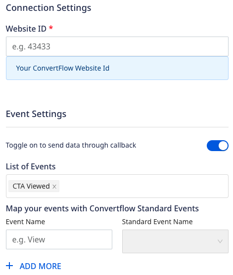

[ConvertFlow](https://www.convertflow.com/) is an all-in-one platform that enables you to drive your conversions. It lets you create and deliver personalized user experiences via forms, quizzes, surveys, landing pages, and more. 

RudderStack supports ConvertFlow as a destination where you can seamlessly send your event data.

## Getting started

Before configuring ConvertFlow as a destination in RudderStack, verify if the source platform is supported by ConvertFlow by referring to the table below:

| Connection Mode | Web | Mobile | Server |
| :--- | :--- | :--- | :--- |
| Device mode | Supported | - | - |
| Cloud mode | -  | - | - |

<div class="infoBlock">
To know more about the difference between cloud mode and device mode in RudderStack, refer to the <Link to="/destinations/rudderstack-connection-modes/">RudderStack Connection Modes</Link> guide.
</div>

Once you have confirmed that the source platform supports sending events to ConvertFlow, follow these steps:

1. From your [RudderStack dashboard](https://app.rudderstack.com/), add a source. Then, from the list of destinations, select **ConvertFlow**.
2. Assign a name to the destination and click **Continue**.

## Connection settings

To successfully configure ConvertFlow as a destination, you will need to configure the following settings:




- **Website ID**: Enter your ConvertFlow website ID.

<div class="infoBlock">
For more information on obtaining your ConvertFlow website ID, refer to the <Link to="#faq">FAQ</Link> section below.
</div>

- **Toggle on to send data through callback**: Enable this setting to allow RudderStack to automatically record your ConvertFlow CTA interactions as `track` events.
  - **List of Events**: If **Toggle on to send data through callback** setting is enabled, enter the list of CTA interactions for RudderStack to track.
  - **Map your events with ConvertFlow Standard Events**: Use this setting to map the standard ConvertFlow events with custom event names.

<div class="infoBlock">
For more information on this setting, refer to the <Link to="#mapping-events">Mapping events</Link> section below.
</div>

- **Client-side Events Filtering**: This setting lets you specify which events should be blocked or allowed to flow through to ConvertFlow.

<div class="infoBlock">
For more information on this setting, refer to the <Link to="/sources/sdks/event-filtering/">Client-side Events Filtering</Link> guide.
</div>

- **Use device mode to send events**: As this is a <Link to="https://www.rudderstack.com/docs/destinations/rudderstack-connection-modes/#device-mode">web device mode</Link>-only destination, this setting is enabled by default and cannot be disabled.
- **OneTrust Cookie Categories**: This setting lets you map <Link to="/sources/sdks/rudderstack-javascript-sdk/consent-managers/onetrust/">OneTrust</Link> cookie consent groups to RudderStack's consent purposes.

## Identify

You can use the <Link to="/event-spec/standard-events/identify/">`identify`</Link> call to identify your user in ConvertFlow using their <a href="https://help.convertflow.com/article/112-convertflow-javascript-api-examples#convertflow-identify">`identify`</a> function.

A sample `identify` call is shown below:

```javascript
rudderanalytics.identify(
  "1hKOmRA4GRlm", {
    email: "alex@example.com",
    name: "Alex Keener"
  }
);
```

### Supported mappings

The following table lists the mappings between the RudderStack and ConvertFlow properties:

| RudderStack property | ConvertFlow property | Data type | Presence
|:---------------------|:-------------|:--------------|:--------------|
| `traits.email` / `context.traits.email` | `email` | String | Required |

## Track

If you enable the **Toggle on to send data through callback** dashboard setting, RudderStack records the ConvertFlow CTA interactions and sends them as <Link to="/event-spec/standard-events/track/">track</Link> events. You can then view and analyze these events in the other tools (connected to the same source in RudderStack).

<div class="infoBlock">
RudderStack only tracks the CTA interactions specified in the <strong>List of Events</strong> field in the dashboard settings. If this setting is not specified, RudderStack tracks all the below CTA interactions.
</div>

### Supported events

RudderStack automatically records and sends the following <a href="https://help.convertflow.com/article/112-convertflow-javascript-api-examples">ConvertFlow CTA interactions</a>:

| Interaction event | `track` event name | Description |
| :---| :---|  :--- |
| `cfReady`| `CTA Ready` | Fired when the ConvertFlow script is fully initialized and their JavaScript API is ready for use. |
| `cfView`|  `CTA Viewed` | Fired when the user views a CTA and upon each additional step.
| `cfConversion`|  `CTA Converted` | Fired when the user engages with a CTA, for example, clicking a button, submitting a form, selecting a survey, etc.
| `cfCompletion`|  `CTA Completed` | Fired when the 'Track completion of CTA' automation marks a CTA as complete.
| `cfSubmit`|  `CTA Form Submitted` | Fired when the CTA form and the associated survey elements have been submitted.
| `cfAddToCart`| `Product Addded to Cart` | Fired when the user adds a product to their cart using the ConvertFlow products elements.
| `cfClose`| `CTA Closed` | Fired when the user closes a CTA.

A sample CTA conversion event is shown below:

```javascript
window.addEventListener("cfConversion", function(event) {
  rudderanalytics.track("CTA Converted", {
    cta_name: "CTA123",
    cta_type: "inline",
    cta_id: 124573221,
    cta_variant: "a",
    cta_step: 1,
  });
});
```

### Mapping events

You can also update the standard ConvertFlow CTA events with custom event names by enabling the <strong>Map your events with ConvertFlow Standard Events</strong> setting in the RudderStack dashboard and specifying the required mapping, as shown:


Based on the mappings set in the above image, RudderStack replaces the standard event names `"CTA Viewed"` and `"CTA Converted"`with `"Viewing CTA"` and `"Converting CTA"` respectively.

## FAQ

### Where can I find the ConvertFlow website ID?

To get your ConvertFlow website ID, follow these steps:

1. Log into your <a href="https://app.convertflow.com/login">ConvertFlow account</a>.
2. Select your website under **Active websites**, as shown:


3. You can find the website ID present in your URL:


