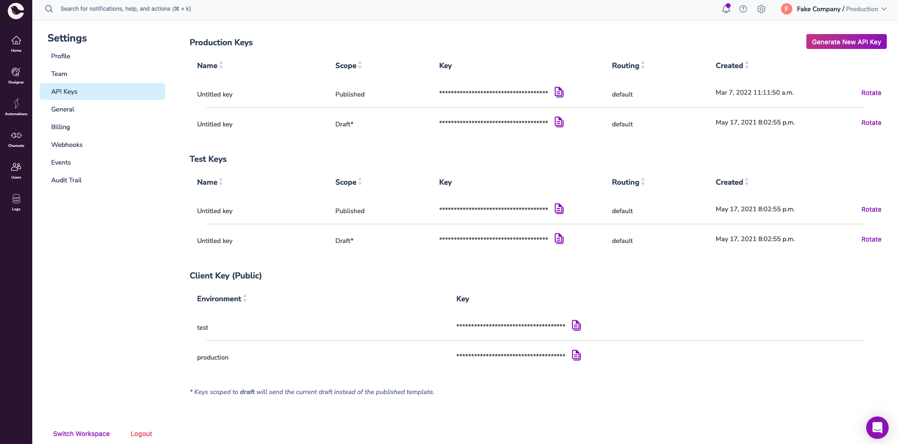

[Courier](https://www.courier.com/)

RudderStack supports Courier as a destination where you can send your event data seamlessly.

  Find the open source transformer code for this destination in the{' '}
  <a href='https://github.com/rudderlabs/rudder-transformer/tree/master/src/v0/destinations/courier'>
    GitHub repository
  </a>
  .

## Getting started

To start sending events to Courier, follow these steps:

1. From your [RudderStack dashboard](https://app.rudderstack.com/), add a source. Then, from the list of destinations, select **Courier**.
2. Assign a name to the destination and click **Continue**.

### Connection settings

To successfully configure Courier as a destination, you will need to configure the Courier API key

To get your Courier API Key, follow these steps:

1. Log into your [Courier dashboard](https://app.courier.com/).
2. Go to your app's **Settings** > **API Keys**.
3. You will find the Courier API Key, as shown:

4. Copy the key based on environment/scope you want to configure
